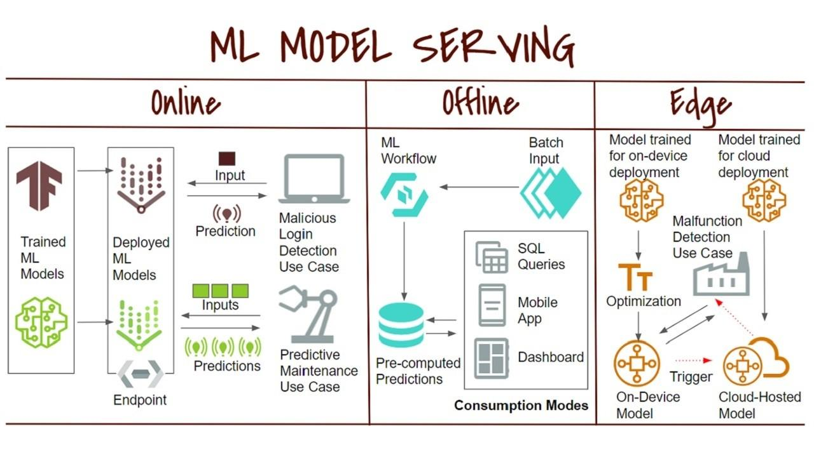

## Table of Contents

## What is machine learning serving?

Machine learning is a type of artificial intelligence that helps computers learn from data without being explicitly programmed. It's like teaching a computer to recognize patterns or make decisions by showing it examples. For instance, if you want a computer to identify pictures of cats, you would show it many pictures of cats and tell it, "These are cats." Over time, the computer gets better at recognizing cats in new pictures by itself.

One common use of machine learning is in recommendation systems, like those used by streaming services or online stores. These systems learn from your past behavior—what movies you've watched or what items you've bought—and suggest new things you might like. This is done by analyzing patterns in large amounts of data to find similarities between different users or products. Machine learning makes these recommendations more accurate over time, improving the user experience by showing more relevant suggestions.

## Why is serving important in machine learning?

Serving is important in machine learning because it's how we use the models we've trained to make predictions or decisions in real-world situations. After training a model on a dataset, we need a way to use that model to make predictions on new data. This is where serving comes in. It's like having a trained chef who can cook a delicious meal; serving is the process of getting that meal to the customers. Without serving, the model would just sit idle, unable to help or provide value to users.

Serving also helps in making sure that the [machine learning](/wiki/machine-learning) model works efficiently and reliably. When a model is served, it needs to handle requests quickly and accurately, often in real-time. For example, if you're using a machine learning model to recommend products on a website, the model needs to serve recommendations fast enough that the user doesn't have to wait. Good serving systems can handle many requests at once, making sure that everyone gets the information they need without delays. This is crucial for applications where speed and reliability are important, like in online shopping or streaming services.

## What are the basic components of a machine learning serving system?

A machine learning serving system has a few main parts that work together to make sure the model can do its job well. The first part is the model itself, which has been trained on data and can now make predictions. The model needs to be stored somewhere where it can be easily accessed. The second part is the server, which takes in new data, sends it to the model, and then sends the model's predictions back to the user. This server needs to be fast and able to handle many requests at once.

The third part is the API (Application Programming Interface), which is like a translator that helps different parts of the system talk to each other. The API makes it easy for other programs to send data to the server and get predictions back. The last part is monitoring and logging, which keeps track of how well the system is working. This helps to fix problems quickly and make sure the model is still giving good predictions over time. Together, these parts make sure that the machine learning model can serve its predictions in a way that is useful and reliable for users.

## How does model deployment differ from model serving?

Model deployment and model serving are two important steps in using machine learning, but they are different. Model deployment is about getting the trained model ready to be used. It's like packing a suitcase before a trip. You take the model and put it into a system where it can run. This might mean turning the model into a format that can be used by the computer, setting up the right software, and making sure everything is ready to go. Deployment is all about preparation and getting the model into the right place.

Model serving, on the other hand, is what happens after the model is deployed. It's like using the suitcase during the trip. Serving is about actually using the model to make predictions on new data. When someone sends data to the model, the serving system takes that data, sends it through the model, and then sends the predictions back. Serving needs to be fast and reliable because people are waiting for the results. It's about making sure the model can do its job well in real-time situations.

In summary, deployment is the step where you get everything ready, and serving is the step where you actually use the model to help people. Both are crucial, but they focus on different parts of the process.

## What are some common challenges faced when serving machine learning models?

One common challenge when serving machine learning models is managing the speed of the system. When a lot of people are using the model at the same time, it can slow down and make them wait longer for predictions. This is a big problem for things like websites or apps where people expect quick answers. Another challenge is keeping the model up to date. As new data comes in, the model might need to be retrained to stay accurate. This can be tricky because it means you have to update the model without stopping the service.

Another challenge is making sure the model works the same way in the real world as it did during testing. Sometimes, the data the model sees when it's serving can be different from the data it was trained on. This can make the model's predictions less accurate. It's like if a chef learned to cook in one kitchen but then had to work in a different one with different tools. Finally, keeping everything secure is important too. When you're serving a model, you have to make sure that the data going in and out is safe and that no one can mess with the model to get wrong answers.

## Can you explain the difference between batch serving and real-time serving?

Batch serving and real-time serving are two different ways to use machine learning models. Batch serving is like cooking a big meal ahead of time. You gather a lot of data, send it through the model all at once, and get the predictions back later. This is good when you don't need the answers right away, like if you're doing a monthly report or sending out weekly recommendations to customers. Batch serving can handle a lot of data at once, but it's not as fast as real-time serving.

Real-time serving is like cooking a meal right when someone orders it. When new data comes in, the model processes it right away and sends back the prediction almost instantly. This is important for things like online shopping, where you want to see recommendations as soon as you look at a product, or in apps where you need quick answers. Real-time serving needs to be very fast and reliable because people are waiting for the results right away.

## What tools and platforms are available for serving machine learning models?

There are many tools and platforms that help serve machine learning models. Some popular ones include TensorFlow Serving, which is great for models built with TensorFlow. It makes it easy to serve models quickly and handle a lot of requests at once. Another tool is Amazon SageMaker, which lets you deploy and serve models on the Amazon Web Services (AWS) cloud. It's user-friendly and can scale up or down depending on how much you need to use it. For those who like open-source options, there's also BentoML, which supports many different machine learning frameworks and makes it easy to package and serve models.

Other platforms include Microsoft Azure Machine Learning, which provides a full suite of tools for deploying and serving models on the Azure cloud. It's good for businesses that already use Microsoft products. Google Cloud AI Platform is another option, offering strong support for TensorFlow models and easy integration with other Google services. For simpler needs, Flask or FastAPI can be used to create a custom serving solution. These are lightweight and flexible, perfect for smaller projects or when you want to have more control over how the model is served.

## How do you monitor and maintain a served machine learning model?

Monitoring and maintaining a served machine learning model is important to make sure it keeps working well. You need to keep an eye on how the model is performing by looking at things like how accurate its predictions are and how fast it's serving them. This is done by collecting data on the model's performance over time. If the model starts to give less accurate predictions, you might need to retrain it with new data. Also, you should check if the model is using too many resources like memory or processing power, which can slow things down.

Keeping the model up to date is another part of maintenance. As new data comes in, you might need to retrain the model to keep it accurate. This can be tricky because you need to update the model without stopping the service. You can do this by using a technique called "shadow deployment," where you test the new model alongside the old one to see if it works better. If it does, you can switch to the new model without anyone noticing. Also, make sure to keep the system secure by checking for any security issues and fixing them quickly. This helps to protect the data and keep the model working smoothly.

## What are the best practices for scaling machine learning serving systems?

Scaling machine learning serving systems means making them handle more work without slowing down. One way to do this is by using load balancing, which spreads the work across many servers so no single server gets too busy. Another important practice is to use auto-scaling, which automatically adds more servers when there are a lot of requests and removes them when things quiet down. This helps keep the system running smoothly even when a lot of people are using it at the same time. Also, it's a good idea to use caching to save the results of common requests so the system doesn't have to do the same work over and over again.

Another key practice is to keep an eye on how the system is doing. This means watching things like how fast the system is responding and how much of its resources it's using. If you see the system starting to slow down, you can add more resources or change how the system works to make it faster. It's also important to plan for the future by thinking about how much the system might need to grow. This helps you make sure the system can handle more work as your needs change. By following these practices, you can make sure your machine learning serving system stays fast and reliable, no matter how much it needs to do.

## How can you ensure the security of a machine learning serving infrastructure?

To keep a machine learning serving infrastructure safe, you need to protect the data that goes in and out of the model. One way to do this is by using encryption, which is like putting a secret code on the data so only people with the right key can read it. You should also use strong passwords and keep them safe, and make sure that only the right people can access the system. Another important thing is to watch the system all the time for any strange behavior that might mean someone is trying to break in. If you see something odd, you can stop it before it causes any harm.

Another part of keeping the system secure is making sure the model itself is safe. This means checking the model often to make sure no one has changed it to give wrong answers. You can use a technique called "model validation" to make sure the model is still working the way it should. It's also a good idea to keep the software and the system up to date, because new updates often fix security problems. By doing these things, you can help keep your machine learning serving infrastructure safe and working well.

## What advanced techniques can be used to optimize the performance of served models?

One advanced technique to optimize the performance of served models is model quantization. This involves reducing the precision of the numbers used in the model, like changing from using 32-bit numbers to 8-bit numbers. This makes the model smaller and faster to run without losing too much accuracy. Another technique is model pruning, which removes parts of the model that don't help much with making predictions. This makes the model simpler and faster to use. Both of these techniques help the model serve predictions more quickly and use less computer power.

Another way to optimize performance is by using hardware acceleration. This means using special computer parts like GPUs (Graphics Processing Units) or TPUs (Tensor Processing Units) that are made to run machine learning models faster. These parts can handle many calculations at once, which makes the model serve predictions much quicker. You can also use techniques like batching, where you group many requests together and process them all at once. This can make the system more efficient, especially when there are a lot of requests coming in. By using these advanced techniques, you can make your served models work better and faster.

## How do you handle model versioning and updates in a serving environment?

Handling model versioning and updates in a serving environment is important to keep the system working well. You need to keep track of different versions of your model so you know which one is being used and can go back to an old version if something goes wrong. One way to do this is by using a version control system, like Git, which helps you manage different versions of your model. When you update the model, you can create a new version and test it to make sure it works better than the old one. If it does, you can switch to the new version without stopping the service.

To update the model without causing problems, you can use a technique called "canary deployment." This means you start serving the new model to just a few users to see how it works. If everything is okay, you can slowly start using the new model for more and more users until everyone is using it. This helps you make sure the new model is good before everyone starts using it. Another way to handle updates is by using "A/B testing," where you serve the new model to some users and the old model to others. This lets you compare how well the new model works and decide if you should keep it or go back to the old one.

## References & Further Reading

[1]: Lantz, B. (2019). ["Machine Learning with R: Expert techniques for predictive modeling."](https://books.google.com/books/about/Machine_Learning_with_R.html?id=iNuSDwAAQBAJ) Packt Publishing.

[2]: O'Reilly Media. (2020). ["Serving Machine Learning Models: A Guide to Architecture, Stream Processing Engines, and Frameworks."](https://www.oreilly.com/library/view/serving-machine-learning/9781492024095/)

[3]: Yu, L., & Zhang, Q. (2023). ["Efficient Serving of Machine Learning Models Using TensorFlow Serving and Kubernetes."](https://ych133.github.io/) Proceedings of the ACM on Computing Surveys.

[4]: ["TensorFlow Serving: High-Performance Machine Learning Models on an Infrastructure Designed for Flexibility and Scalability"](https://github.com/hfp/tensorflow-serving) TensorFlow.org.

[5]: ["Hands-On Machine Learning with Scikit-Learn, Keras, and TensorFlow: Concepts, Tools, and Techniques to Build Intelligent Systems"](https://www.amazon.com/Hands-Machine-Learning-Scikit-Learn-TensorFlow/dp/1098125975) by Aurélien Géron. 

[6]: Hanif, Y. & Yang, Z. (2018). ["Model Lifecycle Management: Deployment to Serving."](https://link.springer.com/article/10.1007/s10664-020-09894-9) arXiv preprint arXiv:1801.06444.