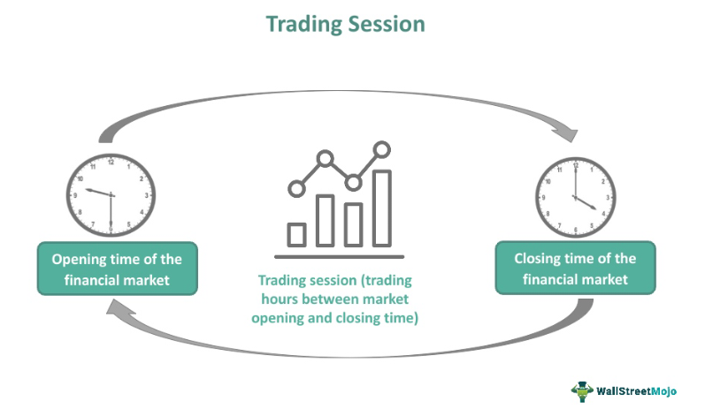

In today's dynamic economic environment, pricing strategies have become crucial for businesses aiming to optimize profits and maintain competitiveness. As companies confront fluctuating market conditions and evolving consumer preferences, traditional methods are being supplemented by advanced technological tools and analytics. Understanding and applying these innovations are key for businesses seeking to remain agile and responsive.

This article discusses session pricing and algorithmic trading, two pivotal elements in contemporary pricing strategy. Session pricing involves setting the price of a financial instrument over a specific trading period, providing insights into market trends through opening and closing prices. Algorithmic trading, on the other hand, employs complex computer algorithms to execute trades based on preset criteria such as price and volume, thus enhancing the speed and accuracy of trading decisions.



The intersection of these two economic concepts has immense potential. As businesses harness the capabilities of technology and data analytics, pricing models are becoming more adaptable and real-time. Such transformations allow companies to better anticipate market movements, optimize costs, and enhance profitability.

A comprehensive understanding of session pricing and algorithmic trading can offer strategic insights for businesses aiming to thrive in the modern market. These tools, when effectively leveraged, can provide a significant edge in competition, allowing enterprises to adapt swiftly to changes and make informed pricing decisions that align with both market demands and organizational goals. As technological advancements continue to refine these processes, the ability of businesses to integrate such strategies will be crucial for driving success and sustainability in an increasingly competitive landscape.

## Table of Contents

## Understanding Pricing Strategy

Pricing strategy is an essential aspect of business economics, focusing on determining the optimal price point for products and services. This process involves a variety of methods tailored to specific market conditions, the competitive landscape, and consumer behavior patterns.

**Demand Elasticity**

A fundamental concept in pricing strategy is demand elasticity, which measures how changes in price affect the quantity of a product demanded. This metric is crucial because it helps businesses understand the potential impact of pricing decisions on sales [volume](/wiki/volume-trading-strategy). The elasticity of demand is typically expressed as:

$$
E_d = \frac{\%\ \text{change in quantity demanded}}{\%\ \text{change in price}}
$$

If a product is elastic (E_d > 1), a small change in price leads to a significant change in demand, suggesting sensitivity to price changes. For inelastic products (E_d < 1), demand is relatively unaffected by price changes, allowing businesses to raise prices with minimal impact on sales volumes.

**Cost-Plus Pricing**

Cost-plus pricing is a straightforward strategy that involves adding a fixed percentage or margin to the cost of producing a product to determine its selling price. This approach ensures that all costs are covered while providing a consistent profit margin. The formula for cost-plus pricing can be expressed as:

$$
\text{Selling Price} = \text{Cost of Production} + (\text{Cost of Production} \times \text{Markup Percentage})
$$

This method is particularly beneficial in industries with stable production costs, allowing companies to maintain predictable and stable pricing.

**Competitive Pricing**

Competitive pricing involves setting prices based on those of competitors, which is particularly effective in markets where consumers have multiple choices and are price-sensitive. This strategy requires continuous market monitoring and adaptation to competitors' pricing changes. It enables businesses to remain attractive to consumers who prioritize cost, while also ensuring market competitiveness.

By incorporating these concepts—demand elasticity, cost-plus pricing, and competitive pricing—companies can strategically position their products in the market to maximize revenue and sustain competitive advantage. These pricing strategies can be tailored to accommodate different market conditions and consumer behaviors, enabling businesses to optimize their profitability and market share effectively.

## Economic Term: Session Pricing

Session pricing is a fundamental concept in finance that refers to the evaluation of a trading instrument's price over a specified trading session. Typically, this involves analyzing the instrument's opening and closing prices, along with the high, low, and closing prices throughout the session. By examining these data points, investors can gain essential insights into market trends, which are critical for making informed investment decisions.

Opening prices represent the level at which a trading session begins and can serve as a benchmark for gauging market sentiment at the start of the session. Conversely, closing prices reflect the market's conclusion at the end of a session, providing key insight into investor sentiment and potential future price movements. The highs and lows during a session illustrate the peak and trough of price movements, offering further context into market [volatility](/wiki/volatility-trading-strategies) and strength during that period.

To quantify these relationships, investors often look at indicators such as the average session range, calculated as:

$$
\text{Average Session Range} = \frac{\sum (\text{High} - \text{Low})}{\text{Number of Sessions}}
$$

This metric helps investors understand typical price fluctuations within a session, aiding in the identification of potential entry and [exit](/wiki/exit-strategy) points. Additionally, session pricing plays a crucial role in identifying support and resistance levels. Support is characterized as the price level which an asset does not usually fall below during a session, indicating strong buying interest. Resistance, on the other hand, marks the price level that an asset rarely surpasses, reflecting robust selling pressure.

For instance, if a stock repeatedly fails to rise above a certain price within multiple sessions, this price level may be identified as a resistance level. Similarly, a consistent bottom in prices during sessions might indicate a support level. These levels can act as indicators for traders to adjust their strategies accordingly, as breaking of these levels could signify a potential price trend reversal.

Understanding session pricing thus enables investors to anticipate potential shifts in the market by recognizing patterns in price movement. By incorporating session pricing analysis with sophisticated trading strategies, participants can optimize their decision-making processes, adjust their risk management protocols, and ultimately enhance their trading performance.

## The Role of Algorithmic Trading

Algorithmic trading utilizes computer algorithms to execute trades based on pre-established rules concerning price, timing, and volume. These algorithms allow traders and institutions to process high-frequency trading orders at speeds and volumes that would be impossible using conventional methods. The primary advantages of [algorithmic trading](/wiki/algorithmic-trading) include reduced transaction costs, enhanced execution speed, and the elimination of human emotional bias in trading decisions.

One key advantage of algorithmic trading is the minimization of transaction costs. Since algorithms can execute trades faster and more efficiently than humans, they often lead to lower costs per transaction. Moreover, algorithms can operate around the clock, taking advantage of temporal market inefficiencies that human traders might miss. This efficiency is particularly valuable in markets with high volatility, where price discrepancies can be quickly exploited.

Improved execution speed is another significant benefit of algorithmic trading. Algorithms can process thousands of data points per second, allowing trades to be executed as soon as market conditions meet the predefined criteria. This speed is crucial in contemporary financial markets, where slight delays can lead to missed opportunities and decreased profitability. The formula for calculating the time it takes to execute a trade is often represented as $T_{execution} = T_{system} + T_{network}$, where $T_{system}$ is the time taken by the algorithm system to process the trade, and $T_{network}$ is the time taken to communicate the trade to the marketplace.

By removing human emotion from trading decisions, algorithmic trading also reduces the risk of decisions driven by fear or greed—reasons often attributed to poor trading outcomes. The algorithms follow strictly defined parameters, ensuring that trades are executed based on logical conditions rather than subjective judgment.

The emergence of algorithmic trading has significantly enhanced market [liquidity](/wiki/liquidity-risk-premium) and efficiency. Algorithms enable continuous trading activities, contributing to a more fluid market where buying and selling can occur with minimal impact on prices. This increased liquidity often results in tighter bid-ask spreads, benefiting all market participants.

Python is frequently used for creating algorithmic trading systems, thanks to its extensive libraries and simplicity for handling financial data. A basic structure for an algorithmic trading script in Python might include libraries like `pandas`, `numpy` for numerical operations, and `TA-Lib` for technical analysis:

```python
import pandas as pd
import numpy as np
import talib

# Example: Simple Moving Average Crossover Strategy
def sma_crossover_strategy(data, short_window=40, long_window=100):
    data['Short_SMA'] = talib.SMA(data['Close'], timeperiod=short_window)
    data['Long_SMA'] = talib.SMA(data['Close'], timeperiod=long_window)

    data['Signal'] = 0  # Initialize signal column
    data['Signal'][short_window:] = np.where(data['Short_SMA'][short_window:] > data['Long_SMA'][short_window:], 1, 0)

    # Create trading orders
    data['Position'] = data['Signal'].diff()

    return data

# Sample data to be fed into the function
# data = pd.read_csv('historical_stock_prices.csv')
# strategy_data = sma_crossover_strategy(data)
```

Algorithmic trading's integration in modern finance continues to rise, driven by technological advancements and the relentless pursuit of efficiency and accuracy in financial transactions.

## Integrating Session Pricing with Algo Trading

Combining session pricing with algorithmic trading enhances decision-making consistency and precision by integrating real-time data analytics with automated trade execution. Session pricing provides a comprehensive overview of a trading instrument within a specific timeframe, reflecting fluctuations in supply and demand. Algorithms can analyze this price data to identify trends and potential market reversals, thereby facilitating strategic decision-making.

Algorithmic trading can process large volumes of session price data to identify entry and exit points more effectively. For instance, algorithms can be designed to initiate buy or sell orders when session prices breach predetermined thresholds based on historical data and market indicators. This trigger-based mechanism allows for timely responses to market conditions, enhancing the agility and accuracy of trading strategies.

In volatile market conditions, integrating session pricing with algorithmic trading can significantly improve risk management. Algorithms can adjust trading positions based on the volatility observed in session prices, thereby minimizing potential losses. For example, a risk management algorithm could use session volatility metrics to adjust stop-loss levels dynamically, ensuring that the risk associated with a trade aligns with current market dynamics.

A simplified Python example of using session pricing data to inform trading decisions might look like this:

```python
class TradingAlgorithm:
    def __init__(self, threshold):
        self.threshold = threshold

    def analyze_session_price(self, session_prices):
        # Calculate average price of the session
        average_price = sum(session_prices) / len(session_prices)

        # Implement buy/sell trigger based on session analysis
        if average_price > self.threshold:
            return "Buy"
        elif average_price < self.threshold:
            return "Sell"
        else:
            return "Hold"

session_prices = [100, 102, 101, 103, 99, 104]
algorithm = TradingAlgorithm(threshold=101)
decision = algorithm.analyze_session_price(session_prices)
print(f"Trading decision: {decision}")
```

Here, the algorithm evaluates the average session price, triggering a buy or sell action if it surpasses or falls below the defined threshold. In practice, more complex criteria would be utilized, incorporating diverse indicators and metrics derived from session price data.

The integration of session pricing with algorithmic trading not only optimizes transaction timing but also enhances strategic foresight, providing traders with a more robust framework to navigate market complexities. This synergy helps businesses capitalize on market opportunities while effectively managing risks, ensuring sustainable financial performance in dynamic trading environments.

## Special Considerations in Session Pricing and Algo Trading

While session pricing and algorithmic trading provide several benefits, they come with challenges, primarily centered around data integrity, algorithmic risks, and compliance issues. Ensuring data accuracy is pivotal, as erroneous data can lead to flawed decisions, impacting trading outcomes adversely. High-frequency trades depend on precise and up-to-date data; any discrepancies could result in significant financial losses or suboptimal trades.

Algorithmic risks are another concern. These involve the potential for algorithms to malfunction or behave unpredictably. Such scenarios can originate from coding errors, inadequate testing, or unforeseen market conditions. For instance, during highly volatile market phases, an algorithm programmed with rigid criteria might execute trades that escalate losses instead of mitigating them. Therefore, thorough testing and constant monitoring of algorithms are necessary to mitigate these risks.

Regulatory concerns surrounding algorithmic pricing practices are gaining prominence. Authorities worldwide are scrutinizing algorithmic trading systems for potential market manipulation. For example, "spoofing," where an algorithm places large orders it intends to cancel to manipulate prices, is illegal in many jurisdictions. Consequently, businesses must ensure their trading algorithms comply with all regulatory standards to avoid hefty fines and reputational damage.

Moreover, businesses must consider the technological infrastructure required to implement sophisticated trading algorithms. This infrastructure should support high-speed processing and real-time data analysis and provide robust security against cyber threats. The costs associated with such technological requirements can be substantial. Companies should weigh these expenses against the potential benefits to determine the viability of their algorithmic trading strategies.

Finally, talent acquisition and retention can be a hurdle, given the specialized skills needed to develop and manage trading algorithms. Firms often face competition for skilled professionals, which can drive up salaries and increase operational costs. Investing in ongoing training and development can help businesses maintain a competitive edge in algorithmic trading.

In conclusion, while integrating session pricing and algorithmic trading into pricing strategies offers significant advantages, businesses must carefully navigate associated challenges to achieve desired outcomes.

## Conclusion

Effective pricing strategies are paramount for achieving success in today's competitive business environment. A thorough understanding of economic concepts such as session pricing and the implementation of algorithmic trading can offer businesses substantial strategic advantages. These tools empower organizations to respond dynamically to market fluctuations, thereby enhancing decision-making processes and mitigating risks associated with price volatility.

Session pricing, by providing a detailed view of price movements within a specific trading session, helps traders and businesses identify key levels of support and resistance. This information is crucial for making timely and informed trading decisions. On the other hand, algorithmic trading streamlines the execution of trades based on pre-established criteria, such as price, volume, and timing, ultimately reducing transaction costs and eliminating emotional biases.

The integration of session pricing data into algorithmic trading models can further refine trading strategies. By programming algorithms to react to session-specific price triggers, businesses can optimize their risk management approaches. This synergy between session pricing and algorithmic trading is particularly valuable in navigating volatile market conditions.

As technology continues to advance, so will the methodologies and tools available for optimizing pricing strategies. Innovations in data analytics and [machine learning](/wiki/machine-learning) offer promising avenues for further enhancing the precision and efficiency of pricing decisions. Organizations that adeptly leverage these evolving tools can secure a competitive edge, augment their profitability, and ensure sustainable growth.

In conclusion, the convergence of economic insights derived from session pricing and the technological benefits offered by algorithmic trading provides a powerful framework for modern pricing strategy. Companies that successfully integrate these components within their operational models are well-positioned to succeed in an ever-evolving market landscape.

## References & Further Reading

[1]: Aldridge, I. (2013). ["High-Frequency Trading: A Practical Guide to Algorithmic Strategies and Trading Systems"](https://www.amazon.com/High-Frequency-Trading-Practical-Algorithmic-Strategies/dp/1118343506). Wiley.

[2]: Lopez de Prado, M. (2018). ["Advances in Financial Machine Learning"](https://www.amazon.com/Advances-Financial-Machine-Learning-Marcos/dp/1119482089). Wiley.

[3]: Chan, E. (2009). ["Quantitative Trading: How to Build Your Own Algorithmic Trading Business"](https://github.com/ftvision/quant_trading_echan_book). Wiley.

[4]: Jansen, S. (2020). ["Machine Learning for Algorithmic Trading"](https://github.com/stefan-jansen/machine-learning-for-trading). Packt Publishing.

[5]: Aronson, D. R. (2006). ["Evidence-Based Technical Analysis: Applying the Scientific Method and Statistical Inference to Trading Signals"](https://www.amazon.com/Evidence-Based-Technical-Analysis-Scientific-Statistical/dp/0470008741). Wiley.

[6]: Cartea, Á., Jaimungal, S., & Penalva, J. (2015). ["Algorithmic and High-Frequency Trading"](https://assets.cambridge.org/97811070/91146/frontmatter/9781107091146_frontmatter.pdf). Cambridge University Press.

[7]: Pardo, R. (2008). ["The Evaluation and Optimization of Trading Strategies"](https://onlinelibrary.wiley.com/doi/book/10.1002/9781119196969). Wiley.