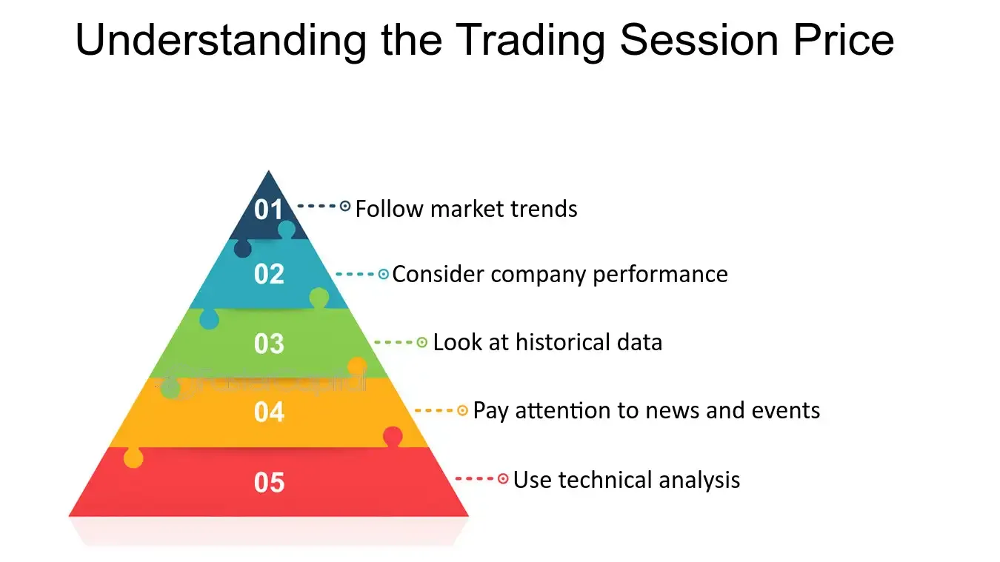

## Table of Contents

## What is session pricing?

Session pricing is a way businesses charge for their services based on the time spent with a customer. Instead of charging a fixed price for a product or service, the business charges for each session or meeting. This is common in fields like therapy, tutoring, or consulting, where the value comes from the time and expertise shared with the client.

Using session pricing can be good for both the business and the customer. For the business, it means they can charge based on how much time and effort they put into each session. For the customer, it can be more fair because they only pay for the time they actually use. But, it's important for both sides to agree on the price per session and how long each session will be, so there are no surprises.

## Why is session pricing important for businesses?

Session pricing is important for businesses because it helps them make money based on the time they spend with each customer. When a business charges by the session, they can set a price that matches the value of their time and expertise. This means they can earn more if they offer special skills or knowledge. It also makes it easier for businesses to plan their money because they know how much they will earn from each session.

For businesses, session pricing also helps them be more flexible. They can change the length of sessions or the price per session based on what customers want or need. This can make more people want to use their services. Plus, it's a clear way to charge customers, so there's less confusion about how much things cost. This can make customers happier and more likely to come back.

## How does session pricing differ from other pricing models?

Session pricing is different from other pricing models because it charges customers based on the time spent with them, not on a fixed price for a product or service. For example, in a subscription model, customers pay a regular fee to access a service, like a monthly fee for a gym membership. With session pricing, a gym might charge for each class or training session instead. This means customers only pay for what they use, which can be more fair for them.

Another common pricing model is the one-time purchase, where customers buy a product or service outright, like buying a book or a piece of furniture. With session pricing, the focus is on the time and expertise provided during each session, not on a physical product. This makes it more suitable for services like therapy, tutoring, or consulting, where the value comes from the interaction and knowledge shared.

Session pricing can also be compared to tiered pricing, where different levels of service are offered at different prices. In session pricing, the price might stay the same per session, but the length or content of the session can be adjusted to meet the customer's needs. This flexibility can be a big advantage over other models, as it allows businesses to tailor their services and pricing to each customer, potentially leading to higher satisfaction and repeat business.

## What are the common types of sessions that can be priced?

Session pricing can be used for many different kinds of services. Some common types include therapy sessions, where people meet with a therapist to talk about their feelings and problems. Tutoring sessions are another example, where a tutor helps a student learn a subject or prepare for a test. Consulting sessions are also common, where a consultant gives advice or helps solve business problems. These sessions are all about using the time and knowledge of the service provider to help the customer.

There are also fitness sessions, where a personal trainer works with a client to help them get in shape. Music lessons are another type, where a teacher helps someone learn to play an instrument. Coaching sessions, whether for life coaching or sports coaching, are also priced by the session. All these types of sessions focus on the value of the time spent with the service provider, and the price is set based on how long the session lasts and the expertise of the person leading it.

## How do you determine the right price for a session?

To determine the right price for a session, you need to think about a few things. First, look at how much other people charge for similar sessions in your area. This helps you set a price that is fair and competitive. Next, consider your own costs, like rent, supplies, and time. You need to make sure the price covers these costs and also gives you some profit. It's also important to think about how much value you bring to your customers. If you have special skills or knowledge, you might be able to charge more.

Another way to set the right price is to ask your customers what they think. You can do this by talking to them or doing surveys. Their feedback can help you understand if your price is too high or too low. You might also want to try different prices to see what works best. Sometimes, offering a few different price options can help you find the right balance. Remember, the goal is to find a price that feels fair to both you and your customers, so they keep coming back for more sessions.

## What factors should be considered when setting session prices?

When setting session prices, it's important to look at what other people charge for similar sessions in your area. This helps you make sure your price is fair and competitive. You also need to think about your own costs, like rent, supplies, and the time you spend. Your price should cover these costs and give you some profit. Another thing to consider is the value you bring to your customers. If you have special skills or knowledge, you might be able to charge more.

It's also a good idea to ask your customers what they think about your prices. You can talk to them or do surveys to get their feedback. This can help you understand if your price is too high or too low. Sometimes, trying different prices can help you find the right one. Offering a few different price options can also help you find a balance that works for both you and your customers. The goal is to set a price that feels fair to everyone, so your customers keep coming back for more sessions.

## How can session pricing be adjusted for different customer segments?

Session pricing can be adjusted for different customer segments by offering different prices or session lengths based on what each group needs and can afford. For example, if you have students who might not have a lot of money, you could offer them shorter sessions at a lower price. On the other hand, if you have business clients who need more detailed help, you could offer longer sessions at a higher price. This way, you can make sure everyone gets the help they need at a price they can afford.

Another way to adjust session pricing is by offering package deals or discounts for certain groups. For instance, you might give a discount to people who buy a set number of sessions upfront, which can be attractive to customers who want to commit to regular sessions. You could also offer special rates for groups like seniors or veterans, making your services more accessible to them. By tailoring your pricing to different customer segments, you can attract a wider range of clients and make sure your services are fair and affordable for everyone.

## What are the best practices for communicating session prices to customers?

When telling customers about session prices, it's important to be clear and honest. Let them know the cost of each session right from the start, so they know what to expect. If you have different prices for different kinds of sessions or for different groups of people, explain that clearly too. It's a good idea to put the prices on your website or in a pamphlet, so people can see them easily. When you talk to customers, use simple words and make sure they understand everything. If they have questions about the price, answer them patiently and make sure they feel comfortable.

It's also helpful to tell customers about any special deals or discounts they might be able to get. For example, if you offer a lower price for buying a bunch of sessions at once, make sure they know about it. If you change your prices, tell your customers ahead of time and explain why. This shows that you respect them and helps keep them happy. Good communication about prices can make customers trust you more and want to keep coming back for your services.

## How can session pricing impact customer retention and satisfaction?

Session pricing can help keep customers coming back and make them happy if it's done right. When customers know exactly how much they will pay for each session, they feel more in control and less worried about surprise costs. This clear pricing can make them trust the business more. Also, if the business offers different prices for different kinds of customers, like students or seniors, it can make the service feel more fair and affordable. This can make customers feel valued and more likely to keep using the service.

On the other hand, if session pricing is not clear or feels too expensive, it can make customers unhappy and less likely to come back. If customers feel like they are being charged too much for the time they spend, they might look for other places that offer better value. It's important for businesses to listen to what customers say about the prices and make changes if needed. By keeping prices fair and easy to understand, businesses can keep their customers happy and coming back for more sessions.

## What are the potential challenges of implementing session pricing?

One big challenge of using session pricing is making sure everyone understands the price. If the price is not clear, customers might feel confused or tricked. This can make them unhappy and less likely to come back. Also, setting the right price can be hard. If the price is too high, customers might go somewhere else. If it's too low, the business might not make enough money to keep going. It's important to find a good balance that feels fair to both the business and the customers.

Another challenge is dealing with different kinds of customers. Some people might want shorter sessions, while others need longer ones. This can make it hard to set prices that work for everyone. The business might need to offer different prices for different groups, like students or seniors, but this can get complicated. It's also tough to change prices once they are set. If the business raises the price, some customers might get upset and leave. Keeping everyone happy while making enough money can be a big challenge when using session pricing.

## How can data analytics be used to optimize session pricing strategies?

Data analytics can help businesses set better session prices by looking at information about customers and how they use the service. By studying this data, a business can see which sessions are most popular and how long customers usually spend on them. This can help the business decide if they should charge more for certain types of sessions or offer discounts for others. For example, if the data shows that a lot of people want to book sessions at certain times, the business might charge more during those busy times. This way, the business can make more money and still keep customers happy.

Also, data analytics can help the business understand what different groups of customers want and can afford. By looking at things like age, job, and how often customers come back, the business can set different prices for different people. For instance, if the data shows that students often can't pay as much, the business might offer them a lower price. This makes the service more fair and can help keep more customers coming back. Using data to make smart choices about pricing can help the business grow and keep customers happy at the same time.

## What advanced techniques can be used to dynamically adjust session pricing?

One advanced way to change session prices is by using something called "dynamic pricing." This means the price can go up or down depending on how many people want to book a session and at what time. For example, if a lot of people want to book a session at 6 PM, the price might go up because it's a busy time. But if fewer people want to book at 9 PM, the price might go down to encourage more people to come then. This can help the business make more money and also fill up times that are usually empty.

Another technique is using "[machine learning](/wiki/machine-learning)" to look at a lot of data and find patterns. This can help the business predict when more people will want sessions and set the right price for those times. For example, if the machine learning system sees that more people book sessions on Mondays, it might suggest a higher price for Monday sessions. This helps the business make the most money possible while still keeping customers happy. By using these smart tools, the business can keep changing the prices to match what customers want and need.

## What is the key to understanding pricing strategy?

Pricing strategy is an essential aspect of business economics, focusing on determining the optimal price point for products and services. This process involves a variety of methods tailored to specific market conditions, the competitive landscape, and consumer behavior patterns.

**Demand Elasticity**

A fundamental concept in pricing strategy is demand elasticity, which measures how changes in price affect the quantity of a product demanded. This metric is crucial because it helps businesses understand the potential impact of pricing decisions on sales [volume](/wiki/volume-trading-strategy). The elasticity of demand is typically expressed as:

$$
E_d = \frac{\%\ \text{change in quantity demanded}}{\%\ \text{change in price}}
$$

If a product is elastic (E_d > 1), a small change in price leads to a significant change in demand, suggesting sensitivity to price changes. For inelastic products (E_d < 1), demand is relatively unaffected by price changes, allowing businesses to raise prices with minimal impact on sales volumes.

**Cost-Plus Pricing**

Cost-plus pricing is a straightforward strategy that involves adding a fixed percentage or margin to the cost of producing a product to determine its selling price. This approach ensures that all costs are covered while providing a consistent profit margin. The formula for cost-plus pricing can be expressed as:

$$
\text{Selling Price} = \text{Cost of Production} + (\text{Cost of Production} \times \text{Markup Percentage})
$$

This method is particularly beneficial in industries with stable production costs, allowing companies to maintain predictable and stable pricing.

**Competitive Pricing**

Competitive pricing involves setting prices based on those of competitors, which is particularly effective in markets where consumers have multiple choices and are price-sensitive. This strategy requires continuous market monitoring and adaptation to competitors' pricing changes. It enables businesses to remain attractive to consumers who prioritize cost, while also ensuring market competitiveness.

By incorporating these concepts—demand elasticity, cost-plus pricing, and competitive pricing—companies can strategically position their products in the market to maximize revenue and sustain competitive advantage. These pricing strategies can be tailored to accommodate different market conditions and consumer behaviors, enabling businesses to optimize their profitability and market share effectively.

## What is the Economic Term: Session Pricing?

Session pricing is a fundamental concept in finance that refers to the evaluation of a trading instrument's price over a specified trading session. Typically, this involves analyzing the instrument's opening and closing prices, along with the high, low, and closing prices throughout the session. By examining these data points, investors can gain essential insights into market trends, which are critical for making informed investment decisions.

Opening prices represent the level at which a trading session begins and can serve as a benchmark for gauging market sentiment at the start of the session. Conversely, closing prices reflect the market's conclusion at the end of a session, providing key insight into investor sentiment and potential future price movements. The highs and lows during a session illustrate the peak and trough of price movements, offering further context into market [volatility](/wiki/volatility-trading-strategies) and strength during that period.

To quantify these relationships, investors often look at indicators such as the average session range, calculated as:

$$
\text{Average Session Range} = \frac{\sum (\text{High} - \text{Low})}{\text{Number of Sessions}}
$$

This metric helps investors understand typical price fluctuations within a session, aiding in the identification of potential entry and [exit](/wiki/exit-strategy) points. Additionally, session pricing plays a crucial role in identifying support and resistance levels. Support is characterized as the price level which an asset does not usually fall below during a session, indicating strong buying interest. Resistance, on the other hand, marks the price level that an asset rarely surpasses, reflecting robust selling pressure.

For instance, if a stock repeatedly fails to rise above a certain price within multiple sessions, this price level may be identified as a resistance level. Similarly, a consistent bottom in prices during sessions might indicate a support level. These levels can act as indicators for traders to adjust their strategies accordingly, as breaking of these levels could signify a potential price trend reversal.

Understanding session pricing thus enables investors to anticipate potential shifts in the market by recognizing patterns in price movement. By incorporating session pricing analysis with sophisticated trading strategies, participants can optimize their decision-making processes, adjust their risk management protocols, and ultimately enhance their trading performance.

## References & Further Reading

[1]: Aldridge, I. (2013). ["High-Frequency Trading: A Practical Guide to Algorithmic Strategies and Trading Systems"](https://www.amazon.com/High-Frequency-Trading-Practical-Algorithmic-Strategies/dp/1118343506). Wiley.

[2]: Lopez de Prado, M. (2018). ["Advances in Financial Machine Learning"](https://www.amazon.com/Advances-Financial-Machine-Learning-Marcos/dp/1119482089). Wiley.

[3]: Chan, E. (2009). ["Quantitative Trading: How to Build Your Own Algorithmic Trading Business"](https://github.com/ftvision/quant_trading_echan_book). Wiley.

[4]: Jansen, S. (2020). ["Machine Learning for Algorithmic Trading"](https://github.com/stefan-jansen/machine-learning-for-trading). Packt Publishing.

[5]: Aronson, D. R. (2006). ["Evidence-Based Technical Analysis: Applying the Scientific Method and Statistical Inference to Trading Signals"](https://www.amazon.com/Evidence-Based-Technical-Analysis-Scientific-Statistical/dp/0470008741). Wiley.

[6]: Cartea, Á., Jaimungal, S., & Penalva, J. (2015). ["Algorithmic and High-Frequency Trading"](https://assets.cambridge.org/97811070/91146/frontmatter/9781107091146_frontmatter.pdf). Cambridge University Press.

[7]: Pardo, R. (2008). ["The Evaluation and Optimization of Trading Strategies"](https://onlinelibrary.wiley.com/doi/book/10.1002/9781119196969). Wiley.