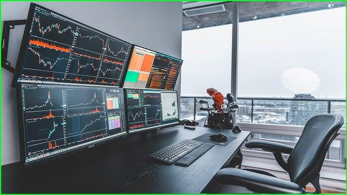

In trading, having the right setup is crucial for success. The trading environment you establish, encompassing both hardware and software components, plays a significant role in enhancing your trading efficiency and decision-making processes. This article aims to guide traders through the essentials of optimizing trading screens, configuring monitors effectively, and understanding the impact of algorithmic trading (algo trading) in modern strategies.

A well-organized trading environment can lead to improved performance by enabling swift access to market data, allowing for comprehensive analysis and quick reaction to market changes. From selecting high-resolution trading screens to ensuring that your monitors are arranged for maximum visibility and comfort, every component of your trading setup matters. Integrating cutting-edge technology such as algo trading can amplify your trading capabilities, providing greater precision and speed.



The key to a successful trading setup lies not only in the equipment but also in the trader's ability to adapt and optimize their environment continuously. By considering factors like screen resolution, monitor configuration, and the role of advanced trading tools, traders can position themselves for greater success in the fast-paced trading landscape. Let's explore these core elements and how they influence the effectiveness of your trading practices.

## Table of Contents

## Understanding Trading Setups

A trading setup encompasses a variety of components that extend beyond a mere computer and internet connection. An effective trading setup integrates physical and digital elements designed to optimize both comfort and functionality, ultimately enhancing trading performance and outcomes.

At the core of an effective trading setup lies a dedicated workspace. This is more than a simple desk; it is an environment tailored to minimize distractions and facilitate focus. The choice of ergonomic furniture is crucial, especially considering the long hours traders often spend monitoring markets. Ergonomic chairs with adjustable height, lumbar support, and comfortable padding can alleviate physical strain, reducing the risk of discomfort or injury over time. Similarly, desks should accommodate multiple monitors and necessary peripherals, such as keyboards and mouse devices, without causing clutter.

The impact of the physical and digital environment on trading performance is significant. A clutter-free workspace allows traders to concentrate more readily on the task at hand, while digital organization, such as a well-structured file system and streamlined access to trading applications, prevents time-wasting navigation between tasks. The organization of both physical and digital resources plays a role in reducing cognitive load, enabling traders to make swift, clear-headed decisions during critical market movements.

A casual trading setup often consists of a single computer monitor and minimal investment in ergonomic solutions, while a professional trading station includes multiple monitors, each dedicated to displaying different types of information for comprehensive market analysis. Professional setups may also integrate specialized tools and software, enhancing real-time data monitoring and trading capabilities. This distinction is important as a professional station is designed to emulate the environment of a trading floor, allowing for rapid decision-making and simultaneous monitoring of numerous data streams.

Recognizing the significance of both workspace dynamics and digital organization can transform a trader's capability, efficiency, and overall performance. By investing in a well-planned trading setup, traders can create an environment that supports both their physical well-being and strategic objectives.

## Trading Screens: Size and Resolution Matter

In trading, the choice and configuration of screens significantly influence the effectiveness and efficiency of market analysis. Multiple screens enhance a trader's capability by allowing simultaneous monitoring of various assets, news feeds, and analytical tools. This multi-monitor approach reduces the need to switch between tabs, enabling quicker decision-making which is crucial in fast-paced market environments.

The optimal screen size and resolution are critical factors in setting up a trading station. Larger screens with higher resolutions, such as 4K (3840 x 2160 pixels), allow for finely detailed charts and clearer text, which assists traders in spot trends and anomalies in market data quickly. High-resolution screens improve the overall readability of complex data, reducing eye strain during long trading sessions and allowing for the efficient use of space by displaying multiple windows side by side without clutter.

Screen quality directly impacts a trader's ability to analyze market data. Modern screens with high color accuracy and contrast ratios provide true-to-life representations of charts and indicators, essential for making precise evaluations. The refresh rate, measured in hertz (Hz), defines the screen’s ability to update images. Higher refresh rates, such as 120Hz or 144Hz, can be beneficial in scenarios that require constant monitoring of real-time data feeds, particularly for high-frequency trading.

A panoramic view provides the benefit of monitoring multiple assets simultaneously, a significant advantage for traders engaging in diverse markets. With ultra-wide monitors or a multi-monitor setup, traders can track different stocks, commodities, or indices side by side. This arrangement supports a comprehensive market view, aiding in the development of broader strategies and reducing the time needed to react to market changes.

For maximum comfort and efficiency, arranging screens should consider ergonomic principles. Screens should be positioned at eye level to maintain a natural neck posture, and the distance between the trader and the screens should allow for a wide field of view without constant neck or eye adjustments. Tilting screens slightly downwards can also help reduce glare, providing a clearer view.

In conclusion, trading screens are a crucial component of an optimized trading setup. Careful selection and arrangement of screens tailored to a trader's specific needs can significantly enhance trading performance, minimize physical strain, and contribute to more effective data analysis. Investing in quality screens is not just an expenditure but a vital investment in a trader's success.

## Optimal Trading Monitor Configuration

Configuring your trading monitors effectively is crucial to creating an efficient trading environment that supports quick decision-making and reduces the risk of errors. This involves understanding the different types of monitor setups, their technical specifications, and optimizing them to simulate a trading floor experience while remaining cost-effective.

### Step-by-Step Guide to Configuring Your Monitors for Trading

1. **Choosing the Right Monitor Setup**: The foundation of your trading setup involves selecting the appropriate monitor configuration based on your needs:
   - **Single Monitor Setup**: Suitable for beginners or traders with a minimalistic trading style. A single, large monitor with a high resolution can be sufficient to display all necessary information, although it has limited flexibility.
   - **Dual Monitor Setup**: This is a popular choice among traders, offering a balance between visibility and simplicity. Traders often use one monitor for charts and trading platforms, while the other displays news feeds, social media, or additional charts.
   - **Multi-Monitor Setup**: For highly active traders or those dealing with multiple markets, a multi-monitor setup allows simultaneously viewing numerous data feeds and trading platforms. This setup mimics a professional trading floor environment.

2. **Technical Aspects**: To ensure optimal performance, consider the following technical specifications:
   - **Refresh Rates**: A higher refresh rate (measured in hertz, Hz) results in smoother motion display, which is important for tracking fast-moving data. A refresh rate of at least 60 Hz is recommended, while 120 Hz or higher can be preferable for smoother transitions.
   - **Color Accuracy**: Accurate color reproduction can be critical, particularly when analyzing charts. Look for monitors with an IPS (In-Plane Switching) panel, which provides better color accuracy and consistency.
   - **Viewing Angles**: IPS panels also offer wide viewing angles, ensuring that screen colors remain accurate even when viewed from the side. This is important in multi-monitor setups where not all screens are directly in front.

3. **Simulating a Trading Floor Experience**: Arrange your monitors to efficiently simulate a trading floor setup. This involves:
   - Setting up monitors in an arc or semi-circle configuration to minimize head movement and ensure easy accessibility.
   - Using monitor arms or stands to position screens at eye level, with the main monitor directly in front of you and additional monitors angled slightly to the sides.
   - Ensuring all cables and connections are secure and organized to prevent tangles and distractions.

4. **Cost-Effective Solutions**: Building an optimal monitor setup doesn't have to be prohibitively expensive. Consider these budget-friendly approaches:
   - Purchase refurbished or second-hand monitors from reputable sources to reduce costs while still obtaining high-quality displays.
   - Use monitor mounts and stands that can support multiple screens, maximizing desk space and providing flexibility without needing additional desks.
   - Prioritize upgrading the primary monitor and gradually expand as your trading demands and budget allow.

By following these guidelines, traders can configure a monitor setup that enhances their trading performance and creates a professional trading environment.

## The Role of Algo Trading in Modern Trading Strategies

Algorithmic trading, often referred to as algo trading, has revolutionized modern trading strategies, offering unprecedented benefits that include precision, speed, and scalability. Its growing prevalence is attributed to advancements in technology and increased accessibility to sophisticated algorithms.

### Enhancing Trading Precision and Speed

Algorithmic trading enhances precision and speed by automating trade execution. Algorithms can rapidly analyze vast amounts of market data, identifying patterns or anomalies that might be imperceptible to human traders. This speed enables the execution of trades in fractions of a second, taking advantage of fleeting market opportunities. The precision is evident in the ability to set specific parameters and execute trades when exact conditions are met, minimizing human error and emotional decision-making.

### Tools and Software for Successful Algo Trading

Several tools and software are essential for conducting successful [algorithmic trading](/wiki/algorithmic-trading). Platforms like MetaTrader, QuantConnect, and NinjaTrader provide robust environments for building and testing algorithms. These platforms often come with integrated development environments (IDEs) supporting Python, C++, or other programming languages commonly used in algorithm development. Essential features include [backtesting](/wiki/backtesting) capabilities, which allow traders to simulate how algorithms would perform using historical data, and live market data feeds to ensure accurate and real-time information is available for swift decision-making.

### Balancing Algorithmic Strategies with Human Intuition

While algorithms offer speed and precision, human intuition remains valuable. Traders often use a hybrid approach, combining quantitative models with qualitative insights to refine trading strategies. This balance allows traders to adapt to unforeseen market conditions where human experience and intuition can provide context that an algorithm might overlook. For instance, geopolitical events or sudden market shifts might require a human touch in interpreting their potential impacts, beyond what algorithms predict based on historical data.

### Debunking Myths and Misconceptions

Several myths surround algorithmic trading, notably the misconception that it's infallible. While algo trading reduces human error, it is not immune to flaws in algorithm design or unpredicted market conditions that can lead to significant losses. Another common myth is that algorithmic trading is only viable for large institutions. In reality, retail traders increasingly leverage algorithmic tools, given the accessibility of advanced software and computational power. It's essential for traders to maintain a robust risk management framework and continuously update algorithms to adapt to dynamic market environments.

In summary, algorithmic trading stands as a cornerstone in modern trading strategies, offering efficiency and precision. By leveraging the right tools, balancing automation with human insight, and debunking prevalent myths, traders can effectively harness the power of algorithms for improved trading outcomes.

## Integrating Technology: Trading Software and Tools

Integrating advanced technology is a pivotal aspect of establishing a robust trading environment. Trading software and tools serve as the backbone of an efficient trading setup, providing traders with the agility to make informed decisions swiftly. 

A comprehensive overview of essential trading software includes platforms that offer real-time data analysis, advanced charting tools, and customizable indicators. Key features to prioritize when selecting trading platforms and tools consist of user-friendly interfaces, high-speed execution, reliability, and a wide array of asset classes. The ability for seamless integration with various APIs for data feeds and order execution is also critical, offering traders versatile opportunities to enhance their strategies through automation and data-driven insights.

Automation tools are crucial in streamlining trading activities and minimizing human error. Through algorithmic trading applications, traders can design, backtest, and deploy automated strategies that execute trades based on predefined criteria without manual intervention. Python is a commonly used language for these tasks due to its powerful libraries, such as NumPy and pandas, which facilitate data manipulation and analysis. Here is a simple example of a backtesting algorithm using Python:

```python
import pandas as pd

# Load historical data
data = pd.read_csv('historical_data.csv')
data['Signal'] = 0

# Simple moving average strategy
data['SMA20'] = data['Close'].rolling(window=20).mean()
data['SMA50'] = data['Close'].rolling(window=50).mean()

# Generate buy/sell signals
data['Signal'][20:] = np.where(data['SMA20'][20:] > data['SMA50'][20:], 1, -1)

# Calculate returns
data['Returns'] = data['Signal'].shift(1) * data['Close'].pct_change()
```

Security considerations are paramount when using digital trading tools. Ensuring platforms employ robust encryption protocols for data transmission, multi-[factor](/wiki/factor-investing) authentication, and regular software updates to guard against vulnerabilities is essential for safeguarding sensitive financial information.

Future trends in trading technology indicate a growing emphasis on [artificial intelligence](/wiki/ai-artificial-intelligence) and [machine learning](/wiki/machine-learning). These technologies are anticipated to provide enhanced predictive analytics, allowing traders to anticipate market movements with greater accuracy. Additionally, blockchain technology could revolutionize transaction transparency and speed, creating more efficient markets. Remaining informed and adaptable to these evolving technologies is vital for any trader aiming to maintain a competitive edge.

In conclusion, integrating the right trading software and tools into your trading environment can significantly boost performance and efficiency. By prioritizing key features, employing automation, and staying vigilant about security and emerging trends, traders can create a technologically empowered setup poised for success in modern markets.

## Maximizing Trader Performance: Ergonomics and Health

In trading, maintaining optimal performance requires more than just technical knowledge and market insight; it also involves attention to ergonomics and health. Ergonomics plays a pivotal role in preventing trader fatigue, which can negatively impact decision-making and overall productivity. By understanding and implementing ergonomic principles, traders can create a more comfortable and efficient work environment.

### Chair Selection, Desk Arrangement, and Posture Maintenance

Choosing the right chair is crucial. A good ergonomic chair should offer proper lumbar support, an adjustable seat height, and a reclining function to support a natural posture. It should allow the trader's feet to remain flat on the floor with knees at a 90-degree angle. Armrests that are adjustable help reduce strain on the shoulders. Desk arrangements should ensure that monitors are at eye level to prevent neck strain, and the keyboard and mouse should be positioned to allow the elbows to rest at an open angle, preferably near 90 to 110 degrees, to avoid wrist strain.

### Health-Focused Office Accessories

Office accessories such as ergonomic keyboard and mouse setups can significantly enhance comfort. Split keyboards and vertical mice are designed to maintain a neutral wrist position, which is less stressful over extended periods. Additionally, standing desk risers enable traders to alternate between sitting and standing, reducing the risk of sedentary-related health issues. Anti-fatigue mats can also be beneficial for those who stand part of the day.

### Practical Exercises and Breaks

Incorporating short breaks and physical exercises into the trading day helps maintain agility and alertness. Practices such as the 20-20-20 rule—taking a 20-second break to look at something 20 feet away every 20 minutes—can alleviate eye strain. Simple stretching exercises, like shoulder rolls and back twists, can improve circulation and reduce muscle tension.

### Lighting and Eye Strain

Lighting is another critical factor in reducing eye strain. Natural light is ideal, but when unavailable, using adjustable LED lamps with warm light settings can help. Positioning light sources to minimize glare on computer screens will further protect the eyes. Monitor settings should be adjusted to a brightness level that matches the surrounding environment, and blue light filters can be used to reduce eye fatigue, particularly when working during evening hours.

By giving attention to these ergonomic and health-focused elements, traders can not only prevent fatigue and discomfort but also enhance their performance and decision-making capabilities during trading sessions.

## Conclusion

In trading, constructing a successful trading setup requires a thoughtful combination of hardware and software, tailored to the trader's specific needs. A well-organized trading environment begins with selecting the right hardware, such as multiple high-resolution screens, which sharpens the ability to monitor and analyze market data efficiently. Complement these with ergonomically designed furniture to ensure the trader's physical well-being, reducing fatigue and enhancing focus during trading sessions.

Adaptability is key in trading, necessitating a constant evaluation and optimization of the trading environment. With the rapid evolution of trading technologies, staying updated is not just beneficial but imperative. This includes regularly upgrading trading software tools and implementing the latest automation technologies to streamline operations and reduce human error. These advancements can significantly enhance a trader’s precision and speed, crucial in the fast-paced trading market.

However, a successful trading setup transcends technology. The trader's well-being is paramount, as good health directly impacts decision-making and performance. Ensuring adequate lighting, proper posture, and regular breaks can mitigate eye strain and physical fatigue, promoting sustained focus and clarity.

In summary, while an effective trading setup leverages cutting-edge technology, it simultaneously prioritizes the trader's health and comfort. By continually refining both the physical and digital components, traders can position themselves to make more informed decisions and achieve greater success in their trading endeavors.

## References & Further Reading

[1]: Bergstra, J., Bardenet, R., Bengio, Y., & Kégl, B. (2011). ["Algorithms for Hyper-Parameter Optimization."](https://papers.nips.cc/paper/4443-algorithms-for-hyper-parameter-optimization) Advances in Neural Information Processing Systems 24.

[2]: ["Advances in Financial Machine Learning"](https://www.amazon.com/Advances-Financial-Machine-Learning-Marcos/dp/1119482089) by Marcos Lopez de Prado

[3]: ["Evidence-Based Technical Analysis: Applying the Scientific Method and Statistical Inference to Trading Signals"](https://www.amazon.com/Evidence-Based-Technical-Analysis-Scientific-Statistical/dp/0470008741) by David Aronson

[4]: ["Machine Learning for Algorithmic Trading"](https://github.com/PacktPublishing/Machine-Learning-for-Algorithmic-Trading-Second-Edition) by Stefan Jansen

[5]: ["Quantitative Trading: How to Build Your Own Algorithmic Trading Business"](https://www.amazon.com/Quantitative-Trading-Build-Algorithmic-Business/dp/0470284889) by Ernest P. Chan