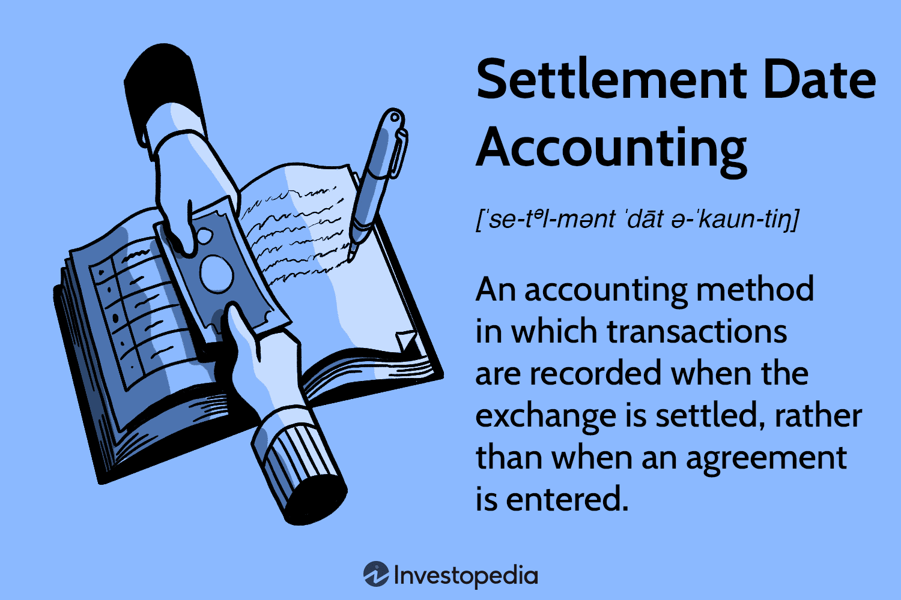

The finance sector is inherently complex, characterized by a myriad of accounting methods that dictate the recording of financial transactions. Among these methods, settlement date accounting holds a significant position, particularly in the environment of algorithmic trading. This method focuses on recording transactions at the time when all service or transaction obligations are fulfilled rather than when they are initiated. This distinction is crucial in maintaining accurate financial records in a high-velocity trading context.

Algorithmic trading has dramatically transformed financial markets by automating the execution of a large volume of trades at extraordinary speeds. This transformation highlights the critical role of accounting methods in ensuring the accuracy and integrity of financial data. Accurate accounting is essential for risk management and strategic decision-making in a market driven by intricate and fast-paced transactions. As such, understanding the impact of different accounting practices, including settlement date accounting, is vital.

This article examines the essential accounting methods relevant to financial transactions, with a particular emphasis on settlement date accounting. By exploring its nuances and implications, the article sheds light on its significance in algorithmic trading. This exploration provides insights into how companies can maintain financial clarity and mitigate the risks associated with pending transactions in an ever-evolving market landscape.

## Table of Contents

## Understanding Settlement Date Accounting

Settlement date accounting is a fundamental method in financial transactions where entries in the financial books are made on the specific date when the transaction obligations are fully satisfied. This means that the recording only occurs once the exchange of assets or services is complete, marking the formal culmination of the transaction. By aligning accounting entries with the actual completion of transactions, this method endeavors to offer a more accurate and reliable representation of a company's financial situation.

In contrast, trade date accounting logs transactions at the initiation point. This method records the transaction based on the agreement or contract date, regardless of when the actual exchange occurs. While it provides immediate insights into commitments and expected future cash flows, it can sometimes reflect a more volatile financial picture due to fluctuations between the trade and settlement dates.

The conservative nature of settlement date accounting helps in mitigating the risks of misstating the financial position by ensuring that only finalized transactions are reflected in the [books](/wiki/algo-trading-books). This approach can prevent premature recognition of revenues and obligations, providing a clearer view of completed exchanges. By focusing on transactions that have been entirely fulfilled, this method enhances the accuracy of financial reporting, potentially reducing discrepancies arising from pending or future obligations.

For firms navigating complex markets, especially where numerous transactions occur rapidly, the distinction between these accounting methods is critical. By implementing settlement date accounting, organizations can safeguard their financial records from overstating or understating actual financial performance due to timing differences inherent in pending transactions.

## Comparing Settlement Date and Trade Date Accounting

Trade date accounting is a method that acknowledges financial transactions at the time they are initiated. This approach provides real-time insights into financial activities, reflecting changes as they occur. However, this immediacy can lead to increased [volatility](/wiki/volatility-trading-strategies) in financial statements. By registering trades as soon as they are executed, companies expose their financials to potential fluctuations before the transaction is finalized. This can result in the appearance of heightened short-term financial instability.

On the other hand, settlement date accounting delays recognition of a transaction until it is completely settled. This postponement offers a smoother presentation of financial data, as it records only finalized transactions. While this approach minimizes the volatility seen in trade date accounting, it might not fully capture the short-term dynamics and activities of financial operations, potentially under-representing the actual [volume](/wiki/volume-trading-strategy) of trading activities.

Both accounting methods have vital implications for [algorithmic trading](/wiki/algorithmic-trading). In such a context, the rapid execution of trades could lead to significant discrepancies in financial reporting depending on the chosen method. Trade date accounting would quickly reflect the multitude of transactions common in algorithmic trading, thus painting an immediate picture of financial activities but risking misleading volatility. Conversely, settlement date accounting may offer a more stable view of financial health, as it accounts for only completed transactions, thereby potentially missing out on the portrayal of ongoing trading activities.

To comprehend these methods thoroughly, consider the effect on a company's financial statement. For instance, if a transaction is initiated on December 29th with a settlement date of January 2nd, trade date accounting would include the transaction in the financial records for December, while settlement date accounting would list it in January. This difference can substantially impact quarterly financial reports, affecting stakeholders' interpretations of a company's financial status during fast-paced trading periods. Through understanding these implications, financial professionals can make informed decisions that align with their strategic objectives and reporting needs.

## Role of Settlement Date Accounting in Algorithmic Trading

In algorithmic trading, the [high frequency](/wiki/high-frequency-trading) and velocity of transactions necessitate the use of precise accounting methods to accurately portray a firm's financial position. Settlement date accounting plays a crucial role owing to its conservative approach of recording transactions only once they are completed, which aligns with the needs of the algorithmic trading environment where transactions are executed in rapid succession.

The core advantage of settlement date accounting is its ability to ensure that financial records accurately reflect transactions that have been finalized. This approach mitigates the potential risks that can arise from recognizing revenues prematurely, which is particularly significant in algorithmic trading where thousands of trades may occur in a fraction of a second. By recording a trade as completed only when the settlement occurs, this method contributes to maintaining financial integrity. It supports a clear demarcation between pending and completed transactions, which reduces the likelihood of overstating revenues or assets that are not yet realized.

Such precision is beneficial not only for internal accuracy but also for external reporting and compliance. Ensuring that only settled trades are recorded helps companies present a reliable financial status to investors, regulatory authorities, and other stakeholders. This, in turn, engenders trust and confidence in financial disclosures and promotes a clearer understanding of the company's actual financial health. This practice becomes essential given the regulatory scrutiny focused on algorithmic trading activities.

Moreover, in the context of risk management, settlement date accounting provides a practical mechanism for tracking and controlling the exposure that can arise from unsettled trades. By ensuring that all accounted trades are indeed settled, firms prevent potential discrepancies that might affect financial stability or lead to problematic audit findings. Given the complex and volatile nature of trading algorithms, this accounting method underpins an accurate risk assessment process, facilitating better-informed decision-making and strategic planning.

In conclusion, applying settlement date accounting in the algorithmic trading sector supports a comprehensive and sustainable financial strategy by ensuring the alignment of accounting practices with the pace and peculiarities of modern trading technologies.

## Implications for Financial Reporting and Analysis

Choosing between settlement date accounting and trade date accounting has significant implications for a company’s financial reporting, particularly within the dynamic environment of algorithmic trading. Each approach influences the representation of financial positions on balance sheets and income statements, leading to distinct financial portrayals and interpretations.

Firstly, in terms of balance sheets, settlement date accounting provides a conservative depiction by recording transactions only when they are fully executed. This means assets and liabilities are recognized when services are fulfilled, ensuring that the reported figures reflect completed and realized financial positions. This method can reduce volatility on financial statements, smoothing the apparent financial health of a company involved in high-frequency trading. On the other hand, trade date accounting records transactions at inception, which may show assets and liabilities as soon as an order is placed. This approach could lead to discrepancies between reported figures and actual assets under the company's control, potentially inflating financial metrics during periods of high trading activity.

Income statements are similarly affected by the choice of accounting method. Settlement date accounting defers revenue recognition until transactions are finalized, which aligns recognized income with actual realized gains. This is particularly valuable for companies engaged in algorithmic trading, where trades can be numerous and rapid, as it prevents the premature recognition of revenue that could be subject to reversal. In contrast, trade date accounting recognizes revenues upon transaction initiation, leading to the potential overstatement of income and increased volatility in financial results.

For companies active in algorithmic trading, aligning the chosen accounting method with their business model and regulatory requirements is crucial. The method selected must accommodate the rapid pace and volume of transactions characteristic of this domain. Regulatory environments often mandate specific accounting practices, especially in financial markets, to ensure transparency and protect stakeholders. Therefore, companies need to consider these regulatory requirements alongside their strategic objectives.

Moreover, the need for transparent investor communication necessitates careful consideration of the implications stemming from each accounting choice. Stakeholders, including investors and analysts, rely on financial reports to assess risk, financial health, and future growth prospects. Companies that opt for settlement date accounting may present a more stable financial outlook, appealing to risk-averse investors. Conversely, trade date accounting might provide a more dynamic view of a company's operations, capturing the immediate impacts of trading strategies but presenting heightened financial volatility. This decision significantly impacts stakeholders' perception of risk and financial health, thereby influencing investment decisions and market valuation.

In summary, the choice between settlement and trade date accounting is pivotal in shaping financial reporting and analysis for companies engaged in algorithmic trading. The decision affects how financial health is communicated to stakeholders and how well the company aligns with regulatory standards and business objectives. Each method offers unique advantages and challenges, requiring careful consideration to ensure accurate and effective financial reporting.

## Conclusion

The choice between settlement date accounting and trade date accounting transcends mere procedural considerations, rising to a level of strategic importance for firms engaged in algorithmic trading. For these businesses, settlement date accounting emerges as a sophisticated tool, essential for ensuring financial accuracy and effective risk management. By recording transactions only upon their completion, this method safeguards against the potential overstatement of revenues from trades that are yet unsettled, thus offering a more stable and reliable reflection of financial health. 

The integration of settlement date accounting aligns with the high-velocity nature of algorithmic trading, delivering an accurate portrayal of completed transactions and facilitating improved strategic planning. It mitigates risks associated with volatile market conditions by providing a buffer against rapid fluctuations that can distort financial statements when using trade date accounting.

Ultimately, the selection between these accounting methods should be guided by a company's long-term business objectives. This decision must also conform to prevailing regulatory standards to ensure compliance and bolster investor confidence. A method that aligns with strategic goals and regulatory frameworks will not only support organizational growth but will also sustain the trust of stakeholders in the complex landscape of financial markets.

## References & Further Reading

[1]: ["Algorithmic Trading, ETF and Smart Beta: A Guide to Portfolio Management"](https://www.investopedia.com/terms/s/smart-beta.asp) by César Pérez López et al.

[2]: ["High-Frequency Trading: A Practical Guide to Algorithmic Strategies and Trading Systems"](https://www.amazon.com/High-Frequency-Trading-Practical-Algorithmic-Strategies/dp/0470563761) by Irene Aldridge

[3]: ["Algorithmic Trading: Winning Strategies and Their Rationale"](https://books.google.com/books/about/Algorithmic_Trading.html?id=WAlFDwAAQBAJ) by Ernie Chan

[4]: Schwartz, R. A., & Franzoni, A. G. (2016). ["High Frequency Trading: New Realities for Investors, Traders and Regulators."](https://www.econbiz.de/Record/high-frequency-trading-new-realities-for-traders-markets-and-regulators-easley-david/10011783880) Taylor & Francis. 

[5]: O'Hara, M. (2015). ["High Frequency Market Microstructure."](https://www.sciencedirect.com/science/article/pii/S0304405X15000045) Journal of Financial Econometrics, 13(1), 1-32.