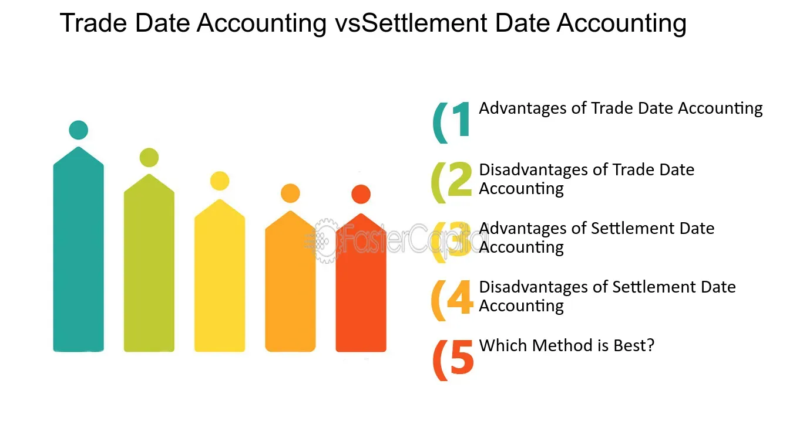

## Table of Contents

## What is settlement date accounting?

Settlement date accounting is a method used in finance to record transactions based on the date when the transaction is actually settled, rather than when it is initiated. This means that if you buy or sell a financial asset, like a stock or bond, the transaction is recorded in your accounts on the day the money and the asset change hands, not on the day you agreed to the deal. This approach is important because it gives a more accurate picture of when cash and assets move in and out of your accounts.

Using settlement date accounting helps businesses and investors manage their cash flow better. For example, if you sell a stock, you won't see the money in your account until the settlement date, so you need to plan your finances knowing when that money will actually be available. This method is different from trade date accounting, where transactions are recorded on the day the deal is made, regardless of when the settlement happens. Settlement date accounting is commonly used in many financial markets because it aligns more closely with the actual movement of funds and assets.

## How does settlement date accounting differ from trade date accounting?

Settlement date accounting and trade date accounting are two different ways to record when a financial transaction happens. Settlement date accounting records a transaction on the day the money and the asset actually change hands. For example, if you buy a stock, you record it in your accounts on the day you get the stock and pay for it, not when you agreed to buy it. This method helps you know exactly when money is coming in or going out of your account.

On the other hand, trade date accounting records a transaction on the day you agree to buy or sell something, even if you don't get the money or the asset right away. So, if you agree to buy a stock today but won't get it until three days later, you would record the transaction today. This method can be useful for planning, but it doesn't show when the money actually moves. Both methods are used in finance, but settlement date accounting is often preferred because it matches more closely with real cash flow.

## What are the basic steps involved in settlement date accounting?

In settlement date accounting, the first step is to identify the settlement date of a transaction. This is the date when the buyer actually receives the asset, like a stock or a bond, and the seller gets the money. For example, if you buy a stock, you need to know when that stock will officially be yours and when you have to pay for it. This date is important because it's when you record the transaction in your accounts.

Once you know the settlement date, you record the transaction in your financial records on that day. So, if the settlement date for buying a stock is three days after you agree to buy it, you wait until those three days have passed before you write it down in your [books](/wiki/algo-trading-books). This helps you keep track of when money and assets are actually moving in and out of your accounts, which is important for managing your cash flow and knowing exactly what you own and owe at any time.

## What are the advantages of using settlement date accounting for businesses?

Settlement date accounting helps businesses by giving them a clear picture of when money and assets are actually moving in and out of their accounts. This is important for managing cash flow because it tells a business exactly when it will have money coming in or going out. For example, if a business sells a product and the payment is due in 30 days, they will record that money coming in on the 30th day, not the day they made the sale. This helps them plan better, knowing exactly when they can use that money.

Another advantage is that it matches the timing of recording transactions with the actual delivery of goods or services. This makes the financial statements more accurate because they show what the business really owns and owes at any point in time. For instance, if a company buys inventory, they will record it as an asset only when they receive it, not when they ordered it. This helps in making better decisions about buying more inventory or paying off debts, because the financial records are up to date and reflect the true state of the business's finances.

## Can you explain how settlement date accounting impacts financial reporting?

Settlement date accounting impacts financial reporting by ensuring that transactions are recorded on the date they are completed, which gives a more accurate picture of a company's financial position at any given time. When a business uses settlement date accounting, it waits until the money and the asset have actually changed hands before recording the transaction. This means that if a company sells a product and expects payment in 30 days, it won't show that money in its financial statements until those 30 days have passed. This helps in creating financial reports that reflect the true cash flow and asset ownership of the business.

This method also helps in aligning the financial reports with the actual delivery of goods or services. For example, if a company orders inventory, it will only record that inventory as an asset once it has been received, not when the order was placed. This makes the financial statements more reliable because they show what the company really owns and owes at the time of reporting. By using settlement date accounting, businesses can provide stakeholders with a clearer and more accurate view of their financial health, which is crucial for making informed decisions.

## What are the potential disadvantages or challenges of implementing settlement date accounting?

One challenge of using settlement date accounting is that it can make it harder to plan and manage finances in the short term. When you record transactions on the settlement date, you might not see the money from a sale in your accounts until days or weeks after the sale happened. This can make it tricky to know how much money you really have to spend or invest right now. For example, if you sell something and expect payment in 30 days, you can't use that money until it actually comes in, which might affect your day-to-day financial decisions.

Another potential disadvantage is that it can cause confusion or delays in financial reporting. Since transactions are recorded later, it might take longer to prepare financial statements. This delay can be a problem if you need to report your financial situation quickly, like for a loan application or to meet regulatory deadlines. Also, if you're used to seeing transactions recorded right away with trade date accounting, switching to settlement date accounting might take some getting used to, and could lead to mistakes or misunderstandings in your financial records.

## How does settlement date accounting affect cash flow management?

Settlement date accounting helps businesses manage their cash flow by showing them exactly when money is coming in or going out. When you use this method, you record a transaction only when it's actually settled, like when you get paid for selling something or when you pay for something you bought. This means if you sell a product and the buyer pays you in 30 days, you won't see that money in your accounts until those 30 days are up. Knowing this helps you plan better because you can see clearly when you'll have money to spend or invest.

On the flip side, settlement date accounting can make cash flow management a bit trickier in the short term. Because you're waiting to record money until it's actually in your account, it might feel like you have less money to work with day to day. For example, if you're waiting on payments to come in, you need to be careful not to spend money you don't have yet. This can make it harder to make quick decisions or to know exactly how much cash you have on hand at any moment.

## What industries or types of transactions benefit most from settlement date accounting?

Settlement date accounting is really helpful for industries that deal with big transactions that take time to settle, like the financial and investment sectors. For example, when banks or investment firms buy or sell stocks, bonds, or other financial assets, it can take a few days for the money and the asset to actually change hands. Using settlement date accounting helps them keep track of when they will really have the money or the asset, which is important for planning their finances and making sure they have enough cash to cover their needs.

Another type of transaction that benefits from settlement date accounting is in the real estate industry. When someone buys a house or a piece of property, the settlement date is when the buyer officially gets the keys and the seller gets the money. This can take weeks or even months after the initial agreement. By recording the transaction on the settlement date, real estate companies and investors can better manage their cash flow and know exactly when they can use the money from a sale or need to pay for a purchase.

## What are the regulatory considerations for using settlement date accounting?

When businesses use settlement date accounting, they need to make sure they follow the rules set by financial regulators. Different countries have different rules about how and when companies should record their transactions. For example, in the United States, the Securities and Exchange Commission (SEC) has rules about how companies should report their financial activities. If a company uses settlement date accounting, it needs to make sure it's following these rules so its financial reports are accurate and legal.

Using settlement date accounting can also affect how a business meets its tax obligations. Tax authorities might have specific rules about when income and expenses should be reported, and these rules might not always match up with settlement date accounting. For instance, the Internal Revenue Service (IRS) in the U.S. might require businesses to report income on the trade date, not the settlement date. So, companies need to be careful to follow both the accounting rules and the tax rules to avoid any problems or penalties.

## How can technology and software assist in managing settlement date accounting?

Technology and software can make managing settlement date accounting easier by keeping track of when transactions are settled. These tools can automatically record the date when money and assets change hands, so businesses don't have to do it manually. This helps save time and reduces the chance of making mistakes. For example, accounting software can remind you when a transaction is due to settle and then record it in your books on the right day, making sure your financial records are always up to date.

Also, technology can help businesses plan their cash flow better. Software can show you when money is coming in or going out, so you know exactly how much cash you'll have at any time. This is really helpful for making decisions about spending or investing. Some systems even let you see reports and graphs that make it easier to understand your financial situation. By using these tools, businesses can manage their finances more smoothly and make sure they're following all the rules about when to record their transactions.

## What are some best practices for ensuring accuracy in settlement date accounting?

To make sure settlement date accounting is accurate, it's important to keep good records of when transactions are supposed to settle. This means writing down the settlement date as soon as you know it, so you don't forget or mix it up with other dates. It's also a good idea to double-check these dates with the other people involved in the transaction, like the buyer or seller, to make sure everyone agrees on when the money and the asset will change hands. Using software that can remind you when a transaction is due to settle can also help a lot, because it makes sure you record everything on the right day.

Another best practice is to regularly review your financial records to catch any mistakes early. This means looking over your accounts often to make sure all the transactions are recorded on the correct settlement dates. If you find any errors, fix them right away to keep your records accurate. It's also helpful to train your team on how important it is to use settlement date accounting correctly, so everyone knows what to do. By following these steps, you can make sure your financial reports are as accurate as possible and help manage your cash flow better.

## How does settlement date accounting integrate with other financial systems and processes?

Settlement date accounting fits well with other financial systems and processes by making sure all the dates line up correctly. When a business uses settlement date accounting, it records transactions on the day the money and the asset actually change hands. This helps other systems like cash flow management and inventory tracking because they all use the same dates. For example, if a company buys inventory, it won't show up in the inventory system until it's received, which is the same day it's recorded in the accounts. This way, all parts of the business have the same information, making it easier to plan and manage finances.

Also, settlement date accounting works well with systems that handle payments and receivables. When a sale is made, the payment might not come in right away, so the business needs to know when to expect the money. By using settlement date accounting, the accounts receivable system can track when payments are due and when they are actually received. This helps the business know exactly when it can use the money from a sale. It also makes sure that the financial reports match up with the actual cash flow, which is important for making good decisions about spending and investing.

## References & Further Reading

[1]: ["Algorithmic Trading, ETF and Smart Beta: A Guide to Portfolio Management"](https://www.investopedia.com/terms/s/smart-beta.asp) by César Pérez López et al.

[2]: ["High-Frequency Trading: A Practical Guide to Algorithmic Strategies and Trading Systems"](https://www.amazon.com/High-Frequency-Trading-Practical-Algorithmic-Strategies/dp/0470563761) by Irene Aldridge

[3]: ["Algorithmic Trading: Winning Strategies and Their Rationale"](https://books.google.com/books/about/Algorithmic_Trading.html?id=WAlFDwAAQBAJ) by Ernie Chan

[4]: Schwartz, R. A., & Franzoni, A. G. (2016). ["High Frequency Trading: New Realities for Investors, Traders and Regulators."](https://www.econbiz.de/Record/high-frequency-trading-new-realities-for-traders-markets-and-regulators-easley-david/10011783880) Taylor & Francis. 

[5]: O'Hara, M. (2015). ["High Frequency Market Microstructure."](https://www.sciencedirect.com/science/article/pii/S0304405X15000045) Journal of Financial Econometrics, 13(1), 1-32.