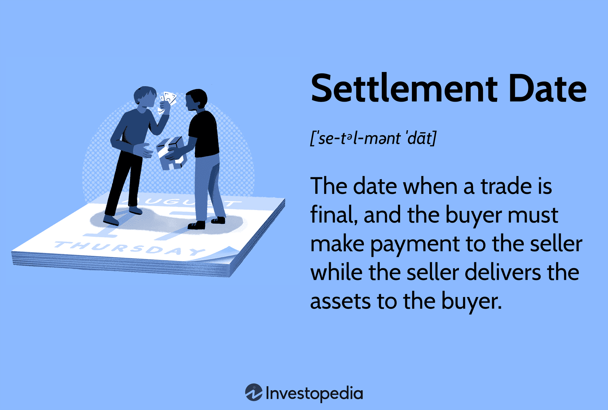

## Table of Contents

## What is a settlement date in the context of financial markets?

A settlement date in financial markets is the day when a trade is finalized. It's when the buyer pays for the securities, like stocks or bonds, and the seller hands them over. This date is important because it helps make sure that both the buyer and seller keep their promises.

Usually, the settlement date comes a few days after the trade date, the day when the buyer and seller agree to the trade. For stocks, it's often two business days after the trade date, which is called T+2. This time gap gives the buyer's money and the seller's securities time to move around and get ready for the final exchange.

## How does the settlement date differ between stocks, bonds, and insurance products?

The settlement date for stocks is usually two business days after the trade date, known as T+2. This means if you buy a stock on Monday, you'll get it and pay for it by Wednesday. This time helps make sure everything is ready for the trade to be completed. It's a standard rule for stocks in many countries, but it can be different in some places.

For bonds, the settlement date can be different. It often takes longer than stocks, usually three business days after the trade date, or T+3. This extra day is because bonds can be more complicated to move around. But, like stocks, the exact time can change depending on where you are and the type of bond.

Insurance products, like life insurance or annuities, don't have a settlement date in the same way as stocks and bonds. When you buy an insurance product, you usually start paying premiums right away, and the coverage begins according to the policy terms. There's no specific "trade date" and "settlement date" because it's more about ongoing payments and coverage rather than a one-time exchange of money and securities.

## What is the typical settlement period for stock transactions?

The typical settlement period for stock transactions is two business days after the trade date. This is called T+2. It means if you buy a stock on a Monday, you will get the stock and pay for it by Wednesday. This time helps make sure everything is ready for the trade to be completed.

This T+2 rule is common in many countries, but it can be different in some places. It's important because it gives time for the money and the stocks to move around and be ready for the final exchange. This helps keep the trading process smooth and reliable.

## Why is the settlement date important for investors and traders?

The settlement date is important for investors and traders because it's the day when they actually get the stocks they bought or the money from the stocks they sold. It's like the finish line for a trade. Knowing when this day is helps them plan their money and make sure they have enough to pay for their buys or that they will get paid for their sells on time.

If the settlement date didn't exist or if it was too short, it could cause problems. Imagine buying a stock and needing to pay for it right away, but the money isn't ready yet. Or selling a stock and needing the money, but it takes too long to get it. The settlement date gives everyone a bit of time to get things ready, making trading smoother and less risky.

## How does the settlement process work for bond transactions?

When you buy or sell a bond, the settlement process is a bit like passing a baton in a relay race. It starts when you agree to the trade, which is called the trade date. But you don't get the bond or the money right away. Usually, it takes three business days after the trade date for everything to be final, and this is called the settlement date. During this time, the money you're paying for the bond moves from your account to the seller's account, and the bond moves from the seller to you.

This three-day wait, known as T+3, helps make sure everything goes smoothly. It gives the banks and the places that keep the bonds enough time to check everything and move the money and bonds around. If something goes wrong, like the seller doesn't have the bond or the buyer doesn't have the money, this time helps fix it before the trade is final. So, the settlement process for bonds makes sure that when you buy or sell, you get what you're supposed to, and it keeps the trading world running smoothly.

## What are the implications of missing a settlement date in stock trading?

If you miss a settlement date in stock trading, it can cause some big problems. When you buy a stock, you need to pay for it by the settlement date. If you don't, the stockbroker might sell the stock to someone else to get their money back. This is called a "buy-in" and it can happen without you knowing. You'll lose the stock you wanted and might have to pay extra fees.

On the other hand, if you're selling a stock and don't deliver it by the settlement date, the buyer might get upset. They might cancel the trade or buy the stock from someone else. This can make you look bad and you might have to pay fines or fees. It's important to make sure you have the money or the stock ready by the settlement date to avoid these problems.

## Can the settlement date be affected by holidays or weekends, and if so, how?

Yes, the settlement date can be affected by holidays and weekends. If the settlement date falls on a weekend or a holiday, it will be moved to the next business day. This is because banks and stock markets are usually closed on weekends and holidays, so they can't process the trades.

For example, if you buy a stock on a Thursday and the usual settlement date is two business days later (Saturday), but Saturday is a weekend, the settlement date will move to the next business day, which would be Monday. This makes sure that the trade can be completed when the markets are open and everyone can get their money and stocks on time.

## What role does a clearinghouse play in the settlement of stock and bond trades?

A clearinghouse is like a middleman that helps make sure stock and bond trades go smoothly. When you buy or sell a stock or bond, the clearinghouse steps in to make sure both sides of the trade do what they promised. It checks that the buyer has the money to pay and that the seller has the stock or bond to give. This helps stop problems like someone not paying or not giving the stock.

The clearinghouse also keeps track of all the trades and makes sure they happen on the right day, which is the settlement date. If something goes wrong, like if the buyer can't pay or the seller can't deliver the stock, the clearinghouse steps in to fix it. This makes trading safer and more reliable for everyone involved.

## How do insurance policies handle settlement dates, particularly in claims processing?

Insurance policies don't have settlement dates like stocks and bonds do. Instead, they have a different process for claims. When you make a claim on your insurance, there's usually a waiting period before you get paid. This waiting time can vary depending on the type of insurance and the company's rules. For example, if you have car insurance and you get into an accident, you'll need to file a claim, and then the insurance company will look at it and decide how much to pay you. This whole process can take a few weeks or even longer.

The insurance company has to check the details of your claim to make sure it's valid. They might need to talk to you, look at the damage, or get reports from other people involved. Once they've done all that, they'll decide if they'll pay your claim and how much. Unlike stocks and bonds, there isn't a set "settlement date" for insurance claims, but the insurance company will let you know when you can expect to get your money. This process is important to make sure that the insurance company pays out the right amount for real claims and not for fake ones.

## What are the differences in settlement practices between different countries or regions?

Settlement practices can be different from one country to another. In the United States, the usual time for settling stock trades is two business days after the trade, which is called T+2. But in Europe, some countries might use a different time, like T+3, which means three business days after the trade. These differences happen because each country or region has its own rules and ways of doing things. It's important for traders and investors to know these rules if they want to trade in different places.

In Asia, settlement times can also vary. For example, in India, the settlement for stocks is usually T+1, which is just one business day after the trade. This is quicker than in many other places. Meanwhile, in Japan, the settlement for stocks is typically T+2, similar to the United States. These differences can affect how fast money and stocks move around, and traders need to plan their trades carefully to make sure they follow the local rules and get their money and stocks on time.

## How have technological advancements impacted the settlement process in financial markets?

Technological advancements have made the settlement process in financial markets faster and more reliable. Before, it could take a long time to move money and stocks from one place to another. Now, with computers and the internet, everything can happen much quicker. For example, electronic trading platforms let people buy and sell stocks with just a few clicks. This means the settlement can happen faster, often in just a couple of days instead of weeks.

Also, technology has made the settlement process safer. With better computer systems, it's easier to keep track of trades and make sure everyone does what they promised. Clearinghouses use technology to check that buyers have the money and sellers have the stocks before the settlement date. This helps stop problems like someone not paying or not giving the stock. Overall, technology has made trading smoother and more trustworthy for everyone involved.

## What are the potential future developments or regulations that could affect settlement dates in stocks, bonds, and insurance?

In the future, we might see changes to how long it takes for stock and bond trades to settle. Some places are already talking about making the settlement time even shorter, like moving from two days to just one day for stocks. This is because technology is getting better and faster, and people want to get their money and stocks quicker. New rules from governments or financial groups could make this happen. They might want to make trading safer and more efficient, so they could set new standards for how fast trades need to settle.

For insurance, future changes might focus more on how fast claims are processed rather than having a set settlement date like stocks and bonds. With new technology like [artificial intelligence](/wiki/ai-artificial-intelligence) and big data, insurance companies could get better at checking claims faster and more accurately. This might mean people get their money from claims quicker. Also, new rules could be made to make sure insurance companies handle claims in a fair and timely way, which would help everyone who needs to use their insurance.

## What is the Importance of Settlement Dates for Bonds and Stocks?

Settlement dates are critical in financial markets, especially for bonds and stocks, as they influence various aspects of transactions and subsequent entitlements. For bonds, the settlement date determines the calculation of accrued interest, which is essential for both buyers and sellers. Accrued interest represents the interest that has accumulated on a bond from the last interest payment date up to, but not including, the settlement date. The formula for calculating accrued interest is usually given by:

$$
\text{Accrued Interest} = \frac{\text{Days Since Last Payment}}{\text{Coupon Period}} \times \text{Annual Coupon Payment}
$$

where the days since the last payment reflects the time elapsed between the last interest payment and the settlement date. This ensures that a fair price is set for the bond transaction, with accrued interest being paid by the buyer to the seller in addition to the market price of the bond.

In the context of stock trading, the settlement date is significant as it dictates the actual transfer of ownership rights to the buyer. This transfer of ownership is crucial because the record date for dividends determines who is entitled to receive the upcoming dividend payment. As such, an investor must own the stock by the record date to be eligible for dividends. The settlement date also affects other shareholder benefits, such as voting rights and participation in corporate actions, which can include stock splits or rights issuances.

Moreover, the transition to a T+1 settlement cycle is a notable development that seeks to enhance market efficiency and mitigate counterparty risk. In a T+1 settlement cycle, transactions are settled one business day after the trade date, as opposed to the traditional T+2 cycle, which takes two business days. This shift not only reduces the time span for which credit and settlement risks are present but also limits the impact of market [volatility](/wiki/volatility-trading-strategies) on pending transactions. By accelerating the settlement process, the T+1 cycle aims to foster greater [liquidity](/wiki/liquidity-risk-premium) and smoother transaction processes in the markets. This transition is in line with technological advancements and the increasing demand for swift and secure financial transactions.

## References & Further Reading

[1]: Lopez de Prado, M. (2018). ["Advances in Financial Machine Learning"](https://www.amazon.com/Advances-Financial-Machine-Learning-Marcos/dp/1119482089). Wiley.

[2]: Chan, E. P. (2009). ["Quantitative Trading: How to Build Your Own Algorithmic Trading Business"](https://github.com/ftvision/quant_trading_echan_book). Wiley.

[3]: Aronson, D. R. (2007). ["Evidence-Based Technical Analysis: Applying the Scientific Method and Statistical Inference to Trading Signals"](https://onlinelibrary.wiley.com/doi/book/10.1002/9781118268315). Wiley.

[4]: Jansen, S. (2020). ["Machine Learning for Algorithmic Trading"](https://github.com/stefan-jansen/machine-learning-for-trading). Packt Publishing.

[5]: Bergstra, J., Bardenet, R., Bengio, Y., & Kégl, B. (2011). ["Algorithms for Hyper-Parameter Optimization."](https://dl.acm.org/doi/10.5555/2986459.2986743) Advances in Neural Information Processing Systems 24.