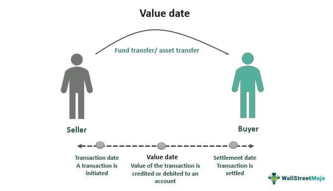

Technology's impact on trading processes is growing significantly as financial markets evolve rapidly. Two critical concepts in modern finance are settlement prices and algorithmic trading. Settlement prices serve as essential reference points in trading, helping to assess daily profits or losses and determine the final payoffs in derivatives and options contracts. Understanding how these prices are established and their role in trading is vital for market participants.

Algorithmic trading, on the other hand, leverages computer algorithms to execute trades at high speeds based on predefined criteria. This technology-driven approach minimizes human emotions, enhances market liquidity, and boosts trading efficiency. It employs various strategies like trend-following, arbitrage, and index fund rebalancing and is used by institutional and individual traders alike. However, it also presents challenges, such as technical dependencies and regulatory oversight.



This article explores the intersection of settlement prices and algorithmic trading, revealing the synergies that exist between them. Algorithmic strategies often depend on settlement prices to trigger buy or sell orders, using them as benchmarks for optimizing execution prices. The effectiveness of trading algorithms is closely tied to the accuracy and timeliness of settlement information. As markets become more efficient, aligning accurate settlement data with high-speed algorithmic operations can offer substantial advantages.

As technology continues to advance, the relationship between settlement mechanisms and trading algorithms is likely to evolve, presenting both opportunities and challenges. To stay competitive, investors and traders must keep abreast of these developments and leverage them in informed and effective trading strategies. Understanding the intricate dynamics of settlement prices and algorithmic trading is crucial for navigating today's complex financial markets.

## Table of Contents

## Understanding Settlement Prices in Financial Markets

Settlement prices play a crucial role in the financial markets by serving as pivotal reference points for evaluating the daily profit or loss of trading positions. These prices are particularly significant for open derivatives contracts, which rely on accurate settlement figures to mark-to-market the value held by traders and institutions. The accurate determination of these prices ensures fair play and transparency across trading activities.

Methods for calculating settlement prices can vary significantly depending on the exchange and the specific financial instrument involved. Commonly, exchanges derive settlement prices from the average price of trades conducted during a specific period, often during the closing minutes of a trading session. This methodology mitigates the impact of anomalous transactions that may distort the closing price if taken at a solitary point in time. For instance, exchanges may utilize volume-weighted average price (VWAP) or time-weighted average price (TWAP) methods to derive a reliable settlement figure.

In the context of options trading, settlement prices are critical in determining the final payoff of contracts at expiration. An option's payoff is contingent upon the difference between its strike price and the settlement price of the underlying asset. For a call option, this payoff is max(S - K, 0), where S is the settlement price and K is the strike price. Similarly, for a put option, the payoff is max(K - S, 0).

Several factors can influence settlement prices, including but not limited to market activity levels, [volatility](/wiki/volatility-trading-strategies), and the timing of trades. High market activity generally leads to robust price discovery processes, helping to ensure that settlement prices accurately reflect the market consensus on value. Meanwhile, trades occurring during less volatile periods may result in more stable and predictable settlement prices compared to those finalized amid high volatility or market turmoil.

Moreover, technological advances and data analytics are progressively enhancing the computation of settlement prices, enabling exchanges to promptly and accurately compute these crucial benchmarks in increasingly complex and fast-paced trading environments.

## The Role of Algorithmic Trading in Modern Markets

Algorithmic trading, often referred to as algo-trading, involves the use of computer programs to execute trades at extraordinarily high speeds based on pre-defined criteria. These algorithms can process vast amounts of data quickly, identifying and acting on market opportunities that would be difficult for human traders to spot and execute with equal efficiency.

The primary aim of [algorithmic trading](/wiki/algorithmic-trading) is to reduce the influence of human emotions in trading, thereby enhancing market [liquidity](/wiki/liquidity-risk-premium) and efficiency. Emotions such as fear and greed can often lead to irrational decision-making in trading, resulting in poor performance and increased volatility. By automating trades with a set of pre-defined rules, algorithmic trading seeks to standardize trading behavior, mitigate the risk of emotional biases, and achieve a more predictable trading outcome.

Common strategies utilized in algorithmic trading include trend-following, [arbitrage](/wiki/arbitrage) opportunities, and the rebalancing of index funds. Trend-following algorithms are designed to capitalize on market movements by identifying and executing trades in the direction of emerging trends. Arbitrage algorithms exploit price discrepancies between different markets or instruments, ensuring profits through simultaneous buy and sell transactions. Index fund rebalancing algorithms adjust the composition of portfolios to ensure alignment with benchmark indices, usually conducted in a manner to minimize transaction costs and price impact.

Algorithmic trading is employed by a diverse array of market participants, including institutional traders such as mutual funds, hedge funds, and pension funds, as well as individual retail traders. Institutional traders often have the advantage of significant resources and capital, enabling them to deploy sophisticated algorithms and technology to optimize their trading strategies.

Despite the considerable advantages of algorithmic trading, such as increased speed, precision, and the capability to handle large volumes of trades, it poses certain challenges. A key concern is its dependency on technology, which can be prone to errors and failures. Any technical glitches, such as software bugs or network outages, can result in incorrect trades and significant financial losses. Moreover, the speed at which algo-trading operates can exacerbate market volatility, as seen in events like the "Flash Crash" of 2010.

Furthermore, algorithmic trading faces regulatory scrutiny due to its potential impact on market stability. Regulators have been actively developing frameworks to oversee algorithmic trading practices, ensuring they do not disrupt fair and orderly markets. These regulations typically focus on transparency, risk management, and ensuring the accountability of trading algorithms.

In summary, while algorithmic trading provides numerous benefits in terms of efficiency, cost reduction, and error minimization, it requires careful implementation and monitoring. Addressing the technical and regulatory challenges associated with algo-trading is crucial to maintaining market integrity and ensuring that the advantages it offers can be fully realized by market participants.

## Synergies Between Settlement Prices and Algorithmic Trading

Algorithmic trading strategies often leverage settlement prices as critical reference points for executing trades. These settlement prices serve as benchmarks, allowing algorithms to optimize execution prices by determining the most favorable moments to trigger buy or sell orders. The precision of these decisions is contingent upon the accuracy and timeliness of settlement price information, directly impacting the performance of trading algorithms.

In financial markets, settlement prices help set the value of derivatives contracts, affecting the strategic decisions made by algorithms. An algorithm may rely on a simple moving average strategy that adjusts buy or sell orders based on the difference between the current price and the moving average of settlement prices. Python code implementing such a strategy might look like this:

```python
import numpy as np

def moving_average_strategy(prices, window_size):
    moving_averages = np.convolve(prices, np.ones(window_size)/window_size, mode='valid')
    buy_signals = []
    sell_signals = []

    for i in range(len(prices) - window_size + 1):
        if prices[i + window_size - 1] > moving_averages[i]:
            buy_signals.append(i + window_size - 1)
        elif prices[i + window_size - 1] < moving_averages[i]:
            sell_signals.append(i + window_size - 1)

    return buy_signals, sell_signals
```

Here, `prices` would include recent settlement prices, and `window_size` defines how many days of settlements the algorithm considers. The buy and sell signals are then generated based on whether the current price exceeds the moving average, indicating a potential upward trend.

The efficiency of financial markets benefits significantly from the synergy between timely settlement information and the rapid execution capabilities of algorithmic trading. Accurate settlement data ensures that trading algorithms operate on reliable inputs, enhancing market liquidity and price discovery. This dynamic alignment facilitates more informed decision-making within markets, promoting stability and efficiency.

Emerging technologies such as blockchain and distributed ledger technologies are explored to further integrate settlement processes with automated trading platforms. These technologies offer the potential for real-time settlement information, reducing latency and increasing the reliability of data inputs for algorithmic systems. With continued advancements, the fusion of settlement prices with algorithmic trading is poised to evolve, offering enhanced precision and efficiency across financial markets.

## Examples and Case Studies

The Chicago Mercantile Exchange (CME) and the Moscow Exchange (MOEX) provide insightful examples of how settlement periods can vary significantly between different asset classes. At the CME, for instance, futures contracts might have their settlement prices determined at the end of each trading day, ensuring that all positions are valued based on a standardized price calculated using the trading day's last price, weighted average, or a [volume](/wiki/volume-trading-strategy)-weighted average price (VWAP). This methodology allows traders to evaluate their portfolios consistently and aligns with the clearing processes regulated by the exchange. 

In contrast, the MOEX adopts a slightly different approach, particularly regarding how foreign currency futures are settled. For these assets, the settlement price is typically calculated using a specific rate provided by the Bank of Russia or other authorized sources, highlighting a different regulatory influence and market need. This distinction emphasizes the necessity for traders to understand the specifics of how settlement prices are determined for each exchange and asset they trade in, as these prices form the foundation for calculating margins and assessing financial performance.

Case studies from high-frequency trading ([HFT](/wiki/high-frequency-trading-strategies)) environments underscore the successful implementation of algorithmic trading strategies that leverage settlement prices. For instance, some algorithmic trading systems are designed to exploit minor price discrepancies occurring at the close of trading sessions. By using settlement prices as a reference, these algorithms can make split-second decisions to buy or sell positions, capitalizing on anticipated shifts in asset valuation right before or after the market closes. This strategy is particularly effective in options markets, where it is crucial to accurately predict changes in asset prices to maximize profits or hedge risks efficiently.

A practical example can be illustrated with algorithmic strategies in options markets. Consider a Python script that triggers buy/sell orders based on a comparison between the option's current market price and its projected settlement price:

```python
import yfinance as yf

# Fetch option data
data = yf.Ticker("AAPL").option_chain("2023-12-15")

# Function to determine buy/sell based on projected settlement prices
def trading_decision(current_price, projected_settlement_price):
    if current_price < projected_settlement_price:
        return "Buy"
    elif current_price > projected_settlement_price:
        return "Sell"
    else:
        return "Hold"

# Example application
for option in data.calls.itertuples():
    decision = trading_decision(option.lastPrice, option.strike)
    print(f"Option: {option.contractSymbol}, Current Price: {option.lastPrice}, Decision: {decision}")
```

This simplistic model highlights how an algorithm might use settlement prices to guide trading decisions. The accurate determination of settlement prices becomes critical in optimizing such algorithmic systems, directly influencing the profitability and risk management strategies employed by traders.

These examples from exchanges and algorithmic trading applications illustrate the integral role settlement prices play in trading strategies. Whether adjusting portfolios at the end of the day or navigating complex options markets, understanding how these prices are set and utilized can significantly enhance trading performance and strategic planning.

## Advantages and Challenges of Algorithmic Trading

Algorithmic trading has revolutionized financial markets by introducing a level of speed and precision that manual trading cannot achieve. One of its primary advantages is the ability to execute trades in fractions of a second, capitalizing on fleeting opportunities that would be impossible to seize manually. The use of sophisticated algorithms allows traders to process vast volumes of transactions simultaneously, significantly increasing the scalability of trading operations.

Moreover, by automating the trading process, algorithmic trading reduces transaction costs. It limits the need for extensive human oversight, thereby minimizing the potential for human error, which can be particularly beneficial in executing complex trading strategies that require consistent and precise decision-making. This automation can lead to more consistent returns by adhering strictly to the pre-defined criteria and avoiding the pitfalls of human emotions in trading decisions.

Nevertheless, algorithmic trading is not without its challenges. One of the key issues is the risk of technological failures, which can lead to significant financial losses. The reliance on technology means that any disruption, such as system outages or software bugs, can have widespread ramifications. For example, a malfunction in the algorithm can result in unintended trades that could destabilize a trader's portfolio.

Additionally, algorithmic trading has been associated with increased market volatility. The high-speed nature of algorithmic trades can exacerbate price swings, particularly during times of market stress. The phenomenon of "flash crashes," where markets experience extremely rapid declines and recoveries, underscores the potential volatility that algorithmic trading can introduce. These events have prompted regulators to scrutinize algorithmic trading practices closely.

Establishing and maintaining an algorithmic trading system requires significant resources. This includes substantial investments in technology infrastructure and the continuous development of sophisticated algorithms. Moreover, the competitive advantage in algorithmic trading often relies on having access to cutting-edge technology and data, which entails ongoing costs and expertise.

Regulatory frameworks surrounding algorithmic trading are continually evolving to address these concerns. Regulators aim to ensure that algorithmic trading enhances market stability rather than undermining it. This involves the implementation of measures such as circuit breakers, which temporarily halt trading during extreme volatility, and stringent compliance requirements to oversee the development and deployment of trading algorithms.

Overall, while algorithmic trading presents numerous advantages, it also poses challenges that require careful management. Market participants must balance the benefits of high-speed, efficient trading with the risks of technological failures and regulatory requirements to navigate the modern financial landscape effectively.

## Conclusion

Settlement prices and algorithmic trading are integral components in financial markets today, shaping how trading is conducted. Their intersection creates both opportunities and challenges for traders and investors. Specifically, the accurate and timely determination of settlement prices offers a reliable benchmark for algorithmic systems to execute trades efficiently. Conversely, the real-time capabilities and precision of algorithmic trading can ensure rapid responses to settlement price updates, optimizing execution and enhancing market liquidity.

As technology continues to advance, the symbiotic relationship between settlement mechanisms and trading algorithms is expected to evolve. Emerging technologies, such as [machine learning](/wiki/machine-learning) and blockchain, are poised to further integrate these systems, potentially increasing accuracy and reducing latency in financial transactions. This progression suggests that market participants who remain informed and adaptive will likely gain competitive advantages.

Investors and traders must proactively engage with the rapidly evolving financial landscape. Understanding the dynamics between settlement prices and algorithmic trading empowers stakeholders to exploit efficiencies and anticipate risks in market activities. Thus, insights into these components facilitate more informed decision-making and optimized trading strategies, promoting robust participation and profitability in modern markets.

## References & Further Reading

[1]: ["Real-Time Risk: What Investors Should Know About FinTech, High-Frequency Trading, and Flash Crashes"](https://www.amazon.com/Real-Time-Risk-Investors-FinTech-High-Frequency/dp/1119318963) by Irene Aldridge and Steven Krawciw

[2]: Aldridge, I. (2013). ["High-Frequency Trading: A Practical Guide to Algorithmic Strategies and Trading Systems."](https://www.wiley.com/en-us/High+Frequency+Trading%3A+A+Practical+Guide+to+Algorithmic+Strategies+and+Trading+Systems%2C+2nd+Edition-p-9781118343500) Wiley Finance Series.

[3]: Linton, O. (2019). ["Financial Econometrics: Models and Methods."](https://www.cambridge.org/highereducation/books/financial-econometrics/09CA0F5E949EB8F516EE4BB4E45F393E) Routledge.

[4]: Fox, J. (2009). ["The Myth of the Rational Market: A History of Risk, Reward, and Delusion on Wall Street."](https://www.sciencedirect.com/science/article/pii/S1477388015300347) Harper Business.

[5]: Narang, R. K. (2013). ["Inside the Black Box: A Simple Guide to Quantitative and High-Frequency Trading."](https://www.wiley.com/en-us/Inside%20the%20Black%20Box:%20A%20Simple%20Guide%20to%20Systematic%20Investing,%203rd%20Edition-p-9781119931904) Wiley.