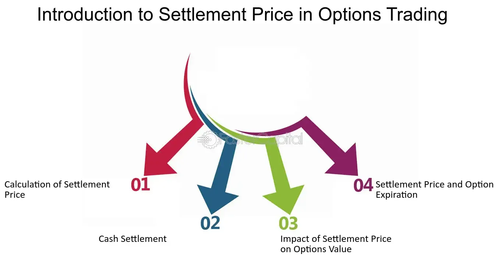

## Table of Contents

## What is a settlement price in trading?

A settlement price in trading is the official closing price of a futures contract or an option at the end of a trading day. It's used to determine the daily gains or losses in the account of the traders who hold these contracts. This price is important because it helps in calculating the margin requirements and in settling the financial obligations between the parties involved in the trade.

The settlement price is usually set by the exchange where the futures or options are traded. It can be determined in different ways, like taking an average of the prices during the last few minutes of trading or using the price of the last trade before the market closes. This price is crucial for maintaining fairness and transparency in the market, ensuring that all traders have a clear understanding of their positions at the end of each day.

## How is the settlement price determined?

The settlement price is decided by the place where people trade futures and options, called an exchange. They usually look at the prices of trades happening close to the end of the trading day. One common way is to take the average price of trades in the last few minutes before the market closes. Another way is to just use the price of the very last trade before the market shuts down.

This price is important because it helps everyone know where they stand at the end of the day. If you're trading futures or options, the settlement price tells you if you made money or lost money that day. It also helps the exchange figure out how much money traders need to keep in their accounts, which is called the margin requirement. By having a clear settlement price, the exchange makes sure that trading is fair and everyone can trust the market.

## Why is the settlement price important for traders?

The settlement price is very important for traders because it tells them how much their futures or options contracts are worth at the end of each trading day. This price helps traders know if they made or lost money that day. If the settlement price is higher than what they paid, they made money. If it's lower, they lost money. This information is crucial for traders to keep track of their profits and losses and to plan their next moves in the market.

Another reason the settlement price is important is because it affects the amount of money traders need to keep in their trading accounts, known as the margin requirement. The exchange uses the settlement price to calculate this amount. If the price moves a lot, traders might need to add more money to their accounts to keep trading. This helps make sure that traders can cover their losses and keeps the market stable and fair for everyone.

## What is the difference between settlement price and closing price?

The settlement price and the closing price are both important numbers in trading, but they are not the same. The closing price is the last price at which a security, like a stock, was traded before the market closes. It's a snapshot of the very last trade of the day. On the other hand, the settlement price is used for futures and options contracts. It's an official price set by the exchange, often calculated as an average of trades in the last few minutes of the trading day, or sometimes it's just the last trade price before the market closes.

The settlement price is crucial for people trading futures and options because it's used to figure out if they made or lost money that day. It also helps the exchange decide how much money traders need to keep in their accounts, called the margin requirement. The closing price, while important for stocks, doesn't directly affect the daily financial obligations of futures and options traders in the same way. So, while both prices are key to understanding market activity, they serve different purposes and are used in different parts of the trading world.

## How does the settlement price affect futures contracts?

The settlement price is very important for people who trade futures contracts. It's the official price set by the exchange at the end of each trading day. This price helps traders know if they made or lost money on their futures contracts. If the settlement price is higher than what they paid, they made money. If it's lower, they lost money. This is important because it helps traders keep track of their profits and losses every day.

The settlement price also affects how much money traders need to keep in their trading accounts, which is called the margin requirement. The exchange uses the settlement price to figure out this amount. If the price moves a lot, traders might need to add more money to their accounts to keep trading. This helps make sure that traders can cover their losses and keeps the market stable and fair for everyone. So, the settlement price is a big deal for futures contracts because it helps manage daily financial obligations and keeps trading smooth.

## Can the settlement price be manipulated, and if so, how?

Yes, the settlement price can be manipulated, but it's hard to do and usually against the rules. Some people might try to change the settlement price by making a lot of trades right before the market closes. They might buy or sell a lot to push the price up or down on purpose. This is called "banging the close" and it's not allowed because it's unfair to other traders.

Exchanges and regulators watch closely to stop this kind of cheating. They use special systems to check for strange trading patterns and can punish people who try to manipulate the market. It's important for the market to be fair and honest, so everyone can trust it. If someone gets caught manipulating the settlement price, they could face big fines or even go to jail.

## What role does the settlement price play in options trading?

The settlement price is really important for people who trade options. It's the official price set by the exchange at the end of each trading day. This price helps traders know if they made or lost money on their options. If the settlement price is good for them, they might make money. If it's bad, they might lose money. This is important because it helps traders keep track of how they're doing every day.

The settlement price also helps figure out if an option can be used, which is called exercising the option. If the settlement price is better than the price the option was bought at, the trader might choose to use the option to buy or sell the underlying asset. This way, the settlement price helps make sure that options trading is fair and everyone knows where they stand at the end of the day.

## How do different markets calculate their settlement prices?

Different markets have their own ways to figure out the settlement price. In the futures market, the settlement price is often the average price of trades in the last few minutes before the market closes. Some exchanges might use the price of the very last trade of the day instead. This helps make sure that the price is fair and reflects what was happening in the market at the end of the day.

In the options market, the settlement price can be a bit different. For stock options, the settlement price is usually the closing price of the stock on the day the option expires. For index options, like those based on the S&P 500, the settlement price might be based on the opening prices of the stocks in the index on the day after the option expires. This way, the settlement price helps traders know if they made or lost money and if they should use their options.

Both futures and options markets use the settlement price to keep things fair and clear for everyone. It helps traders know where they stand at the end of each day and makes sure that the market works smoothly. By having a clear way to calculate the settlement price, markets can avoid confusion and make sure everyone trusts the system.

## What are the consequences of a miscalculated settlement price?

If the settlement price is wrong, it can cause big problems for traders. They might think they made money when they actually lost money, or the other way around. This can mess up their plans and make them lose trust in the market. If traders don't know if the prices are right, they might stop trading or be more careful, which can make the market less active and harder to use.

The exchange and regulators also have to deal with a wrong settlement price. They need to fix the mistake quickly to keep the market fair. If they don't, people might think the market is not honest, and this can lead to fines or other punishments for the exchange. It's really important for the settlement price to be right so that everyone can trust the market and keep trading smoothly.

## How does the settlement price impact margin requirements?

The settlement price is really important for figuring out how much money traders need to keep in their accounts, which is called the margin requirement. The exchange looks at the settlement price to see if traders made or lost money that day. If the settlement price is a lot different from what the trader paid, it can change how much money they need to keep in their account. If the price goes up a lot, the trader might need to put more money in to keep trading. This helps make sure that traders can cover their losses and keeps the market fair for everyone.

If the settlement price is wrong, it can mess up the margin requirements. Traders might not have enough money in their accounts if the price is too low, or they might have to put in more money than they need to if the price is too high. This can make trading harder and less fair. The exchange has to be careful to get the settlement price right so that the margin requirements are fair and traders can keep trading without big problems.

## What historical events have significantly impacted settlement prices?

One big event that changed settlement prices was the 1987 stock market crash, also called Black Monday. On that day, the stock market dropped a lot, and it made the settlement prices for futures and options go down too. Traders lost a lot of money because the prices were so low. This event showed how important it is to have good rules to stop big drops in the market and to make sure settlement prices are fair.

Another event that affected settlement prices was the 2008 financial crisis. During this time, the prices of many things, like houses and stocks, went down a lot. This made the settlement prices for futures and options based on these things go down too. Traders had to deal with big losses, and it made people think more about how to make the market safer and more stable. Both of these events showed how big changes in the market can mess up settlement prices and why it's important to have good systems to handle these changes.

## How do advanced trading strategies utilize the settlement price?

Advanced trading strategies often use the settlement price to make smart moves in the market. Traders who use these strategies might look at the settlement price to see if they should keep their futures or options contracts or if they should sell them. They might also use the settlement price to figure out if they need to add more money to their accounts to keep trading. By watching the settlement price closely, these traders can make better choices about when to buy or sell and how to manage their money.

Some traders use a strategy called "end-of-[day trading](/wiki/day-trading-spy)," where they make trades right before the market closes to try to affect the settlement price. They might do this to make a little more money or to make sure they don't lose too much. But this can be risky and is often against the rules. Other traders might use the settlement price to help them with "options strategies" like straddles or strangles, where they buy options that will make money if the price moves a lot in either direction. By understanding how the settlement price works, these traders can plan their moves better and try to make more money.

## References & Further Reading

[1]: ["Real-Time Risk: What Investors Should Know About FinTech, High-Frequency Trading, and Flash Crashes"](https://www.amazon.com/Real-Time-Risk-Investors-FinTech-High-Frequency/dp/1119318963) by Irene Aldridge and Steven Krawciw

[2]: Aldridge, I. (2013). ["High-Frequency Trading: A Practical Guide to Algorithmic Strategies and Trading Systems."](https://www.wiley.com/en-us/High+Frequency+Trading%3A+A+Practical+Guide+to+Algorithmic+Strategies+and+Trading+Systems%2C+2nd+Edition-p-9781118343500) Wiley Finance Series.

[3]: Linton, O. (2019). ["Financial Econometrics: Models and Methods."](https://www.cambridge.org/highereducation/books/financial-econometrics/09CA0F5E949EB8F516EE4BB4E45F393E) Routledge.

[4]: Fox, J. (2009). ["The Myth of the Rational Market: A History of Risk, Reward, and Delusion on Wall Street."](https://www.sciencedirect.com/science/article/pii/S1477388015300347) Harper Business.

[5]: Narang, R. K. (2013). ["Inside the Black Box: A Simple Guide to Quantitative and High-Frequency Trading."](https://www.wiley.com/en-us/Inside%20the%20Black%20Box:%20A%20Simple%20Guide%20to%20Systematic%20Investing,%203rd%20Edition-p-9781119931904) Wiley.