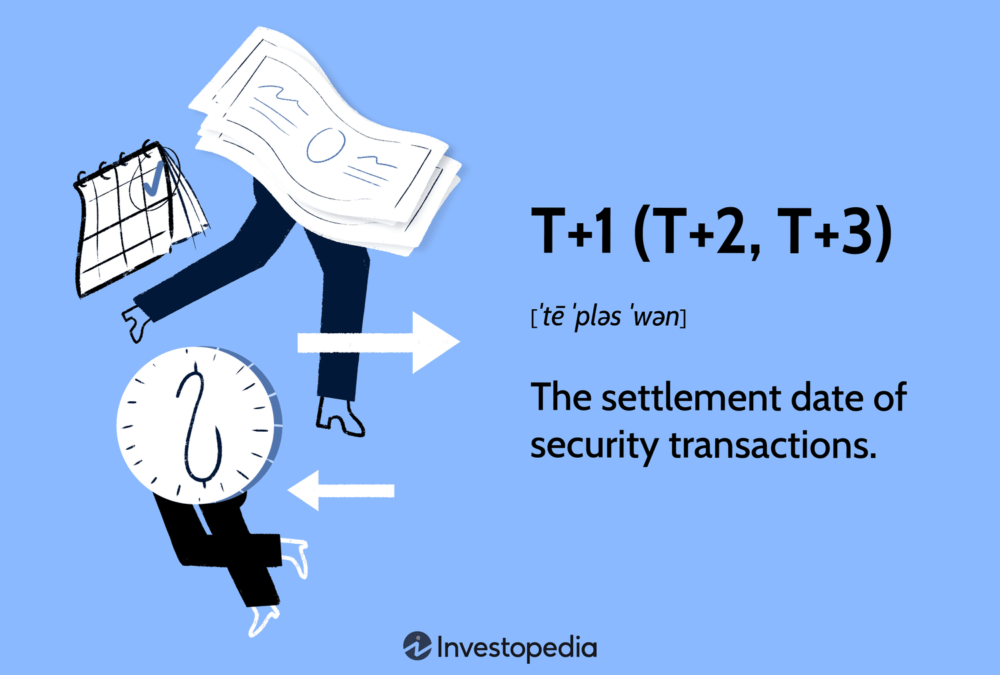

## Table of Contents

## What does 'T' stand for in T+1, T+2, and T+3?

In T+1, T+2, and T+3, the 'T' stands for the word "transaction." These terms are used in the financial world to talk about how many days it takes to settle a trade after it happens. So, T+1 means the trade will be settled one day after the transaction, T+2 means two days after, and T+3 means three days after.

These terms are important because they help everyone involved in a trade know when they will get their money or their stocks. Different countries and types of investments might use different numbers of days for settling trades. Knowing the 'T' helps traders plan and manage their investments better.

## What is the basic definition of a settlement in financial markets?

In financial markets, a settlement is the process of finishing a trade. It's when the buyer pays for what they bought, and the seller gives them the stocks, bonds, or whatever they were selling. This step is really important because it makes sure that both the buyer and the seller do what they promised when they made the trade.

Settlements usually happen a few days after the trade is made. This time is called the settlement period. During this time, everything is checked and prepared so that when the settlement happens, it goes smoothly. If something goes wrong, like if the buyer can't pay or the seller can't deliver, the settlement process helps to fix these problems before they get too big.

## How does the T+1 settlement cycle work?

The T+1 settlement cycle means that a trade will be settled just one day after the transaction happens. Imagine you buy some stocks today. With T+1, you will get those stocks and the seller will get your money the very next day. This quick process is used to make trading faster and safer. It helps everyone know exactly when they will get what they bought or sold, which can make the market work better.

Before T+1, longer settlement times like T+2 or T+3 were common. Moving to T+1 can make things a bit more challenging because everything has to happen faster. But it also means less time waiting and less risk that something could go wrong between the trade and the settlement. Countries and markets that use T+1 believe it's worth the extra effort to have quicker, smoother trades.

## What are the differences between T+1, T+2, and T+3 settlement cycles?

The main difference between T+1, T+2, and T+3 settlement cycles is how long it takes to finish a trade after it happens. T+1 means the trade settles one day after the transaction, T+2 means it takes two days, and T+3 means it takes three days. These numbers show how many days buyers and sellers have to wait before they get their stocks or money.

Each of these cycles affects how quickly people can use their money or stocks after a trade. With T+1, everything happens faster, which can be good for traders who want to keep moving their money around quickly. T+2 and T+3 take a bit longer, but they might be easier for some people because they have more time to get everything ready. The choice of which cycle to use depends on what the market or country thinks is best for keeping trades safe and smooth.

## Why did financial markets move from T+3 to T+2?

Financial markets moved from T+3 to T+2 to make trading faster and safer. Before, it took three days for a trade to be settled, but with T+2, it only takes two days. This change helped traders get their money or stocks sooner, which is important for them to keep trading without waiting too long. It also made the whole trading process more efficient because there was less time for things to go wrong between the trade and the settlement.

The switch to T+2 was also about reducing risk. When trades take longer to settle, there's more chance that something could go wrong, like a buyer not being able to pay or a seller not being able to deliver. By shortening the settlement time to two days, markets could lower these risks. This made the financial system more stable and helped everyone trust that their trades would go smoothly.

## What are the potential benefits of moving to a T+1 settlement cycle?

Moving to a T+1 settlement cycle can make trading faster. When trades settle in just one day, people get their money or stocks quicker. This is good for traders because they can use their money or stocks right away to make more trades. It also helps the whole market move faster and be more efficient. When things happen quickly, everyone can keep trading without waiting too long, which is important in busy markets.

Another big benefit of T+1 is that it can make trading safer. With a shorter time to settle trades, there's less chance for something to go wrong. If a buyer can't pay or a seller can't deliver, it's easier to fix these problems in one day than in two or three. This makes the market more stable because everyone knows their trades will be settled quickly and safely. Overall, T+1 can help build trust and keep the financial system running smoothly.

## What challenges might financial institutions face when transitioning to a shorter settlement cycle?

Moving to a shorter settlement cycle like T+1 can be tough for financial institutions. They have to work faster to get everything ready for the trade to settle in just one day. This means they need to check all the details and make sure the money and stocks are ready to move quickly. If they don't do this right, there could be mistakes or delays, which can cause problems for everyone involved in the trade.

Another challenge is that financial institutions might need to change their systems and how they work. They might need new technology or more people to handle the faster pace. This can cost a lot of money and take time to set up. But if they don't make these changes, they might not be able to keep up with the new T+1 cycle, which could make it hard for them to do business in the market.

## How do different countries' regulations affect the choice of settlement cycle?

Different countries have their own rules about how long it should take for a trade to settle. These rules can change how fast or slow the settlement cycle is. For example, some countries might think it's important to have a quick T+1 cycle to make their markets move faster and be safer. Other countries might prefer a longer T+2 or T+3 cycle because they think it gives everyone more time to get ready and makes things less risky.

These rules can also be different because of what each country thinks is best for its own market. Some countries might have the technology and systems to handle a fast T+1 cycle without problems. But other countries might not have these things yet, so they stick with a longer cycle. The choice of settlement cycle can affect how people trade and invest in each country, so it's important for countries to pick the cycle that works best for them and their markets.

## What impact does the settlement cycle have on liquidity and risk management?

The settlement cycle affects how much money, or liquidity, people have to use in the market. When the cycle is shorter, like T+1, people get their money back faster after selling something. This means they can use that money to buy more things or invest in other ways sooner. A shorter cycle can make the market more liquid because money moves around quicker. But if the cycle is longer, like T+2 or T+3, people have to wait longer to get their money, which can slow down how fast they can trade and make the market less liquid.

The settlement cycle also changes how much risk there is in trading. A shorter cycle, like T+1, means less time for things to go wrong between when a trade happens and when it settles. If a buyer can't pay or a seller can't deliver, it's easier to fix these problems quickly. This makes the market safer because there's less risk that something bad will happen. But with a longer cycle, like T+2 or T+3, there's more time for problems to come up, which can make trading riskier. So, choosing the right settlement cycle is important for managing risk and keeping the market stable.

## How do technological advancements influence the feasibility of shorter settlement cycles?

Technological advancements make it easier for markets to switch to shorter settlement cycles like T+1. With better technology, financial institutions can process trades faster and more accurately. They can use computers and software to check all the details of a trade quickly, making sure everything is ready to settle in just one day. This means less time is needed to move money and stocks around, which helps everyone get what they need faster. Without these technological improvements, it would be much harder to handle the quick pace of a T+1 cycle.

However, not all places have the same level of technology. Some countries might have the latest systems that can handle a T+1 cycle easily, while others might still be using older technology that works better with longer cycles like T+2 or T+3. This difference can affect how quickly a country can move to a shorter settlement cycle. As technology keeps getting better, more places might be able to switch to faster cycles, making trading quicker and safer for everyone.

## What role do clearinghouses play in the settlement process?

Clearinghouses are really important in the settlement process. They help make sure that when people trade, everything goes smoothly. When someone buys or sells something, the clearinghouse steps in to make sure the buyer gets what they bought and the seller gets their money. They check all the details of the trade to make sure everything is correct. This helps stop mistakes and makes sure everyone can trust that the trade will work out.

Clearinghouses also help manage risk. If something goes wrong, like if a buyer can't pay or a seller can't deliver, the clearinghouse steps in to fix it. They have rules and systems in place to make sure these problems don't cause big trouble. By doing this, clearinghouses make the market safer for everyone. They help keep the trading process stable and trustworthy, which is really important for the whole financial system.

## What future trends can we expect in settlement cycles and how might they evolve?

In the future, we might see even shorter settlement cycles than T+1. As technology keeps getting better, it could become easier for markets to settle trades even faster. This means people could get their money or stocks almost right away after a trade. Some places might even start using real-time settlement, where trades happen and finish in just a few seconds. This would make trading super fast and could help make the market more liquid and safe.

However, moving to even shorter cycles will have its challenges. Not all countries or financial institutions will be ready to switch quickly. They might need to spend a lot of money on new technology and train their people to work faster. There could also be more risk if things have to happen so quickly. So, while shorter cycles are possible, it will take time and careful planning to make them work well for everyone. As technology and rules keep changing, we'll see how these trends play out in different markets around the world.

## References & Further Reading

[1]: ["Shortening the Settlement Cycle: The Move to T+1 in the United States"](https://www.sec.gov/exams/educationhelpguidesfaqs/t1-faq) by The Depository Trust & Clearing Corporation (DTCC).

[2]: Monk, A., & Litterman, R. (2015). ["Risk Management and the Emergency of T+1 Settlement Implementation."](https://www.sia-partners.com/en/insights/publications/t1-operational-impacts-today-and-beyond) Risk.net.

[3]: Lopez de Prado, M. (2018). ["Advances in Financial Machine Learning."](https://www.amazon.com/Advances-Financial-Machine-Learning-Marcos/dp/1119482089) John Wiley & Sons.

[4]: Aronson, D. R. (2007). ["Evidence-Based Technical Analysis: Applying the Scientific Method and Statistical Inference to Trading Signals."](https://onlinelibrary.wiley.com/doi/book/10.1002/9781118268315) John Wiley & Sons.

[5]: Jansen, S. (2018). ["Machine Learning for Algorithmic Trading."](https://www.amazon.com/Hands-Machine-Learning-Algorithmic-Trading/dp/178934641X) Packt Publishing.

[6]: Chan, E. P. (2009). ["Quantitative Trading: How to Build Your Own Algorithmic Trading Business."](https://github.com/ftvision/quant_trading_echan_book) John Wiley & Sons.

[7]: Securities and Exchange Commission. (2022). ["SEC Approves Shorter Securities Settlement Cycle to Reduce Risk."](https://www.sec.gov/newsroom/press-releases/2023-29) U.S. Securities and Exchange Commission.

[8]: ["Algorithmic Trading 101: A Beginner's Guide to Learning the Basics of Algorithmic Trading"](https://algotrading101.com/) by Nasdaq.