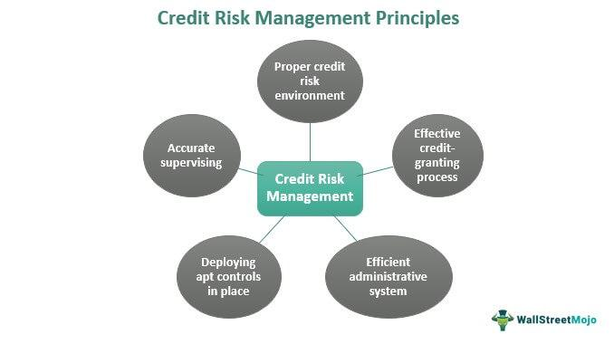

In the fast-evolving world of financial trading, settlement risk has emerged as a critical concern that traders and financial institutions must navigate. Settlement risk involves the possibility that a counterparty might fail to deliver on the terms of a contract at the agreed time, leading to potential financial losses. This risk is particularly pronounced in transactions involving multiple parties and complex financial instruments, where default by one party can disrupt the entire chain of transactions.

With the growing complexity of trading platforms and the rise of algorithmic trading, understanding and managing settlement risk becomes crucial. Algorithmic trading, which relies on intricate mathematically driven decisions executed at high speeds, adds layers of complexity to the settlement process. The rapid execution of a large volume of trades increases the potential for discrepancies, necessitating robust risk management frameworks.

This article explores the fundamentals of settlement risk, its types, and strategies for effective risk mitigation in financial markets. By analyzing the essential components and dynamics of settlement risk, we aim to provide insights into maintaining market integrity and ensuring the smooth operation of trading activities. As the landscape of financial trading continues to evolve, a deep understanding of settlement risk will remain a pivotal aspect of safeguarding the financial system's stability.

## Table of Contents

## Understanding Settlement Risk

Settlement risk, often referred to as delivery or Herstatt risk, is a significant concern in the financial trading environment. This risk manifests when there is uncertainty surrounding the successful completion of a trade resulting from a counterparty's potential default. The term "Herstatt risk" originates from the 1974 failure of Herstatt Bank, which defaulted due to time-zone differences in currency trades, accentuating the vulnerabilities stemming from such financial transactions.

The risk permeates various markets, including securities, foreign exchange, and commodities. In securities markets, settlement risk arises during the exchange of securities for payment, which may not occur simultaneously, leading to the possibility that one party might fail to deliver the traded asset. Foreign exchange markets face similar challenges, where the non-synchronous nature of currency exchanges heightens risk exposure due to differing time zones and settlement times. Commodities trading, with its physical delivery component, also tackles settlement risk as logistical issues could prevent timely fulfillment of contractual obligations.

Settlement risk is a core component of broader risk management frameworks within financial institutions. It influences the efficiency and reliability of financial markets by affecting liquidity, pricing, and the overall confidence of market participants. High levels of settlement risk can lead to market disruptions, making it crucial for institutions to adopt comprehensive measures to manage and mitigate these risks effectively.

Managing settlement risk involves ensuring the stability and integrity of trading practices worldwide. Strategies include robust counterparty credit assessments, real-time transaction monitoring, and the use of technology to streamline and secure settlement processes. Adopting such measures safeguards against potential counterparty defaults and ensures smoother operations within global trading platforms, thereby maintaining trust and stability in financial markets.

## Types of Settlement Risk

Settlement risk in financial trading can significantly affect market operations and requires thorough comprehension and management. There are primarily two types of settlement risk that market participants must address: default risk and settlement timing risk.

Default risk refers to the possibility that a counterparty will fail to fulfill their contractual obligations. This is similar to the concept of non-delivery of goods after payment has been made. In financial trading, default risk can manifest when one party in a trade cannot pay for the securities they are supposed to receive, or when they fail to deliver securities they have sold, potentially leading to significant financial losses. Regular assessment of counterparty creditworthiness and implementing strategies such as the use of credit derivatives or collateral agreements are essential to manage default risk efficiently.

Settlement timing risk arises when there's a delay in the exchange of securities, which can affect [liquidity](/wiki/liquidity-risk-premium) and overall market stability. This type of risk is particularly pronounced in markets where the settlement process takes several days, known as T+2 or T+3 settlements (where "T" stands for the transaction date plus the additional days until settlement). Delays during these periods can cause liquidity bottlenecks and limit the ability of traders to use their cash or securities promptly. Mitigating settlement timing risk often involves improving the efficiency and reliability of settlement systems. Technological advancements like real-time settlement systems and the adoption of blockchain-based platforms are being explored to enhance the speed and certainty of securities transfers.

Both default risk and settlement timing risk have substantial implications for market operations. They elevate operational and counterparty risks, impacting the confidence and efficiency of market participants. Therefore, these risks require careful monitoring and management through robust risk management frameworks and technological innovations to ensure smooth and efficient trading activities.

## Impacts of Settlement Risk on Trading

Settlement risk poses a considerable threat to financial trading by potentially inducing significant financial losses from unfulfilled trades. When one party fails to deliver the agreed-upon financial instrument, the counterparty may suffer lost revenues and missed opportunities. This not only affects individual market participants but can also disrupt overall market dynamics, particularly in volatile environments.

Among the immediate impacts of settlement risk is the elevation of counterparty risk, which is the risk that a party involved in a transaction might default. This increased risk negatively impacts the confidence and efficiency of market participants, as the reliance on counterparties to fulfill obligations is integral to market operations. Operational risk also tends to increase under heightened settlement risk as it involves the potential for losses due to failed internal processes, systems, or external events.

To mitigate these risks, enhancing settlement processes is crucial. Improved processes maintain market liquidity, ensuring the availability of cash or assets to meet trading obligations. Ensuring efficient settlements prevents liquidity constraints which, if unresolved, can lead to systemic disruptions. Strategies such as real-time settlements and improved counterparty credit assessments are vital in this context.

Lastly, an understanding of the broader impact of settlement risk is essential for creating strategic responses that ensure market stability. By assessing where settlement risk might emerge, institutions can improve their risk management frameworks, thus fostering an environment where trading processes run smoothly and efficiently. This holistic approach to settlement risk aids in preserving market integrity and reduces potential threats to financial stability.

## Mitigating Settlement Risk in Algo Trading

Algorithmic trading, characterized by its reliance on automated trading decisions, brings a heightened complexity to the management of settlement risk. This complexity emerges from the rapid pace of transactions conducted without direct human oversight, necessitating more sophisticated risk management strategies to mitigate potential financial losses due to settlement failures.

One approach to reducing exposure to settlement risk is through the integration of advanced risk management strategies such as netting and collateral arrangements. Netting involves offsetting liabilities between parties in multiple transactions, resulting in a single net payment obligation. This method reduces the number of transactions required to settle, thereby lowering the overall risk of default. Collateral arrangements can serve as a risk buffer, where parties agree to provide assets as security against potential default. These arrangements ensure that even if one party fails to meet its obligations, the collateral can be used to cover losses.

Real-time monitoring is another critical strategy in minimizing settlement risk in [algorithmic trading](/wiki/algorithmic-trading). By continuously analyzing trading activity and settlement processes, institutions can swiftly identify anomalies or potential defaults. Real-time systems enable traders to automatically adjust their positions or collateral requirements in response to market conditions, thereby enhancing the resilience of trading operations.

Technological innovations, particularly blockchain, offer promising solutions to enhance transparency and efficiency in trade settlements. Blockchain technology provides a decentralized and immutable ledger, reducing the reliance on centralized third parties and minimizing the potential for settlement errors or fraud. By using smart contracts, blockchain can automate and enforce the terms of transactions, ensuring that settlements occur promptly and accurately as per predefined conditions.

To complement these strategies, the application of robust framework structures is essential to ensure that algorithmic trading operates with minimized settlement risk and greater financial stability. This involves establishing clear policies and procedures for risk management, regularly testing systems for vulnerabilities, and ensuring compliance with regulatory standards. Additionally, ongoing investment in technological infrastructure and personnel training can enhance the ability of market participants to respond to and manage settlement risks effectively.

In conclusion, as algorithmic trading continues to evolve, mitigating settlement risk demands a combination of innovative technological tools and strong operational frameworks. By leveraging these strategies, financial institutions can safeguard the integrity of their trading processes and support more stable and reliable market operations.

## Conclusion

Settlement risk remains a vital consideration for financial institutions and individual traders due to its potential to disrupt market operations and impact financial stability. By understanding the types and impacts of settlement risk, stakeholders can adopt effective mitigation strategies that preserve market integrity. Implementing robust risk management practices, such as real-time monitoring, collateral management, and the use of central counterparties, can significantly reduce exposure to these risks.

The integration of cutting-edge technology, including blockchain and distributed ledger technologies, holds promise for enhancing transparency and efficiency in the settlement process. Blockchain, for example, can facilitate near-instantaneous settlement of trades, reducing the time window in which settlement risk occurs. This technology also provides an immutable record of transactions, which can enhance trust among market participants.

Furthermore, the continuous evolution of risk management practices—from the development of advanced algorithms to improved predictive analytics—enables financial institutions to better anticipate and manage settlement risk. These tools allow traders and institutions to analyze vast amounts of market data, identify potential risks, and deploy real-time solutions.

Continuous learning and adaptation are essential as financial markets evolve in complexity and scale. As new trading platforms and financial instruments emerge, stakeholders must stay informed about potential risks and emerging solutions. Regular training and updates on best practices are crucial for maintaining a proactive stance towards risk management. By embracing innovation and fostering a culture of continuous improvement, financial markets can better manage settlement risk and ensure smooth, efficient operations.

## References & Further Reading

[1]: Bank for International Settlements. (2013). ["Payment, clearing and settlement systems in the CPSS countries."](https://www.bis.org/cpmi/publ/d105.pdf) 

[2]: Gregory, J. (2012). ["Counterparty Credit Risk: The new challenge for global financial markets."](https://www.semanticscholar.org/paper/Counterparty-Credit-Risk-%3A-The-new-challenge-for-Gregory/57bb00d008eb8cff6c5075908eac911de3b3f2ac) Wiley.

[3]: Hull, J. C. (2015). ["Risk Management and Financial Institutions,"](https://www.amazon.com/Management-Financial-Institutions-Wiley-Finance/dp/1119932483) 4th Edition. Wiley.

[4]: Pirrong, C. (2011). ["The Economics of Central Clearing: Theory and Practice."](https://www.eachccp.eu/wp-content/uploads/2015/12/ISDAdiscussion_CCP_Pirrong.pdf) ISDA Discussion Papers Series. 

[5]: Duffie, D., & Gârleanu, N. (2001). ["Risk and Valuation of Collateralized Debt Obligations."](https://web.stanford.edu/~duffie/ddng.pdf) Review of Financial Studies, 12(3), 527-561.