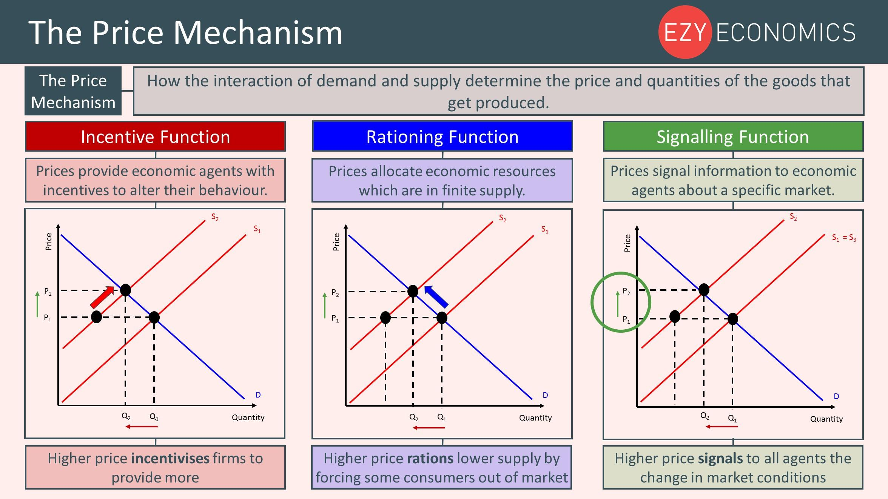

## Table of Contents

## What is a setup price?

A setup price is the cost you pay to get something ready to use. It's like the fee you might pay to have a new phone activated or the cost to install a new software program on your computer. This price is usually a one-time payment and covers the initial work needed to start using the product or service.

Sometimes, setup prices can be confusing because they are separate from the regular price you pay for using the product or service. For example, you might pay a setup price to get a new internet service started, and then you'll have to pay a monthly fee to keep using it. It's important to know about setup prices so you can budget for them and not be surprised by extra costs.

## Why is the setup price important in business?

The setup price is important in business because it helps cover the costs of getting things ready for customers. When a business charges a setup price, it can pay for things like installing equipment, training staff, or setting up accounts. This helps the business make sure everything is working well before the customer starts using the product or service. Without a setup price, the business might have to raise the regular price to cover these costs, which could make their product or service more expensive for everyone.

Setup prices also help businesses manage their cash flow. When a customer pays a setup price, the business gets money right away to help with the costs of setting things up. This can be really helpful, especially for small businesses that might not have a lot of money saved up. It also lets the business know how serious a customer is about using their product or service. If a customer is willing to pay the setup price, it shows they are committed and likely to keep using the product or service for a while.

## How does the setup price differ from other types of pricing?

The setup price is different from other types of pricing because it is a one-time fee paid at the beginning. This fee covers the costs of getting things ready, like setting up equipment or training staff. Other types of pricing, like monthly or yearly fees, are paid over time and cover the ongoing use of a product or service. For example, you might pay a setup price to get a new phone activated, and then pay a monthly fee to use the phone service.

Another way the setup price differs is that it helps businesses cover their initial costs without raising the regular price. If a business didn't charge a setup price, they might have to make their product or service more expensive for everyone to cover those costs. This can be important for keeping the product or service affordable for customers. Also, the setup price shows that a customer is serious about using the product or service, which can be helpful for businesses in planning and managing their resources.

## What are the common components included in a setup price?

The setup price often includes the costs of getting things ready for a customer to use a product or service. This can mean setting up equipment, like installing a new computer system or putting in new machinery. It can also cover the costs of training staff, so they know how to use the new equipment or provide the service well. Sometimes, the setup price pays for things like creating an account or getting a license, which are needed before the customer can start using the product or service.

Another part of the setup price might be the costs of any materials or supplies needed to get started. For example, if you're setting up a new office, the setup price might include the cost of buying desks, chairs, and other furniture. It can also cover the cost of any software or tools that need to be bought before the product or service can be used. All these things together make up the setup price, which helps businesses cover their initial costs and get everything ready for the customer.

## Can you explain how setup prices are calculated?

Setup prices are calculated by adding up all the costs that a business needs to get a product or service ready for a customer. This can include the cost of installing new equipment, like setting up a computer system or machinery. It also covers the cost of training staff, so they know how to use the new equipment well. Sometimes, the setup price includes the cost of creating an account or getting a license, which are needed before the customer can start using the product or service. If any materials or supplies are needed to get started, like desks and chairs for a new office, those costs are also part of the setup price.

Businesses might also add a bit extra to the setup price to make sure they cover all their costs and maybe even make a little profit. This extra amount helps them pay for things like the time and effort it takes to set everything up. The setup price is important because it helps the business manage their money and make sure they can afford to get everything ready for the customer. By adding up all these different costs, businesses can figure out a fair setup price that helps them cover their initial expenses and start off on the right foot with their customers.

## What industries commonly use setup prices?

Many industries use setup prices to cover the costs of getting things ready for their customers. For example, in the telecommunications industry, companies often charge a setup price to activate a new phone or internet service. This fee helps pay for the work needed to set up the account and get the service running. In the software industry, setup prices are common when installing new programs or systems. These fees cover the cost of setting up the software and training staff to use it properly.

The fitness industry also uses setup prices, especially for gym memberships. When someone joins a gym, they might have to pay a setup fee to cover the cost of setting up their membership and giving them an orientation to the gym's equipment and facilities. In the construction industry, setup prices are used for things like setting up a new building site or installing new equipment. These fees help cover the costs of getting everything ready before the actual construction work begins.

## How do setup prices affect customer acquisition and retention?

Setup prices can affect how many new customers a business gets. If the setup price is too high, some people might not want to pay it and choose a different company instead. This means the business might lose customers because of the high setup price. But if the setup price is fair and helps the customer see the value in the product or service, it can make them feel good about their choice. This can help the business get more customers because people are willing to pay the setup price to start using the product or service.

Setup prices can also affect how long customers stay with a business. If the setup price is too high, some customers might feel unhappy and leave after a short time. They might think the setup price was not worth it and go to a different company. But if the setup price is reasonable and the customer feels like they are getting good value, they are more likely to stay with the business for a longer time. This helps the business keep their customers happy and coming back, which is good for the business in the long run.

## What are the best practices for setting a setup price?

When setting a setup price, it's important to think about what costs need to be covered. This includes things like installing equipment, training staff, and getting any needed materials or supplies. Make sure to add up all these costs carefully so the setup price can cover them. It's also a good idea to add a little extra to the setup price to help with any unexpected costs and maybe even make a small profit. This way, the business can make sure they have enough money to get everything ready for the customer without losing money.

Another important thing to think about is what customers are willing to pay. If the setup price is too high, some customers might choose a different company instead. So, it's helpful to look at what other businesses charge for similar services and try to set a fair price. It's also good to explain to customers why they are paying the setup price and what it covers. This can make them feel better about paying it and help them see the value in the product or service. By setting a fair and clear setup price, a business can attract more customers and keep them happy.

## How can businesses adjust their setup prices over time?

Businesses can change their setup prices over time by looking at their costs and what customers are willing to pay. If the costs of setting things up go up, like if equipment or materials get more expensive, the business might need to raise the setup price to cover these costs. They can also look at what other companies are charging for similar services. If other companies have lower setup prices, the business might need to lower their price to stay competitive and attract more customers.

It's also important for businesses to listen to what their customers say about the setup price. If a lot of customers think the setup price is too high, the business might need to lower it to keep customers happy. On the other hand, if customers don't mind paying the setup price and see the value in it, the business might be able to keep it the same or even raise it a little bit. By keeping an eye on costs, competition, and customer feedback, businesses can adjust their setup prices to make sure they are fair and help them succeed.

## What are the potential pitfalls of using setup prices?

One big problem with setup prices is that they can make customers not want to use a business's product or service. If the setup price is too high, customers might think it's not worth it and go to another company instead. This can make it hard for the business to get new customers. Also, if the setup price is not clear or the customer doesn't understand what it's for, they might feel tricked or unhappy. This can make them leave and not come back.

Another issue is that setup prices can make it hard for a business to keep customers. If customers feel like the setup price was too much and they didn't get good value, they might leave soon after they start using the product or service. This means the business loses money because they spent time and effort setting things up, but the customer didn't stay long enough to make it worth it. It's important for businesses to set a fair setup price and explain it well so customers feel good about paying it and want to keep using the product or service.

## How do setup prices integrate with overall pricing strategies?

Setup prices are a part of a business's overall pricing strategy. They help cover the costs of getting things ready for customers, like setting up equipment or training staff. When a business sets a setup price, they need to think about how it fits with their other prices, like monthly fees or yearly subscriptions. The setup price should be fair and clear so customers understand what they are paying for. If the setup price is too high, it might make the overall cost of using the product or service too expensive, and customers might choose a different company.

The setup price also affects how customers see the value of the product or service. If the setup price is reasonable and the customer feels like they are getting good value, they are more likely to stay with the business for a long time. This can help the business keep their customers happy and coming back. On the other hand, if the setup price is too high or not explained well, customers might feel unhappy and leave. So, it's important for businesses to think about how the setup price works with their other prices to make sure they are attracting and keeping customers.

## What advanced techniques can be used to optimize setup pricing?

One advanced way to make setup prices better is by using data to see how customers act. Businesses can look at things like how many customers they get, how long they stay, and how happy they are with the setup price. By using this information, businesses can change the setup price to make more people want to use their product or service. For example, if a lot of customers leave right after paying the setup price, the business might need to lower it to keep more customers. This helps the business make the setup price just right so it covers costs and keeps customers happy.

Another way to make setup prices better is by trying out different prices with different groups of customers. This is called A/B testing. The business can see which setup price makes more people want to use their product or service and stay longer. They can also use special deals or discounts to make the setup price more appealing. By doing this, businesses can find the best setup price that works for both them and their customers. It's all about finding a balance so the setup price helps the business make money and keeps customers happy at the same time.

## What is the role of pricing in risk management?

Effective pricing strategies are instrumental in the risk management process within [algorithmic trading](/wiki/algorithmic-trading) systems, providing a structured approach to safeguard against market [volatility](/wiki/volatility-trading-strategies). By clearly defining entry and [exit](/wiki/exit-strategy) points, traders can implement stop-loss and take-profit orders. These mechanisms help cap potential losses and lock in gains, respectively. For instance, a stop-loss order can be placed at a level that limits losses to a specified percentage of the trading capital, allowing traders to manage their risk exposure with precision.

Pricing mechanisms further facilitate trading with predetermined risk-reward ratios, which form the foundation of robust portfolio management. This approach ensures that the potential reward for each trade surpasses the associated risk, thus enhancing the overall resilience of a portfolio. For example, a common risk-reward ratio is 1:3, where the potential gain is three times as large as the maximum acceptable loss. This can be represented by the formula:

$$
\text{Risk-Reward Ratio} = \frac{\text{Potential Gain}}{\text{Potential Loss}}
$$

The formula helps traders to quantify the expected outcomes of trades, allowing for more informed decision-making.

The inherently unpredictable (aleatory) nature of financial markets requires continuous adjustments to pricing strategies to preserve a competitive edge. Algorithmic trading systems are well-suited for this task, as they can be programmed to adapt pricing strategies in real-time based on market conditions. This adaptability is achieved through [machine learning](/wiki/machine-learning) algorithms that identify patterns and forecast price movements, thereby optimizing trading decisions.

Integrating automated risk management tools with algorithmic trading platforms further fortifies trading positions. Advanced software solutions can monitor trades across multiple markets, analyzing vast datasets to provide real-time risk assessments. These systems can automatically adjust stop-loss levels or alter trading parameters in response to market movements, thereby maintaining an optimal risk profile. By leveraging tools like Python, traders can develop custom scripts to automate these processes. An example Python code snippet to set a stop-loss order might look like this:

```python
def set_stop_loss(current_price, stop_loss_percentage):
    stop_loss_price = current_price * (1 - stop_loss_percentage / 100)
    return stop_loss_price

# Example usage
current_price = 100.0  # current stock price
stop_loss_percentage = 5  # stop-loss at 5%

stop_loss_price = set_stop_loss(current_price, stop_loss_percentage)
print(f"Stop-loss price set at: ${stop_loss_price}")
```

In summary, the integration of effective pricing strategies within algorithmic trading not only bolsters risk management capabilities but also enhances the overall robustness and efficiency of trading operations. Through a blend of mathematical modeling, automation, and continuous strategy refinement, traders can navigate the complexities of the markets with greater confidence and precision.

## References & Further Reading

[1]: Bergstra, J., Bardenet, R., Bengio, Y., & Kégl, B. (2011). ["Algorithms for Hyper-Parameter Optimization."](https://proceedings.neurips.cc/paper/2011/file/86e8f7ab32cfd12577bc2619bc635690-Paper.pdf) Advances in Neural Information Processing Systems 24.

[2]: ["Advances in Financial Machine Learning"](https://www.amazon.com/Advances-Financial-Machine-Learning-Marcos/dp/1119482089) by Marcos Lopez de Prado

[3]: ["Evidence-Based Technical Analysis: Applying the Scientific Method and Statistical Inference to Trading Signals"](https://www.amazon.com/Evidence-Based-Technical-Analysis-Scientific-Statistical/dp/0470008741) by David Aronson

[4]: ["Machine Learning for Algorithmic Trading"](https://github.com/stefan-jansen/machine-learning-for-trading) by Stefan Jansen

[5]: ["Quantitative Trading: How to Build Your Own Algorithmic Trading Business"](https://www.amazon.com/Quantitative-Trading-Build-Algorithmic-Business/dp/1119800064) by Ernest P. Chan