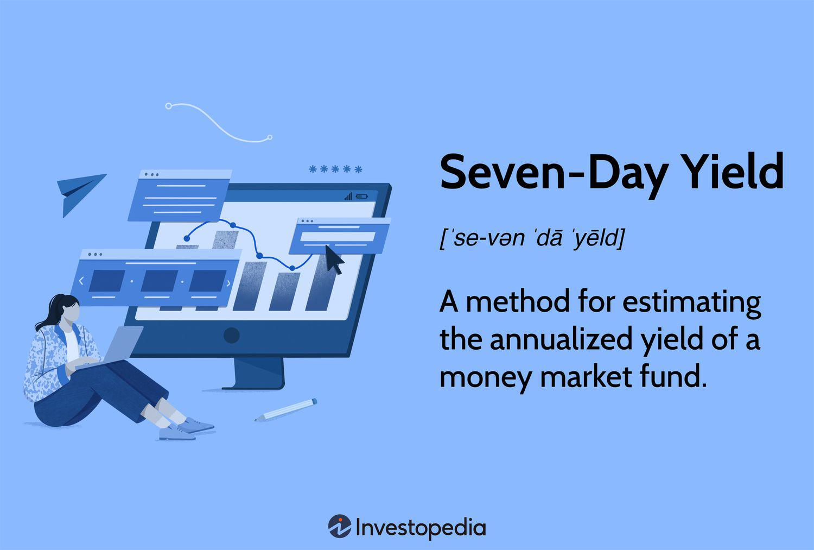

## Table of Contents

## What is the Seven-Day Yield?

The Seven-Day Yield is a way to measure how much money a money market fund makes in a week. It shows the income you could earn from the fund if you kept your money in it for seven days. This number is usually shown as a percentage, which makes it easy to compare different money market funds.

To find the Seven-Day Yield, the fund looks at the income it made over the last seven days. Then, it figures out what that income would be if it were spread out over a whole year. This gives investors a good idea of what they might earn if they invest in the fund, helping them decide if it's a good choice for their money.

## Why is the Seven-Day Yield important for investors?

The Seven-Day Yield is important for investors because it tells them how much money they might make from a money market fund in a week. This helps them see if the fund is a good place to put their money. When investors are looking at different money market funds, they can use the Seven-Day Yield to compare them and pick the one that might give them the best return.

Knowing the Seven-Day Yield also helps investors understand how well a money market fund is doing right now. It's like a quick check-up on the fund's health. If the yield is high, it means the fund is earning a lot of income, which could be good for the investor. If it's low, the fund might not be the best choice at that time. This information helps investors make smart choices about where to invest their money.

## How is the Seven-Day Yield different from other yield measures?

The Seven-Day Yield is different from other yield measures because it focuses on a short period of time, just one week. This makes it very useful for money market funds, which often change their income quickly. Other yield measures, like the 30-Day SEC Yield, look at a longer time frame, usually a month. The Seven-Day Yield gives investors a more current snapshot of what the fund is earning right now, while the 30-Day SEC Yield gives a more stable, but less up-to-date picture.

Another difference is how the Seven-Day Yield and other measures calculate their numbers. The Seven-Day Yield is calculated using the income earned over the past seven days, then it's annualized to show what the yearly return might be. This makes it easy to compare with other investments. On the other hand, the Effective Yield takes into account the effect of compounding, showing what the return would be if the income was reinvested. This can be more accurate for long-term investments but might be too complex for quick decisions about money market funds.

## What are the components needed to calculate the Seven-Day Yield?

To calculate the Seven-Day Yield, you need to know the income the money market fund earned over the past seven days. This income comes from the interest and dividends the fund collected during that time. You also need to know the total value of the fund at the beginning of those seven days. This value is used to figure out what percentage of the fund's value the income represents.

Once you have these two pieces of information, you can work out the Seven-Day Yield. First, you divide the income earned over seven days by the fund's total value at the start of those seven days. This gives you the yield for just one week. To make it easier to compare with other investments, you then multiply this weekly yield by 365 and divide by 7. This step turns the weekly yield into an annual rate, which is what we call the Seven-Day Yield.

## Can you walk through the step-by-step process of calculating the Seven-Day Yield?

To calculate the Seven-Day Yield, you start by finding out how much money the money market fund made from interest and dividends over the last seven days. You also need to know how much the fund was worth at the beginning of those seven days. Once you have these numbers, you can do the math. First, you divide the income the fund earned over seven days by the fund's total value at the start of those seven days. This gives you the yield for just one week.

Next, you need to turn this weekly yield into an annual rate so it's easier to compare with other investments. To do this, you multiply the weekly yield by 365 (the number of days in a year) and then divide by 7 (the number of days you're looking at). This calculation gives you the Seven-Day Yield, which is shown as a percentage. This number tells you what you might earn from the fund if you kept your money in it for a whole year, based on what it earned over the last week.

## What are some common mistakes to avoid when calculating the Seven-Day Yield?

When calculating the Seven-Day Yield, one common mistake is using the wrong numbers. You need to make sure you're using the income the fund made over the last seven days and the fund's value at the start of those seven days. If you mix up these numbers or use the wrong time period, your calculation will be wrong. It's also important to double-check your math, especially when you're turning the weekly yield into an annual rate.

Another mistake to avoid is not understanding what the Seven-Day Yield really means. It's just an estimate of what you might earn in a year based on one week's income. It doesn't tell you what will happen in the future, and it can change a lot from week to week. So, don't rely on it too much when making investment decisions. Always look at other information too, like the fund's history and other yield measures, to get a full picture.

## How often should the Seven-Day Yield be recalculated?

The Seven-Day Yield should be recalculated every week. This is because it looks at the income the money market fund made over the last seven days. By updating it weekly, investors can see the most current picture of how well the fund is doing. This helps them make better decisions about where to put their money.

It's important to keep the Seven-Day Yield up to date because money market funds can change quickly. If you don't recalculate it every week, the number might not show what the fund is really earning right now. So, checking it weekly gives investors a fresh look at the fund's performance and helps them stay informed.

## What factors can influence changes in the Seven-Day Yield?

Changes in the Seven-Day Yield can be influenced by many things. One big factor is the interest rates set by the central bank. If these rates go up, the money market fund might earn more interest on the money it has invested, which can make the Seven-Day Yield go up too. On the other hand, if interest rates go down, the fund might earn less, and the Seven-Day Yield could drop. Another factor is how well the companies or governments the fund has invested in are doing. If they are doing well and paying more dividends, the fund's income goes up, and so does the Seven-Day Yield.

Another thing that can change the Seven-Day Yield is how much money is coming into or going out of the fund. If a lot of people are putting money into the fund, the fund managers might have to invest in lower-yielding options, which can lower the Seven-Day Yield. If people are taking their money out, the fund might have to sell some of its investments, which can also affect the yield. Lastly, changes in the economy, like inflation or economic growth, can also play a role. If the economy is doing well, the fund might earn more, but if things are tough, the Seven-Day Yield might go down.

## How can the Seven-Day Yield be used to compare different investment options?

The Seven-Day Yield is a great way for investors to compare different money market funds. By looking at the Seven-Day Yield of different funds, you can see which one is earning more money right now. If one fund has a higher Seven-Day Yield than another, it means that fund is making more income over the last week. This can help you decide which fund might give you a better return on your money. But remember, the Seven-Day Yield is just a snapshot of one week, so it's a good idea to look at other things too, like the fund's history and other yield measures.

You can also use the Seven-Day Yield to see how a money market fund stacks up against other types of investments, like savings accounts or short-term bonds. If the Seven-Day Yield of a money market fund is higher than the interest rate on a savings account, it might be a better place to put your money. But you need to think about other things too, like how safe the investment is and how easy it is to get your money back. The Seven-Day Yield gives you a quick way to compare, but it's always smart to look at the whole picture before making a decision.

## What are the limitations of using the Seven-Day Yield as a performance metric?

The Seven-Day Yield is a good way to see how a money market fund is doing right now, but it has some limitations. One big problem is that it only looks at what the fund earned over the last seven days. This means it can change a lot from week to week, so it might not show you what the fund will do in the future. It's like trying to guess the weather for the whole month based on just one day. Also, the Seven-Day Yield doesn't tell you anything about how safe the fund is. A fund might have a high yield, but if it's risky, you might lose money.

Another limitation is that the Seven-Day Yield doesn't take into account other important things like fees and expenses. These costs can eat into your earnings, so a fund with a high yield might not be as good as it looks if it has high fees. It's also important to remember that the Seven-Day Yield is just one number. It doesn't give you the whole story about a fund's performance. To make smart investment choices, you need to look at other things too, like the fund's history, other yield measures, and how easy it is to get your money out.

## How does the tax treatment affect the Seven-Day Yield for different types of investors?

The tax treatment can make a big difference in how much money you really get from the Seven-Day Yield. For some investors, the income they get from a money market fund might be taxed. This means they have to pay part of their earnings to the government, which makes the real return lower than the Seven-Day Yield shows. For example, if the Seven-Day Yield is 2%, but you have to pay 25% in taxes, you're only keeping 1.5% of your money.

Different types of investors might be taxed differently. Some people, like retirees, might not have to pay as much tax on their investment income. This means they get to keep more of the Seven-Day Yield. On the other hand, someone in a higher tax bracket might see a bigger chunk of their earnings taken away. It's important for investors to think about their own tax situation when they look at the Seven-Day Yield to understand what they'll really get to keep.

## What advanced strategies can be employed using the Seven-Day Yield for portfolio management?

One advanced strategy for using the Seven-Day Yield in portfolio management is to keep an eye on it to make quick changes to your investments. If you see the Seven-Day Yield of a money market fund going up, it might be a good time to put more money into that fund because it's earning more right now. On the other hand, if the yield starts to drop, you might want to take some money out and move it to another fund or investment that's doing better. This way, you can try to always have your money in the best-performing funds.

Another strategy is to use the Seven-Day Yield to balance your portfolio. If you have a lot of money in stocks or other risky investments, you can use money market funds with a good Seven-Day Yield to keep some of your money safe while still earning a bit of income. By checking the Seven-Day Yield regularly, you can move money between your safe investments and your riskier ones to keep your portfolio balanced. This can help you make the most of your money while also protecting it from big losses.

## How is the Seven-Day Yield Calculated?

Calculating the seven-day yield is a direct process used to estimate the annualized return of a money market fund over a single week. This yield measurement provides investors with an annualized projection, assuming that the investment conditions during those seven days persist throughout the year.

To compute the seven-day yield, you start by determining the difference between the ending price and the starting price of the investment over the seven-day period. This calculation includes any distributions, such as interest or dividends, that were paid during this time. From this total, you subtract any fees that are averaged over the period. Here is a step-by-step breakdown of the formula involved:

- **A**: Represents the end-of-period price plus any distributions paid during the seven days. 
- **B**: Represents the price at the beginning of the period.
- **C**: Denotes the average fees deducted over the period.

The formula for calculating the seven-day yield is:

$$
\text{Seven-Day Yield} = \left( \frac{(A - B - C)}{B} \right) \times \frac{365}{7}
$$

This formula provides an effective annual yield based on the one-week performance by annualizing the seven-day return. Here's a simple Python code snippet that can be used to calculate the seven-day yield:

```python
def calculate_seven_day_yield(start_price, end_price, distributions, fees):
    A = end_price + distributions
    B = start_price
    C = fees
    seven_day_yield = ((A - B - C) / B) * (365 / 7)
    return seven_day_yield

# Example usage:
start_price = 100.00
end_price = 101.00
distributions = 0.50
fees = 0.10

yield_result = calculate_seven_day_yield(start_price, end_price, distributions, fees)
print(f"The seven-day yield is {yield_result:.4f}%")
```

This straightforward method helps investors to estimate how much they might earn annually if the short-term conditions hold constant, making it easier to compare different money market funds or investment opportunities based on their potential performance.

## References & Further Reading

[1]: ["The Handbook of Mortgage-Backed Securities"](https://academic.oup.com/book/7943) by Frank J. Fabozzi

[2]: ["Money Market Funds: Study by the U.S. Securities and Exchange Commission"](https://www.sec.gov/data-research/data-visualizations/money-market-fund-statistics)

[3]: ["Fixed Income Securities: Tools for Today's Markets"](https://www.amazon.com/Fixed-Income-Securities-Markets-Finance/dp/1119835550) by Bruce Tuckman and Angel Serrat

[4]: Ippolito, R. A. (1992). ["Consumer Reaction to Measures of Poor Quality: Evidence from the Mutual Fund Industry."](https://www.jstor.org/stable/725554) Journal of Law and Economics, 35(1), 45-70.

[5]: ["Fundamentals of Futures and Options Markets"](https://api.pageplace.de/preview/DT0400.9781292422121_A43290044/preview-9781292422121_A43290044.pdf) by John C. Hull