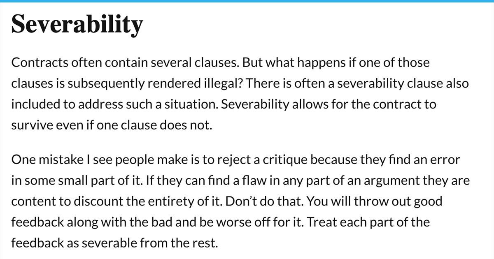

The concept of severability in contract law is crucial for maintaining the integrity and enforceability of legal agreements. Severability clauses, known as savings clauses, are integral for ensuring that the remainder of a contract remains effective even when a specific provision is found to be invalid or unenforceable. This mechanism prevents the invalidation of an entire contract due to an issue with one of its parts, thereby providing stability and predictability in contractual relations.

Severability is particularly relevant in complex frameworks like algorithmic trading, where contracts are heavily utilized and must accommodate evolving technologies and regulatory landscapes. These contracts often contain numerous intricate provisions governing the use of algorithms, data rights, and other technical specifications. Understanding the role of severability clauses in these contexts is essential for drafting robust contracts and negotiating agreements that can withstand potential legal challenges.

This article will examine severability clauses, focusing on legal examples and their significance within contract structures in algorithmic trading. By understanding how these clauses function and interact with broader legal frameworks, stakeholders can mitigate risks associated with invalid contractual terms. This discussion also underscores the strategic importance of severability in safeguarding contractual integrity and ensuring that agreements continue to operate effectively, even when unforeseen legal issues arise.

## Table of Contents

## Understanding Severability

Severability, originating from the Latin term 'salvatorius', is integral to contract law, enabling a contract's continued validity even when certain provisions become unenforceable or illegal. This functionality is crucial because, in the absence of a severability clause, the invalidity of a single term could jeopardize the entire contract, potentially nullifying all related agreements. A well-crafted severability clause generally comprises two fundamental components: savings language and reformation language.

Savings language functions to protect and uphold the enforceable sections of the contract by ensuring that these remain operational despite the invalidity of other sections. Reformation language, on the other hand, provides a mechanism for modifying or interpreting unenforceable terms in a manner that aligns with the original contractual intent. This allows for minor adjustments rather than discarding the entire agreement.

The principle of reasonableness often guides judicial interpretation and application of severability clauses. Courts apply this principle to adjust or redefine problematic contractual areas, attempting to uphold the agreement as much as possible within legal bounds. For example, if a particular term contradicts legal statutes, a court may modify that term to make it enforceable while preserving the core intentions of the contracting parties. This judicial intervention emphasizes the need for precise wording and comprehensive design of severability clauses to ensure their durability and effectiveness in legal disputes.

The absence of a severability clause may lead to the unintended consequence of voiding an entire contract due to one defective part. This highlights the essential role of these provisions in contract drafting and negotiations. Careful attention to drafting these clauses is necessary to minimize risks and maintain contractual stability, safeguarding against potential disputes and ensuring continuity of the agreement's enforceable obligations. Understanding and implementing severability can thus fortify contracts against unforeseen legal impediments, playing a pivotal role in supporting the resilience and adaptability of legal agreements.

## Examples of Severability Clauses in Contracts

A typical severability clause in a contract stipulates that if any provision of the contract is found to be illegal or unenforceable, the remaining provisions will continue to be in effect. This clause is essential in safeguarding the overall validity of a contract when individual sections face legal scrutiny or invalidation.

Corporate contracts often exhibit these clauses to ensure operational continuity. For instance, a multinational company may enter into agreements with various international suppliers. If a regulatory change renders a specific agreement term unenforceable in one jurisdiction, a severability clause allows the contract's full functionality in other jurisdictions to remain unaffected. This ensures that the company’s supply chain is not entirely disrupted by regional legal changes.

In legislative contexts, severability serves to uphold the enforceability of laws even when certain parts are deemed unconstitutional. A prominent example can be found in the United States Supreme Court cases where portions of federal laws were invalidated without nullifying the entirety of the legislation. A landmark instance is the Affordable Care Act, where certain provisions were challenged, but the core of the legislation continued to operate effectively due to its severability clause.

Case law provides tangible insights into how severability operates in diverse legal scenarios. Courts often emphasize the intent of the parties involved, favoring interpretations that respect the parties' original objectives. For example, in the case of *Fox v. Mountain West Electric, Inc.*, the court upheld the contract by enforcing the valid portions and severing the unenforceable part, reflecting the contract’s intent and functionality.

Understanding these examples highlights the critical role severability plays in contract management. It demonstrates the utility of these clauses in preserving contractual relationships and maintaining predictability and stability across various legal and business landscapes. By examining these real-world applications, stakeholders can assess the necessity of robust severability clauses in their contractual documents.

## Severability in Algorithmic Trading Contracts

Algorithmic trading contracts encompass a range of elements, such as rights, responsibilities, and protocols, governing the conduct of participating entities. These contracts often bear complex technical foundations, necessitating the inclusion of severability clauses. These clauses are essential for ensuring the continuity of contract enforceability, even when specific provisions may face legal challenges.

The inclusion of severability clauses in [algorithmic trading](/wiki/algorithmic-trading) contracts is paramount due to the intricate and technical nature of these agreements. Algorithmic trading involves executing trades at high speeds based on pre-defined criteria, often entailing proprietary algorithms and crucial data rights. Such contracts may include contested or invalid provisions. In these instances, severability clauses serve as a safeguard, preventing the entire agreement from being rendered void. For example, if a section of the contract related to proprietary algorithm protection is deemed unenforceable, a severability clause would maintain the enforceability of the remaining provisions, allowing trading operations to continue without interruption.

Furthermore, severability clauses in algorithmic trading contracts may cover aspects such as technical service agreements, which define the scope and nature of services provided. Should any part of these agreements come under legal scrutiny, severability ensures that unaffected sections remain operational, thus preserving the overall efficiency and reliability of trading activities.

Ensuring the integrity of algorithmic trading contracts through severability clauses is crucial for business continuity. It minimizes the risk of litigation and potential financial losses associated with invalidated contracts. By safeguarding vital components like data rights and proprietary technology, organizations can maintain their trading infrastructures and fulfill their strategic objectives, even amidst legal disputes over specific contract terms.

In conclusion, severability clauses are integral to algorithmic trading contracts, providing a legal mechanism to uphold critical aspects of these agreements despite challenges to individual provisions. As the algorithmic trading landscape evolves, the importance of well-crafted severability clauses is expected to grow, underscoring their role in maintaining resilient and adaptable trading infrastructures.

## Legal Considerations and Best Practices

When considering the inclusion of severability clauses in contracts, it is vital to recognize the varying jurisdictional interpretations and enforcement levels of these provisions. The legal landscape can significantly differ from one jurisdiction to another, and these differences can impact how a severability clause is applied during legal disputes. Some jurisdictions may have more favorable environments for enforcing such clauses, while others may impose restrictions or have specific statutory interpretations.

Drafting a severability clause with precision is a recommended best practice. Clear and explicit language in the clause serves as a protective measure against potential legal challenges. It ensures that the intent and scope of severability are unambiguous. This clarity helps minimize disputes and enhances the likelihood that the clause will perform its function if a contract component is declared invalid.

Contract negotiators must strike a balance between the interests of the involved parties and the creation of a clause that is both practical and legally robust. This involves careful consideration of the specific provisions that are most likely to be challenged and ensuring that the severability wording effectively covers these scenarios without overly compromising the contract's integrity or objectives.

Engaging with legal experts during the drafting phase of a contract is strongly advised. Their expertise can help navigate complex legal landscapes and craft effective severability clauses. Legal professionals can provide insights on jurisdiction-specific requirements and offer guidance on how to address potential pitfalls in severability wording.

Regular reviews of contract terms are essential, especially in light of evolving regulations and technological advancements. As legal and technological contexts change, so too might the vulnerabilities within a contract. Continuous oversight ensures that severability clauses remain applicable and protective, thereby maintaining the contract's integrity over its lifespan. This proactive approach is crucial for adapting contracts to new legal norms and technological innovations, safeguarding parties against unforeseen contractual invalidations.

## Conclusion

Severability clauses are essential components in contract law, designed to uphold the integrity of agreements by ensuring that they remain effective despite potential legal challenges. In contract settings, especially those involving algorithmic trading, these clauses are vital for maintaining commercial operations and preventing entire agreements from falling apart due to invalidated individual provisions.

In algorithmic trading contracts, which often encompass complex technical arrangements and intellectual property considerations, a well-drafted severability clause is crucial. It protects the contract's core intents by isolating problematic clauses, thereby avoiding total contract failure. This isolation is particularly important where vast algorithms, data rights, and service agreements interact within the same contractual framework.

To enhance contract formulation and enforcement, it is imperative to grasp the fundamental principles and best practices of severability. This involves crafting clauses with precision to account for jurisdictional and industry-specific nuances, ensuring that they are robust enough to withstand varied legal interpretations.

As industries evolve, driven by technological advancements and shifting regulatory landscapes, the role of severability within contracts becomes even more critical. Emerging technologies bring new challenges that may impact contract enforceability. Therefore, future considerations in contract law should prioritize the refinement and adaptation of severability clauses to ensure they meet the demands of contemporary market practices and technological contexts.

In summary, severability clauses not only preserve the continuity and enforceability of contracts but are also key to fostering resilient legal frameworks that adapt to ongoing changes in the industry. Ensuring these clauses are well-crafted and responsive to new challenges is essential for safeguarding the interests of all parties involved in complex contractual arrangements.

## References & Further Reading

[1]: Restatement (Second) of Contracts § 184. [American Law Institute](https://advance.lexis.com/open/document/openwebdocview/-184-When-Rest-of-Agreement-Is-Enforceable/?pdmfid=1000522&pddocfullpath=%2Fshared%2Fdocument%2Fanalytical-materials%2Furn%3acontentItem%3a42GD-2SH0-00YG-M06Y-00000-00&pdcomponentid=12225)

[2]: MacQueen, H., & Thomson, J. (2001). "Contract Law in Scotland." Tottel Publishing. (Discusses the principle of severability in contract law).

[3]: "Principles of International Commercial Contracts" (2016). International Institute for the Unification of Private Law (UNIDROIT). (Includes discussion on the inclusion of severability clauses in international contracts).

[4]: White, A., & Case, C. (2017). "Contract Law: Text, Cases, and Materials". Oxford University Press. (Covers severability and related contract law principles).

[5]: "The Use of Severability Clauses in the Insurance Industry" by the International Risk Management Institute. (Explains severability in contractual contexts within specific industries, available at [IRMI](https://www.irmi.com/)).