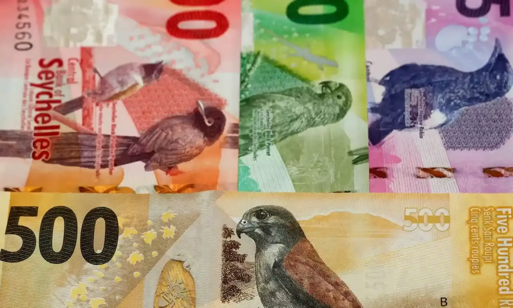

## Table of Contents

## What is the Seychelles Rupee and how is it symbolized?

The Seychelles Rupee is the official currency used in the Seychelles, a country made up of many islands in the Indian Ocean. It is managed by the Central Bank of Seychelles. The Seychelles Rupee helps people in Seychelles buy things and also helps the country trade with other countries.

The symbol for the Seychelles Rupee is SR or SCR. Sometimes, you might see it written as ₨, which is a common symbol for many rupees around the world. When you see prices in Seychelles, they will usually be shown with these symbols to show how much something costs in Seychelles Rupees.

## How does the Seychelles Rupee compare to major world currencies like the USD and EUR?

The Seychelles Rupee (SCR) is generally weaker compared to major world currencies like the US Dollar (USD) and the Euro (EUR). This means that it takes more Seychelles Rupees to buy one US Dollar or one Euro. For example, if you want to change your Seychelles Rupees into US Dollars, you might need around 13 to 14 SCR to get just one USD. For Euros, you might need around 14 to 15 SCR to get one EUR. These numbers can change every day because of things like how the economy is doing in Seychelles and around the world.

Even though the Seychelles Rupee is weaker, it's still important for the people living in Seychelles. They use it every day to buy things like food, clothes, and other stuff they need. When Seychellois people travel to countries that use USD or EUR, they have to change their money, and because the SCR is weaker, they might not get as much foreign money as they hoped. But, a weaker currency can also help Seychelles because it can make their country a cheaper place for tourists to visit, which can be good for their tourism business.

## What is the current exchange rate of the Seychelles Rupee?

The current exchange rate of the Seychelles Rupee (SCR) to the US Dollar (USD) is about 13.8 SCR for 1 USD. This means if you have 1 US Dollar, you can get around 13.8 Seychelles Rupees in return. The exchange rate changes every day because of many things like how the economy is doing in Seychelles and around the world.

For the Euro (EUR), the exchange rate is around 14.9 SCR for 1 EUR. So, if you have 1 Euro, you can get about 14.9 Seychelles Rupees. Just like with the US Dollar, this rate can go up or down based on different economic factors. It's always a good idea to check the latest rates before you change your money.

## What are the main factors influencing the value of the Seychelles Rupee?

The value of the Seychelles Rupee can change because of many things. One big thing is how well the economy of Seychelles is doing. If the economy is growing and people are making more money, the Seychelles Rupee might get stronger. But if the economy is not doing well, the Seychelles Rupee might get weaker. Another thing that can change the value of the Seychelles Rupee is how much people want to buy things from Seychelles. If more people from other countries want to buy things from Seychelles, the Seychelles Rupee might get stronger because they need to change their money into Seychelles Rupees to buy those things.

Another important [factor](/wiki/factor-investing) is what's happening in the world's economy. If big countries like the United States or countries in Europe have problems with their economies, it can affect the Seychelles Rupee too. For example, if the US Dollar gets stronger, the Seychelles Rupee might get weaker because people might want to change their Seychelles Rupees into US Dollars. Also, things like the price of oil and other things Seychelles needs to buy from other countries can change the value of the Seychelles Rupee. If these things get more expensive, it can make the Seychelles Rupee weaker because Seychelles has to spend more money to buy them.

## How has the Seychelles Rupee performed over the past decade?

Over the past ten years, the Seychelles Rupee has had its ups and downs. At the start of the decade, around 2013, you needed about 12 Seychelles Rupees to get one US Dollar. But as time went by, the Seychelles Rupee got weaker. By 2023, you needed around 13.8 Seychelles Rupees to get one US Dollar. This means the Seychelles Rupee lost some of its value compared to the US Dollar over the decade. There were times when the Seychelles Rupee got a bit stronger, but overall, it has been weaker compared to the start of the decade.

Many things affected the Seychelles Rupee during this time. The economy of Seychelles had some good years and some tough years. When the economy was doing well, the Seychelles Rupee sometimes got a bit stronger. But when the economy was not doing so well, the Seychelles Rupee got weaker. Also, what was happening in the world's economy had a big impact. Things like the price of oil and other things Seychelles needed to buy from other countries played a role in how the Seychelles Rupee did over the past ten years.

## What role does tourism play in the Seychelles economy and how does it affect the Rupee?

Tourism is very important for the Seychelles economy. It brings in a lot of money because many people from all over the world come to visit the beautiful beaches and nature of Seychelles. When tourists come, they spend money on hotels, food, and things to do, which helps create jobs and makes the economy grow. Tourism can be a big part of why the economy does well, and when the economy is doing well, it can help make the Seychelles Rupee stronger.

The Seychelles Rupee can be affected by how much tourists come to Seychelles. If more tourists come, they need to change their money into Seychelles Rupees to spend it there. This can make the Seychelles Rupee stronger because there is more demand for it. But if fewer tourists come, there might be less demand for the Seychelles Rupee, which can make it weaker. So, tourism can have a big impact on how the Seychelles Rupee does.

## What are the primary industries in Seychelles and their impact on the national economy?

The main industries in Seychelles are tourism, fishing, and agriculture. Tourism is the biggest one. It brings in a lot of money because many people come to see the beautiful beaches and nature. This helps create jobs and makes the economy grow. Fishing is also important. Seychelles has a lot of fish in its waters, and they sell fish to other countries. This brings in money too. Agriculture is smaller but still important. They grow things like coconuts, cinnamon, and vanilla, which they can sell to other places.

These industries help the Seychelles economy in different ways. Tourism makes the economy grow a lot because it brings in money from other countries. When tourists come, they spend money on hotels, food, and things to do. This helps create jobs and makes the economy stronger. Fishing and agriculture also help by bringing in money from selling fish and crops to other countries. But if these industries do not do well, it can make the economy weaker. So, they are all important for keeping the Seychelles economy healthy.

## How does the government of Seychelles manage its monetary policy and what tools does it use?

The government of Seychelles manages its monetary policy through the Central Bank of Seychelles. The main goal is to keep the economy stable and control inflation, which means making sure prices don't go up too fast. The Central Bank does this by changing how much money is in the economy and by setting interest rates. Interest rates are what banks charge people to borrow money. If the Central Bank makes interest rates higher, it can slow down the economy because borrowing money becomes more expensive. If they make interest rates lower, it can help the economy grow because borrowing money becomes cheaper.

The Central Bank also uses other tools to manage the economy. One tool is called open market operations, where the Central Bank buys or sells government bonds. When they buy bonds, they put more money into the economy, and when they sell bonds, they take money out of the economy. Another tool is setting reserve requirements, which means telling banks how much money they need to keep in their vaults and not lend out. By changing these requirements, the Central Bank can control how much money banks can lend, which affects how much money is circulating in the economy. All these tools help the Central Bank keep the Seychelles economy stable and the Seychelles Rupee strong.

## What are the inflation rates in Seychelles and how do they correlate with the Rupee's value?

Inflation in Seychelles means that the prices of things like food, clothes, and other stuff people buy are going up. Over the past few years, the inflation rate in Seychelles has been around 2% to 3%. This means prices are going up a little bit every year, but not too much. The government and the Central Bank of Seychelles try to keep inflation low because it helps the economy stay stable and makes life easier for people.

The value of the Seychelles Rupee can change because of inflation. When inflation is high, the Seychelles Rupee might get weaker because the money doesn't buy as much as before. If inflation is low, the Seychelles Rupee might stay strong or even get stronger because the money keeps its value better. So, the Central Bank works hard to keep inflation under control to help keep the Seychelles Rupee strong and the economy healthy.

## How do foreign investments impact the Seychelles economy and the Rupee?

Foreign investments are when people or companies from other countries put money into Seychelles to start businesses or buy things there. This can be really good for the Seychelles economy because it brings in more money and can help create jobs. When more money comes into Seychelles from foreign investments, it can make the economy grow. This is because the money can be used to build new things, like hotels or factories, which can make the country more attractive to tourists and other businesses. More jobs mean more people can earn money and spend it, which helps the economy even more.

Foreign investments can also affect the Seychelles Rupee. When investors from other countries want to put money into Seychelles, they need to change their money into Seychelles Rupees. This can make the Seychelles Rupee stronger because there is more demand for it. But if foreign investors decide to take their money out of Seychelles, it can make the Seychelles Rupee weaker because there is less demand for it. So, foreign investments can have a big impact on both the economy and the value of the Seychelles Rupee.

## What are the key economic challenges facing Seychelles and how do they influence the Rupee?

Seychelles faces several economic challenges that can affect its economy and the value of the Seychelles Rupee. One big challenge is that Seychelles depends a lot on tourism and fishing. If fewer tourists come or if there are problems with fishing, it can hurt the economy. Another challenge is that Seychelles imports a lot of things it needs, like food and fuel. If the prices of these things go up, it can make life more expensive for people in Seychelles and put pressure on the economy.

These challenges can influence the Seychelles Rupee in different ways. If the economy is not doing well because of fewer tourists or higher import prices, the Seychelles Rupee might get weaker. This is because people might not want to change their money into Seychelles Rupees if they think the economy is not doing well. On the other hand, if the government and the Central Bank can manage these challenges well, it can help keep the Seychelles Rupee strong. They do this by trying to keep inflation low and making sure the economy stays stable.

## What future economic strategies are being considered by Seychelles to strengthen the Rupee and the overall economy?

Seychelles is looking at different ways to make the economy stronger and help the Seychelles Rupee. One big idea is to not rely so much on tourism and fishing. They want to grow other parts of the economy, like technology and services. This can help because if one part of the economy has problems, the other parts can still do well. Another plan is to make it easier for foreign investors to put money into Seychelles. This can bring in more money and help create jobs, which can make the economy grow and the Seychelles Rupee stronger.

Another strategy is to work on making things in Seychelles instead of buying them from other countries. If Seychelles can make more of what it needs, like food and fuel, it won't have to spend as much money on imports. This can help keep prices from going up too fast and make the economy more stable. The government also wants to keep inflation low and control how much money is in the economy. By doing these things, Seychelles hopes to keep the Seychelles Rupee strong and make life better for its people.

## References & Further Reading

[1]: Securities and Exchange Commission. (2020). ["Equity Market Structure Literature Review: Part II: High Frequency Trading."](https://www.sec.gov/marketstructure/research/hft_lit_review_march_2014.pdf)

[2]: Aldridge, I. (2013). ["High-Frequency Trading: A Practical Guide to Algorithmic Strategies and Trading Systems."](https://www.amazon.com/High-Frequency-Trading-Practical-Algorithmic-Strategies/dp/1118343506) Wiley.

[3]: Lopez de Prado, M. (2018). ["Advances in Financial Machine Learning."](https://www.amazon.com/Advances-Financial-Machine-Learning-Marcos/dp/1119482089) Wiley.

[4]: Aronson, D. R. (2007). ["Evidence-Based Technical Analysis: Applying the Scientific Method and Statistical Inference to Trading Signals."](https://onlinelibrary.wiley.com/doi/book/10.1002/9781118268315) Wiley.

[5]: Chan, E. P. (2009). ["Quantitative Trading: How to Build Your Own Algorithmic Trading Business."](https://github.com/ftvision/quant_trading_echan_book) Wiley.