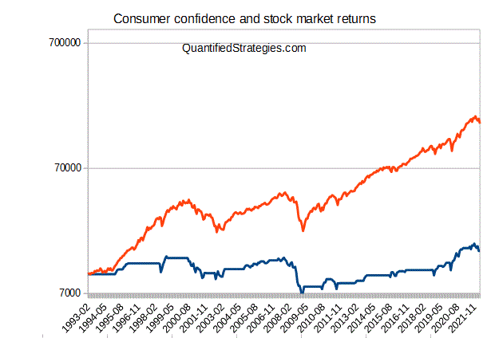

San Francisco has long been recognized as a center for innovation and financial expertise, especially within the domain of algorithmic trading. With its unique blend of technological advancement and financial acumen, the city has fostered a dynamic environment for traders and investors. Among the influential entities that shaped this landscape was SFO Magazine, a key publication for market participants engaged in stocks, futures, and options trading. Through its insightful content, SFO Magazine significantly influenced the trading community, providing a crucial resource for those seeking to enhance their strategies and understanding of market trends.

This article examines the history, impact, and eventual disappearance of SFO Magazine from the San Francisco publication business landscape. By tracing its journey, we uncover its contributions to the field of algorithmic trading and consider the broader lessons its history imparts. From its inception, SFO Magazine aimed to educate and inform its audience with detailed analyses and expert insights. As algorithmic trading gained momentum, the magazine became a vital platform for disseminating advanced strategies and technological innovations.

The publication not only informed traders but also drove discourse around the latest developments in the trading industry. As we explore the trajectory of SFO Magazine, we highlight its enduring legacy and the lessons learned from its operations. Despite its absence, the foundational knowledge and principles it disseminated continue to resonate within the financial community. This exploration serves both as a tribute to the magazine's influence and as a reminder of the evolving nature of financial publications in nurturing innovation.

## Table of Contents

## The Genesis of SFO Magazine

SFO Magazine was founded in 2001 by Russell R. Wasendorf Sr. during a transformative era for the trading industry. The publication was distinctive in its focus, dedicating itself to the education of investors and traders by exploring strategies across various financial instruments, including stocks, futures, and options. One of the key features of SFO Magazine was its emphasis on technical analysis and [trend following](/wiki/trend-following), techniques that are crucial for traders aiming to make informed decisions based on market behavior rather than company fundamentals.

From its inception, SFO Magazine catered to a broad spectrum of financial professionals, ranging from novice traders seeking foundational knowledge to seasoned experts looking to refine their strategies. To accommodate its wide readership, the magazine was available in both print and online editions, ensuring accessibility to a growing audience. At its peak, the publication achieved a circulation of 120,000, indicating its widespread popularity and influence in the financial community.

The magazine's launch coincided with a period marked by rapid advancements in trading technologies and methodologies. This era witnessed the increased adoption of algorithmic trading, where traders used sophisticated mathematical models and software to execute trades at speeds and frequencies beyond human capabilities. As such, SFO Magazine's content was timely and relevant, providing insights into these emerging practices and helping traders navigate the changing landscape. The publication's commitment to delivering cutting-edge information cemented its place as a vital resource for finance professionals during its years of operation.

## Contributors and Content

SFO Magazine distinguished itself by attracting contributions from some of the most respected names in trading, including Larry Williams, Brett Steenbarger, John Bollinger, and Jack Schwager. These experts played a pivotal role in shaping the magazine's content, which was aimed at providing traders with tools and strategies to enhance their decision-making processes. Each contributor brought a unique perspective, enriching the publication's overall value.

Larry Williams, known for his innovative trading indicators and techniques, shared insights on futures and commodities, directing readers towards developing robust trading systems. Brett Steenbarger contributed with authoritative articles on the psychology of trading, emphasizing the role of emotional intelligence in trading success. John Bollinger, renowned for the Bollinger Bands, illuminated technical analysis strategies, and Jack Schwager, with his exhaustive knowledge on hedge funds and technical trading, provided critical evaluations of contemporary market trends.

Each issue of SFO Magazine covered themes vital to the trading community. Psychology of trading was a recurring focus, helping traders understand the impact of their mindsets on market performance. The magazine also offered practical guides and strategies for [day trading](/wiki/day-trading-spy), enabling readers to adapt to fast-paced market environments. Forex market analysis was another crucial area covered, with articles breaking down currency trading strategies and technical indicators, reflecting the magazine's commitment to providing actionable insights.

SFO Magazine was particularly notable for its emphasis on the technical aspects of trading over [fundamental analysis](/wiki/fundamental-analysis). This technical focus included exploring chart patterns, indicators, and [momentum](/wiki/momentum) strategies, aligning with traders who favored quantifiable data over economic factors. Such a perspective is relatively rare in today's financial publications, which often balance or favor fundamental analysis.

By championing technical strategies and psychological insights, SFO Magazine provided a platform that encouraged the evolution of sophisticated trading methodologies, contributing significantly to the knowledge base of traders worldwide.

## Impact on the San Francisco Trading Scene

San Francisco's dynamic financial landscape provided an essential setting for SFO Magazine's operations and influence. The magazine played a significant role in synchronizing the trading strategies and practices within the Bay Area's financial community. By integrating its insightful content into the local trading culture, SFO Magazine contributed substantially to the region's reputation as a center for financial innovation and expertise.

SFO Magazine was instrumental in advancing [algorithmic trading](/wiki/algorithmic-trading) practices. It served as a channel for the dissemination of advanced trading strategies and technologies, aiding traders and investors in adopting more sophisticated techniques in their financial activities. The publication frequently featured articles and analyses that explored the technical aspects of trading, such as algorithmic approaches to market trends and statistical [arbitrage](/wiki/arbitrage). This focus not only addressed the growing demand for expertise in automated trading but also educated readers on the practical applications of these technologies.

The magazine's influence was evident in its ability to attract a community of traders keen on enhancing their knowledge of algorithmic trading algorithms and their implementation. By discussing both the theoretical underpinnings and practical applications, SFO Magazine facilitated a deeper understanding of how algorithmic systems could be leveraged in day-to-day trading operations. New trading models, optimization techniques, and software tools were regularly covered, providing essential information that helped shape the development of trading technologies throughout the region.

Moreover, by spotlighting prominent voices in the trading industry and featuring their expertise in algorithmic strategies, the magazine bridged gaps between established methodologies and emerging technologies. This integration of knowledge fostered an environment where the local trading community could exchange insights and remain at the forefront of innovative trading practices. The proliferation of algorithmic trading in San Francisco and beyond owes much to the foundational work done by SFO Magazine in making complex concepts accessible and actionable for its readers.

In summary, SFO Magazine's contribution to the San Francisco trading scene was marked by its effective blending of advanced trading strategies with traditional trading practices. It played a crucial role in promoting a culture of innovation and technical proficiency, solidifying San Francisco's status as a key player in the evolution of algorithmic trading.

## The Downfall of SFO Magazine

Despite its prior achievements and influence within the trading community, SFO Magazine met an untimely end in 2012. This demise was intrinsically linked to the collapse of its parent company, Peregrine Financial Group (PFG), a financial catastrophe that sent ripples throughout the trading industry. The magazine's shutdown was largely due to the fraudulent activities of Russell R. Wasendorf Sr., the company's founder and CEO. Wasendorf's financial misconduct involved the embezzlement of customer funds, which not only led to the bankruptcy of Peregrine Financial Group but also the cessation of SFO Magazine's operations.

The fraud perpetuated by Wasendorf was substantial and prolonged. It was discovered that over nearly two decades, he had misappropriated approximately $215 million from PFG's customer accounts. This discovery came at a time when the financial world was still reeling from other significant collapses, such as the debacle of MF Global, overshadowing the downfall of SFO Magazine with the broader narrative of institutional failures.

Amidst these developments, SFO Magazine was acquired by TraderPlanet in an attempt to preserve its valuable content. Although the magazine stopped publishing new issues, its archived articles continued to serve as a resource for traders and financial professionals, perpetuating its influence long after its discontinuation.

The narrative of SFO Magazine's closure underscores the vulnerabilities inherent within financial institutions, particularly those aggravated by unethical leadership. Its story remains a poignant reminder of the need for stringent financial oversight and transparency to safeguard against similar failures in the future.

## Lessons Learned and Legacy

SFO Magazine's story serves as a significant cautionary tale about the inherent vulnerabilities within financial institutions, especially in light of unforeseen leadership failures. The magazine's narrative highlights how a single node of failure, epitomized by the financial misconduct of its founder, Russell R. Wasendorf Sr., can induce sweeping repercussions across an entire organization, regardless of past successes or reputations. This incident underscores the pivotal importance of robust governance and stringent ethical guidelines in financial enterprises to prevent such catastrophes.

Despite its premature conclusion, the commitment of SFO Magazine to advancing technology and innovation in trading has left an indelible mark on the financial community. The publication was forward-thinking in its emphasis on algorithmic trading, which has become foundational to modern financial markets. The strategies and insights shared by the magazine's contributors, who were esteemed experts in their fields, continue to influence current trading practices. Many former readers and contributors have integrated the magazine's cutting-edge ideas into their own innovations and strategies, sustaining its influence long after its closure.

Although SFO Magazine is no longer published, its impact on the algorithmic trading industry and financial publication landscape in San Francisco endures. The magazine provided a platform for educating traders on sophisticated trading methodologies, playing a crucial role in shaping the early discourse on algorithmic trading. By focusing on technical analysis and fostering a community of numerically savvy traders and investors, SFO Magazine contributed significantly to the knowledge base that underpins today’s algorithmic trading strategies. In doing so, it helped set a tone of analytical rigor and openness to technological change that continues to characterize financial publications and trading approaches in the San Francisco area and beyond.

## Conclusion

The legacy of SFO Magazine continues to resonate within the San Francisco trading community, underscoring the essential role of specialized financial publications. Despite the magazine's cessation, its contributions to the education and advancement of traders remain impactful. SFO Magazine was a beacon of knowledge, offering comprehensive strategies, practical insights, and technical analysis that enriched the trading practices of its audience. By fostering a culture of technical proficiency and innovative thought, it equipped traders with the necessary tools to navigate the intricacies of stocks, futures, and options markets.

As algorithmic trading persists in its evolution, the foundational knowledge and insights shared by SFO Magazine stand as a vital reference point. The magazine's focus on algorithmic strategies and technical methodologies continues to influence modern trading paradigms. Through its archived content, SFO Magazine's teachings inspire current and future traders to adopt advanced trading strategies and technological innovations.

In a rapidly changing financial environment, the emphasis on continuous learning and adaptation remains crucial. The pioneering spirit of SFO Magazine and its dedication to the dissemination of sophisticated trading concepts emphasize the importance of specialized publications in bridging the knowledge gap within the financial sector. As the trading landscape evolves, the insights propagated by SFO Magazine will persist as a cornerstone for future innovations and advancements in algorithmic trading.

## References & Further Reading

[1]: ["Algorithmic Trading and DMA: An Introduction to Direct Access Trading Strategies"](https://archive.org/details/algorithmictradi0000john) by Barry Johnson

[2]: Perez, J. (2010). ["The Impact of Algorithmic Trading on the Financial Market."](https://www.semanticscholar.org/paper/Analyzing-the-impact-of-algorithmic-trading-on-A-Damilare-Oyeniyi/cfaa220cded37f824aa2bf5b97f26c9b2aa6cb95) Charles University.

[3]: ["Trade Your Way to Financial Freedom"](https://www.amazon.com/Trade-Your-Way-Financial-Freedom/dp/007147871X) by Van K. Tharp

[4]: ["Bollinger on Bollinger Bands"](https://www.bollingerbands.com/) by John Bollinger

[5]: ["The New Trading for a Living"](https://www.amazon.com/New-Trading-Living-Psychology-Discipline/dp/1118443926) by Dr. Alexander Elder

[6]: ["Market Wizards: Interviews with Top Traders"](https://www.amazon.com/Market-Wizards-Updated-Interviews-Traders/dp/1118273052) by Jack D. Schwager

[7]: ["The Psychology of Trading: Tools and Techniques for Minding the Markets"](https://www.amazon.com/Psychology-Trading-Techniques-Minding-Markets/dp/0471267619) by Brett N. Steenbarger