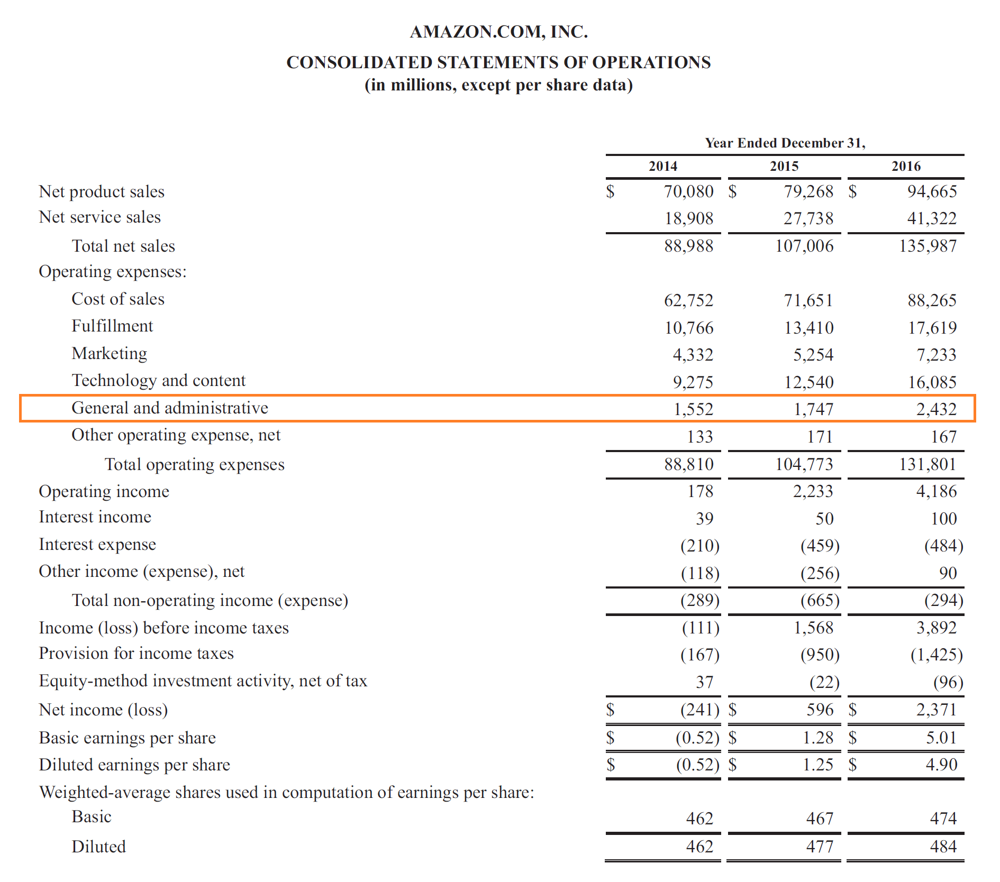

Understanding the financial dynamics of a business is crucial for success. In the rapidly evolving world of algorithmic (algo) trading, this understanding becomes even more critical. Algo trading relies on complex algorithms to make high-speed, high-frequency transactions, where even the minutest inefficiency can lead to substantial financial losses. As such, effectively managing business expenses is essential for firms to maintain a competitive edge and ensure sustainable profitability.

This article explores the intricate components of business expenses, administrative expenses, and SG&A (Selling, General, and Administrative) costs, particularly within the context of algo trading. Business expenses encompass a wide range of costs incurred by firms in their general operations, from direct costs like the cost of goods sold to indirect costs, such as marketing and overhead. Understanding these expenses helps businesses streamline their operations, focus on cost-efficiency, and enhance overall profitability. 



In algo trading, administrative expenses play a crucial role, as they encompass the costs necessary to maintain the technological infrastructure and compliance with regulatory standards that are vital for automated trading systems. The growing complexity and regulatory scrutiny in the financial markets necessitate stringent management of these expenses to ensure operational efficiency and compliance.

Alongside this, SG&A expenses represent a significant portion of a company's operational costs, covering expenses related to selling products and managing the company's overall structures. For algo trading firms, minimizing SG&A expenses without sacrificing performance is a key strategy for boosting financial health and competitive positioning. Efficient management of SG&A can contribute directly to improved profitability by optimizing resource allocation and fostering lean organizational practices.

As this article progresses, it will highlight the importance of SG&A expenses in financial reporting and decision-making processes for algo trading businesses. Understanding the categorization and impact of these expenses equips firms with the necessary insights to make strategic financial decisions and optimize their trading operations.

In summary, as algotrading continues to grow, the need for meticulous financial management becomes abundantly clear. By examining these categories of expenses, business leaders can enhance their strategic financial planning and operational effectiveness, ultimately securing their firms' positions in the competitive landscape of algotrading.

## Table of Contents

## Understanding Business Expenses

Business expenses are vital to any company's operations, representing the costs incurred to generate revenue. These expenses are broadly categorized into direct and indirect costs. Direct costs, such as the Cost of Goods Sold (COGS), are directly tied to the production of goods or services a company offers. Indirect costs, often referred to as overhead, encompass expenses not directly linked to production, including administrative and marketing expenses.

In the context of businesses engaged in algorithmic (algo) trading, understanding and managing these expenses effectively is crucial for maintaining profitability and sustainability. Algo trading involves using automated algorithms to execute trades, which can incur distinct types of business expenses.

**Direct Costs:**
For algo trading firms, direct costs may include the computational resources necessary for running trading algorithms. This can involve expenses related to data acquisition from stock exchanges, which is essential for developing and testing trading models. Additionally, expenses linked to the execution of trades, such as brokerage fees and transaction costs, fall into this category.

**Indirect Costs:**
Indirect costs in algo trading are predominantly associated with overheads necessary to support the trading operations. Key categories include:

1. **Marketing Expenses:** 
   - Marketing strategies are vital for attracting capital and clients. Expenses may include digital marketing campaigns, investor relations activities, and branding efforts.

2. **Rent and Utilities:**
   - These are costs associated with office space and maintaining technological infrastructure. Given the high-tech nature of algo trading, ensuring robust and reliable infrastructure is imperative.

3. **Insurance:**
   - Insurance is essential for mitigating risks associated with operational and technological failures. Coverage can extend to cyber insurance to protect against data breaches and system intrusions.

4. **Technology and Communication:**
   - Continuous updates and maintenance of software and hardware are crucial for competitive algo trading. Expenses also encompass networking and communication systems that ensure real-time data processing and trade execution.

Managing business expenses in algo trading requires strategic allocation of resources to ensure optimal operation of trading algorithms while maintaining cost efficiency. Precise expense tracking and management lead to improved financial health and competitive advantage.

Adopting advanced financial software for tracking and analyzing these expenses can help firms streamline their operations. Automation of expense management through technologies like [machine learning](/wiki/machine-learning) can also predict potential cost savings and areas requiring budget adjustments.

In summary, comprehending the nature of business expenses and effectively managing them are vital for algo trading firms. Efficient expense management not only supports sustainable operations but also enhances profitability by allowing companies to focus resources on innovation and competitive trading strategies.

## Diving into Administrative Expenses

Administrative expenses form a critical component of a company's operating costs, encompassing costs associated with the general administration necessary to run the business effectively. These costs typically include expenditure on human resources (HR) functions, legal fees, office supplies, and utilities, among others. This area of expense management is essential for ensuring the smooth operation of any business, including algo trading firms.

Algorithmic trading, which relies on automated trading systems to execute orders based on pre-set conditions, places specific demands on a firm's administrative framework. For algo trading firms, administrative expenses often encompass costs related to maintaining an advanced technological infrastructure. This includes expenses for high-performance computing systems, data feeds, co-location services — where trading systems are physically positioned close to data exchange centers to reduce latency — and software maintenance. Furthermore, costs associated with cybersecurity measures to protect proprietary trading algorithms and sensitive data from breaches are also categorized as administrative expenses.

Regulatory compliance is a significant component of administrative expenses within the algo trading sector, given the strict regulations governing financial markets. Compliance costs can include expenditures for audit processes, acquiring necessary licenses, engaging external consultants for regulatory guidance, and ensuring that all trading activities adhere to financial regulations like those imposed by the Securities and Exchange Commission (SEC) or the Financial Industry Regulatory Authority (FINRA).

These expenses are crucial not only for the operational viability of algo trading firms but also in safeguarding against regulatory penalties. By effectively managing these administrative costs, firms can maintain operational efficiency and regulatory compliance, which are vital for sustaining their competitive positioning in the highly-regulated financial markets sector.

## Exploring SG&A Expenses

SG&A expenses, encompassing Selling, General, and Administrative costs, play a critical role in a company's financial structure. These expenses are necessary for maintaining and operating various aspects of a business, including the costs involved in the selling process, general business operations, and administrative functions. For algo trading firms, which exist in a highly competitive and rapidly changing environment, managing these expenses efficiently is vital for sustaining profitability and operational effectiveness.

Selling costs, a component of SG&A, typically involve expenses related to the marketing and distribution of a firm's services or products. In algo trading, this might include costs associated with client acquisition, maintaining relationships with investors, and marketing the firm's trading platforms or strategies. General costs encompass a wide range of operational expenses, such as utilities, office rent, and general supplies, which are necessary for the daily functioning of a business. For algo trading firms, general costs also might include expenses related to maintaining critical trading technology and infrastructure.

Administrative costs, another key component, often involve expenses related to the management and oversight of a company. This includes salaries of executive and administrative staff, legal fees, and compliance costs. In the algo trading sector, administrative expenses also cover technology management, data acquisition, and regulatory compliance, all of which are crucial for the secure and efficient operation of automated trading systems.

Efficient management of SG&A expenses is beneficial in achieving cost reduction and improving the company's bottom line. By analyzing and optimizing these expenses, algo trading firms can increase their investment in core activities that directly contribute to income generation, such as developing new trading algorithms or enhancing existing ones. Leveraging technology such as automated reporting tools and cost-tracking software can greatly aid in monitoring and reducing SG&A expenses.

For instance, using Python, businesses can automate data collection and generate reports to track SG&A expenses accurately. Here is a simple example of how such a system might be set up to summarize monthly expenses:

```python
import pandas as pd

# Sample data for costs
data = {'Month': ['January', 'February', 'March'],
        'Selling Costs': [2000, 1800, 2100],
        'General Costs': [3000, 3200, 3100],
        'Administrative Costs': [1500, 1600, 1550]}

# Create DataFrame
df = pd.DataFrame(data)

# Calculate total SG&A expenses for each month
df['Total SG&A'] = df['Selling Costs'] + df['General Costs'] + df['Administrative Costs']

# Display the DataFrame
print(df)
```

This approach not only enhances transparency but also enables firms to identify areas where costs can be cut or managed more efficiently. Understanding the components of SG&A allows algo trading firms to strategically allocate resources, thus ensuring both competitive edge and enhanced operational efficiency in a fast-paced market.

## SG&A Versus Operating Expenses

SG&A (Selling, General, and Administrative) expenses and operating expenses often overlap but serve different roles in a company's financial framework. Operating expenses encompass all costs associated with running a business's day-to-day operations that are not directly involved in the manufacturing of goods or delivery of specific services. This includes a broad range of expenses like rent, utilities, and salaries for non-production staff.

SG&A, on the other hand, is a subset of operating expenses specifically focused on costs that do not fall under the umbrella of production or manufacturing. This includes expenses related to selling products, general administrative duties, and maintaining management infrastructure. Common examples include marketing costs, executive salaries, and office supplies.

The distinction between SG&A and other operating expenses is critical for financial reporting and analysis. Accurate categorization aids businesses in evaluating operational efficiency and identifying areas for cost savings. In [algorithmic trading](/wiki/algorithmic-trading) firms, where SG&A costs may include expenses for technology setup, compliance, and administrative support, precise tracking can be particularly beneficial for optimizing resource allocation and strategic planning.

Maintaining transparency between SG&A and operating expenses is essential for preparing clear financial statements. Financial statements often require that SG&A be reported separately to provide insights into how much a company is spending on activities not directly tied to production. This separation helps in evaluating the financial health of a company and assists stakeholders in making informed decisions.

For algo trading companies, which operate in a data-driven and rapidly changing environment, these distinctions allow for better financial management. They can focus on reducing SG&A costs without compromising on essential operational functions. Efficient management of these expenses supports enhanced profitability and aids in strategic financial planning, ensuring that the firm maintains a competitive edge in the algorithmic trading sector.

## Impact of SG&A on Financial Strategies

SG&A (Selling, General, and Administrative) expenses are a critical component in assessing a company's financial health and operational efficiency. These expenses serve as a measure of a company's ability to control costs while maintaining necessary infrastructure for operations and growth. Effective monitoring and management of SG&A can lead to identifying significant cost-saving opportunities, which is crucial for companies involved in algorithmic trading.

In the domain of algo trading, managing SG&A expenses is crucial for maintaining a competitive edge and optimizing financial performance. The fast-paced and highly competitive nature of algo trading means that firms must strive for efficiency in all aspects of their operations. SG&A expenses, which include costs not directly tied to the production of goods or services, provide a unique opportunity for profit maximization through strategic reduction or reallocation. These expenses cover a range of operational activities, from salaries and office expenses to marketing and utility costs.

Cost management strategies within algorithmic trading often emphasize improving the efficiency of trading algorithms while keeping a streamlined organizational structure. For instance, optimizing algorithm performance can lead to reduced transaction costs and better execution of trades, directly impacting the bottom line. Additionally, investments in technology and infrastructure, while initially classified as SG&A, can result in cost reductions over time through automation and improved operational efficiency.

Furthermore, algorithmic trading firms can employ data analytics to gain insights into SG&A spending patterns and identify areas ripe for cost reduction. Advanced analytics can uncover inefficiencies in resource allocation, allowing firms to implement targeted strategies for trimming excess costs. For example, automating routine administrative tasks can reduce labor costs and allow personnel to focus on more strategic initiatives.

In summary, SG&A expenses play a pivotal role in financial strategy for algorithmic trading firms. By focusing on these expenses, firms can enhance their financial performance, achieving a lean and efficient operational model that supports ongoing innovation and competitiveness in the market. This strategic approach to managing SG&A not only aids in preserving financial health but also fosters an environment conducive to sustained growth and adaptation in the rapidly evolving trading landscape.

## Conclusion

In business, particularly within algorithmic trading, efficient management of business expenses, administrative costs, and SG&A (Selling, General, and Administrative) expenses is essential for achieving sustained success and profitability. By developing a comprehensive understanding of the financial landscape and effectively categorizing expenses, businesses can derive critical insights that enhance both profitability and operational effectiveness.

Managing these financial aspects allows companies to streamline their operations, ensuring that resources are allocated efficiently. This strategic approach not only improves the bottom line but also bolsters the company's ability to adapt to changing market demands and technological advancements, particularly crucial for algo trading firms where technology and speed are paramount.

Effective monitoring and reporting of expenses are indispensable. By employing diligence in financial reporting and meticulous expense management, businesses can fine-tune their strategies to navigate complex trading environments. This requires leveraging data analytics and financial modeling to identify patterns and cost-saving opportunities, enabling firms to maintain a competitive edge while ensuring compliance with stringent financial regulations.

The emphasis on precise financial oversight and disciplined expense categorization is not merely an exercise in accounting; it forms the backbone of a company's strategic framework, underpinning decision-making that drives growth and sustainability. As businesses face increasingly complex financial landscapes, the capacity to manage and optimize expenses remains a decisive [factor](/wiki/factor-investing) in their ability to thrive in competitive markets.

## FAQs

### What are the key differences between SG&A and COGS?

SG&A (Selling, General, and Administrative expenses) and COGS (Cost of Goods Sold) are both critical components of a company's financial statements, but they serve different purposes and are accounted for differently. 

SG&A expenses encompass costs related to selling products and managing operations, including salaries, rent, utilities, and marketing expenses. These expenses are generally indirect costs that are not tied directly to the production of goods or services. They are reflected on the income statement as part of operating expenses and are primarily concerned with maintaining the broader operational and administrative functions of a business.

In contrast, COGS represents the direct costs incurred in producing goods or services sold by a business. This includes the cost of materials, labor, and overhead directly attributed to the production process. COGS is subtracted from revenue to calculate the gross profit of a company.

Understanding the distinction is vital for accurate financial analysis and helps in determining a business's gross margin and operating efficiency. For instance, reducing COGS can directly improve gross profit, whereas decreasing SG&A impacts operating income.

### How can algorithmic trading firms reduce SG&A expenses effectively?

Algorithmic trading firms can implement several strategies to reduce SG&A expenses and enhance profitability. Given the technology-driven nature of such firms, one of the most effective methods is optimizing technological infrastructure. This includes investing in cost-effective, high-performance computing resources and leveraging cloud-based solutions to reduce maintenance and upgrade costs.

Streamlining personnel by automating repetitive tasks can also reduce labor costs. By employing advanced algorithms and machine learning, firms can achieve higher efficiency with minimal human intervention. Additionally, renegotiating contracts for software licenses, employing open-source tools, and reducing unnecessary marketing expenditures can contribute to lowering SG&A expenses.

### Why is it essential to separate selling, general, and administrative expenses from other operating costs?

Separating selling, general, and administrative (SG&A) expenses from other operating costs is crucial for financial clarity and strategic decision-making. This segregation allows businesses to accurately track and manage the expenses associated with running day-to-day operations without conflating them with production costs.

This distinction aids in analyzing cost structures, improving budgeting accuracy, and implementing targeted cost-reduction strategies. By isolating SG&A, companies gain insights into their spending on necessities such as marketing campaigns, salaries, and administrative overheads, enabling them to make informed decisions to optimize operational efficiency.

### What role do SG&A expenses play in financial reporting and decision-making?

SG&A expenses are integral to financial reporting as they directly impact a company's profitability and operational efficiency. They are part of operating expenses on the income statement and are deducted from gross profit to calculate operating income.

Understanding and managing SG&A expenses is crucial for decision-making, as they can significantly influence a company's bottom line. By monitoring these costs, businesses can identify trends, areas for improvement, and potential cost-saving measures. This, in turn, assists in strategic planning, setting realistic financial targets, and ensuring sustainable growth. Proper management of SG&A expenses also enhances investor confidence by demonstrating a company's commitment to maintaining fiscal discipline and operational effectiveness.

## References & Further Reading

[1]: Bergstra, J., Bardenet, R., Bengio, Y., & Kégl, B. (2011). ["Algorithms for Hyper-Parameter Optimization."](https://dl.acm.org/doi/10.5555/2986459.2986743) Advances in Neural Information Processing Systems 24.

[2]: ["Advances in Financial Machine Learning"](https://www.amazon.com/Advances-Financial-Machine-Learning-Marcos/dp/1119482089) by Marcos Lopez de Prado

[3]: ["Evidence-Based Technical Analysis: Applying the Scientific Method and Statistical Inference to Trading Signals"](https://www.semanticscholar.org/paper/Evidence-Based-Technical-Analysis%3A-Applying-the-and-Aronson/3b33df8737f1772e9e14d66a08c9696f140a2ee1) by David Aronson

[4]: ["Machine Learning for Algorithmic Trading"](https://github.com/PacktPublishing/Machine-Learning-for-Algorithmic-Trading-Second-Edition) by Stefan Jansen

[5]: ["Quantitative Trading: How to Build Your Own Algorithmic Trading Business"](https://books.google.com/books/about/Quantitative_Trading.html?id=j70yEAAAQBAJ) by Ernest P. Chan