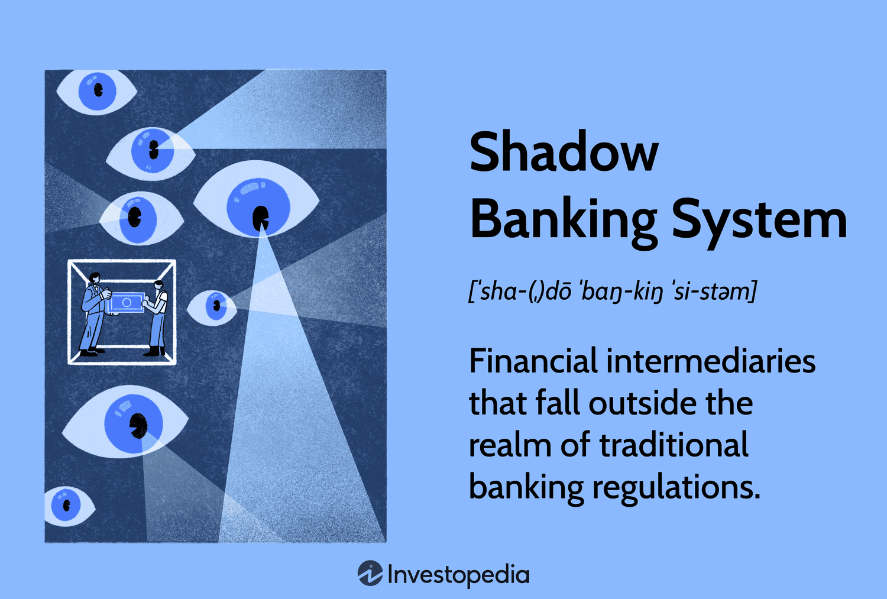

The financial world is multifaceted and complex, with various entities participating in the creation, movement, and regulation of money. At the heart of this intricate system lies the shadow banking system, an influential yet often misunderstood component. Shadow banking encompasses financial activities that mimic traditional banking but occur outside the purview of conventional regulations. This sector includes players like hedge funds, mortgage lenders, and investment firms, which facilitate credit creation beyond the strict oversight imposed on traditional banks.

Understanding the shadow banking system is crucial for analyzing the nuances of global financial dynamics. This system has shown its capacity for immense influence, particularly as demonstrated in the events leading up to and during the 2008 financial crisis. While shadow banking provides much-needed liquidity and credit, supporting economic growth, it simultaneously poses significant risks to financial stability due to its lack of regulation and transparency. This dual nature makes shadow banking a vital area of study within the financial industry. 



This article will explore the concept of shadow banking, examining its role within the broader financial system and its connections to contemporary practices like algorithmic trading. By analyzing real-world examples, the article will highlight how shadow banking entities contribute to, and sometimes challenge, financial stability. This understanding is pivotal for anyone looking to navigate and comprehend the complexities of modern finance.

## Table of Contents

## Understanding the Shadow Banking System

Shadow banking encompasses financial activities akin to traditional banking but operates outside the regulated banking sector. These activities include credit intermediation and liquidity transformation conducted by non-bank entities, such as hedge funds, mortgage lenders, and investment firms. These shadow banks facilitate credit creation without the need to comply with the rigorous oversight and capital requirements that traditional banks face. This lack of regulation allows for greater flexibility and innovation in financial services.

Key players in the shadow banking system, such as hedge funds and investment firms, act as intermediaries by pooling funds from investors and allocating capital in various financial products. Mortgage lenders contribute by offering loans and mortgages without adhering to the stringent regulatory frameworks imposed on traditional banks, thus providing an alternative source of credit for borrowers who might be underserved by the conventional banking sector.

The role of shadow banks in the expansion of credit came into sharp focus during the lead-up to the 2008 financial crisis. Shadow banking entities significantly contributed to the growth of credit by engaging in practices like securitization and repo transactions. These activities provided additional liquidity to the financial markets, but they also increased the interconnectedness and complexity of the global financial system, amplifying systemic risks. The crisis highlighted how the shadow banking system, when left unchecked, could exacerbate financial instability.

Despite the potential risks, shadow banking plays a crucial role in the modern financial landscape by providing essential [liquidity](/wiki/liquidity-risk-premium) and credit. These entities fill gaps left by regulated banks, facilitating economic growth by offering the flexibility and innovation needed to meet diverse credit demands. However, the absence of regulation also poses systemic risks, as shadow banking entities might engage in riskier practices without adequate oversight, potentially leading to financial disruptions. Balancing the benefits of credit provision and innovation with the need to mitigate systemic risks remains a significant challenge for policymakers and regulators.

## Examples of Shadow Banking Entities

Shadow banks encompass a diverse range of entities that operate outside the traditional banking framework, taking advantage of fewer regulatory constraints. These entities play a crucial role in credit creation and financial intermediation, despite the risks associated with limited oversight. Key examples of shadow banking entities include hedge funds, private equity funds, money market funds, and mortgage lenders.

Hedge funds are investment funds that employ sophisticated strategies and financial instruments to achieve high returns. They are often characterized by their broad array of investment activities, including [arbitrage](/wiki/arbitrage), derivatives trading, and leveraged positions, which allow them to exploit market inefficiencies. Unlike traditional banks, hedge funds are typically subject to minimal regulation, enabling them to pursue riskier investments for potentially higher gains.

Private equity funds focus on investing in companies that are not publicly listed, aiming to increase their value through restructuring, operational improvements, or strategic management changes. These funds seek significant returns by eventually selling these restructured firms or taking them public. As with hedge funds, private equity funds experience fewer regulatory constraints, allowing them to invest with greater flexibility and risk.

Money market funds are investment vehicles that offer short-term borrowing and lending, typically providing higher yields than traditional savings accounts. These funds invest in highly liquid, short-term instruments such as Treasury bills, commercial paper, and certificates of deposit. Money market funds form a substantial component of the shadow banking system because they facilitate liquidity in financial markets, offering investors a safe place to park funds temporarily while [earning](/wiki/earning-announcement) returns.

Mortgage lenders within the shadow banking system provide loans without adhering to the stringent regulatory requirements that conventional banks must follow. They often engage in securitization, packaging mortgage loans into securities that can be sold to investors. This practice was notably prevalent leading up to the 2008 financial crisis, illustrating how these lenders can significantly impact financial stability when risks are not adequately managed.

Each of these entities contributes to the shadow banking system's capacity to fulfill credit demands unmet by the traditional banking sector, albeit with potential implications for systemic risk.

## Algorithmic Trading in the Shadow Banking System

Algorithmic trading, a key facet of modern financial markets, utilizes sophisticated computational algorithms to expedite trading processes and execute orders at high speeds. This approach to trading is particularly prevalent within the shadow banking sector, where it aims to optimize returns on investment by swiftly adjusting to market dynamics. Unlike traditional banking entities, shadow banks operate with fewer regulatory constraints, allowing them to capitalize on technological innovations such as [algorithmic trading](/wiki/algorithmic-trading) more rapidly.

The integration of algorithmic trading in shadow banking enables these entities to react to market signals almost instantaneously. This advantage allows them to exploit market inefficiencies and fluctuations to maximize profits. However, this capability also brings about significant challenges. The rapidity at which transactions occur in algorithmic trading can enhance market efficiency by narrowing bid-ask spreads and increasing liquidity. Yet, the same speed and frequency of transactions can also introduce heightened market [volatility](/wiki/volatility-trading-strategies) and systemic risk.

One core aspect of algorithmic trading is its reliance on quantitative models and automated decision-making processes. These algorithms analyze vast amounts of market data to identify patterns and execute trades without human intervention. For example, a simplistic algorithm might involve a condition-based execution strategy, such as:

```python
def trade_decision(market_data):
    if market_data['price'] > market_data['moving_average']:
        execute_buy_order()
    elif market_data['price'] < market_data['moving_average']:
        execute_sell_order()

def execute_buy_order():
    # Code to execute a buy order
    pass

def execute_sell_order():
    # Code to execute a sell order
    pass
```

While the above example is a basic version of an algorithm, actual trading algorithms are highly complex and [factor](/wiki/factor-investing) in numerous variables, including historical price patterns, trading volumes, and even sentiment analysis derived from news and social media.

Shadow banks' freedom from stringent regulations permits them to optimize algorithmic trading strategies to a degree that traditional banks often cannot. However, this unregulated environment means that shadow banks might also adopt aggressive trading strategies that could increase market instability. The high-frequency nature of these trades can lead to events like the "flash crash," where rapid sell-offs trigger significant price declines in a matter of minutes.

The dual impact of algorithmic trading — facilitating efficient market functioning while potentially elevating volatility — underscores the complex role it plays within the shadow banking system. Balancing the benefits of speed and innovation against the need for market stability remains an ongoing challenge in the intersection of shadow banking and technological advancement.

## Risks and Implications of Shadow Banking

Shadow banking encompasses financial activities that operate outside the traditional banking regulations, resulting in a unique set of risks and implications for the financial system. One of the primary concerns is the lack of regulatory oversight that allows shadow banks to function without the stringent capital requirements imposed on traditional banking institutions. This absence of regulation can create vulnerabilities, particularly as shadow banks become increasingly interconnected with mainstream financial entities. 

This interconnectedness poses the risk of systemic shocks being transmitted across the financial system, potentially destabilizing traditional banks and the broader economy. In situations where shadow banks face liquidity crunches or default risks, these pressures can quickly spread, highlighting the systemic risk they introduce. The 2008 financial crisis serves as a poignant example, where the collapse of key shadow banking components precipitated widespread financial instability.

Moreover, shadow banks often employ complex financial instruments, including derivatives and asset-backed securities, which can obscure the true nature of their risk exposure. Without adequate monitoring and transparency, these complexities can exacerbate financial crises, as demonstrated in 2008, when the opacity of mortgage-backed securities contributed significantly to the crisis's severity.

Despite these risks, shadow banks play a crucial role in fulfilling credit demands that traditional banks might be unable or unwilling to meet. Their flexibility and innovation are necessary for providing liquidity and supporting economic growth. However, balancing these benefits with the need to mitigate systemic risks remains a significant challenge for financial regulators. 

While regulatory frameworks continue developing to address these concerns, the dynamic nature of shadow banking necessitates a vigilant and adaptive approach to ensuring financial stability without stifling economic innovation.

## Regulatory Considerations and Future Outlook

The shadow banking system operates largely outside traditional regulatory frameworks, prompting significant discussion about its oversight. The debate focuses on the necessity for regulatory reform to mitigate systemic risks inherent within this sector. Proponents of increased regulation argue that the absence of stringent oversight can lead to vulnerabilities, as evidenced by the 2008 financial crisis. An increased regulatory framework could help manage these risks while maintaining the system's ability to provide alternative credit sources.

Future considerations suggest a shift towards increased regulation, particularly regarding the financial products offered by shadow banks. Regulatory bodies worldwide are considering measures to enhance transparency and accountability of shadow banking entities. These measures aim to ensure that shadow banks adhere to more rigorous standards similar to those imposed on traditional banks, especially in terms of capital requirements and risk assessment procedures.

A central challenge for regulators is balancing the benefits of shadow banking—such as innovation and credit supply augmentation—with the necessity of safeguarding the financial system. Shadow banks play a pivotal role in facilitating credit flows and liquidity, which are essential for economic growth. Thus, any regulatory framework needs to consider these factors to prevent stifling innovation and economic contributions made by shadow banks.

Moreover, the role of technology in shadow banking is a double-edged sword. Algorithmic trading, for instance, provides shadow banks with the ability to execute trades rapidly and efficiently. However, the speed and complexity of these operations pose challenges for existing regulatory mechanisms. Regulators are continuously working to adapt to these technological advancements, ensuring that they do not amplify systemic risks.

In summary, while the shadow banking system is crucial for modern financial ecosystems, its regulation remains a contentious issue. The future likely holds increased regulatory measures aimed at ensuring stability without hindering the positive contributions shadow banks can provide. The interplay between technology, innovation, and regulation will remain central to shaping the future landscape of shadow banking.

## Conclusion

Shadow banking, often perceived as risky due to its lack of regulation, is an integral part of the financial ecosystem. With entities such as hedge funds and private equity firms operating in these markets, shadow banks play a crucial role in providing much-needed liquidity and fostering financial innovation. Advanced trading technologies, including algorithmic trading, contribute to these institutions' ability to efficiently allocate capital and maximize returns.

These entities often operate outside the rigid regulatory frameworks that bind traditional banks, which allows them to maneuver swiftly and with greater flexibility. This adaptability is particularly beneficial for meeting the dynamic credit demands that conventional banks may not always adequately fulfill. Consequently, shadow banking serves as a complementary force within the broader financial system, supporting economic expansion.

Balancing regulation is key to allowing shadow banking to continue its economic contributions without compromising financial stability. While the lack of stringent oversight can introduce systemic risks, a well-considered regulatory approach can mitigate these dangers. Regulators must strive to create policies that protect the financial system while preserving the innovative capacity of shadow banks. 

Understanding shadow banking is essential for navigating the complexities of modern finance. As global markets evolve and the financial landscape becomes increasingly sophisticated, grasping the mechanisms and implications of shadow banking prepares individuals and institutions for future challenges. By acknowledging its risks and potential, stakeholders can craft strategies that harness the benefits of shadow banking while guarding against its pitfalls.

## References & Further Reading

[1]: Adrian, T., & Ashcraft, A. B. (2012). ["Shadow banking: A review of the literature."](https://www.newyorkfed.org/medialibrary/media/research/staff_reports/sr580.pdf) National Bureau of Economic Research.

[2]: Pozsar, Z., Adrian, T., Ashcraft, A., & Boesky, H. (2013). ["Shadow Banking."](https://www.newyorkfed.org/medialibrary/media/research/staff_reports/sr458.pdf) Federal Reserve Bank of New York Economic Policy Review.

[3]: Gorton, G. B., & Metrick, A. (2012). ["Securitized banking and the run on repo."](https://www.sciencedirect.com/science/article/pii/S0304405X1100081X) Journal of Financial Economics.

[4]: "Algorithmic Trading and DMA: An Introduction to Direct Access Trading Strategies" by Barry Johnson.

[5]: Financial Stability Board. (2013). ["Global Shadow Banking Monitoring Report 2013."](https://www.fsb.org/2013/11/r_131114/)

[6]: "High-Frequency Trading: A Practical Guide to Algorithmic Strategies and Trading Systems" by Irene Aldridge.