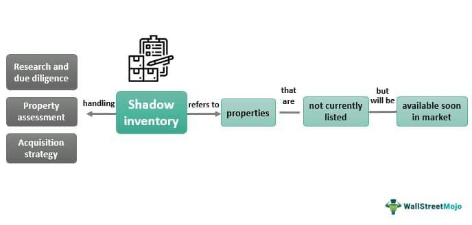

The evolving interaction between real estate, shadow inventory, and algorithmic trading represents a pivotal area of interest in contemporary financial markets. Shadow inventory, which comprises foreclosed and unsold properties, holds considerable influence over the housing market's supply dynamics and pricing stability. By staying obscured from the formal listings, these inventories can unexpectedly alter the balance between supply and demand, thereby impacting property valuations and market recovery efforts during economic fluctuations.

Advancements in algorithmic trading have begun to play a transformative role in real estate investments. These sophisticated algorithms utilize complex mathematical models and vast datasets to predict market trends, optimize buying strategies, and enhance investment decisions. By deploying algorithmic trading techniques in real estate, investors can reap benefits such as improved accuracy in forecasting and increased speed in executing transactions.



The synergy between shadow inventory and algorithmic trading is a fascinating prospect for market analysts and investors. Algorithms have the capacity to detect opportunities hidden within the layers of shadow inventory, potentially offering new investment avenues. As these technologies evolve, their integration could signify significant shifts in market analysis, strategic planning, and investment methodologies in the housing sector. Understanding these mechanisms is crucial for stakeholders aiming to navigate and capitalize on future market landscapes influenced by technological progress.

## Table of Contents

## What is Shadow Inventory?

Shadow inventory refers to properties that are foreclosed or otherwise unsold and are not yet listed on the market. This clandestine segment of the real estate market consists primarily of properties that are in foreclosure, bank-owned properties, or homes that are delinquent but not yet actively listed for sale. The existence of shadow inventory is often tied to strategic market timing where property owners or financial institutions delay the sale of these assets to avoid flooding the market and potentially depressing prices.

The reasons behind the existence of shadow inventory are multifaceted. Market strategies play a significant role; by controlling the inflow of properties onto the market, real estate stakeholders aim to stabilize or elevate property values. Economic conditions also influence shadow inventory levels. During periods of economic downturn, such as the subprime mortgage crisis of 2007-2008, many homeowners defaulted on their mortgages, creating a backlog of foreclosed properties. Financial institutions, wary of causing further declines in property prices, may choose to hold these properties rather than release them into an already weakened market.

The impact of shadow inventory on real estate supply is significant. A high level of shadow inventory can imply a future increase in supply, which might lead to a decrease in housing prices as these properties are eventually released onto the market. This phenomenon can result in prolonged price instability, as potential buyers may anticipate price drops, leading to reduced demand in the short-term market.

In mathematical terms, the effect of introducing shadow inventory into the market could be analyzed using supply and demand equations. Let $D(p)$ represent the demand function and $S(p)$ represent the supply function, where $p$ is the price of housing. The presence of shadow inventory can cause an outward shift in the supply curve $S(p)$, potentially lowering prices if demand remains constant, i.e., $p$ decreases as $S(p)$ increases beyond $D(p)$.

To further illustrate, consider a Python script that simulates the effect of releasing shadow inventory on house prices:

```python
import numpy as np
import matplotlib.pyplot as plt

def demand_price(quantity):
    return 300000 - 1000 * quantity

def supply_price(quantity, shadow_inventory):
    return (200000 + 1000 * quantity + shadow_inventory * 500)

quantities = np.linspace(0, 100, 100)
demand = demand_price(quantities)
supply_no_shadow = supply_price(quantities, 0)
supply_with_shadow = supply_price(quantities, 20)

plt.plot(quantities, demand, label='Demand')
plt.plot(quantities, supply_no_shadow, label='Supply (No Shadow)')
plt.plot(quantities, supply_with_shadow, label='Supply (With Shadow)')
plt.xlabel('Quantity of Houses')
plt.ylabel('Price ($)')
plt.title('Impact of Shadow Inventory on Housing Price')
plt.legend()
plt.show()
```

In the provided model, an influx of shadow inventory shifts the supply curve rightward, often leading to a lower equilibrium price in the housing market. Understanding the dynamics of shadow inventory is crucial for stakeholders seeking to navigate the complexities of real estate investment and market analysis.

## The Impact of Shadow Inventory on the Housing Market

Shadow inventory, comprising foreclosed, bank-owned, and other off-market properties, plays a critical role in shaping housing market dynamics. It often serves as a hidden layer of housing supply that, when released or accounted for, can significantly alter market conditions.

During economic downturns, shadow inventory typically swells due to increased foreclosures and prolonged market uncertainties. Homeowners unable to meet mortgage obligations contribute to the accumulation of shadow inventory, which banks often withhold from the market to avoid depressing prices further. This withholding can, in turn, create a backlog of properties that delays the market's recovery by restricting available supply.

In contrast, during economic recoveries, a gradual reduction in shadow inventory can signal improving market health. As the economy stabilizes, banks and institutions may begin releasing these homes back into the market, contributing to a more balanced supply and providing upward [momentum](/wiki/momentum) for prices. However, a sudden influx of shadow inventory can also overwhelm the market, potentially stalling recovery or depressing prices.

The impact of shadow inventory is evident in past financial crises. For instance, during the 2008 financial downturn, the U.S. housing market experienced an unprecedented spike in shadow inventory. In 2010, estimates suggested there were over 2 million homes in shadow inventory, exacerbated by foreclosures and distressed sales [CoreLogic, 2011]. These inventories loomed large over the market, creating uncertainty and delaying recovery efforts as the eventual absorption of these properties became a critical challenge.

As shadow inventory begins to recede during a market recovery, it can help moderate rapid price appreciations and provide stability. However, lenders and investors must carefully manage this balance to avoid destabilizing the market with abrupt changes in supply.

In conclusion, shadow inventory significantly influences housing markets by moderating supply levels and price stability, both in economic downturns and recoveries. This dynamic element requires careful monitoring and strategic management to mitigate adverse impacts on the housing sector.

## Algorithmic Trading in Real Estate

Algorithmic trading refers to the use of computer algorithms to automatically execute trading decisions in financial markets, optimizing the process by setting predefined rules to determine the timing, price, or quantity of orders. This technique, widely utilized in traditional financial markets, has begun to influence real estate investments by enabling investors to make data-driven decisions in a sector traditionally governed by intuition and experience.

In the real estate market, algorithms can parse vast datasets related to property values, market trends, and economic indicators to predict market movements. By analyzing historical data and recognizing patterns, algorithms attempt to forecast price fluctuations, identify lucrative investment opportunities, and optimize buying strategies. A simple example of such an algorithm might use linear regression to predict future prices based on historical trends:

```python
import numpy as np
from sklearn.linear_model import LinearRegression

# Example data: years since base year and corresponding average real estate prices
years = np.array([0, 1, 2, 3, 4]).reshape(-1, 1)
prices = np.array([200000, 210000, 220000, 230000, 240000])

# Creating and training the model
model = LinearRegression()
model.fit(years, prices)

# Predicting future prices
future_years = np.array([5, 6]).reshape(-1, 1)
predicted_prices = model.predict(future_years)
```

Benefits of incorporating [algorithmic trading](/wiki/algorithmic-trading) into real estate include the potential for increased efficiency and reduced transaction costs. Algorithms execute trades faster than humans, which is crucial in markets where timing is of the essence. They also reduce the emotional bias often present in human decision-making, leading to more rational investment decisions. Furthermore, algorithms can continuously monitor market conditions and adjust strategies accordingly, enabling dynamic responses to market changes.

However, the use of algorithms in real estate trading is not without risks. One significant concern is model risk; if an algorithm is based on flawed assumptions or inaccurate data, it could make poor investment decisions, leading to substantial losses. Additionally, the real estate market's lower [liquidity](/wiki/liquidity-risk-premium) compared to stock markets may pose challenges, as algorithmic programs may struggle to execute larger trades without influencing market prices. Furthermore, there are inherent risks of technological failures or security breaches, which could compromise trading activities.

In conclusion, while algorithmic trading presents opportunities for enhanced precision and strategy in real estate investments, it also requires careful management of associated risks, technical aptitude, and a deep understanding of market dynamics to ensure its successful application.

## The Interplay Between Shadow Inventory and Algorithmic Trading

The integration of algorithmic trading within real estate has opened new avenues for identifying opportunities hidden within shadow inventory. Shadow inventory, consisting of unlisted foreclosed and unsold properties, represents a latent supply within the housing market. By deploying sophisticated algorithms, investors can navigate this obscured segment more effectively, capitalizing on trends and anomalies that might elude traditional analysis.

Algorithms have the potential to detect opportunities within shadow inventory by analyzing vast datasets encompassing foreclosure records, unsold home listings, market trends, and economic indicators. Machine learning techniques, such as supervised learning models, can be trained to recognize patterns and predict future inventory dynamics. For instance, by inputting data on foreclosure rates, housing starts, and sales patterns, these algorithms can forecast potential releases of shadow inventory and determine optimal times for acquisition.

Real estate algorithmic strategies are inherently adaptive, allowing them to evolve with changing shadow inventory levels. Such strategies can incorporate real-time data to dynamically adjust investment approaches, taking advantage of sudden shifts, such as an unexpected influx of foreclosures during economic downturns. Algorithms can also segment the market into micro-level components, leading to tailored investment strategies that focus on specific regions or property types within the shadow inventory spectrum.

The future prospects of integrating algorithmic trading technologies within real estate market analysis and investment decisions are promising. As algorithmic models become more refined and incorporate increasingly diverse sets of data—ranging from economic indicators to consumer sentiment—investors will be able to generate insights that are both granular and comprehensive. These insights will not only enhance decision-making but also facilitate more efficient market operations.

To illustrate the potential for algorithmic involvement, consider a hypothetical Python implementation for predicting shadow inventory releases. This can be achieved by leveraging [machine learning](/wiki/machine-learning) libraries like scikit-learn for developing predictive models:

```python
from sklearn.ensemble import RandomForestRegressor
import numpy as np
import pandas as pd

# Load data into a DataFrame
data = pd.read_csv('housing_market_data.csv')

# Feature selection and engineering
features = data[['foreclosure_rate', 'housing_starts', 'unsold_listings', 'economic_indicators']]
target = data['shadow_inventory_level']

# Split dataset into training and testing sets
train_features, test_features, train_target, test_target = train_test_split(features, target, test_size=0.2, random_state=42)

# Initialize the algorithm
model = RandomForestRegressor(n_estimators=100, random_state=42)

# Train the model
model.fit(train_features, train_target)

# Make predictions
predictions = model.predict(test_features)

# Evaluate model accuracy
accuracy = model.score(test_features, test_target)
print("Model Accuracy:", accuracy)
```

This basic framework can be expanded with more advanced techniques such as neural networks for deeper insights. As data availability continues to expand and computational power increases, algorithmic trading strategies will become even more integral to harnessing the potential of shadow inventory, driving more informed and strategic real estate investments.

## Case Studies and Examples

## Case Studies and Examples

Real-world examples of investor strategies involving shadow inventory often highlight the delicate balance between risk management and opportunity identification. One notable example is the strategy adopted by several real estate investment trusts (REITs) during the aftermath of the 2008 financial crisis. Following the crisis, a significant amount of shadow inventory accumulated due to foreclosures and unsold properties. REITs and private equity firms capitalized on this opportunity by purchasing properties at reduced prices, anticipating their eventual reintegration into the market as economic conditions improved. This allowed investors to acquire assets below market value, which subsequently increased in worth as the housing market recovered.

In terms of algorithmic trading, a successful implementation can be seen in the predictive modeling used by companies like Zillow and Redfin. These companies employ algorithms to analyze vast datasets, such as historical housing prices, neighborhood demographics, and economic indicators, to forecast real estate market trends and identify optimal buying opportunities. By leveraging machine learning models, these algorithms constantly refine their predictions, enhancing accuracy over time. This data-driven approach enables investors to make informed decisions based on probable future scenarios, rather than solely relying on historical data.

A case study illustrating algorithmic trading's effectiveness in the real estate market involved the use of machine learning by a [hedge fund](/wiki/hedge-fund-trading-strategies) specializing in property investments. The fund developed an algorithm that identified undervalued properties likely to appreciate in the near future by analyzing variables such as macroeconomic trends, local employment rates, and interest rates. By systematically applying this strategy, the fund was able to achieve a higher return on investment compared to traditional investment methods, thereby demonstrating the potential of integrating algorithmic trading into real estate.

Analyzing the outcomes from these case studies reveals several key insights. First, shadow inventory presents both a challenge and an opportunity for investors. While it can suppress price growth temporarily, it also provides a resource to acquire properties at favorable prices. Second, algorithmic trading introduces a level of precision and sophistication to real estate investments that can outperform traditional approaches when supported by accurate data and robust models.

The strategic use of algorithms can enhance decision-making, but it requires continuous data updates and algorithm refinements to remain effective. These examples underscore the importance of embracing technology and data analytics in modern real estate investment strategies, suggesting that those who adopt such methods may gain a competitive advantage in a rapidly evolving market.

## Conclusion

The intricate relationship between shadow inventory and algorithmic trading significantly impacts the housing market. Shadow inventory, which includes foreclosed and unsold properties, represents a latent supply of homes that can influence market conditions. Its presence can stabilize or destabilize real estate prices, depending on economic scenarios. Algorithmic trading, driven by advancements in technology, offers innovative solutions for navigating this complex landscape. Algorithms can effectively analyze market data, predict trends, and optimize investment strategies, thus identifying opportunities within shadow inventory.

As technology continues to advance, the housing market is likely to see increased integration of algorithms in real estate investments. This integration promises a future where market analysis becomes more precise and investment decisions more efficient. However, with these advancements come challenges, such as ensuring that algorithms are adaptable and can manage the uncertainties inherent in shadow inventory fluctuations.

To leverage the full potential of these technological innovations, it is crucial for investors and market analysts to continually explore and develop innovative strategies. This exploration will not only enhance investment returns but also contribute to a more stable housing market. By embracing technology and adapting to changing market dynamics, the real estate industry can look forward to a future marked by improved efficiency and greater resilience.

## References & Further Reading

[1]: Gyourko, J., & Tracy, J. (2014). ["Reconciling theory and empirics on the role of 'shadow inventories' in the housing market."](https://www.sciencedirect.com/science/article/pii/S0094119013000831) Real Estate Economics.

[2]: CoreLogic (2011). ["CoreLogic Reports Shadow Inventory at 1.8 Million in April 2011."](https://www.calculatedriskblog.com/2011/03/corelogic-shadow-inventory-declines.html)

[3]: Lo, A. W., & Hasanhodzic, J. (2010). ["The Evolution of Technical Analysis: Financial Prediction from Babylonian Tablets to Bloomberg Terminals."](https://archive.org/details/evolutionoftechn0000loan) Wiley.

[4]: Marcos Lopez de Prado. (2018). ["Advances in Financial Machine Learning."](https://www.amazon.com/Advances-Financial-Machine-Learning-Marcos/dp/1119482089) Wiley.

[5]: Chan, E. P. (2009). ["Quantitative Trading: How to Build Your Own Algorithmic Trading Business."](https://github.com/ftvision/quant_trading_echan_book) Wiley.

[6]: Fabozzi, F. J., Kolm, P. N., Pachamanova, D. A., & Focardi, S. M. (2007). ["Robust Portfolio Optimization and Management."](https://onlinelibrary.wiley.com/doi/book/10.1002/9781119202172) Wiley Finance.

[7]: Zillow Research (2021). ["The Impact of Foreclosures on the Housing Market and 'Shadow Inventory'."](https://www.zillow.com/research/forbearance-exits-inventory-2021-29931/) Zillow.