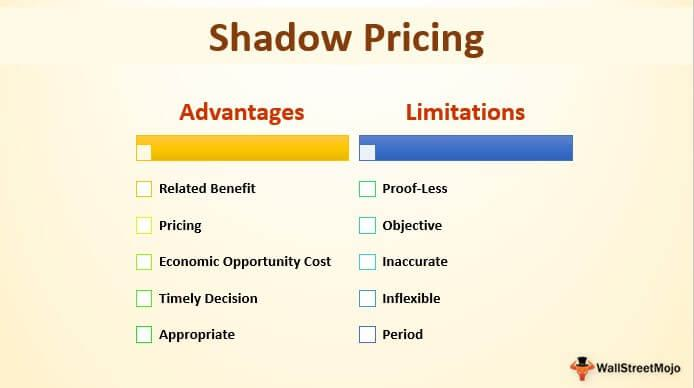

In today's complex economic landscape, shadow markets present both challenges and opportunities. These markets, characterized by their unregulated and often opaque nature, function outside the boundaries of traditional financial systems. They have evolved significantly, becoming integral to the global economy while simultaneously raising concerns related to transparency, legality, and risk.

Shadow markets provide alternative avenues for trading, often spurred by the limitations within conventional markets. These markets are appealing to certain investors due to the potential for high returns and innovative financial products that may not be available elsewhere. As such, understanding their dynamics is essential for a comprehensive grasp of modern economic systems.

Algorithmic trading plays a pivotal role in shadow markets, offering advantages such as speed and precision in executing trades. This approach leverages advanced algorithms to react to market conditions in real-time, facilitating numerous transactions with minimal human intervention. Despite these benefits, algorithmic trading within shadow markets can exacerbate market volatility and complicate regulatory oversight.

Given the expansive role of shadow markets, economic strategists, policymakers, and investors must develop a nuanced understanding of their mechanisms. This knowledge is crucial for navigating the economic environment effectively and for formulating strategies that account for both the opportunities and the risks these markets present. As shadow markets continue to evolve, their impact on global economies will likely grow, necessitating ongoing analysis and adaptive regulatory frameworks.

## Table of Contents

## Understanding Shadow Markets

Shadow markets, often referred to as informal or underground markets, function with scant regulatory oversight, creating alternative platforms for trading that are not bound by the conventional rules governing formal markets. This lack of regulation provides a discreet environment for transactions, enabling participants to engage in economic activities that might be constrained or prohibited within traditional market frameworks. 

The fundamental characteristic of shadow markets is their opacity. Unlike formal markets, where transparency is a cornerstone, shadow markets offer little visibility into their operations. This lack of transparency can make them both appealing and risky. On the one hand, they provide avenues for financial activities and transactions, especially in environments where regulatory or institutional constraints hinder market operations. On the other hand, the absence of transparency can lead to issues such as price manipulation, fraud, and a general lack of trust among market participants.

Despite these challenges, shadow markets can serve as financial lifelines in situations where traditional systems fall short. In contexts where regulatory frameworks are overly restrictive or where financial infrastructure is underdeveloped, shadow markets fill gaps by offering credit, [liquidity](/wiki/liquidity-risk-premium), and investment opportunities that would otherwise be unavailable. This function is especially vital in many developing regions where formal financial systems are less accessible. 

However, the existence and persistence of shadow markets underscore the need for a flexible regulatory approach. Excessive regulation can stifle the innovative potential of financial markets, while too little can invite misuse and instability. Therefore, finding a regulatory balance that accommodates the unique characteristics of shadow markets while safeguarding economic integrity is crucial. This balance can ensure that shadow markets complement rather than compete with formal economic structures, providing both a haven and a spur for economic activities that drive innovation and inclusivity in the global economy.

## Economic Systems and Market Dynamics

Shadow markets are inherently shaped by the diverse economic systems in which they operate. These markets exist alongside legal, regulated markets, creating a parallel economy that can influence broader market dynamics, including pricing, supply, and demand.

**Interaction with Legal Markets:**

Shadow markets interact with formal markets in complex ways, often reflecting or responding to inefficiencies or gaps within these legal systems. For instance, in economies with restrictive or cumbersome regulations, shadow markets may arise as a means to bypass red tape, providing quicker or more accessible trading options. This interaction can lead to price adjustments in regulated markets when shadow market activities alter supply levels or consumer demand. For example, luxury goods that face high tariffs might find parallel distribution in shadow markets at reduced prices, adjusting consumer expectations and eventually influencing the pricing strategies of orthodox distributors.

**Influence on Pricing and Demand:**

The pricing within shadow markets can be more volatile due to their largely unregulated nature and the lack of standardized pricing mechanisms. These markets might set prices based on immediate supply and demand rather than long-term forecasting, differing from traditional market practices where pricing often considers regulatory input and stabilization policies. The dynamics of these markets can trigger shifts in consumer behavior and preferences, sometimes leading traditional markets to adapt by either offering competitive pricing or innovating in service delivery to retain clientele.

**Innovation and Trade Practices:**

The less formal structure of shadow markets can foster innovation, particularly in trade practices and transaction modalities. Without the constraints of rigorous compliance requirements, shadow markets can experiment with novel business models that might later be adopted by legal markets. For instance, shadow markets have been known to integrate advanced digital payment systems or blockchain transactions more swiftly than their regulated counterparts, leading to progressive shifts in how traditional markets perceive and implement technology. Additionally, these markets often develop unique distribution channels that challenge conventional logistical strategies, prompting traditional markets to rethink efficiency in product delivery.

Overall, shadow markets serve as a reflection of both the limitations and opportunities presented by existing economic systems. They highlight the necessity for formal markets to continuously adapt and innovate in response to real-time economic interactions and consumer behavior shifts. Balancing this dynamic relationship requires regulatory foresight and a flexible economic approach to harness potential benefits while ensuring market stability and fairness.

## Algorithmic Trading in Shadow Markets

Algorithmic trading in shadow markets is becoming increasingly prevalent, enabling rapid and efficient transaction execution. This trading approach utilizes sophisticated algorithms designed to assess market conditions and determine the most advantageous times for executing trades. These algorithms analyze extensive datasets, incorporating financial metrics, historical data, and real-time market information to make informed trading decisions. The primary goal of [algorithmic trading](/wiki/algorithmic-trading) is to capitalize on market inefficiencies, often executing multiple trades in milliseconds to maximize profit potential.

The efficiency algorithmic trading brings to shadow markets primarily stems from its automation and speed. Algorithms automate repetitive tasks, reducing the need for human intervention and allowing for trades to be performed at a frequency and speed that human traders cannot match. This not only increases the [volume](/wiki/volume-trading-strategy) of trades but also enhances market liquidity, enabling participants to buy and sell more easily.

Despite its advantages, algorithmic trading contributes to higher [volatility](/wiki/volatility-trading-strategies) within shadow markets. The rapid execution and large volume of trades can cause abrupt and significant price fluctuations. This phenomenon is often exacerbated during periods of market uncertainty or stress, where the swift actions of algorithms can amplify price movements. Volatility is further intensified by the interconnectedness of global markets, where algorithmic strategies can trigger cascading effects across different financial systems.

Regulatory concerns are paramount when considering algorithmic trading in shadow markets. The lack of regulation allows these markets to operate discreetly, but it also increases the risk of market manipulation and systemic threats. High-speed trading can lead to scenarios comparable to "flash crashes," where markets experience sudden, severe drops in asset prices within minutes, destabilizing the market ecosystem. Regulators face challenges in monitoring these activities due to the opacity and diverse nature of shadow markets.

Policymakers and regulatory bodies are tasked with addressing the dual issues of transparency and stability. Balancing the need for regulatory oversight with the flexibility that shadow markets offer poses a significant challenge. Innovative technologies such as [machine learning](/wiki/machine-learning) and [artificial intelligence](/wiki/ai-artificial-intelligence) are suggested as potential tools for understanding and regulating algorithmic trading more effectively, but ethical considerations regarding data usage and market fairness persist. As algorithmic trading continues to embed itself deeper into shadow markets, ensuring ethical and fair trading practices is imperative for maintaining market integrity and investor confidence.

## Comparing Shadow and Traditional Markets

Shadow markets differ significantly from traditional markets, primarily regarding regulation and transparency. Traditional markets are characterized by stringent regulatory frameworks that mandate disclosure and provide oversight to ensure fairness, transparency, and stability. These regulations are in place to protect investors and maintain market integrity. In contrast, shadow markets frequently operate outside the prevailing regulatory structures, bypassing requirements typically necessary for traditional market participation. This lack of regulation can diminish investor trust as the accountability mechanisms present in traditional markets are often absent.

The difference in regulatory oversight also means that shadow markets can influence pricing and demand without the usual constraints found in traditional markets. While traditional markets impose a structured approach to market trading—complete with standardized reporting and evaluation—shadow markets thrive on less rigidity, allowing them to adapt swiftly but at the cost of potential market stability.

Both market types offer distinct advantages and challenges that depend largely on the specific economic goals they aim to serve. For instance, traditional markets are considered safer and more reliable due to their transparency and regulatory oversight. This can be advantageous for long-term investors and institutions seeking stable, predictable investment environments. On the other hand, shadow markets provide opportunities for innovation and expedience, particularly when traditional systems are too rigid or slow to adjust to new economic conditions. This flexibility can be favorable for investors who are willing to take on more risk for potentially higher returns, or in transaction scenarios where traditional market access is restricted.

In conclusion, acknowledging the differences between shadow and traditional markets is crucial for understanding their roles within the broader economic system. Traditional markets provide the assurance of monitored and regulated participation, while shadow markets offer adaptability and innovation—each complementing the other in fulfilling diverse economic needs.

## Strategic Implications for Stakeholders

In the ever-evolving landscape of shadow markets, stakeholders such as investors, businesses, and regulators face intricate challenges and strategic considerations. Understanding the dynamics of these markets is crucial for strategic planning and effective engagement. Shadow markets, characterized by minimal regulation and enhanced discretion, present unique opportunities and risks that stakeholders must navigate judiciously.

For investors and businesses, shadow markets can be both a boon and a bane. The primary advantage lies in their ability to provide financial solutions that traditional markets may not offer, especially in times of economic uncertainty. However, the lack of transparency and regulatory oversight may lead to information asymmetry, where investors might not have full visibility into risk factors. Such opacity can affect strategic decision-making, necessitating a robust risk assessment framework to evaluate potential investments. Strategies might include developing advanced analytical tools to monitor market trends and employing diversified investment portfolios to mitigate risks associated with volatility.

Regulators hold a critical role in shadow markets, where finding an optimal balance between oversight and the flexibility offered by these markets is paramount. Over-regulation may stifle innovation and the inherent advantages of shadow markets, whereas a lack of regulation can lead to systemic risks and market manipulation. Thus, a dynamic regulatory framework that adapts to technological advancements and market shifts is essential. This may involve employing technologies like blockchain for transaction transparency while ensuring agile policy-making that can respond to emerging challenges promptly.

Stakeholders must also consider the ethical implications and market fairness. The unregulated nature of shadow markets can lead to practices that may infringe on ethical norms, such as insider trading or systemic exploitation of vulnerable market participants. Establishing a code of ethics specific to shadow markets can help guide stakeholders in maintaining fair practices, enhancing the overall trust and sustainability of these markets.

To balance these elements, stakeholders may adopt a collaborative approach, engaging with industry bodies to establish soft regulations or guidelines that uphold ethical standards without stifling innovation. Additionally, increased cooperation between international regulatory entities could help in monitoring cross-border shadow market activities, thereby enhancing global market stability.

In conclusion, stakeholders in shadow markets must employ a multi-faceted strategic approach that addresses risk management, regulatory balance, and ethical considerations. Such an approach is vital for harnessing the potential benefits of shadow markets while safeguarding against their inherent risks.

## Conclusion

Shadow markets are poised to maintain their influence within the global economy. These non-traditional markets persist due to their adaptability and potential benefits, offering alternatives when conventional systems face limitations. Nonetheless, they remain accompanied by inherent risks, primarily stemming from their lack of regulation and transparency. This dual nature necessitates a balanced perspective on their role.

The key advantage of shadow markets lies in their capacity to provide flexibility and innovation within economic frameworks. They act as a pressure valve in situations where rigid traditional systems struggle, allowing for novel financial solutions and strategies. For instance, during economic downturns, shadow markets can offer critical liquidity sources when traditional channels are constrained. This adaptability ensures that they remain an integral part of a diverse economic landscape.

Conversely, the risks associated with shadow markets cannot be ignored. The absence of stringent oversight creates opportunities for fraudulent activity, market manipulation, and increased volatility. This can undermine investor confidence and destabilize broader economic structures. Therefore, while these markets offer significant advantages, they also demand careful consideration of their potential drawbacks.

To maximize the benefits and minimize the risks, a nuanced approach is essential. Policymakers and stakeholders should aim to integrate shadow markets into a broader economic strategy without stifling their innovative potential. This involves designing flexible but effective regulatory frameworks that enhance transparency and accountability without hampering market dynamism. By doing so, these markets can be effectively aligned with traditional systems, thus achieving complementary and sustainable economic growth.

## References & Further Reading

[1]: Lu, Y., Yang, X., & Niu, B. (2019). ["Algorithmic Trading and Volatility: A Study on a Simulated Order-Driven Market."](https://www.sciencedirect.com/science/article/pii/S092633732030429X) Computational Economics, 55(1), 367-382.

[2]: Ait-Sahalia, Y., & Saglam, M. (2013). ["High Frequency Traders: Taking Advantage of Speed."](https://papers.ssrn.com/sol3/papers.cfm?abstract_id=2342011) Journal of Financial Economics, 113(1), 1-28.

[3]: Biais, B., Foucault, T., & Moinas, S. (2015). ["Equilibrium Fast Trading."](https://www.sciencedirect.com/science/article/pii/S0304405X15000288) Journal of Financial Economics, 116(2), 292-313.

[4]: Financial Stability Board (2020). ["Crypto-assets and Shadow Banking: Challenges and Opportunities."](https://www.fsb.org/2020/10/regulation-supervision-and-oversight-of-global-stablecoin-arrangements/)

[5]: Gomber, P., Koch, J., & Siering, M. (2017). ["Digital Finance and FinTech: Current Research and Future Research Directions."](https://link.springer.com/article/10.1007/s11573-017-0852-x) Journal of Business Economics, 87(5), 537-580.