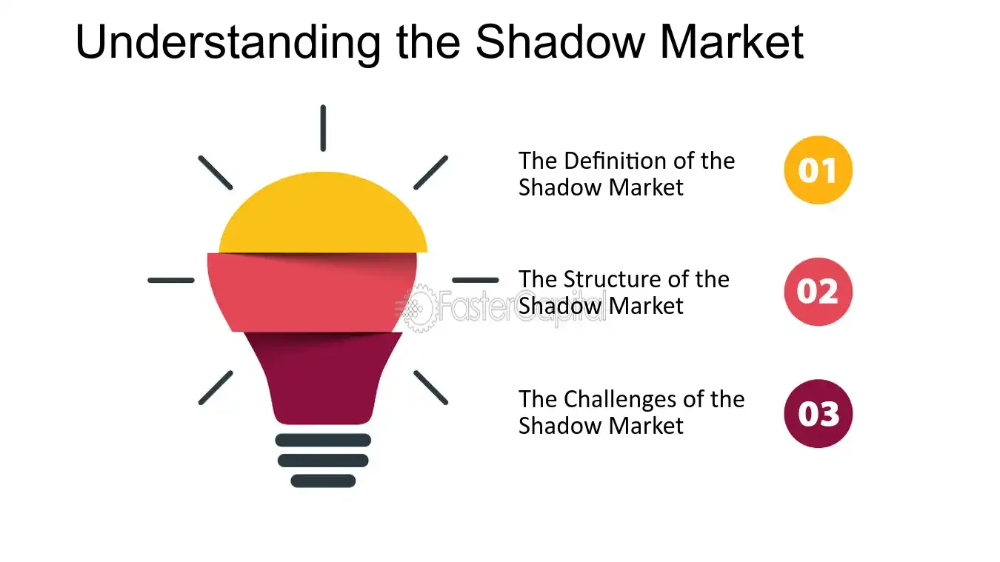

## Table of Contents

## What is the basic definition of a shadow market?

A shadow market is a place where people buy and sell things secretly, without the government knowing. These markets are often illegal and can include things like drugs, stolen goods, or even fake money. People use shadow markets because they want to avoid taxes or laws that control what can be bought and sold.

These markets can be dangerous because they are not regulated. This means that buyers and sellers might not be safe, and the products might not be good quality. Shadow markets exist all over the world, and they can be found online or in secret locations. They are a big problem for governments because they lose money and can't protect people from harm.

## How does a shadow market differ from a traditional market?

A shadow market is very different from a traditional market. In a traditional market, people buy and sell things openly, following the rules and laws set by the government. These markets are safe and regulated, meaning the government checks to make sure everything is fair and that the products are safe. You can find traditional markets in stores, malls, or online websites like Amazon or eBay.

On the other hand, a shadow market operates in secret. People in these markets do not follow the government's rules and often sell illegal or dangerous items. These markets are not safe because there is no one to check the quality of the products or protect the buyers and sellers. Shadow markets can be found in hidden places or on special websites that are hard to access.

The main difference between the two is that traditional markets are legal and regulated, while shadow markets are illegal and unregulated. This makes traditional markets safer and more trustworthy, while shadow markets can be risky and harmful.

## What are the common goods and services traded in shadow markets?

In shadow markets, people often trade things that are illegal or hard to get legally. Drugs are one of the most common items you'll find. These can include marijuana, cocaine, heroin, and many others. People also trade stolen things like electronics, jewelry, and even cars. Counterfeit money and fake products, like fake designer clothes or watches, are also popular in these markets. 

Another thing you might find in shadow markets is weapons. These can range from guns to knives and even more dangerous items. Some people also trade in human trafficking, which is very sad and illegal. Services like hacking or making fake IDs can be found too. These markets are risky because they deal in things that are against the law, and the people involved can get into big trouble if they are caught.

## What are the main mechanisms that facilitate transactions in shadow markets?

In shadow markets, people use different ways to buy and sell things without getting caught. One common way is using cash, which is hard to trace. People meet in secret places or use special codes to make sure no one knows what they are doing. Another way is using cryptocurrencies like Bitcoin. These are digital money that can be used online without banks knowing. This makes it easier to buy and sell things secretly on the internet.

Another important way is using special websites on the dark web. These websites are hidden and can only be accessed with special software. They let people buy and sell things without anyone knowing. People often use fake names and special ways to talk to each other to stay safe. All these methods help people in shadow markets keep their deals secret and avoid getting caught by the police.

## How do participants typically enter and operate within a shadow market?

People usually enter shadow markets by finding someone who already knows about them. They might meet someone who can introduce them to the market or find information online. To get in, they need to be careful and secretive. They might use special codes or secret places to meet others. Once they are in, they often use fake names to keep their real identity hidden. This way, they can buy and sell things without anyone knowing who they are.

Once inside the shadow market, people use different ways to do their deals. They might use cash to buy and sell things because it is hard to trace. Or they might use cryptocurrencies like Bitcoin, which can be used online without banks knowing. They often meet in secret places or use special websites on the dark web to do their business. These websites are hidden and need special software to access. Everyone tries to stay safe by using secret ways to talk and making sure no one can find out what they are doing.

## What are the legal implications of participating in shadow markets?

Participating in shadow markets is very risky because it is illegal. If you get caught, you can face big problems like going to jail or paying a lot of money as a fine. The government does not like shadow markets because they lose money from taxes and can't control what is being bought and sold. So, they work hard to catch people who use these markets. This means that if you are involved, you could be in big trouble.

Also, the things you buy or sell in shadow markets might be dangerous or bad quality. For example, drugs can hurt you, and fake products might not work right. If you get caught with these items, you can face even more legal trouble. It's important to know that the risks are very high, and the law is strict about punishing people who take part in these illegal activities.

## How do shadow markets impact the broader economy?

Shadow markets can hurt the broader economy in big ways. When people buy and sell things in these markets, the government doesn't get the taxes it should. This means less money for important things like schools, roads, and hospitals. Also, shadow markets take business away from legal markets. This can make it hard for honest businesses to make money and grow. Over time, this can slow down the whole economy because less money is moving around in the right way.

Another problem is that shadow markets can make prices go up. When people buy things like drugs or stolen goods in these markets, it can create more demand for these items. This can lead to higher prices, which can affect the cost of living for everyone. Plus, shadow markets can make it harder for the government to control the economy. If a lot of money is moving around in secret, it's tough to know what's really going on. This can lead to bad decisions and more economic problems.

## What are the technological tools used to enhance the operations of shadow markets?

People in shadow markets use special technology to keep their deals secret. One big tool they use is the dark web. The dark web is a hidden part of the internet that you can only get to with special software like Tor. This software helps hide where you are and what you are doing online. People use the dark web to buy and sell things without anyone knowing. They also use special websites on the dark web that are hard to find and can only be accessed with secret links.

Another important tool is [cryptocurrency](/wiki/cryptocurrency), like Bitcoin. Cryptocurrency is digital money that you can use online without banks knowing. This makes it perfect for shadow markets because it's hard to trace. People can send and receive money without leaving a trail that the government can follow. They also use special apps and software to talk to each other in secret. These tools help them use codes and secret messages to keep their deals safe and hidden from the police.

## How do regulatory bodies attempt to monitor and control shadow markets?

Regulatory bodies try hard to keep an eye on shadow markets. They use special technology to watch the internet and the dark web. They look for signs of illegal buying and selling. They also work with banks and financial companies to track money moving around, especially when it involves cryptocurrencies like Bitcoin. By watching these things, they hope to find and stop people who are using shadow markets.

Another way regulatory bodies control shadow markets is by making laws and rules stricter. They work to close down websites on the dark web that are used for illegal deals. They also try to catch and punish people who use these markets. Sometimes, they use undercover [agents](/wiki/agents) to go into these markets and gather information. All these efforts are meant to make it harder for shadow markets to operate and to protect the economy and people from harm.

## What are the ethical considerations associated with shadow markets?

Shadow markets raise big ethical questions because they often involve illegal and harmful activities. When people buy and sell things like drugs, stolen goods, or fake money in these markets, they are breaking the law. This can hurt other people and make society less safe. For example, drugs can ruin lives, and stolen goods can make honest people lose money. It's not fair to the people who follow the rules and pay taxes, because shadow markets take money away from the government that could be used for good things like schools and hospitals.

Another ethical issue is that shadow markets can take advantage of people who are in need. Some people might turn to these markets because they are desperate or don't have other choices. This can lead to more harm and unfairness. Also, the secrecy and danger of shadow markets can make it hard for people to get help if they need it. Overall, shadow markets go against the idea of a fair and safe society, where everyone follows the same rules and looks out for each other.

## How do shadow markets adapt to changes in legislation and technology?

Shadow markets are always changing to stay ahead of new laws and technology. When governments make new rules to stop these markets, the people running them find new ways to keep going. They might use different websites or change how they talk to each other to stay hidden. They also watch what the government is doing and try to find ways around the new rules. This makes it hard for the government to stop them completely.

Technology is also a big part of how shadow markets adapt. When new technology comes out, like better ways to hide on the internet or new kinds of digital money, shadow markets use it quickly. They use the dark web and special software to stay secret. They also use cryptocurrencies like Bitcoin to make it hard for the government to follow the money. By using the latest technology, shadow markets can keep working even when the government tries to shut them down.

## What advanced strategies are used by experts to navigate and profit from shadow markets?

Experts who navigate and profit from shadow markets often use very smart and careful strategies. They know a lot about the dark web and use special software to stay hidden. They also use cryptocurrencies like Bitcoin to move money around without being caught. These experts are good at finding secret websites and using codes to talk to others without anyone knowing. They also keep an eye on what the government is doing and change their plans to stay safe. By being very careful and using the latest technology, they can make money from these illegal markets.

Another important strategy is building trust with other people in the shadow market. Since these markets are secret and risky, it's important to know who you can trust. Experts often use fake names and special ways to talk to make sure they are safe. They might also work with others to share information and help each other. By being smart and careful, and by using the right technology and trust, experts can navigate and profit from shadow markets, even though it's very risky and illegal.

## References & Further Reading

[1]: Lu, Y., Yang, X., & Niu, B. (2019). ["Algorithmic Trading and Volatility: A Study on a Simulated Order-Driven Market."](https://www.sciencedirect.com/science/article/pii/S092633732030429X) Computational Economics, 55(1), 367-382.

[2]: Ait-Sahalia, Y., & Saglam, M. (2013). ["High Frequency Traders: Taking Advantage of Speed."](https://papers.ssrn.com/sol3/papers.cfm?abstract_id=2342011) Journal of Financial Economics, 113(1), 1-28.

[3]: Biais, B., Foucault, T., & Moinas, S. (2015). ["Equilibrium Fast Trading."](https://www.sciencedirect.com/science/article/pii/S0304405X15000288) Journal of Financial Economics, 116(2), 292-313.

[4]: Financial Stability Board (2020). ["Crypto-assets and Shadow Banking: Challenges and Opportunities."](https://www.fsb.org/2020/10/regulation-supervision-and-oversight-of-global-stablecoin-arrangements/)

[5]: Gomber, P., Koch, J., & Siering, M. (2017). ["Digital Finance and FinTech: Current Research and Future Research Directions."](https://link.springer.com/article/10.1007/s11573-017-0852-x) Journal of Business Economics, 87(5), 537-580.