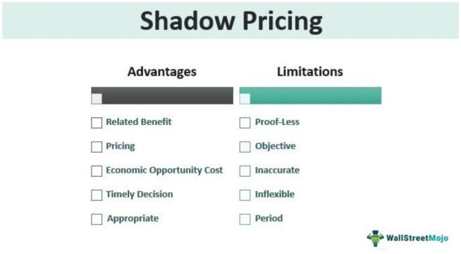

In today's competitive economic landscape, accurately valuing resources and making informed decisions about their allocation is crucial for both businesses and policymakers. The necessity to optimize resource allocation stems from the limited nature of resources and the need to maximize economic efficiency and social welfare. Three pivotal concepts that facilitate this optimization are shadow pricing, economic valuation, and algorithmic trading.

Shadow pricing refers to the technique of assigning a monetary value to resources or goods that do not have a market-determined price. This practice is essential for evaluating the opportunity costs and potential benefits of various projects or policies, particularly when dealing with public goods or intangible assets. By assigning a value to these non-market elements, businesses and governments can make more informed decisions that align with broader economic objectives.



Economic valuation, on the other hand, provides a framework for quantifying the benefits and costs associated with different allocation choices. It plays a critical role in ensuring that resource allocations reflect not only economic efficiency but also social and environmental considerations. Integrating shadow pricing into economic valuation allows for a comprehensive approach to decision-making, capturing both explicit and implicit values.

Algorithmic trading introduces another dimension to the resource allocation process, particularly within financial markets. By leveraging computer algorithms, it facilitates faster and more accurate trading decisions based on complex financial models. This technological advancement enhances market efficiency and can be utilized to incorporate shadow pricing into trading strategies, dynamically valuing and exchanging resources that lack traditional market prices.

This article explores these interconnected concepts, demonstrating their applications and implications for businesses and economic policy. Understanding and integrating shadow pricing, economic valuation, and algorithmic trading are fundamental for achieving informed and efficient resource allocation in today's dynamic economic environment.

## Table of Contents

## Understanding Shadow Pricing

Shadow pricing is a method used to assign a monetary value to resources or services that are not typically traded in markets and therefore do not have explicit market prices. This approach is crucial for economists and businesses to assess the opportunity costs and benefits linked with various projects or policies. By effectively estimating these values, decision-makers can make informed choices that reflect both economic and societal impacts.

The essence of shadow pricing lies in its ability to incorporate the true economic value of resources, particularly those with significant social benefits but no direct market price. For instance, public goods such as parks provide recreational opportunities, enhance the aesthetic value of communities, and contribute to environmental conservation. These benefits, while intangible, represent significant social utility, and shadow pricing helps quantify such values for better policy formulation and resource allocation.

Consider a scenario where a local government is debating whether to allocate land for a new public park or sell it to a developer for commercial projects. By employing shadow pricing, the government can assign a hypothetical market value to the park based on its expected social benefits. These might include improved air quality, increased property values in the surrounding areas, and enhanced community well-being. This valuation is crucial for conducting a cost-benefit analysis to make economically and socially optimized decisions.

Economists often use techniques, such as contingent valuation and hedonic pricing, to determine shadow prices. Contingent valuation involves surveys that ask people how much they would be willing to pay for specific non-market services. Hedonic pricing, on the other hand, estimates economic values by observing market prices for goods that are related to the non-market resources. For instance, the difference in property prices near parks can serve as an implicit shadow price for the park's value.

By integrating shadow prices into their analyses, businesses and policymakers can also better understand and internalize the externalities of economic activities. The adoption of shadow pricing encourages organizations to evaluate options not purely on financial metrics but also on their broader societal contributions.

## Resource Allocation and Economic Valuation

Resource allocation is a critical process that involves the strategic distribution and management of limited resources to achieve the highest possible benefit in both economic and social terms. It requires precise decision-making to determine the most effective and efficient allocation strategies. This process is fundamental not only in businesses but also in governmental and non-profit sectors, where resource scarcity is a common challenge.

Economic valuation is integral to this process, serving as a quantitative method for assessing the potential costs and benefits associated with various allocation strategies. By assigning monetary values to both tangible and intangible factors, economic valuation aids decision-makers in comparing different options in a standardized format, thereby facilitating more objective evaluations. Methods such as contingent valuation, hedonic pricing, and cost-benefit analysis are commonly employed tools for this purpose.

The incorporation of shadow pricing into resource allocation is vital to ensuring that economic decisions encompass not just market-based values but also social and environmental considerations. Shadow pricing assigns a monetary figure to resources or goods that lack market prices, thereby allowing their inclusion in economic evaluations. For instance, a public park may not yield direct revenue but provides substantial social value, which can be captured using shadow pricing techniques. By assigning such values, policy-makers and businesses can make more holistic decisions that reflect true societal benefits.

Python, as a versatile programming language, can be employed to calculate and model shadow pricing and resource allocation strategies. Below is an example of Python code that demonstrates a simple approach to calculating shadow prices for a theoretical resource using linear programming:

```python
from scipy.optimize import linprog

# Coefficients of the objective function (e.g., profit from resources)
c = [-50, -40]  

# Coefficients of the inequality constraints (resource limits)
A = [[1, 2], [3, 1]]
b = [100, 90]

# Bounds for each variable (e.g., each resource cannot be less than 0)
x_bounds = (0, None)
y_bounds = (0, None)

# Linear programming optimization
res = linprog(c, A_ub=A, b_ub=b, bounds=[x_bounds, y_bounds], method='highs')

# Shadow prices from Lagrange multipliers
shadow_prices = res.dual_simplex  

print("Optimal Resource Allocation:", res.x)
print("Shadow Prices:", shadow_prices)
```

This integration of economic valuation and resource allocation fosters decisions that align with the broader objectives of economic efficiency and social welfare. As we venture into sustainable development practices, recognizing and valuing the full spectrum of benefits and costs associated with resource allocations becomes paramount. The strategic use of these tools ensures that both immediate economic gains and long-term societal benefits are duly considered, paving the way for responsible and sustainable growth.

## Algorithmic Trading in Economic Frameworks

Algorithmic trading, an integral component of modern financial markets, utilizes computer algorithms to make decisions, often predicated on intricate financial models. At its core, [algorithmic trading](/wiki/algorithmic-trading) involves the automatic execution of pre-programmed trading instructions, accounting for variables such as price, timing, and [volume](/wiki/volume-trading-strategy). This automation enhances market efficiency by enabling traders to swiftly capitalize on fleeting market opportunities, thereby facilitating faster and more accurate trading decisions.

The underlying strength of algorithmic trading lies in its ability to process vast amounts of data at speeds unattainable by human traders. This high-speed data processing allows algorithms to analyze financial markets and quickly execute trades, subsequently reducing the lag between information reception and decision execution. A practical application of this can be seen in high-frequency trading ([HFT](/wiki/high-frequency-trading-strategies)), where algorithms perform thousands of trades within fractions of a second to profit from small price discrepancies.

Mathematically, the strategies employed in algorithmic trading often revolve around statistical [arbitrage](/wiki/arbitrage), utilizing techniques such as mean reversion and the examination of price correlations between assets. Consider a simple example involving mean reversion, where prices tend to return to their historical mean over time. An algorithm could be programmed to execute buying orders when the price of a security drops below its historical average by a certain threshold and sell when it rises above.

```python
def mean_reversion_trading(prices, window_size, threshold):
    moving_avg = sum(prices[-window_size:]) / window_size
    current_price = prices[-1]

    if current_price < moving_avg - threshold:
        return "buy"
    elif current_price > moving_avg + threshold:
        return "sell"
    else:
        return "hold"

# Example usage
prices = [100, 102, 101, 99, 98, 97, 96, 95, 96, 94]
decision = mean_reversion_trading(prices, window_size=5, threshold=2)
print(decision)  # Output will be "buy"
```

Beyond traditional applications, the intersection of algorithmic trading with shadow pricing offers the potential to evaluate and trade non-market resources. Shadow pricing, which assigns monetary values to resources lacking explicit market prices, can synergize with algorithmic trading to dynamically assess resource values under environmental or policy constraints. For instance, incorporating shadow prices in algorithmic frameworks could allow traders to make decisions that reflect both economic valuations and externalities, such as environmental impact or social benefits.

Integrating shadow pricing into algorithmic trading systems requires the development of algorithms capable of adjusting trade valuations by taking into account estimated shadow prices. These algorithms would need to process additional data reflecting non-market conditions, such as environmental metrics or regulatory constraints, fostering a more holistic approach to market interactions.

This integration not only enhances trading strategies but also aligns them with broader economic and environmental objectives. By considering both market and non-market values, firms can make more informed decisions that balance profitability with sustainability, promoting responsible resource utilization and contributing to societal welfare.

## Applications and Case Studies

Shadow pricing is a fundamental concept in environmental economics, where it is pivotal in the valuation of ecosystem services. Ecosystem services refer to the benefits that natural environments provide to humans, such as clean air, water purification, and pollination. These services often lack a direct market price, making shadow pricing an essential tool for quantifying their economic value. For instance, when evaluating the economic benefits of preserving a forest, shadow pricing can estimate the value of carbon sequestration and biodiversity, allowing policymakers to make more informed conservation decisions. This approach aids in determining whether the preservation of natural resources outweighs the potential benefits of alternative land uses.

In corporate finance, shadow pricing assists in evaluating intangible assets, which can be challenging to appraise by traditional methods. Intangible assets such as brand value, patents, or customer loyalty contribute significantly to a company's overall worth but do not have explicit market prices. Shadow pricing helps quantify these assets, enabling firms to make strategic decisions based on a more comprehensive understanding of their value. For example, a company considering a merger or acquisition might use shadow pricing to assess the potential synergistic value of combining customer bases or brand recognition.

Several case studies illustrate the practical application of shadow pricing in infrastructure projects. Governments and private firms often employ shadow pricing to weigh the costs and benefits of investing in infrastructure, such as highways, bridges, or public transportation systems. In these scenarios, shadow pricing captures the future benefits of such investments, which include reduced travel time, increased economic activity, and environmental improvements. For instance, when planning a new public transit system, shadow pricing can be used to quantify the expected reduction in traffic congestion and pollution, thereby justifying the project's costs based on long-term societal benefits.

Moreover, in public policy, shadow pricing is utilized to evaluate the economic implications of regulatory decisions. By assigning a value to externalities, such as pollution or resource depletion, policymakers can better assess the trade-offs associated with regulatory measures. This approach informs decisions such as setting emissions limits or pricing carbon, where the societal costs of environmental damage are factored into economic analysis.

Overall, shadow pricing is an invaluable tool across various domains, from environmental conservation to corporate financial strategy and public infrastructure development. It enables a more complete assessment of economic and social benefits, guiding decisions that support long-term sustainability and resource optimization.

## Challenges and Limitations

Shadow pricing is a powerful tool for resource valuation, but it is not without challenges and limitations. A primary concern is its inherent subjectivity, which can introduce biases into the valuation process. Shadow prices are often derived from expert judgments, assumptions, or models that simulate hypothetical scenarios, leading to potential variances depending on who performs the valuation and under what conditions. This subjectivity can result in inconsistent values, especially when different methodologies or expert opinions are applied to the same set of resources.

Data quality and availability are crucial to accurate shadow pricing but often represent significant hurdles. High-quality data is necessary to make informed estimations about the true value of resources lacking explicit market prices. However, many non-market resources do not have extensive data available. Even when data exists, it may be incomplete or outdated, further complicating the valuation process. This issue is especially pronounced in emerging markets or less documented sectors, where statistical data might be sparse or unreliable.

Moreover, the ethical implications of assigning monetary values to non-market goods are hotly debated. For instance, placing a financial value on public goods such as clean air, biodiversity, or cultural heritage raises complex ethical questions. Critics argue that monetizing these goods can lead to oversimplifications of their inherent value, ignoring qualitative aspects that are not easily converted into monetary terms. This debate is particularly relevant when considering resources with profound social or environmental importance, where monetary valuation could diminish public perception of their true worth.

Consequently, while shadow pricing is a useful framework for economic analysis, its application must be approached with caution. Adjustments in methodology, improvements in data collection, and sensitivity to ethical considerations are necessary to enhance its credibility and effectiveness. Addressing these challenges involves a collaborative effort among economists, policymakers, and stakeholders to create balanced and context-aware valuation techniques.

## Future Directions

Advancements in data analytics and [artificial intelligence](/wiki/ai-artificial-intelligence) (AI) are poised to significantly enhance the accuracy and applicability of shadow pricing. Traditional methods of assigning monetary value to non-market resources often rely on static models and assumptions. However, with AI and big data analytics, it is possible to dynamically analyze large datasets, identifying patterns and trends that can lead to more precise valuation models. Machine learning algorithms, such as regression models and neural networks, can be employed to predict the shadow prices of resources by continuously learning from historical and real-time data. 

The integration of social and ethical values into economic decision-making frameworks represents a transformative shift in shadow pricing. Currently, most economic decisions prioritize efficiency and profit maximization. By incorporating ethical considerations, such as equity and environmental sustainability, into the valuation process, shadow pricing can better reflect a comprehensive picture of societal values. For instance, a multi-criteria decision analysis (MCDA) framework could be utilized to systematically include diverse stakeholder values into economic assessments, thus broadening the traditional scope of shadow pricing.

In the context of algorithmic trading platforms, incorporating shadow prices presents new possibilities for aligning trading strategies with wider economic objectives. Traditionally focused on high-frequency trading and profit generation, these platforms can evolve to account for the social and environmental impacts of trading decisions. By integrating shadow pricing into their algorithms, traders can adjust their portfolios to not only seek profit but also adhere to principles of sustainable and responsible investing. For instance, a Python algorithm could implement shadow price adjustments by integrating external datasets reflecting non-market valuations, such as CO2 emissions or social impact indicators:

```python
import numpy as np

def update_portfolio_with_shadow(prices, shadow_prices, sensitivity):
    adjusted_prices = prices + sensitivity * shadow_prices
    return adjusted_prices

# Example data: market prices and shadow prices
market_prices = np.array([100, 200, 300])
shadow_prices = np.array([-5, 10, -15])
sensitivity_factor = 0.1

# Adjusting portfolio prices
adjusted_prices = update_portfolio_with_shadow(market_prices, shadow_prices, sensitivity_factor)
print(adjusted_prices)
```

This approach allows for a nuanced strategy where financial returns are balanced with societal benefits, potentially transforming investment landscapes and contributing to broader economic goals. As these advancements continue to unfold, the future of shadow pricing within economic frameworks appears increasingly integrated, dynamic, and aligned with broader societal imperatives.

## Conclusion

In today's complex economic environment, the principles of shadow pricing, economic valuation, and algorithmic trading serve as indispensable tools for achieving efficient resource allocation. At their core, these concepts offer a structured method for evaluating both tangible and intangible assets, ensuring decisions are not only economically sound but also aligned with broader social objectives.

Shadow pricing provides a framework for quantifying the value of resources that lack explicit market prices, such as public parks or environmental assets. By incorporating these valuations into economic decision-making, businesses and policymakers can more accurately reflect the true costs and benefits of their actions, guiding them towards choices that optimize both economic efficiency and social welfare.

Economic valuation further aids in this process by offering quantifiable metrics to assess diverse allocation options. This allows for a systematic comparison of potential projects or policies, facilitating decisions that maximize resource utility. When effectively integrated with shadow pricing, it ensures a holistic approach that encompasses both market and non-market factors.

Algorithmic trading, through its reliance on sophisticated financial models and data-driven insights, enhances market efficiency by enabling faster and more precise trading operations. When these algorithms integrate shadow prices, they can dynamically adjust to reflect the value of non-market resources, aligning trading strategies with a more comprehensive economic perspective. This synergy not only boosts financial performance but also supports sustainable economic development by emphasizing long-term gains over short-term profits.

As we advance, the continued refinement of these tools will be pivotal. Innovations in data analytics and artificial intelligence promise to enhance the precision and applicability of shadow pricing, while integrating social and ethical considerations into economic frameworks could ensure that these methodologies contribute to a more just and sustainable world. By striving for this balance, these concepts can lead to economic decisions that prioritize not just profitability, but also the overall well-being of society and the environment.

## References & Further Reading

[1]: Arrow, K. J., & Lind, R. C. (1970). ["Uncertainty and the Evaluation of Public Investment Decisions."](https://www.jstor.org/stable/1821490) American Economic Review, 60(3), 364-378.

[2]: Dasgupta, P., & Heal, G. (1979). ["Economic Theory and Exhaustible Resources."](https://www.cambridge.org/core/books/economic-theory-and-exhaustible-resources/9166D109F98A552A6F5A4C43D3DC2DC7) Cambridge University Press.

[3]: Friedman, J. H. (2001). ["Greedy Function Approximation: A Gradient Boosting Machine."](https://www.jstor.org/stable/2699986) Annals of Statistics, 29(5), 1189-1232.

[4]: Hull, J. (2015). ["Options, Futures, and Other Derivatives."](https://books.google.com/books/about/Options_Futures_and_Other_Derivatives.html?id=t6CSAgAAQBAJ) Pearson Education.

[5]: Krugman, P., & Wells, R. (2018). ["Economics."](https://archive.org/details/economics0000krug_f6w1) Worth Publishers.

[6]: Markowitz, H. (1952). ["Portfolio Selection."](https://onlinelibrary.wiley.com/doi/abs/10.1111/j.1540-6261.1952.tb01525.x) The Journal of Finance, 7(1), 77-91.

[7]: Stiglitz, J. E. (2000). ["Economics of the Public Sector."](https://archive.org/details/economicsofpubli0000stig_z7r0) W. W. Norton & Company.

[8]: Thaler, R. H., & Sunstein, C. R. (2008). ["Nudge: Improving Decisions About Health, Wealth, and Happiness."](https://www.researchgate.net/publication/257178709_Nudge_Improving_Decisions_About_Health_Wealth_and_Happiness_RH_Thaler_CR_Sunstein_Yale_University_Press_New_Haven_2008_293_pp) Penguin Books.

[9]: Varian, H. R. (1992). ["Microeconomic Analysis."](https://archive.org/details/microeconomicana0000vari_g1b1) W. W. Norton & Company.