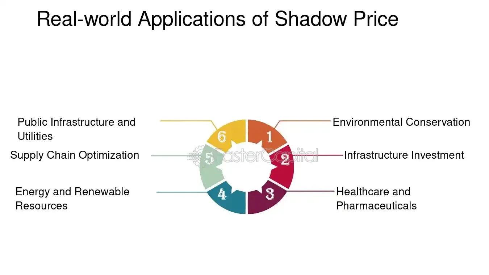

## Table of Contents

## What is shadow pricing?

Shadow pricing is a way to figure out the true cost of something that doesn't have a clear price tag. It's used when you need to make decisions about resources that are hard to value, like the environment or time. For example, if a company wants to build a factory, they might use shadow pricing to understand the cost of pollution it might cause. This helps them see if the project is really worth it, not just in terms of money, but also in terms of its impact on the world.

In economics, shadow pricing is important for making better choices. It helps governments and businesses understand the hidden costs of their actions. By putting a price on things like clean air or time saved, they can make more informed decisions. This can lead to policies that are better for everyone, not just for making money. Shadow pricing makes sure that all costs, even the ones you can't see, are considered in big decisions.

## Why is shadow pricing important in economics?

Shadow pricing is important in economics because it helps us understand the true cost of things that don't have a clear price. For example, when a company wants to build a new factory, they need to think about more than just the money it will cost to build it. They also need to consider the impact on the environment, like pollution, or the time people might save by using the factory's products. By putting a price on these things, shadow pricing helps businesses and governments make better decisions.

Using shadow pricing can lead to choices that are good for everyone, not just for making money. It makes sure that all costs, even the ones you can't see, are taken into account. This is important for creating policies that protect the environment and improve people's lives. Without shadow pricing, we might make decisions that seem good at first but end up causing problems later on. By understanding the full cost of our actions, we can plan for a better future.

## How is shadow pricing calculated?

Shadow pricing is calculated by figuring out the cost of something that doesn't have a clear price. To do this, experts look at what people are willing to pay to avoid a problem, or what they would need to be paid to accept it. For example, to find the shadow price of pollution, they might look at how much people would pay to have cleaner air. They could also see how much it costs to fix the damage caused by pollution, like health care costs or cleaning up a polluted river.

Another way to calculate shadow pricing is by looking at the opportunity cost. This means thinking about what you give up when you choose one thing over another. For instance, if a city decides to build a park instead of a parking lot, the shadow price of the park would include the money the city could have made from the parking lot. By considering these different costs, experts can come up with a shadow price that helps make better decisions.

## What are the main applications of shadow pricing?

Shadow pricing is used a lot in figuring out how much things cost when they don't have a clear price. For example, governments use it to make decisions about building new roads or parks. They look at how much people would pay to have less traffic or more green space. This helps them see if the project is really worth it, not just in money, but also in making life better for people. Businesses also use shadow pricing to think about things like pollution. If a factory makes a lot of pollution, the shadow price might show how much it would cost to clean up the environment. This helps companies decide if the factory is a good idea or if they should find a cleaner way to do things.

Another big use of shadow pricing is in figuring out the cost of time. For example, if a new train line can save people time getting to work, the shadow price would show how much that time is worth. This helps decide if building the train line is a good investment. Shadow pricing is also important in managing natural resources. For instance, if a forest is cut down to make room for a farm, the shadow price would include the value of the forest for things like clean air and wildlife. By using shadow pricing, people can make choices that are better for everyone, not just for making money.

## Can you explain shadow pricing with a simple example?

Imagine a city wants to build a new park. The park will cost money to build, but it also has other benefits like cleaner air and a nicer place for people to relax. To figure out if building the park is a good idea, the city uses shadow pricing. They look at how much people would be willing to pay for cleaner air and a nice place to hang out. They also think about what else they could do with the land, like building a shopping center. The shadow price of the park would be the value of all these things put together.

Let's say the city finds out that people would pay a lot for cleaner air and a nice place to relax. They also find out that a shopping center would bring in money, but not as much as the park would be worth to the community. By using shadow pricing, the city can see that building the park is a good choice, even if it costs money upfront. This helps them make a decision that is good for everyone, not just for making money.

## How does shadow pricing affect decision-making in businesses?

Shadow pricing helps businesses make better choices by showing them the true cost of things that don't have a clear price. For example, if a company wants to build a new factory, they need to think about more than just the money it will cost to build it. They also need to consider the impact on the environment, like pollution. By using shadow pricing, they can figure out how much it would cost to clean up the pollution. This helps them see if building the factory is really worth it, not just in terms of money, but also in terms of its impact on the world.

Using shadow pricing can lead businesses to make choices that are good for everyone, not just for making money. For instance, if the shadow price of pollution is high, a company might decide to use cleaner technology or find a different way to do things. This can save them money in the long run and also make the community happier. By considering all costs, even the ones you can't see, businesses can make decisions that are better for the environment and for people's lives.

## What is the difference between shadow pricing and market pricing?

Shadow pricing and market pricing are two different ways to figure out how much something is worth. Market pricing is the price you see when you buy something in a store or online. It's based on what people are willing to pay and what sellers are willing to accept. For example, if you buy a shirt, the market price is what you pay at the checkout. This price is clear and easy to see.

Shadow pricing, on the other hand, is used for things that don't have a clear price tag. It's a way to figure out the cost of things like pollution or time. For example, if a company wants to build a factory, they might use shadow pricing to understand the cost of the pollution it will create. This helps them see if the project is really worth it, not just in terms of money, but also in terms of its impact on the world. Shadow pricing helps make better decisions by considering all costs, even the ones you can't see.

## How is shadow pricing used in environmental economics?

In environmental economics, shadow pricing helps us figure out the true cost of things that hurt the environment. For example, if a company wants to build a factory, they need to think about the pollution it will make. The shadow price of this pollution would be how much it costs to clean up the air or water, or how much people would pay to avoid the pollution. By using shadow pricing, companies and governments can see if the factory is really worth building, not just in terms of money, but also in terms of its impact on the environment.

Shadow pricing also helps us value things like forests or clean air, which don't have a clear price tag. If a city wants to cut down a forest to build houses, they can use shadow pricing to figure out what the forest is worth. This includes the value of clean air, the homes of animals, and the beauty of the forest. By understanding these costs, we can make better choices that protect the environment and make life better for everyone.

## What are the limitations and challenges of implementing shadow pricing?

Using shadow pricing can be tricky because it's hard to figure out the right price for things like pollution or time. People might not agree on how much clean air is worth, or how much time saved is worth. This makes it hard to come up with a number that everyone thinks is fair. Also, shadow pricing needs a lot of information and good guesses about the future. If the guesses are wrong, the shadow price might not be right, and this can lead to bad decisions.

Another challenge is that shadow pricing can be expensive and take a lot of time to do. You need experts to study and figure out the costs, and this can cost a lot of money. Sometimes, businesses or governments might not want to spend the time and money to do this. They might just go with what seems cheaper at first, even if it's not the best choice in the long run. But even with these challenges, shadow pricing is still a helpful tool for making better decisions that think about more than just money.

## How do government policies influence shadow pricing?

Government policies can have a big impact on shadow pricing. When the government makes rules about things like pollution or building new roads, they need to think about the hidden costs. For example, if there's a new law that says factories can't pollute as much, the shadow price of pollution goes up. This means companies have to think more about the cost of cleaning up the environment when they make decisions. Government policies can also change how much people value things like clean air or time saved. If the government gives money to people for using public transport, the shadow price of time saved by not sitting in traffic might go up.

These changes in shadow pricing can lead to better decisions that are good for everyone. When the government makes rules that make the shadow price of bad things like pollution go up, companies are more likely to find cleaner ways to do things. This can help protect the environment and make life better for people. But it's not always easy. Sometimes, the government might not have all the information they need to set the right shadow prices. And if the policies are too strict, they might make it hard for businesses to make money. So, it's important for the government to find a balance that helps everyone.

## What advanced techniques are used to refine shadow pricing models?

To make shadow pricing models better, experts use advanced math and computer programs. They use something called "optimization techniques" to find the best shadow price. This means they look at a lot of different numbers and try to find the one that makes the most sense. They also use "sensitivity analysis" to see how changes in the world might affect the shadow price. For example, if a new law makes pollution more expensive, they can see how this changes the shadow price of building a factory. By using these advanced methods, experts can make shadow pricing more accurate and useful for making decisions.

Another way to improve shadow pricing is by using "simulation models." These are like computer games that let experts see what might happen in the future. They can change different things in the game, like how much people value clean air, and see how it affects the shadow price. This helps them understand how different choices might affect the environment and people's lives. By using these advanced techniques, businesses and governments can make better decisions that think about more than just money.

## Can you discuss a case study where shadow pricing significantly impacted a project or policy?

In the early 2000s, the city of London wanted to reduce traffic and pollution in the city center. They decided to use shadow pricing to figure out if a new policy called the Congestion Charge would be a good idea. The shadow price of time saved by not sitting in traffic was a big part of their decision. They found out that people would pay a lot to save time and have cleaner air. So, they started charging drivers to enter the city center during busy times. This helped reduce traffic and pollution, making life better for everyone in London.

The Congestion Charge was a success because it used shadow pricing to show the true cost of traffic and pollution. By understanding these hidden costs, the city made a decision that was good for the environment and for people's lives. The charge brought in money that the city used to improve public transport, which helped even more people save time and money. This case study shows how shadow pricing can help make smart choices that think about more than just money.

## References & Further Reading

[1]: Arrow, K. J., & Lind, R. C. (1970). ["Uncertainty and the Evaluation of Public Investment Decisions."](https://www.jstor.org/stable/1821490) American Economic Review, 60(3), 364-378.

[2]: Dasgupta, P., & Heal, G. (1979). ["Economic Theory and Exhaustible Resources."](https://www.cambridge.org/core/books/economic-theory-and-exhaustible-resources/9166D109F98A552A6F5A4C43D3DC2DC7) Cambridge University Press.

[3]: Friedman, J. H. (2001). ["Greedy Function Approximation: A Gradient Boosting Machine."](https://www.jstor.org/stable/2699986) Annals of Statistics, 29(5), 1189-1232.

[4]: Hull, J. (2015). ["Options, Futures, and Other Derivatives."](https://books.google.com/books/about/Options_Futures_and_Other_Derivatives.html?id=t6CSAgAAQBAJ) Pearson Education.

[5]: Krugman, P., & Wells, R. (2018). ["Economics."](https://archive.org/details/economics0000krug_f6w1) Worth Publishers.

[6]: Markowitz, H. (1952). ["Portfolio Selection."](https://onlinelibrary.wiley.com/doi/abs/10.1111/j.1540-6261.1952.tb01525.x) The Journal of Finance, 7(1), 77-91.

[7]: Stiglitz, J. E. (2000). ["Economics of the Public Sector."](https://archive.org/details/economicsofpubli0000stig_z7r0) W. W. Norton & Company.

[8]: Thaler, R. H., & Sunstein, C. R. (2008). ["Nudge: Improving Decisions About Health, Wealth, and Happiness."](https://www.researchgate.net/publication/257178709_Nudge_Improving_Decisions_About_Health_Wealth_and_Happiness_RH_Thaler_CR_Sunstein_Yale_University_Press_New_Haven_2008_293_pp) Penguin Books.

[9]: Varian, H. R. (1992). ["Microeconomic Analysis."](https://archive.org/details/microeconomicana0000vari_g1b1) W. W. Norton & Company.