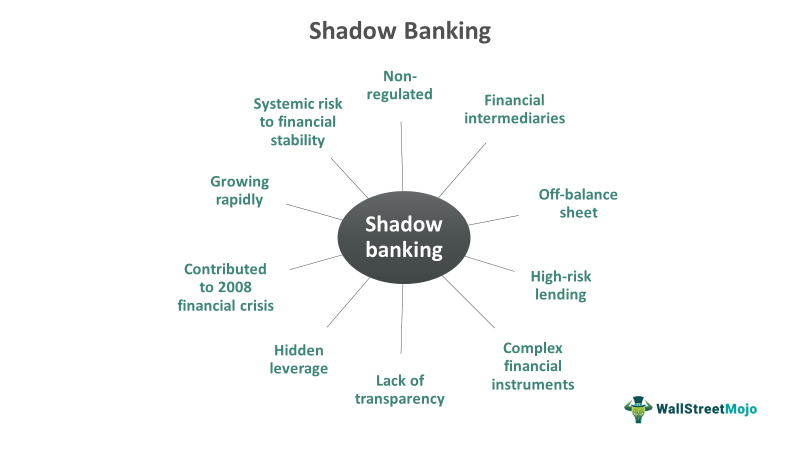

## Table of Contents

## What is a shadow rating?

A shadow rating is a type of credit rating that a company gets but doesn't share with everyone. It's like a secret grade that helps the company know how good its credit is without telling the public. Companies might want to keep this rating private because they are planning something big, like buying another company, and they don't want others to know their financial health yet.

These ratings are usually done by big credit rating agencies, like Moody's or Standard & Poor's. They look at the company's money situation and give it a score. Even though the rating is secret, it can still help the company in many ways. For example, it can help them plan better or get ready for borrowing money in the future. It's like having a secret report card that only you and your teacher know about.

## How does a shadow rating differ from a public credit rating?

A shadow rating is like a secret grade that a company gets from a credit rating agency, but it's not shared with everyone. It's kept private, so only the company knows how good or bad its credit is. This can be useful for the company because they might be planning something big, like buying another company, and they don't want others to know their financial situation yet. It's like having a secret report card that only you and your teacher know about.

On the other hand, a public credit rating is open for everyone to see. It's like a regular report card that gets sent home and can be seen by your parents, friends, and anyone else. Companies with public credit ratings share them because it can help them borrow money more easily or show investors that they are financially healthy. But because everyone can see it, it can also affect how others see the company, for better or worse.

## Who typically uses shadow ratings?

Companies that want to keep their financial health a secret often use shadow ratings. They might be planning big moves like buying another company or making big changes, and they don't want others to know how much money they have or how good their credit is. By getting a shadow rating, they can see their credit score without everyone else knowing.

Big credit rating agencies like Moody's or Standard & Poor's give out these shadow ratings. They look at the company's money situation and give it a secret grade. This helps the company plan better or get ready for borrowing money in the future, all without telling the public.

## What are the main components of a shadow rating?

A shadow rating looks at a company's money situation to give it a secret grade. This grade is based on things like how much money the company makes, how much it owes, and how well it can pay back what it borrows. The rating agency checks the company's financial statements, like its income and how much it spends, to see if it's doing well or not. They also look at the company's past and guess about its future to see if it can keep making money and paying its bills.

The other part of a shadow rating is about the company's plans and the world around it. The rating agency thinks about what the company wants to do next, like buying another company or starting a new project. They also look at things happening in the world, like the economy or new laws, that might affect the company. By putting all this together, the agency can give the company a secret grade that helps it plan without telling everyone else.

## How is a shadow rating calculated?

A shadow rating is calculated by looking at a company's money situation. The rating agency checks the company's financial statements, like how much money it makes and how much it spends. They also see how much the company owes and if it can pay back what it borrows. By looking at these numbers, the agency can tell if the company is doing well or not. They also look at the company's past to see if it has been good at making money and paying its bills.

Besides the company's money, the rating agency also thinks about what the company wants to do next. They look at the company's plans, like buying another company or starting a new project. The agency also considers things happening in the world, like the economy or new laws, that might affect the company. By putting all this information together, the agency can give the company a secret grade. This grade helps the company plan its future without telling everyone else about its financial health.

## What are the benefits of using shadow ratings for financial institutions?

Shadow ratings help financial institutions keep their financial health a secret. This is useful when they are planning big moves, like buying another company or starting a new project. By keeping their credit rating private, they can work on these plans without everyone knowing how much money they have or how good their credit is. This secrecy can give them an advantage in negotiations and help them plan better without outside pressure.

Also, shadow ratings let financial institutions see how they are doing without affecting what people think of them. If a public rating was low, it might scare away investors or make it harder to borrow money. But with a shadow rating, they can work on fixing any problems without the world knowing. This can help them get ready for borrowing money in the future or make other financial plans more easily.

## Can shadow ratings be used for regulatory compliance?

Shadow ratings are not usually used for regulatory compliance because they are secret. Regulators need to see public information to make sure companies are following the rules. If a company uses a shadow rating, it's like having a secret report card that only they know about. Regulators can't use this secret information to check if the company is doing what it's supposed to do.

However, shadow ratings can help companies prepare for regulatory compliance. By getting a secret grade, a company can see where it needs to improve before it has to show its public rating. This way, they can fix any problems and make sure they are ready to meet the rules when the time comes. So while shadow ratings aren't used directly for regulatory compliance, they can help companies get ready for it.

## What are the potential risks associated with relying on shadow ratings?

Relying on shadow ratings can be risky because they are secret. If a company only uses a shadow rating, it might not be ready for when it has to show its public rating. This can be a problem if the public rating is lower than expected. It might scare away investors or make it harder for the company to borrow money. Also, because shadow ratings are not shared, other people can't check if they are fair or correct. This means the company might be too confident in its financial health based on a secret grade that might not be accurate.

Another risk is that shadow ratings might not be taken seriously by everyone. Since they are not public, some people might think they are not as important as public ratings. This could lead to the company not getting the help or advice it needs to improve. Also, if something goes wrong with the company's finances, it might be harder to fix because the problem was hidden by the shadow rating. Keeping financial health a secret can make it harder to get support or make changes when they are needed.

## How do shadow ratings impact financial decision-making processes?

Shadow ratings help companies make smart money choices without telling everyone about their financial health. When a company gets a shadow rating, it can see how good its credit is without sharing it with the public. This secret grade helps the company plan big moves, like buying another company or starting new projects, without others knowing their financial situation. By keeping their credit rating private, companies can work on these plans quietly and have an advantage in negotiations. They can also prepare for borrowing money or making other financial plans more easily because they know their secret score.

But, relying too much on shadow ratings can be risky. Since these ratings are secret, the company might not be ready when it has to show its public rating. If the public rating is lower than expected, it could scare away investors or make it harder to borrow money. Also, because no one else can see the shadow rating, it might not be as accurate or fair as a public rating. This could make the company too confident in its financial health, leading to bad decisions. Keeping financial health a secret can also make it harder to get help or advice when something goes wrong, because the problem was hidden by the shadow rating.

## What methodologies are commonly employed in the development of shadow ratings?

When a company wants a shadow rating, the rating agency looks at its money situation. They check the company's financial statements, like how much money it makes, how much it spends, and how much it owes. They also look at how well the company can pay back what it borrows. By looking at these numbers, the agency can tell if the company is doing well or not. They also think about the company's past to see if it has been good at making money and paying its bills. All this information helps the agency give the company a secret grade.

Besides the company's money, the rating agency also thinks about what the company wants to do next. They look at the company's plans, like buying another company or starting a new project. The agency also considers things happening in the world, like the economy or new laws, that might affect the company. By putting all this information together, the agency can give the company a secret grade. This grade helps the company plan its future without telling everyone else about its financial health.

## How do shadow ratings adapt to changes in the financial markets?

Shadow ratings change when the financial markets change because they look at a company's money situation. If the economy gets better or worse, or if new laws come out, the rating agency will think about these things when giving the company a secret grade. They check how the company's money is doing and if it can still pay back what it borrows. By looking at all these new changes, the agency can update the shadow rating to make sure it's still right.

Even though shadow ratings are secret, they still need to be up-to-date. The rating agency keeps an eye on the company and the world around it. If the company's plans change or if something big happens in the market, the agency will look at all this new information. This helps them give the company a new secret grade that matches the current situation. By doing this, shadow ratings can help the company make smart money choices even when things in the financial markets are changing.

## What future trends might affect the use and development of shadow ratings?

In the future, shadow ratings might change because of new technology. Computers and special programs can now look at a lot of information very quickly. This means rating agencies can use more data to give companies a secret grade. They can check things like how people feel about the company on the internet or what they say on social media. This can help make shadow ratings more accurate and up-to-date. But it also means companies need to be careful about what they share online, because it could affect their secret grade.

Another thing that might change shadow ratings is new rules from the government. If there are new laws about how companies should share their financial health, it might be harder to keep shadow ratings secret. Governments might want more information to be public, so they can make sure companies are following the rules. This could make companies use shadow ratings less, or they might find new ways to keep their secret grades private. Either way, companies will need to keep an eye on these changes and be ready to adjust their plans.

## What is the Role of Credit Assessment in Investment?

Credit assessment is essential in evaluating the creditworthiness of a borrower or a security, providing a fundamental basis for investment decisions. It determines the likelihood that a borrower will fulfill their financial obligations, impacting interest rates offered to them and influencing investor confidence.

Traditionally, credit assessment involved a thorough analysis of an entity's financial statements. This examination entails scrutinizing income statements, balance sheets, and cash flow statements to gauge an entity’s financial health. For instance, the ratio of total debt to equity, often expressed as:

$$
\text{Debt to Equity Ratio} = \frac{\text{Total Debt}}{\text{Total Equity}}
$$

is a key indicator of financial leverage and potential risk. A high ratio suggests greater leverage and possibly higher default risk.

Beyond these quantitative measures, qualitative aspects such as market conditions and management quality are also significant. Market conditions, including economic trends and competitive dynamics, provide context for financial performance. In contrast, management quality and operational efficiency reflect an entity’s potential to sustain and improve financial performance in varying conditions.

The evolution of credit assessment has been marked by technological advancements, incorporating analytical software and big data analytics. These technologies allow for the processing of vast datasets, enhancing predictive accuracy and reducing the time required for evaluations. Machine learning algorithms, for example, can identify patterns and anomalies in credit data that might elude traditional analysis. A Python implementation for evaluating such data could include models like logistic regression for default prediction:

```python
from sklearn.linear_model import LogisticRegression
from sklearn.model_selection import train_test_split
from sklearn.metrics import classification_report

# Sample data: features like debt ratio, income stability, etc.
X = [...]  
y = [...]  # Binary outcome: default (1) or not (0)

# Train-test split
X_train, X_test, y_train, y_test = train_test_split(X, y, test_size=0.2, random_state=42)

# Model training
model = LogisticRegression()
model.fit(X_train, y_train)

# Predictions
predictions = model.predict(X_test)
print(classification_report(y_test, predictions))
```

Shadow ratings, unofficial assessments used internally by entities, complement formal credit assessments by providing a more flexible framework. While formal assessments often dictate market conditions due to their public nature, shadow ratings allow a private understanding of creditworthiness, influencing strategic decisions on borrowing and lending internally.

Both shadow ratings and formal credit assessments significantly impact investment decisions. A favorable credit assessment can open avenues for lower-cost borrowing and enhance investor attractiveness, thereby increasing stock value and overall market confidence. Conversely, a negative assessment might hinder access to capital markets and elevate borrowing costs.

In conclusion, credit assessment remains a pivotal process in the financial sector, its methodologies enriched by technological innovations. As these methods continue to evolve, they offer enhanced precision and strategic advantage, underscoring their critical role in informed investment decision-making.

## References & Further Reading

[1]: De Servigny, A., & Renault, O. (2004). ["Measuring and Managing Credit Risk."](https://www.semanticscholar.org/paper/Measuring-and-Managing-Credit-Risk-Servigny-Renault/11357a81b5bd332d5e8f77f1e53d4a2b5d1eb470) McGraw-Hill Education.

[2]: Lopez de Prado, M. (2018). ["Advances in Financial Machine Learning."](https://www.amazon.com/Advances-Financial-Machine-Learning-Marcos/dp/1119482089) Wiley.

[3]: Chan, E. (2008). ["Quantitative Trading: How to Build Your Own Algorithmic Trading Business."](https://github.com/ftvision/quant_trading_echan_book) Wiley.

[4]: Aronson, D. R. (2006). ["Evidence-Based Technical Analysis: Applying the Scientific Method and Statistical Inference to Trading Signals."](https://www.amazon.com/Evidence-Based-Technical-Analysis-Scientific-Statistical/dp/0470008741) Wiley.

[5]: Jansen, S. (2018). ["Machine Learning for Algorithmic Trading."](https://github.com/stefan-jansen/machine-learning-for-trading) Packt Publishing.