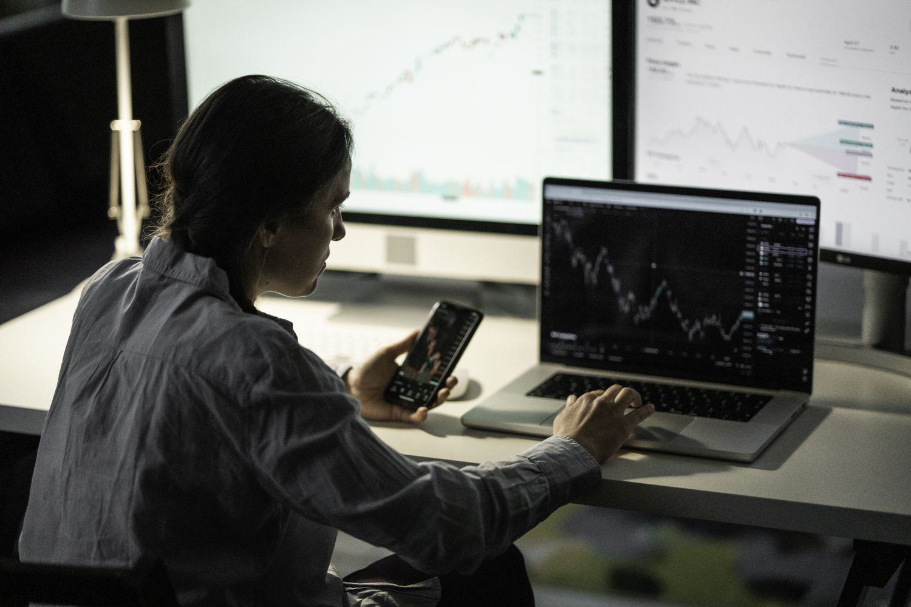

The stock market is inherently volatile, with prices fluctuating due to a myriad of factors including economic indicators, investor sentiment, and external events. Volatility is a measure of the risk associated with the magnitude of price changes in financial markets. This characteristic of the stock market can be represented by the standard deviation of returns or more dynamically by the Volatility Index (VIX), which measures market expectations of near-term volatility based on S&P 500 index options.

Market volatility presents both challenges and opportunities for traders. High volatility increases the potential for significant losses but also opens up avenues for substantial gains. Understanding and effectively responding to volatility is a crucial skill for traders aiming to manage risk and capitalize on favorable trading conditions. Key indicators like Bollinger Bands, which use standard deviations to identify price boundaries, assist traders in recognizing volatile market conditions and setting appropriate entry and exit points.



Algorithmic trading has become a pivotal tool for traders in navigating market volatility. By employing algorithms, trades can be executed with high precision and speed, allowing traders to leverage fluctuations in asset prices efficiently. These automated systems utilize complex mathematical models, incorporating various data sources to predict price movements and optimize trading strategies. The integration of algorithms helps traders mitigate risks associated with volatile markets by responding rapidly to price changes and executing trades based on pre-defined criteria.

This article explores the interplay between market volatility, shakeout events—characterized by mass sell-offs often triggered by unfavorable developments—and the role of algorithmic trading in mitigating risks and enhancing trading strategies. By examining these elements, traders can better navigate the complexities of financial markets, utilizing algorithmic trading platforms to maintain a competitive edge.

## Table of Contents

## Understanding Market Volatility

Market volatility refers to the degree of variation in trading prices over a specific time frame, characterized by rapid and significant price movements. It is a critical aspect of financial markets and serves as both a challenge and an opportunity for investors and traders. The level of uncertainty associated with volatile markets often deters some investors but attracts others who seek higher returns.

Volatility indicators are vital tools for assessing potential risks and opportunities in stock trading. Bollinger Bands, developed by John Bollinger, measure market volatility by using a statistical chart characterizing the prices and volatility over time. Bollinger Bands consist of a simple moving average (SMA) and two standard deviation lines, one above and one below the SMA. The formula for the upper Bollinger Band is:

$$
\text{Upper Band} = \text{SMA}(n) + k \times \sigma
$$

where $n$ is the duration, $\sigma$ is the standard deviation, and $k$ is the number of standard deviations.

Another widely used [volatility](/wiki/volatility-trading-strategies) indicator is the Volatility Index (VIX), often referred to as the "fear index." The VIX measures the market's expectation of future volatility based on options prices of the S&P 500 index. A high VIX value indicates a high level of expected volatility, which can signal increased risk but also potential opportunity for traders willing to engage in speculative activities.

High market volatility is typically triggered by various factors, including economic news such as changes in GDP growth rates, employment [statistics](/wiki/bayesian-statistics), and inflation data. Geopolitical events, such as elections, trade negotiations, or international conflicts, often lead to abrupt changes in investor sentiment, causing price swings. Additionally, adjustments in fiscal policies, such as government spending or tax changes, alongside monetary policy shifts by central banks, can lead to heightened volatility in stock prices. 

Understanding these triggers and utilizing volatility indicators enables traders to formulate strategies that mitigate risks while capitalizing on price fluctuations, ultimately guiding them toward more informed and strategic investment decisions.

## The Concept of Shakeouts in Stock Trading

A shakeout occurs when a significant number of investors liquidate their positions within a short time frame, often in response to uncertainty or negative news. This exodus can precipitate sharp declines in stock prices, leading to substantial financial losses for those caught in the tumult. Shakeouts serve a crucial function in market dynamics. By purging weaker hands, these events enable market consolidation, paving the way for more sustainable growth as only the more resilient investors remain.

The aftermath of a shakeout often reveals technical chart patterns indicative of potential market reversals. Among these are the 'cup and handle' and 'double bottom' formations. A 'cup and handle' pattern is characterized by a U-shaped recovery followed by a smaller consolidation phase, resembling a teacup. It suggests a bullish continuation once the price breaks out above the handle's resistance level. A 'double bottom' pattern, on the other hand, features two distinct troughs at approximately the same price level, indicating strong support and potential trend reversal from bearish to bullish. Recognizing these patterns can be advantageous for traders seeking to capitalize on price reversals post-shakeout.

Shakeouts thus represent both a challenge and an opportunity in stock trading. While they can lead to rapid losses, they also clear the field for investors to identify and exploit nascent upward trends, recalibrating their strategies to reflect these new market conditions.

## Algorithmic Trading: A Game Changer

Algorithmic trading has transformed modern financial markets by utilizing advanced computer algorithms to execute large volumes of trades with remarkable speed and precision. These algorithms are designed based on complex mathematical models and are capable of analyzing market data much faster than any human trader. This high-level automation facilitates the rapid execution of buy and sell orders, thus enabling traders to exploit market inefficiencies and price discrepancies in real time.

A primary advantage of [algorithmic trading](/wiki/algorithmic-trading) lies in its ability to manage risks associated with volatile markets. It can rapidly process vast amounts of data, including historical prices, trading volumes, and market trends, to identify optimal trading opportunities. For instance, algorithms can be programmed to react instantly to specific triggers, such as price thresholds or technical indicators, thus allowing traders to capitalize on favorable conditions or mitigate losses from adverse market movements. The use of stop-loss orders, trailing stops, and other risk management techniques can be seamlessly integrated into an algorithmic trading strategy.

One of the modern AI-powered platforms that have gained prominence is UltraAlgo. UltraAlgo incorporates multiple technical indicators and [machine learning](/wiki/machine-learning) algorithms to assist traders in making well-informed decisions. These indicators provide insights into market trends, [momentum](/wiki/momentum), and potential reversal points, enhancing the trader's ability to predict price movements. The platform's AI capabilities enable it to learn from historical data and refine its prediction models continuously, thereby improving accuracy over time.

Here is a basic illustration of how algorithmic trading can be implemented using Python's `pandas` and `numpy` for data processing and strategy development:

```python
import pandas as pd
import numpy as np

# Load historical data
data = pd.read_csv('historical_prices.csv')

# Calculate moving averages
data['SMA_20'] = data['Close'].rolling(window=20).mean()
data['SMA_50'] = data['Close'].rolling(window=50).mean()

# Generate trading signals
data['Signal'] = 0
data.loc[data['SMA_20'] > data['SMA_50'], 'Signal'] = 1  # Buy signal
data.loc[data['SMA_20'] <= data['SMA_50'], 'Signal'] = -1  # Sell signal

# Calculate daily returns
data['Returns'] = data['Close'].pct_change()

# Calculate strategy returns
data['Strategy Returns'] = data['Signal'].shift(1) * data['Returns']

# Plot results
import matplotlib.pyplot as plt

plt.figure(figsize=(12, 6))
plt.plot(data['Close'], label='Close Price')
plt.plot(data['SMA_20'], label='20-day SMA')
plt.plot(data['SMA_50'], label='50-day SMA')
plt.legend(loc='best')
plt.title('Algorithmic Trading Strategy with Moving Averages')
plt.show()
```

This sample code demonstrates a simple moving average crossover strategy, where buy and sell signals are generated based on the relationships between short-term and long-term moving averages. Such strategies are foundational in algorithmic trading, and more complex models can be developed using a similar approach, incorporating other sophisticated indicators and statistical methods.

In conclusion, by integrating algorithmic trading techniques, traders can enhance their ability to navigate the uncertainty of market volatility effectively. Platforms like UltraAlgo provide an advanced solution for executing well-informed trades, thus empowering traders to maintain a competitive edge in today's rapidly evolving financial markets.

## Leveraging Volatility for Strategic Trading

Volatility indicators are indispensable tools in assessing market conditions, as they help traders identify opportune moments to enter or [exit](/wiki/exit-strategy) trades. Indicators such as the Average True Range (ATR), Bollinger Bands, and the Volatility Index (VIX) provide quantifiable measures of market fluctuations, allowing traders to make data-driven decisions. 

When these indicators are integrated into algorithmic trading platforms like UltraAlgo, they become even more powerful. By offering real-time market insights, these platforms enable traders to optimize their portfolios dynamically. For instance, UltraAlgo can analyze patterns across different time frames and asset classes, alerting traders to sudden market swings or emerging trends that may necessitate portfolio adjustments.

Traders can enhance their strategies further by leveraging [backtesting](/wiki/backtesting) features offered by algorithmic trading platforms. Backtesting involves simulating a trading strategy using historical data to evaluate its potential effectiveness under various market conditions. By experimenting with different parameters and volatility scenarios, traders can refine their strategies, ensuring they are robust and adaptable to shifting market dynamics. For example, a Python script can be written to backtest a strategy using the Bollinger Bands indicator:

```python
import pandas as pd
import numpy as np

def calculate_bollinger_bands(df, n=20):
    df['SMA'] = df['Close'].rolling(window=n).mean()
    df['std'] = df['Close'].rolling(window=n).std()
    df['Upper Band'] = df['SMA'] + (df['std'] * 2)
    df['Lower Band'] = df['SMA'] - (df['std'] * 2)

    return df

data = pd.read_csv('historical_stock_data.csv')  # Assuming historical data is available in CSV
result = calculate_bollinger_bands(data)

# Simple backtest strategy based on Bollinger Bands
data['Signal'] = 0
data['Signal'][data['Close'] > data['Upper Band']] = -1  # Sell signal
data['Signal'][data['Close'] < data['Lower Band']] = 1   # Buy signal
data['Position'] = data['Signal'].shift()

# Calculate returns from executed trades
data['Returns'] = data['Position'] * data['Close'].pct_change()
strategy_returns = data['Returns'].sum()

print(f'Total Strategy Returns: {strategy_returns:.2f}')
```

This code snippet demonstrates how to apply the Bollinger Bands indicator to historical stock data and test a simple strategy of buying when the price crosses below the lower band and selling when it crosses above the upper band. Such analyses can help traders assess the viability of incorporating volatility indicators into their larger trading systems.

In conclusion, leveraging volatility through sophisticated algorithmic trading platforms offers traders an avenue to fine-tune their strategies, ensuring they are not only reactive to market changes but also proactively positioned to capitalize on potential opportunities.

## Conclusion

Understanding and harnessing market volatility through the use of algorithmic trading platforms is pivotal for success in stock trading. The dynamic nature of financial markets presents both challenges and opportunities, making it crucial for traders to adapt quickly. Algorithmic tools, such as UltraAlgo, provide the technological edge needed to navigate these complexities. By leveraging AI-driven insights, traders can optimize their strategies, ensuring they are well-positioned to respond to rapid market fluctuations and capitalize on emerging trends.

The capabilities of platforms like UltraAlgo extend beyond mere execution of trades. They offer an integrated suite of analytical tools that analyze a vast array of market data in real-time. This enables traders to make informed decisions, rather than relying solely on intuition or delayed information. The application of [artificial intelligence](/wiki/ai-artificial-intelligence) and machine learning in these platforms enhances predictive accuracy, thus reducing the risk associated with high volatility.

As financial markets continue to evolve, largely influenced by technological advancements and global developments, the role of advanced trading technologies becomes even more critical. The integration of such technologies allows traders to maintain a competitive edge in increasingly fast-paced environments. The continuous adaptation and evolution of these tools to incorporate new data sources and analytical methods will be essential for traders to sustain profitability and mitigate risks.

In conclusion, the strategic use of algorithmic trading platforms is imperative for traders who aim to effectively manage market volatility and achieve consistent results. Platforms like UltraAlgo not only empower traders with cutting-edge technology but also facilitate a deeper understanding of market mechanisms. As the trading landscape advances, embracing these innovations will be crucial for maintaining and enhancing competitive advantage.

## References & Further Reading

[1]: Bergstra, J., Bardenet, R., Bengio, Y., & Kégl, B. (2011). ["Algorithms for Hyper-Parameter Optimization."](https://dl.acm.org/doi/10.5555/2986459.2986743) Advances in Neural Information Processing Systems 24.

[2]: ["Advances in Financial Machine Learning"](https://www.amazon.com/Advances-Financial-Machine-Learning-Marcos/dp/1119482089) by Marcos Lopez de Prado

[3]: ["Evidence-Based Technical Analysis: Applying the Scientific Method and Statistical Inference to Trading Signals"](https://www.amazon.com/Evidence-Based-Technical-Analysis-Scientific-Statistical/dp/0470008741) by David Aronson

[4]: ["Machine Learning for Algorithmic Trading"](https://github.com/stefan-jansen/machine-learning-for-trading) by Stefan Jansen

[5]: ["Quantitative Trading: How to Build Your Own Algorithmic Trading Business"](https://www.amazon.com/Quantitative-Trading-Build-Algorithmic-Business/dp/1119800064) by Ernest P. Chan