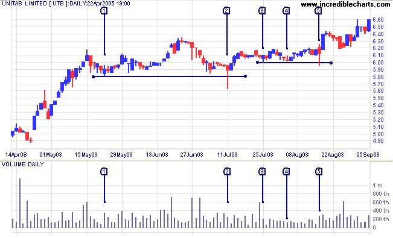

## Table of Contents

## What is a shakeout in stock trading?

A shakeout in stock trading is when a lot of people suddenly sell their stocks, causing the price to drop quickly. This often happens because of rumors, news, or just because everyone is feeling nervous. When the price drops, it can make more people panic and sell their stocks too, which makes the price drop even more.

After a shakeout, the stock price might start to go back up if the selling stops and people start buying again. This can happen if the reason for the panic turns out to be not as bad as everyone thought. Shakeouts can be tricky for traders because they need to decide whether to sell their stocks during the panic or wait and see if the price will recover.

## How does a shakeout affect stock prices?

A shakeout makes stock prices drop fast. It happens when a lot of people start selling their stocks all at once. This can be because of rumors, bad news, or just because everyone is scared. When many people sell, there are more stocks for sale than people wanting to buy them, so the price goes down.

After a shakeout, the stock price might start to go up again. This can happen if the selling stops and people start buying the stocks again. If the reason for the panic turns out to not be so bad, people might feel better and want to buy the stocks at the lower price. But if the bad news keeps coming, the price might keep going down.

## What are the common signs of an impending shakeout?

You might see a shakeout coming if you notice a lot of people starting to sell their stocks quickly. This can happen when there are rumors or bad news about a company. People might also start selling if they see the stock price going down a little bit, which makes them worried that it will keep dropping. If you see a lot of selling happening all at once, it could be a sign that a shakeout is about to happen.

Another sign is when the stock market starts to feel very nervous. You can tell this is happening if you see big changes in stock prices from one day to the next. People might start talking a lot about the stock and sharing their worries. If everyone is feeling scared and unsure, it can lead to a shakeout because people might decide to sell their stocks to avoid losing more money.

## Can you explain the psychological impact of a shakeout on traders?

A shakeout can make traders feel really scared and unsure. When they see the stock price dropping fast, they might start to panic. They might think, "What if the price keeps going down and I lose all my money?" This fear can make them sell their stocks quickly, even if they don't really want to. It's like when everyone is running out of a room, you might start running too, just because you're scared.

After a shakeout, traders might feel relieved if the stock price starts to go back up. They might think, "I'm glad I didn't sell everything!" But if they did sell during the panic, they could feel upset or regretful, especially if the price goes up again. It can be hard for traders to trust their decisions after a shakeout because they might worry about it happening again. This can make them more cautious or even scared to trade in the future.

## What strategies can beginners use to survive a shakeout?

When a shakeout happens, beginners should try to stay calm and not panic. It's easy to feel scared when you see the stock price dropping fast, but selling your stocks right away might not be the best idea. Instead, take a deep breath and think about why the price is going down. Is it because of bad news about the company, or is it just because everyone is scared? If you believe in the company and think the price will go back up, you might want to hold onto your stocks.

Another good strategy is to have a plan before a shakeout happens. Decide ahead of time what you will do if the stock price drops a lot. Maybe you will sell some of your stocks to be safe, or maybe you will keep them all because you believe in the company. Having a plan can help you feel more in control and less likely to make quick decisions based on fear. Remember, it's okay to ask for advice from more experienced traders or financial advisors if you're not sure what to do.

## How can technical analysis help in predicting a shakeout?

Technical analysis can help you spot a shakeout before it happens by looking at charts and patterns. One thing to watch for is when the stock price starts to go down fast and more people are selling than buying. This can show up on a chart as a big drop in price, and it might be a sign that a shakeout is coming. Another thing to look for is when the stock price breaks through a support level, which is a price where the stock usually stops dropping. If it goes below this level, it could mean a shakeout is about to happen.

Another way technical analysis can help is by looking at trading [volume](/wiki/volume-trading-strategy). If you see the volume going up a lot while the price is going down, it means a lot of people are selling their stocks quickly. This can be a warning sign of a shakeout. By keeping an eye on these patterns and volumes, you can get a better idea of when a shakeout might be coming and be ready for it.

## What role do market makers play during a shakeout?

Market makers are important during a shakeout. They are the people or companies that help make sure stocks can be bought and sold easily. When a lot of people start selling their stocks during a shakeout, market makers step in to buy those stocks. This helps keep the market stable because it stops the price from dropping too fast. Without market makers, the price could go down even more because there would be no one to buy the stocks that people are selling.

During a shakeout, market makers also help by setting prices for stocks. When everyone is selling and the price is going down, market makers decide what the new price should be. They try to keep the price fair so that the market doesn't get too crazy. By doing this, they help traders feel a bit more calm because they know there's someone making sure the market works properly, even when things are scary.

## How do experienced traders capitalize on shakeouts?

Experienced traders often see shakeouts as a chance to make money. When a shakeout happens, the stock price drops fast because a lot of people are selling. These traders might buy the stocks at the lower price because they think the price will go back up later. They believe that the reason for the shakeout, like bad news or rumors, might not be as bad as everyone thinks. By buying when others are scared, they can make a profit when the price goes up again.

These traders also use their knowledge of the market to stay calm during a shakeout. They have plans and strategies that they follow, so they don't panic and sell like many beginners might do. They might even sell some of their stocks before a shakeout if they see signs that it's coming, and then buy them back at a lower price. This way, they can take advantage of the shakeout and make money while others are losing it.

## What are the differences between a shakeout and a market correction?

A shakeout and a market correction both make stock prices go down, but they happen for different reasons. A shakeout happens when a lot of people suddenly start selling their stocks because they are scared. This can be because of rumors, bad news, or just because everyone is feeling nervous. The selling happens fast and the price drops quickly. A shakeout can be over soon if the reason for the panic turns out to not be so bad, and the price might start going up again.

A market correction is different because it happens over a longer time. It's when the stock market has been going up a lot and then starts to go down to a more normal level. This can happen because people think the stocks are too expensive or because the economy is slowing down. A market correction is usually seen as a normal part of the market cycle and can last for weeks or months. Unlike a shakeout, a market correction is not caused by sudden panic but by a gradual change in how people feel about the market.

## How can algorithmic trading influence the occurrence of shakeouts?

Algorithmic trading can make shakeouts happen more often or make them bigger. These are computer programs that buy and sell stocks really fast, sometimes in just a few seconds. When a lot of people start selling stocks during a shakeout, these programs can see it happening and start selling too. This can make the price drop even faster because there are more stocks for sale. If the programs are set up to sell when they see certain signs, like a big drop in price, they can make the shakeout worse.

But [algorithmic trading](/wiki/algorithmic-trading) can also help stop shakeouts from getting out of control. Some programs are made to buy stocks when the price drops a lot. This can help keep the price from falling too far because there are still people, or in this case, computers, buying the stocks. So, while algorithmic trading can make shakeouts happen more often or make them bigger, it can also help calm things down if the programs are set up to buy when everyone else is selling.

## What historical examples illustrate significant shakeouts in the stock market?

One big shakeout happened in October 1987, known as Black Monday. On that day, the stock market crashed, and the Dow Jones Industrial Average dropped by about 22% in one day. A lot of people started selling their stocks because they were scared. This happened really fast and caused a big shakeout. Many people lost a lot of money, and it took a long time for the market to get back to normal. The reason for the panic was not just one thing but a mix of worries about the economy and new computer trading systems that made the selling happen even faster.

Another example of a shakeout was in May 2010, known as the Flash Crash. On that day, the stock market dropped a lot in just a few minutes. The Dow Jones Industrial Average went down by about 1,000 points before coming back up a bit. This happened because a lot of people started selling their stocks all at once, and computer programs made it worse by selling even more. It was a big shakeout because it happened so fast and scared a lot of people. The market got back to normal pretty quickly, but it showed how quickly a shakeout can happen and how computer trading can make it worse.

## How can regulatory changes impact the frequency and severity of shakeouts?

Regulatory changes can make shakeouts happen more or less often and can make them bigger or smaller. If the rules make it harder for people to sell their stocks quickly, like by adding more checks before a trade can happen, shakeouts might not happen as much. This is because it would be harder for everyone to start selling at the same time. Also, if the rules make it so that computer programs can't sell stocks as fast, this can stop shakeouts from getting out of control because these programs can make the selling happen even faster.

On the other hand, if the rules make it easier for people to trade, shakeouts might happen more often and be bigger. For example, if the rules let people trade without as many checks, it could be easier for everyone to start selling their stocks all at once when they get scared. This can make the price drop really fast. Also, if the rules let computer programs trade more freely, they can make shakeouts worse by selling a lot of stocks very quickly when they see the price going down.

## What is Understanding Market Volatility?

Market volatility refers to the degree of variation in trading prices over a specific time frame, characterized by rapid and significant price movements. It is a critical aspect of financial markets and serves as both a challenge and an opportunity for investors and traders. The level of uncertainty associated with volatile markets often deters some investors but attracts others who seek higher returns.

Volatility indicators are vital tools for assessing potential risks and opportunities in stock trading. Bollinger Bands, developed by John Bollinger, measure market volatility by using a statistical chart characterizing the prices and volatility over time. Bollinger Bands consist of a simple moving average (SMA) and two standard deviation lines, one above and one below the SMA. The formula for the upper Bollinger Band is:

$$
\text{Upper Band} = \text{SMA}(n) + k \times \sigma
$$

where $n$ is the duration, $\sigma$ is the standard deviation, and $k$ is the number of standard deviations.

Another widely used [volatility](/wiki/volatility-trading-strategies) indicator is the Volatility Index (VIX), often referred to as the "fear index." The VIX measures the market's expectation of future volatility based on options prices of the S&P 500 index. A high VIX value indicates a high level of expected volatility, which can signal increased risk but also potential opportunity for traders willing to engage in speculative activities.

High market volatility is typically triggered by various factors, including economic news such as changes in GDP growth rates, employment [statistics](/wiki/bayesian-statistics), and inflation data. Geopolitical events, such as elections, trade negotiations, or international conflicts, often lead to abrupt changes in investor sentiment, causing price swings. Additionally, adjustments in fiscal policies, such as government spending or tax changes, alongside monetary policy shifts by central banks, can lead to heightened volatility in stock prices. 

Understanding these triggers and utilizing volatility indicators enables traders to formulate strategies that mitigate risks while capitalizing on price fluctuations, ultimately guiding them toward more informed and strategic investment decisions.

## References & Further Reading

[1]: Bergstra, J., Bardenet, R., Bengio, Y., & Kégl, B. (2011). ["Algorithms for Hyper-Parameter Optimization."](https://dl.acm.org/doi/10.5555/2986459.2986743) Advances in Neural Information Processing Systems 24.

[2]: ["Advances in Financial Machine Learning"](https://www.amazon.com/Advances-Financial-Machine-Learning-Marcos/dp/1119482089) by Marcos Lopez de Prado

[3]: ["Evidence-Based Technical Analysis: Applying the Scientific Method and Statistical Inference to Trading Signals"](https://www.amazon.com/Evidence-Based-Technical-Analysis-Scientific-Statistical/dp/0470008741) by David Aronson

[4]: ["Machine Learning for Algorithmic Trading"](https://github.com/stefan-jansen/machine-learning-for-trading) by Stefan Jansen

[5]: ["Quantitative Trading: How to Build Your Own Algorithmic Trading Business"](https://www.amazon.com/Quantitative-Trading-Build-Algorithmic-Business/dp/1119800064) by Ernest P. Chan