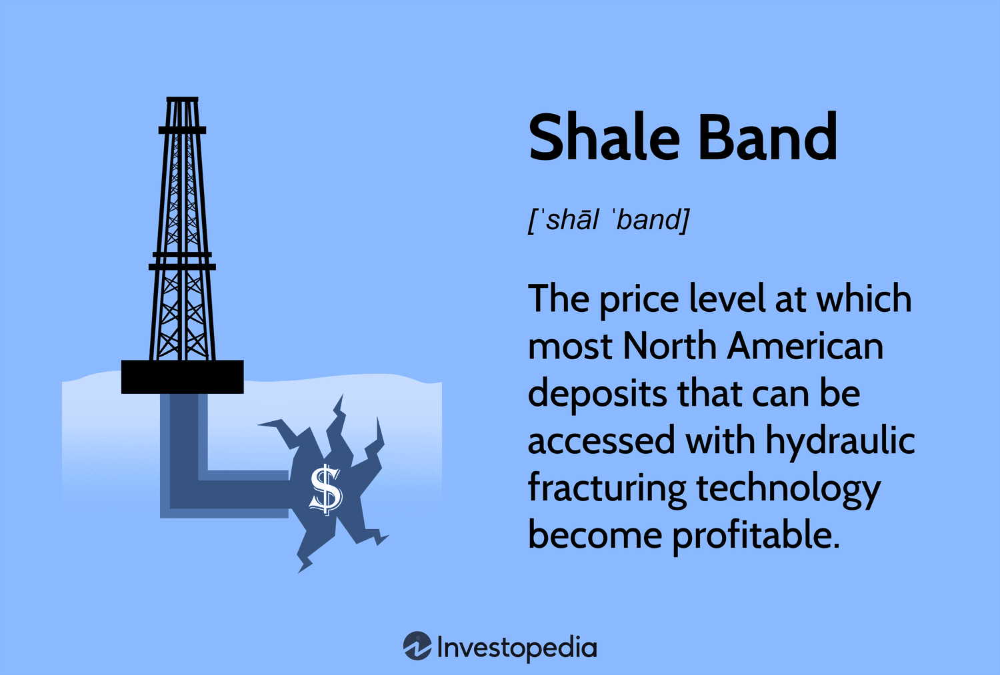

The global energy market is a complex and evolving landscape shaped by numerous factors. Among these, oil prices, the shale band, and algorithmic trading have emerged as significant influences. Oil prices are traditionally governed by a mixture of supply and demand dynamics, geopolitical conditions, and policymaking by influential groups such as the Organization of the Petroleum Exporting Countries (OPEC). However, the introduction of technological advancements has shifted the paradigm, placing algorithmic trading at the forefront of market activity.

Algorithmic trading utilizes sophisticated computer algorithms to execute trades at speeds and frequencies far beyond human capabilities. This method has revolutionized trading in the energy sector, offering the potential for increased market efficiency and liquidity. Yet, it also adds layers of complexity, potentially increasing volatility and deviating prices from their fundamental values. With the rapid execution of large volumes of transactions, algorithmic trading can significantly impact oil prices, often amplifying short-term market movements and influencing long-term price signals.



The shale band, which denotes a price threshold where oil shale production becomes economically feasible, interacts dynamically with these market conditions. The interplay among oil prices, shale production levels, and algorithmic trading strategies can create a feedback loop influencing the energy market's stability and growth prospects.

Understanding these dynamics is crucial for stakeholders across the energy value chain and policymakers. For investors, these variables represent risks and opportunities that could affect investment outcomes. For policymakers, balancing developments in these areas is essential for crafting effective energy policies that stabilize markets and support economic growth. This article will explore how these elements interact and shape the current and future state of the energy market, and discuss their implications for investors and the broader economy, providing a comprehensive understanding of this continually evolving sector.

## Table of Contents

## Understanding Oil Prices and Their Fluctuations

Oil prices are influenced by a complex interplay of factors that constantly affect their fluctuations. Among the most significant influences are geopolitical tensions, natural disasters, and technological advancements, each playing a role in shaping market conditions.

Geopolitical tensions, such as conflicts in key oil-producing regions, can create supply uncertainties, leading to price spikes. For example, tensions in the Middle East often result in increased risk premiums, causing volatility in oil markets. Similarly, natural disasters like hurricanes can disrupt production and supply chains, leading to temporary shortages and price hikes. 

Supply factors, particularly decisions by the Organization of the Petroleum Exporting Countries (OPEC), critically impact oil prices. OPEC's ability to adjust production levels provides it with significant control over the global supply, allowing it to influence prices. When OPEC decides to cut production, the reduced supply tends to drive prices up, whereas increased production can have the opposite effect.

Demand side influences are equally crucial, with economic cycles playing a pivotal role. During periods of economic growth, increased industrial activity and consumption boost demand for oil, pushing prices upward. Conversely, during economic downturns, reduced industrial activity lowers demand, leading to price declines.

In recent years, technological changes, notably the introduction of [algorithmic trading](/wiki/algorithmic-trading), have added a layer of complexity to the determination of oil prices. Algorithmic trading employs sophisticated computer algorithms to execute orders based on set conditions, often reacting to market movements at a speed beyond human capabilities. This has led to increased market [liquidity](/wiki/liquidity-risk-premium) but also added [volatility](/wiki/volatility-trading-strategies), as trades can occur in rapid succession, sometimes creating price swings that deviate from traditional supply and demand dynamics.

The combined effect of these multiple factors adds a layer of unpredictability to oil prices. For investors and policymakers aiming to predict or stabilize oil prices, keeping track of these influences is essential. The ability to anticipate how geopolitical developments, environmental events, supply decisions, and technological advancements interact can provide a strategic advantage in navigating the complex landscape of the global energy market. Understanding these dynamics not only aids in making informed investment decisions but also helps in formulating policies that can mitigate the adverse impacts of price volatility on the broader economy.

## The Shale Band Concept in the Energy Market

The shale band concept serves as a pivotal element in understanding the economic viability of shale oil production within the global energy market. This concept refers to a specific range of oil prices, initially set between $45 and $65 per barrel, which delineates the threshold at which shale oil production becomes economically feasible. Within this range, shale producers can decide to initiate or ramp up production, responding effectively to market signals.

Significant advancements in fracking technology have contributed to lowering the cost of extraction, thereby reducing the price levels initially associated with the shale band. These technological innovations have increased the efficiency of shale production, enabling producers to remain competitive even when global oil prices experience downturns. As a result, the shale band has a substantial impact on global oil supply decisions, with producers adjusting their output based on prevailing prices.

Functioning as a self-correcting mechanism, the shale band helps stabilize oil prices through dynamic production adjustments. When oil prices fall closer to the lower end of the band, production may decrease due to lower profitability, which in turn can lead to a reduction in supply and a potential increase in prices. Conversely, when prices rise towards the upper end, increased production can lead to greater supply and a moderation of price rises. This interaction underscores the shale band as a balancing force within the broader oil market.

Despite its economic benefits, the long-term sustainability of the shale industry is challenged by environmental concerns. The fracking process, central to shale oil extraction, raises issues related to water usage, potential contamination, and seismic activities. These environmental considerations, combined with regulatory pressures, necessitate careful evaluation of the shale industry's impact on ecological systems. As the demand for cleaner energy sources grows, addressing these sustainability challenges becomes imperative for the future of shale production.

## Algorithmic Trading in the Energy Market

Algorithmic trading has become a crucial component of the energy market, with Commodity Trading Advisors (CTAs) playing a significant role. Utilizing complex algorithms, these systems execute trades at high speed, guided by predefined rules and patterns that respond to market conditions to optimize execution and enhance market efficiency. This rapid execution contributes to market liquidity by increasing the number of trades and narrowing bid-ask spreads.

While algorithmic trading enhances market liquidity, it can also exaggerate price movements, creating volatility that may not align with fundamental supply and demand dynamics. For example, when market sentiment shifts, algorithms may trigger a cascade of trades amplifying price swings beyond what fundamental factors would suggest. This disconnect can lead to paper market prices diverging from those in the physical market.

The behavior of algorithmic systems often introduces 'noise' into price signals, complicating the interpretation of market information. Algorithms analyze vast datasets, identifying trading opportunities through patterns and predictive analytics, yet they may react to transient market sentiments or technical signals rather than underlying economic indicators.

Traditional investors, including hedge funds and energy producers, must navigate these complexities as algorithmic trading strategies become more prevalent. Understanding these algorithms provides opportunities to anticipate market movements, but also poses risks as strategies rely heavily on data interpretation and may lead to unintended consequences.

Algorithmic trading presents both advantages and challenges. By scrutinizing trading algorithms and their impact on market dynamics, investors can develop informed strategies to manage risks and capitalize on opportunities. Nonetheless, this demands continuous adaptation in trading models and a keen awareness of technological progress in the trading domain.

## Interplay Between Shale Production and Algorithmic Trading

The relationship between shale oil production levels and algorithmic trading is characterized by a complex interplay of production dynamics and advanced trading strategies. Algorithmic models, often employed by traders, adapt by analyzing factors such as the shale band, a pricing mechanism crucial to predicting production changes. These models are programmed to anticipate shifts in production that may occur as oil prices fluctuate to levels conducive to shale extraction. 

The concept of the shale band, with its thresholds initially set between $45 and $65 per barrel, is pivotal. It acts as a barometer through which algorithmic systems can forecast the economic viability of shale production. As prices inch toward either threshold, algorithms adjust trading positions, influencing market sentiment and creating a feedback loop between production levels and market prices.

High-frequency trading ([HFT](/wiki/high-frequency-trading-strategies)), a subset of algorithmic trading, introduces significant volatility, generating what is often referred to as 'noise' in the market. This noise complicates the task of assessing the real impact of shale production on oil prices. The rapid execution of trades in milliseconds allows for swift reactions to price changes, although not necessarily based on underlying supply and demand conditions. This dissonance can decouple paper market activities from physical market realities, distorting perceptions of oil supply and demand balance.

Shale producers are continually challenged by the volatility introduced by algorithmic trading. The quick nature of trades necessitates a high degree of flexibility and responsiveness from producers who must adapt production schedules to align with rapidly changing market conditions. This requires an acute awareness of market signals to optimize production strategies, ensuring profitability even when faced with erratic price movements.

For market participants, the confluence of agile production adjustments and high-speed trade execution presents both challenges and opportunities. On one hand, this environment demands a recalibration of traditional risk management and investment approaches. On the other hand, those adept at interpreting algorithmic behavior and aligning production capacities accordingly can leverage these dynamics for strategic advantage, maximizing returns in an increasingly complex energy market.

## Implications for Investors and the Global Economy

For investors, understanding the dynamics among oil prices, shale production, and algorithmic trading is crucial for risk assessment and strategic planning. The intertwining of these factors creates a volatile environment that can significantly impact investment portfolios and economic conditions globally. Algorithmic trading, with its speed and efficiency, has emerged as a notable influence on market volatility. This volatility, in turn, affects global economic conditions, influencing inflation rates and guiding investment decisions.

Strategic positioning is essential for investors aiming to navigate this complex landscape. Diversification across different energy sectors or a focus on specialized knowledge can provide pathways to capitalize on market inefficiencies. For example, understanding the implications of the shale band can allow investors to anticipate shifts in oil supply and adjust their holdings accordingly. Moreover, identifying patterns in algorithmic trading can offer insights into potential short-term price movements, creating opportunities for tactical trading strategies.

Policymakers also face the challenge of incorporating these volatile elements into robust economic policies. With the significant role that energy prices play in inflation and general economic stability, governments must consider the impact of algorithmic trading and shale production on market dynamics. Effective regulation and oversight might mitigate some of the adverse effects of rapid trading and excessive speculation on oil prices.

For all market participants, regularly updating trading models and maintaining awareness of technological advancements are critical to staying competitive. The fast-paced developments in trading technologies necessitate a proactive approach to model adaptation. Utilizing tools such as [machine learning](/wiki/machine-learning) to analyze and predict market trends can create a competitive edge. Python, widely used in data analysis and algorithm development, could be employed to simulate market scenarios, test trading algorithms, and refine decision-making processes. Here's an example of how Python might be used to model energy market data:

```python
import pandas as pd
import numpy as np
from sklearn.ensemble import RandomForestRegressor
from sklearn.model_selection import train_test_split

# Hypothetical dataset of oil prices, shale production, and trading activity
data = pd.read_csv('energy_market_data.csv')

# Features and target variable
X = data[['oil_prices', 'shale_production', 'trading_volume']]
y = data['market_volatility']

# Splitting data into training and test sets
X_train, X_test, y_train, y_test = train_test_split(X, y, test_size=0.2, random_state=42)

# Model instantiation and training
model = RandomForestRegressor(n_estimators=100, random_state=42)
model.fit(X_train, y_train)

# Making predictions and assessing accuracy
predictions = model.predict(X_test)
accuracy = model.score(X_test, y_test)

print(f'Model Accuracy: {accuracy * 100:.2f}%')
```

Such an approach not only helps in anticipating market shifts but also ensures that strategies are adapting to the ongoing transformation of the global energy market.

## Conclusion

The energy market is experiencing significant transformation, primarily driven by advancements in technology and changes in production capabilities. Oil prices are especially susceptible to these transformations, as both shale production and algorithmic trading introduce complexities and volatility. Shale production, by impacting supply dynamics, and algorithmic trading, through its influence on market liquidity and volatility, collectively shape the pricing environment in intricate ways.

For investors and stakeholders, maintaining a vigilant and adaptive approach is vital to effectively navigate the intricate landscape of the energy market. Understanding the interplay between production shifts and technological advancements will be key to managing risks and identifying lucrative opportunities. These challenges, albeit demanding, offer substantial rewards for those proficient in interpreting and responding to market signals, supported by strategies that are both balanced and well-informed.

As the energy landscape evolves, forward-thinking strategies that integrate technological insights and market expertise will be essential. By capitalizing on these potentials, stakeholders stand to gain substantially in this ever-changing market environment.

## References & Further Reading

[1]: Baffes, J., & Dennis, A. (2015). ["Long-Term Drivers of Food Prices"](https://documents1.worldbank.org/curated/en/832971468150565490/pdf/WPS6455.pdf) World Bank Policy Research Working Paper No. 6455.

[2]: Kilian, L. (2009). ["Not All Oil Price Shocks Are Alike: Disentangling Demand and Supply Shocks in the Crude Oil Market"](https://www.jstor.org/stable/25592494) The Review of Economics and Statistics, 90(4), 683-698.

[3]: Geman, H. (2005). ["Commodities and Commodity Derivatives: Modelling and Pricing for Agriculturals, Metals and Energy"](https://download.e-bookshelf.de/download/0000/5675/90/L-G-0000567590-0015270354.pdf) Wiley Finance.

[4]: Erb, C. B., & Harvey, C. R. (2006). ["The Strategic and Tactical Value of Commodity Futures"](https://www.jstor.org/stable/4480745) Financial Analysts Journal, 62(2), 69-97. 

[5]: ["Algorithmic and High-Frequency Trading"](https://www.amazon.com/Algorithmic-High-Frequency-Trading-Mathematics-Finance/dp/1107091144) by Álvaro Cartea, Sebastian Jaimungal, and José Penalva

[6]: Yergin, D. (2011). ["The Quest: Energy, Security, and the Remaking of the Modern World"](https://archive.org/details/questenergysecur0000yerg) Penguin Press.

[7]: ["Shale Gas and Tight Oil Boom: U.S. States' Economic Gains and Vulnerabilities"](https://www.files.ethz.ch/isn/171589/Energy_Brief_Brown_Yucel.pdf) Rand Corporation

[8]: Kumar, S., & Mohan, V. (2016). ["Forecasting Crude Oil Price Volatility using GARCH Models: Evidence from a Developing Economy"](https://www.sciencedirect.com/science/article/pii/S0140988316300469) Economic Modelling, 59, 181-193.