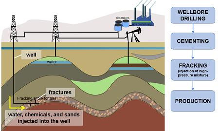

## Table of Contents

## What is shale oil?

Shale oil is a type of oil that is found in shale rock. Shale is a fine-grained sedimentary rock that can trap oil inside it. This oil is different from the oil we usually find because it's harder to get out. To get shale oil, people use a method called hydraulic fracturing, or "fracking." They drill deep into the ground and then use water, sand, and chemicals to break the rock and release the oil.

Shale oil has become important because there is a lot of it in places like the United States. It has helped countries produce more of their own oil instead of buying it from other places. However, getting shale oil out of the ground can be controversial. Some people worry about the environmental impact of fracking, like water pollution and earthquakes. Despite these concerns, shale oil is still a big part of the world's energy supply.

## How is shale oil formed?

Shale oil comes from tiny plants and animals that lived in the ocean millions of years ago. When these creatures died, they sank to the bottom of the ocean and got buried under layers of mud and sand. Over time, this mud and sand turned into rock, and the dead plants and animals turned into a substance called kerogen. Kerogen is like the starting point for oil. As more layers of rock piled up, the pressure and heat from being deep underground turned the kerogen into oil.

This oil got trapped in the shale rock, which is a type of rock that doesn't let liquids move through it easily. The oil stayed there for millions of years until people figured out how to get it out. The shale rock is usually very tight, so the oil can't flow out on its own. That's why we need special methods like fracking to break the rock and release the oil. So, shale oil is a kind of ancient oil that's been locked away in the ground for a very long time.

## What are the primary methods used to extract shale oil?

The main way to get shale oil out of the ground is called hydraulic fracturing, or fracking. This method involves drilling a deep hole into the ground where the shale rock is. Once the hole is drilled, a mix of water, sand, and chemicals is pumped into the hole at high pressure. This high pressure breaks the shale rock and creates tiny cracks. The sand in the mixture keeps these cracks open, and the oil can then flow out through the cracks and up the well to the surface.

Another method that is sometimes used is called horizontal drilling. This is often used along with fracking. In horizontal drilling, after drilling straight down into the ground, the drill turns and goes sideways through the shale rock. This allows the well to cover a larger area of the shale, which can help get more oil out. Both fracking and horizontal drilling have made it possible to get a lot more shale oil out of the ground than was possible before.

## What are the environmental impacts of shale oil extraction?

Getting shale oil out of the ground can hurt the environment. One big problem is water use. Fracking uses a lot of water, and this can be a problem in places where water is already scarce. The water used in fracking is mixed with chemicals, and sometimes this water can leak into the ground and pollute rivers and lakes. This can make the water unsafe for people and animals to drink. Another issue is that the wastewater from fracking can be hard to get rid of safely.

Another environmental impact is the risk of causing small earthquakes. When the water, sand, and chemicals are pumped into the ground, it can put pressure on the rocks and cause them to move. This can lead to small earthquakes, which can be a problem for people living nearby. Also, the process of drilling and fracking can release methane, a powerful greenhouse gas, into the air. This can add to the problem of climate change. So, while shale oil can help us get more energy, it's important to think about these environmental impacts too.

## How does shale oil contribute to energy security?

Shale oil helps make countries safer when it comes to energy. It does this by letting countries produce more of their own oil instead of having to buy it from other places. For example, the United States has a lot of shale oil, and this has helped them produce more oil at home. When a country can make its own oil, it doesn't have to worry as much about what's happening in other parts of the world. This can make the country's energy supply more stable and less likely to be affected by problems in other countries.

However, using shale oil for energy security is not without its challenges. The process of getting shale oil out of the ground can be expensive and can harm the environment. This means that while shale oil can help with energy security, countries need to think carefully about how to balance the benefits with the costs. By finding ways to extract shale oil more safely and efficiently, countries can better use this resource to keep their energy supply secure.

## What are the economic benefits of shale oil production?

Shale oil production can bring a lot of money to a country. When a country starts producing more of its own oil, it doesn't have to spend as much money buying oil from other places. This can save a lot of money and help the country's economy. Also, the process of getting shale oil out of the ground creates jobs. People are needed to drill the wells, operate the equipment, and transport the oil. These jobs can help people earn money and support their families, which is good for the local economy.

Another economic benefit of shale oil is that it can make energy prices more stable. When a country relies less on oil from other countries, it is less affected by changes in the global oil market. This can help keep energy prices steady, which is good for businesses and people who need to plan their budgets. Overall, shale oil can help a country's economy by saving money, creating jobs, and keeping energy prices stable.

## Can you explain the process of hydraulic fracturing used in shale oil extraction?

Hydraulic fracturing, or fracking, is a way to get oil out of shale rock. First, a deep hole is drilled into the ground where the shale is. Then, a special mix of water, sand, and chemicals is pumped into the hole at very high pressure. This high pressure breaks the shale rock and makes tiny cracks in it. The sand in the mix helps keep these cracks open so the oil can flow out. The oil then moves through the cracks and up the well to the surface.

Sometimes, fracking is used with another method called horizontal drilling. After drilling straight down, the drill turns and goes sideways through the shale rock. This lets the well cover a bigger area of the shale, which can help get more oil out. Both fracking and horizontal drilling have made it possible to get a lot more shale oil out of the ground than was possible before.

## What are the differences between shale oil and conventional oil?

Shale oil and conventional oil are both types of oil, but they come from different places and are extracted in different ways. Conventional oil is found in big underground pools where the oil can flow easily. It's easier to get out because you just need to drill a hole and the oil comes up by itself. Shale oil, on the other hand, is trapped in tiny spaces inside shale rock. Shale rock is very tight, so the oil can't flow out on its own. To get shale oil out, people use a method called fracking, which involves drilling and then breaking the rock with high-pressure water, sand, and chemicals.

Another difference is where you find these types of oil. Conventional oil is often found in places like the Middle East, where there are big oil fields. Shale oil is found in many places around the world, including the United States, which has a lot of shale rock. Because of this, shale oil has helped countries like the U.S. produce more of their own oil instead of buying it from other places. But getting shale oil out of the ground can be more expensive and can harm the environment more than getting conventional oil.

## How has the shale oil industry affected global oil prices?

The shale oil industry has had a big effect on global oil prices. When the United States started producing a lot of shale oil, it added more oil to the world market. This extra oil made prices go down because there was more oil available than people needed. Countries that used to control the oil market, like those in OPEC, had to deal with this new competition. They had to decide whether to cut their own oil production to keep prices up or let prices fall.

But the impact of shale oil on prices can change over time. When oil prices are high, it makes sense for companies to spend money on fracking to get shale oil out of the ground. But when prices fall too low, it can become too expensive to keep fracking, so companies might stop. This can cause oil prices to go up again because there's less oil being produced. So, the shale oil industry adds a lot of ups and downs to the global oil market, making prices more unpredictable.

## What are the major shale oil regions in the world?

The biggest shale oil region in the world is in the United States. The most famous place is the Permian Basin, which is in Texas and New Mexico. Another important area is the Bakken Formation, which is in North Dakota and Montana. These places have a lot of shale rock with oil trapped inside. Because of this, the United States has been able to produce a lot more oil in recent years.

Outside of the United States, there are other important shale oil regions too. In Argentina, the Vaca Muerta formation is a big shale oil area. It's in the Patagonia region and has a lot of potential for oil production. In China, the Sichuan Basin is another place where people are trying to get shale oil out of the ground. These regions are important because they can help countries produce more of their own oil, which can make them less dependent on oil from other places.

## What technological advancements have improved shale oil extraction efficiency?

New technology has made it easier and faster to get shale oil out of the ground. One big improvement is in drilling. Now, drills can go deeper and turn sideways to reach more of the shale rock. This is called horizontal drilling. It helps get more oil out because the drill can cover a bigger area. Another important technology is in fracking. The equipment used to pump water, sand, and chemicals into the ground is better now. This means fracking can be done more quickly and with less water, which saves money and helps the environment.

Another advancement is in the way we use data and computers. Now, companies can use special software to study the ground and figure out the best places to drill. This is called seismic imaging. It helps find the best spots for oil and makes drilling more successful. Also, new ways to recycle the water used in fracking have been developed. This means less new water is needed, and it's better for the environment. All these new technologies have made shale oil extraction more efficient and less costly.

## What are the future prospects and challenges for the shale oil industry?

The future of the shale oil industry looks promising because there's still a lot of shale oil in the ground that hasn't been used yet. Countries like the United States and Argentina have big shale oil regions that can help them produce more of their own oil. This can make them less dependent on oil from other places, which is good for energy security. New technology is also making it easier and cheaper to get shale oil out of the ground. This means more oil can be produced without spending as much money.

But there are challenges too. One big challenge is the environment. Fracking can use a lot of water and can pollute rivers and lakes if not done carefully. It can also cause small earthquakes and release methane gas, which is bad for the climate. Another challenge is the ups and downs of oil prices. When prices are low, it can be too expensive to keep fracking, so companies might stop. This can make it hard to plan for the future. So, while the shale oil industry has a lot of potential, it needs to find ways to balance the benefits with the costs and environmental impacts.

## References & Further Reading

[1]: Egan, M. (2019). [“How shale oil reshaped the geopolitics of energy.”](https://academic.oup.com/isq/article-abstract/64/3/544/5866005) CNN Business.

[2]: Wang, Z., & Krupnick, A. (2013). ["A retrospective review of shale gas development in the United States: What led to the boom?"](https://www.jstor.org/stable/26189470) Resources for the Future.

[3]: Davis, L. W. (2015). ["The Environmental Cost of Global Fuel Subsidies."](https://www.cato.org/sites/cato.org/files/pubs/pdf/rb53.pdf) American Economic Review, 105(5), 127-130.

[4]: Vigna, P. (2020). ["The Shale Revolution's Stumble Will Leave a Mark."](https://link.springer.com/article/10.1007/s13563-013-0042-4) The Wall Street Journal.

[5]: Fahey, J. (2017). ["Algorithms in Trading: The Making of a Perfect Storm."](https://licensefiles.com/licenses/bernard-j-fahey-jr/59742) BBC News.

[6]: Kissell, R. (2013). ["The Science of Algorithmic Trading and Portfolio Management."](https://storage.sandtears.com/06_Book/The%20Science%20of%20Algorithmic%20Trading%20and%20Portfolio%20Management%2C%20Robert%20Kissell.pdf) Academic Press.

[7]: Perez, A. (2018). ["Algorithmic and High-Frequency Trading."](https://api.pageplace.de/preview/DT0400.9781316455579_A25606943/preview-9781316455579_A25606943.pdf) Springer.