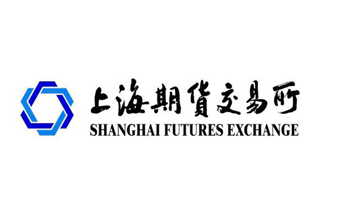

## Table of Contents

## What is the Shanghai Futures Exchange (SHFE)?

The Shanghai Futures Exchange (SHFE) is a place in China where people can buy and sell futures contracts. Futures contracts are agreements to buy or sell something at a future date for a price agreed upon today. The SHFE was started in 1999 and is one of the biggest futures exchanges in the world. It helps people manage the risks of price changes in things like metals and energy.

The SHFE trades futures for many different things, like copper, aluminum, zinc, and natural rubber. This helps companies that use these materials to plan better and protect themselves from big price swings. The exchange also helps set prices that are used around the world. By providing a place for trading, the SHFE makes the market more open and fair for everyone involved.

## When was the Shanghai Futures Exchange established?

The Shanghai Futures Exchange, or SHFE, was set up in 1999. It is a big place in China where people can trade futures contracts. Futures contracts are deals to buy or sell something later at a price agreed on now.

The SHFE helps people and companies manage the risk of price changes for things like metals and energy. It trades futures for items like copper, aluminum, and natural rubber. This helps companies plan better and protects them from big price changes. The SHFE is important because it helps set prices that are used all over the world and makes trading fair for everyone.

## What types of commodities are traded on the SHFE?

The Shanghai Futures Exchange, or SHFE, is a place where people trade futures contracts for different types of commodities. The main commodities they trade are metals like copper, aluminum, zinc, lead, and nickel. These metals are important for many industries, like building and making things.

Besides metals, the SHFE also trades futures for natural rubber. Natural rubber is used to make tires and other products. Trading these commodities on the SHFE helps companies plan ahead and manage the risk of price changes. This makes it easier for them to do business and keep costs steady.

## How does the SHFE contribute to China's economy?

The Shanghai Futures Exchange, or SHFE, helps China's economy by giving companies a way to manage the risk of price changes for important materials like metals and rubber. When companies can plan better and know what prices will be in the future, they can make smarter decisions about buying and selling. This helps them save money and be more efficient. The SHFE makes it easier for companies to do business and grow, which is good for the whole economy.

Also, the SHFE helps set prices that are used all around the world. When people from different countries use the prices from the SHFE, it makes China more important in the global market. This can attract more business and investment to China. By making the market more open and fair, the SHFE helps everyone involved and supports the growth of China's economy.

## What are the trading hours of the SHFE?

The Shanghai Futures Exchange, or SHFE, has specific times when people can trade. The main trading hours are from 9:00 AM to 11:30 AM and then from 1:30 PM to 3:00 PM, Beijing time. These times are when most of the trading happens.

There is also a special time for trading after the main hours, called the after-hours session. This session runs from 9:00 PM to 2:30 AM the next day, Beijing time. This extra time lets people from different time zones around the world trade too.

## What are the membership requirements for the SHFE?

To become a member of the Shanghai Futures Exchange, or SHFE, a company needs to meet certain rules. They must have a good reputation and enough money to handle the risks of trading futures. The company also needs to have people who know a lot about futures trading. This helps make sure that members can trade safely and follow the rules.

There are different types of members at the SHFE. Some members can trade for themselves, while others can also trade for their customers. To apply, a company needs to fill out forms and give information about their business and money situation. The SHFE looks at this information carefully to decide if the company can be a member. This process helps keep the exchange fair and safe for everyone.

## How does the SHFE regulate trading activities?

The Shanghai Futures Exchange, or SHFE, makes sure trading is fair and safe by having strict rules. They watch trading closely to stop any bad behavior, like trying to trick the market or not following the rules. If someone breaks the rules, the SHFE can punish them. This might mean fines, stopping them from trading, or even taking them to court. By doing this, the SHFE keeps the market honest and protects everyone who trades there.

The SHFE also has systems to check trades and make sure they are done correctly. They use computers to watch for anything unusual in trading patterns. If they see something strange, they can look into it more to find out what's happening. This helps stop problems before they get big. By keeping a close eye on everything, the SHFE makes sure the market works well and everyone can trust it.

## What are some key differences between the SHFE and other global futures exchanges?

The Shanghai Futures Exchange, or SHFE, is different from other global futures exchanges in a few ways. First, it focuses mainly on commodities like metals and natural rubber, which are important for industries in China. Other global exchanges might trade a wider range of products, including financial products like stock indexes or currencies. Also, the SHFE has trading hours that fit the Chinese market, with sessions in the morning and afternoon, and an after-hours session that helps traders from different time zones.

Another key difference is that the SHFE is regulated by the Chinese government, which means it follows China's laws and rules. This can be different from exchanges in other countries, which might have different regulations. The SHFE also plays a big role in setting global prices for the commodities it trades, which can affect markets around the world. This makes it an important part of the global economy, even though it is based in China.

## How has the SHFE evolved its product offerings over time?

The Shanghai Futures Exchange, or SHFE, has changed a lot since it started in 1999. At first, it mainly traded futures for metals like copper, aluminum, and zinc. These were important for China's growing industries. Over time, the SHFE added more products to meet the needs of the market. For example, they started trading futures for lead, nickel, and natural rubber. This helped more companies use the SHFE to manage their risks and plan for the future.

The SHFE keeps looking for new ways to help its members. They have added options trading for some of their products. Options are like futures but give traders more choices. The SHFE also works on making its systems better, so trading is easier and safer. By adding new products and improving how things work, the SHFE stays important in China and around the world.

## What role does the SHFE play in global commodity pricing?

The Shanghai Futures Exchange, or SHFE, helps set prices for commodities around the world. It does this by trading futures for things like copper, aluminum, and natural rubber. When people trade these futures, they agree on prices for the future. These prices are watched by people everywhere, not just in China. So, when the SHFE sets a price for copper, for example, it can affect what people pay for copper all over the world.

Because the SHFE is so big and important, it has a lot of power in the global market. Companies and traders from different countries use the prices from the SHFE to make their own deals. This makes the SHFE a key part of the global economy. By giving clear and fair prices, the SHFE helps everyone know what things are worth, which makes trading easier and more trustworthy for everyone.

## What are the technological advancements implemented by the SHFE to enhance trading?

The Shanghai Futures Exchange, or SHFE, has made its trading better by using new technology. They use computers to watch trading and make sure everything is fair. This helps them catch any strange trading quickly. They also have a system that lets traders do their work faster and easier. This system helps traders see prices and make deals in real-time, which means they can react to changes in the market right away.

Another way the SHFE has used technology is by making their trading platform better. They have added options trading, which gives traders more choices. The SHFE also works on making their systems safer and more reliable. This means traders can trust that their deals will go through without problems. By using technology, the SHFE helps make trading smoother and more secure for everyone involved.

## How does the SHFE manage risks associated with futures trading?

The Shanghai Futures Exchange, or SHFE, works hard to manage the risks that come with trading futures. They do this by setting rules that everyone has to follow. These rules help stop people from doing things that could hurt the market, like trying to trick others or making prices go up and down too much. The SHFE also watches trading closely. They use computers to check for anything unusual. If they see something strange, they can stop it before it causes big problems. This helps keep the market safe for everyone.

Another way the SHFE manages risk is by making sure companies that trade on the exchange have enough money. This money, called margin, acts like a safety net. If prices change a lot, the margin helps cover any losses. The SHFE also educates traders about the risks of futures trading. By teaching people how to trade safely, the SHFE helps them make better choices. All these steps together help the SHFE keep trading fair and reduce the chances of big problems happening.

## References & Further Reading

[1]: Fung, H.G., Leung, W.K., & Xu, X.E. (2001). "Information Role of U.S. Futures Trading in a Global Financial Market." Journal of Futures Markets. [Link to Journal](https://link.springer.com/article/10.1023/A:1027384330827)

[2]: Cheng, K.C., & Xiong, W. (2014). "Financialization of Commodity Markets." Annual Review of Financial Economics. [Link to Journal](https://www.nber.org/papers/w19642)

[3]: Pirrong, C. (2011). "The Economics of Commodity Trading Firms." Trafigura White Paper. [Link to Paper](https://www.trafigura.com/media/k4ocz3zq/2015_trafigura_economics_of_commodity_trading_firms_abridged_en.pdf)

[4]: Hong, H., & Yu, J. (2009). "Commodity Market Interest and Asset Return: A Long-Run Perspective." Journal of Banking & Finance. [Link to Journal](https://link.springer.com/article/10.1007/s10668-024-05865-y)

[5]: Black, F. (1976). "The Pricing of Commodity Contracts." Journal of Financial Economics. [Link to Journal](https://www.sciencedirect.com/science/article/pii/0304405X76900246)

[6]: Shanghai Futures Exchange. (n.d.). [About SHFE](https://www.barchart.com/futures/prices-by-exchange/shfe)