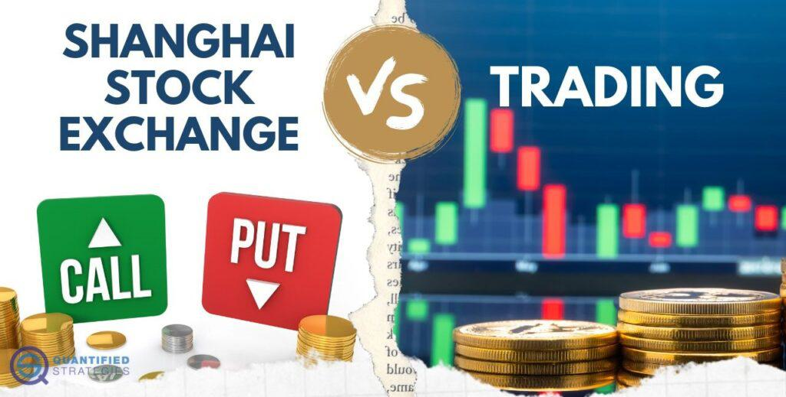

The Shanghai Futures Exchange (SHFE) holds a significant position within China's financial landscape as one of the key platforms for trading commodity futures. Since its establishment in 1998, SHFE has become a central hub for trading a variety of commodities, including metals, energy resources, and agricultural products. This prominence reflects the exchange's capacity to meet the demands of both domestic and international markets.

The SHFE's strategic importance in commodities trading can be attributed to its role in facilitating price discovery and risk management for diverse sectors. By offering futures contracts on essential commodities like copper, aluminum, crude oil, and rubber, SHFE supports key industrial activities and provides a barometer for economic trends in China. As such, the exchange's operations are intricately linked to China's industrial growth and economic policies.

The exchange's evolution and its regulatory framework have been shaped by the broader reforms in China's financial markets. These reforms aim to enhance market stability, transparency, and efficiency, thereby increasing the credibility of the SHFE in the global arena. Understanding SHFE is vital for analyzing the dynamics of global commodity markets, as China's industrial demand and marketing strategies significantly influence global supply and pricing structures.

In recent years, SHFE has been at the forefront of integrating advanced trading technologies and international best practices, considerably influencing the rise of algorithmic trading in regulated environments. This trend reflects a shift towards more efficient and fast-paced trading methodologies, which are gradually gaining traction despite certain regulatory restrictions on high-frequency trading.

The ongoing internationalization efforts by SHFE, such as the introduction of yuan-denominated crude oil futures, illustrate China's objective to embed its financial mechanisms within the global economy. This international outreach not only elevates SHFE's status as a commodities exchange but also enhances China's influence in global economic affairs.

In conclusion, an analysis of the Shanghai Futures Exchange offers valuable insights into the intricacies of the global commodities market and underscores China's evolving role in it. The exchange's development trajectory, including advancements in technology, regulatory adaptations, and international collaborations, continues to shape its future outlook, thus making it a focal point for stakeholders in global finance and trade.

## Table of Contents

## History of Shanghai Futures Exchange

The Shanghai Futures Exchange (SHFE), established in 1998, emerged from the consolidation of three key exchanges: the Shanghai Metal Exchange, the Shanghai Cereals and Oil Exchange, and the Shanghai Commodity Exchange. This merger marked a significant step in the evolution of China's commodities trading landscape. The formation of SHFE was part of a broader initiative during the late 1990s to restructure and modernize China's financial sector, particularly the futures industry. The goal was to create a robust mechanism for managing risk and enhancing [liquidity](/wiki/liquidity-risk-premium) in various commodity markets, reflecting China's rapid economic growth and industrialization.

Prior to its formation, China's futures markets were fragmented, with multiple regional exchanges offering limited liquidity and oversight. The consolidation into SHFE addressed these challenges by centralizing trading activities, improving regulatory oversight, and enhancing the overall efficiency of commodities trading.

The development of SHFE can be examined through the lens of China's regulatory landscape. Over the years, China's regulatory framework for futures markets has evolved significantly. The China Securities Regulatory Commission (CSRC), established in 1992, plays a pivotal role in overseeing and regulating futures markets, ensuring market stability, transparency, and investor protection. The CSRC has introduced numerous reforms aimed at strengthening the supervisory mechanisms, aligning with international best practices, and facilitating the integration of China's commodity markets into the global financial system.

Since its inception, SHFE has become one of the leading platforms for commodity trading in Asia. It offers a wide range of futures contracts, attracting both domestic and international investors. The exchange's growth has been bolstered by China's increasing demand for raw materials driven by industrialization and urbanization. Moreover, SHFE has continuously adapted to changing market dynamics and regulatory environments, emphasizing innovation and technological advancements to maintain its competitive edge in the global market.

Overall, the history of the Shanghai Futures Exchange reflects China's broader economic transformation and its ongoing efforts to build a sophisticated and internationally competitive financial market infrastructure. SHFE remains a crucial component of China's financial development strategy, contributing to the country's stature within global commodities markets.

## Key Commodities Traded on SHFE

The Shanghai Futures Exchange (SHFE) offers futures contracts on a diverse range of commodities, playing a significant role in both domestic and international markets. Notably, the SHFE is a primary venue for trading base metals such as copper, aluminum, and zinc. These metals are integral to China's industrial infrastructure, with copper serving as a key component in China's electrical and construction sectors due to its excellent conductivity and durability. Aluminum, known for its lightweight and versatility, is widely used in transportation and packaging industries, underscoring China's dynamic manufacturing capabilities. Zinc, commonly employed as a protective coating for steel, supports the country's burgeoning construction and automotive industries.

Energy commodities constitute another vital category of contracts on the SHFE, particularly since the establishment of the Shanghai International Energy Exchange (INE). Crude oil futures, denominated in yuan, have allowed for greater participation from domestic and international investors, helping to position China as a critical player in the global energy markets. Natural gas futures also hold significant trading volumes, reflecting China's strategic emphasis on this cleaner-burning fuel source in its energy transition efforts.

Agricultural commodities like rubber are actively traded on the SHFE, mirroring the substantial demand from China's automotive and manufacturing sectors for this essential material. As the world's largest car market, China's consumption of rubber for tire production and other applications is a key driver of economic activity in this commodity.

Each of these commodities plays a unique role in supporting China's industrial sectors, reflecting broader economic trends of urbanization, technological development, and international trade expansion. The SHFE's comprehensive offerings of commodity futures contracts enable market participants to hedge against price risks, speculate on price movements, and gain exposure to one of the world's most dynamic and rapidly evolving economies.

## Trading Rules and Regulations

The Shanghai Futures Exchange (SHFE) operates under a strict regulatory framework established by the China Securities Regulatory Commission (CSRC). These regulations are essential for ensuring the orderly function of the market and preserving the integrity of commodity futures trading.

SHFE's trading activities are governed by specifically defined trading hours and settlement procedures. The exchange typically operates from Monday to Friday, with pre-specified trading sessions throughout the day. This structured timing allows for effective monitoring and regulation of market activities, aligning with international standards and minimizing the risk of price manipulation or irregularities during trading.

Margin requirements are a fundamental component of SHFE’s regulatory framework. They are designed to mitigate credit risk by requiring traders to deposit a certain percentage of the contract value upfront, serving as a financial guarantee. This ensures that parties maintain sufficient capital to cover potential losses, thereby promoting market stability. Margin levels may vary depending on the [volatility](/wiki/volatility-trading-strategies) and risk profile of the specific commodity being traded.

Position limits are another regulatory measure employed by SHFE to control market volatility. These limits cap the number of futures contracts that a single trader or group of linked traders can hold, reducing the potential for market manipulation. This regulation also aims to prevent any undue concentration of market power, fostering a fair and competitive trading environment.

Trading fees set by SHFE are crucial for maintaining operational stability and market development. These fees, including transaction fees and administrative dues, ensure the exchange's sustainability and contribute to the development of robust trading infrastructure.

Adhering to these rules is mandatory for all market participants, reflecting SHFE's commitment to maintaining a transparent and efficient market. It helps prevent fraudulent activities, ensuring a level playing field for domestic and international investors alike. Consequently, the regulatory landscape at SHFE not only safeguards market integrity but also enhances investor confidence, promoting long-term growth and stability in China’s commodity futures markets.

## Internationalization and Market Impact

The Shanghai Futures Exchange (SHFE) has strategically advanced its internationalization to solidify its role in the global commodities market. This discussion highlights how SHFE's efforts aim to integrate China's financial markets with global trade, thereby enhancing China's position and influence on the world stage.

One of the landmark steps in SHFE's internationalization was the introduction of yuan-denominated [crude oil](/wiki/crude-oil) futures in 2018. This move represented the first commodity futures contract in China open to foreign investors without limitations, showcasing a significant shift towards openness. This development aimed to provide a benchmark reflective of the demand and supply dynamics in Asia, particularly in the energy sector. Furthermore, it increased the yuan's usage in international trade, aligning with China's broader economic strategy to enhance its currency's global presence.

In extending its international collaboration, SHFE has fostered partnerships with major international exchanges, such as the London Metal Exchange (LME). These alliances facilitate shared knowledge, technology, and market access, enhancing SHFE's operational frameworks and credibility in the global market. Collaborative ventures with LME exemplify efforts to synchronize trading practices and standards, ensuring smoother integration of global trading activities.

These efforts to internationalize not only aim at expanding SHFE's market influence but also advancing China's economic leverage. By encouraging foreign investment and exchange partnerships, SHFE supports the broader strategy of expanding China's engagement and competitiveness in global finance. The introduction of international financial practices and standards also fosters trust and transparency, crucial for attracting a wider range of global investors.

In summary, SHFE's strategic internationalization, marked by yuan-denominated crude oil futures and critical global partnerships, positions it as a leading player in the global commodities arena. These initiatives bolster China's economic influence while aligning with its objectives to integrate more deeply into the world economy and enhance the international application of its currency.

## Algo Trading in Chinese Markets

Algorithmic trading, commonly referred to as algo trading, is increasingly becoming a focal point in China's financial markets despite existing restrictions on high-frequency trading ([HFT](/wiki/high-frequency-trading-strategies)). Unlike traditional trading methods, [algorithmic trading](/wiki/algorithmic-trading) utilizes automated and pre-programmed trading instructions to account for variables such as time, price, and [volume](/wiki/volume-trading-strategy). This method's efficiency and precision are especially appealing in dynamic markets like the Shanghai Futures Exchange (SHFE), where low latency can be a decisive [factor](/wiki/factor-investing).

The limitations placed on HFT in China have positioned low latency and alternative algo trading as crucial strategies. Low latency in trading refers to the minimal delay between a trading signal being triggered and the actual execution of the trade. This reduction in response time is critical for capitalizing on fleeting market opportunities and managing the high-speed data processing demands of modern financial markets. By focusing on enhancing network infrastructures and server colocations, SHFE is optimizing conditions for algo trading to thrive within regulatory boundaries.

Notably, there is an increasing interest from international investors in China's algorithmic trading landscape. Foreign traders are attracted by the scale and diversity of the Chinese markets, coupled with the advantages offered by algorithmic trading in capturing market efficiencies. As China continues to internationalize its financial markets, platforms like SHFE provide gateway opportunities for global traders seeking exposure to Asian commodities.

The SHFE is equipped with robust technological infrastructure to support and facilitate algorithmic trading. It offers sophisticated trading systems and data analytics tools designed to improve execution speed and accuracy. This infrastructure not only enhances trading efficiency but also helps mitigate risks associated with rapid market movements.

In summary, while the Chinese regulatory environment imposes certain restrictions on high-frequency trading, the growing acceptance and encouragement of algorithmic trading reflect broader financial innovation in the region. The development of supportive infrastructure and regulatory frameworks is expected to bolster these advanced trading strategies, allowing exchanges like SHFE to play an influential role in China's integration into the global financial ecosystem.

## Challenges and Opportunities

Regulatory challenges continue to present obstacles for commodity trading on the Shanghai Futures Exchange (SHFE), notably concerning the need for improved transparency and streamlined processes. The China Securities Regulatory Commission (CSRC) enforces rigorous regulations, which, while ensuring market stability, can sometimes lead to complex administrative procedures that discourage participation from potential investors, especially foreign entities. Streamlining these processes could enhance engagement and foster a more accessible trading environment.

Despite these regulatory hurdles, the SHFE is well-positioned to capitalize on significant opportunities stemming from China's rapid urbanization and industrialization. As the country continues to expand its infrastructure and industrial base, the demand for commodities is set to rise, reinforcing the SHFE's role as a crucial conduit for these resources. This growth trajectory aligns with China's overarching economic ambitions and offers the SHFE an expanded domain to increase its influence and trading volume.

Technological advancements present additional prospects for the SHFE. Innovations such as blockchain and [artificial intelligence](/wiki/ai-artificial-intelligence) (AI) offer promising solutions to existing trading barriers. Blockchain technology can be utilized to enhance transparency and security in transactions, thereby building trust among participants and regulators. AI, on the other hand, provides the means to optimize trading strategies and improve operational efficiencies through data analysis and predictive modeling.

The SHFE actively partakes in leveraging these technologies. By integrating advanced tools and systems, the exchange enhances its infrastructure, allowing for more efficient order matching and improved latency in trade execution. This technological embrace positions SHFE as an innovative player in the global commodities market and encourages both domestic and international participants to engage more deeply with the exchange.

Given these dynamics, the SHFE occupies a pivotal role in navigating regulatory challenges while simultaneously harnessing the opportunities presented by modernization and technological progress. Through strategic implementation of cutting-edge technologies and efforts to simplify regulatory processes, the SHFE can continue to grow and adapt, reinforcing its standing on both national and international stages.

## Conclusion and Future Outlook for SHFE

The Shanghai Futures Exchange (SHFE) has emerged as a significant participant in the global commodity markets, establishing a solid foundation within China's rapidly expanding economic landscape. Its influence and operations have made it an essential entity for investors and traders worldwide who seek exposure to China's robust commodity sectors.

Future growth for SHFE is expected to hinge on a strategic approach, primarily focusing on deeper integration with global markets. By fostering partnerships and enhancing accessibility for international investors, SHFE can expand its market reach and solidify its status as a central player in global trading. This global integration is critical as it could facilitate more robust price discovery and liquidity, increasing its appeal to a broader range of market participants.

Technological enhancement is another crucial area for SHFE's future development. By adopting advanced technologies such as artificial intelligence, blockchain, and data analytics, SHFE can improve the speed, efficiency, and transparency of its trading processes. These technologies could also serve to enhance risk management frameworks, providing a more secure and reliable trading environment. Blockchain, for instance, may offer streamlined clearing and settlement processes, reducing operational risks and costs.

The exchange's efforts in sustainability and product diversification are pivotal in maintaining a competitive edge. By introducing environmentally friendly products and practices, SHFE can align itself with global sustainability trends, attracting socially responsible investments. Additionally, expanding its commodity offerings to include new sectors or innovative financial products may create new revenue streams and capture emerging market demands.

Regulatory adaptations will play a fundamental role in SHFE's future. As international participation increases, aligning with global regulatory standards while adapting to domestic policy shifts will be necessary to maintain compliance and market confidence. This could involve refining existing regulations around trading practices, settlement procedures, and market surveillance to ensure robust governance.

In conclusion, SHFE is well-positioned to capitalize on emerging global opportunities through continuous improvement and strategic innovation. By leveraging its established foundation, enhancing technology, pursuing sustainability, and aligning regulatory measures, SHFE can continue to grow and sustain its influence within the global commodity markets.

## References & Further Reading

[1]: Fung, H.G., Leung, W.K., & Xu, X.E. (2001). "Information Role of U.S. Futures Trading in a Global Financial Market." Journal of Futures Markets. [Link to Journal](https://link.springer.com/article/10.1023/A:1027384330827)

[2]: Cheng, K.C., & Xiong, W. (2014). "Financialization of Commodity Markets." Annual Review of Financial Economics. [Link to Journal](https://www.nber.org/papers/w19642)

[3]: Pirrong, C. (2011). "The Economics of Commodity Trading Firms." Trafigura White Paper. [Link to Paper](https://www.trafigura.com/media/k4ocz3zq/2015_trafigura_economics_of_commodity_trading_firms_abridged_en.pdf)

[4]: Hong, H., & Yu, J. (2009). "Commodity Market Interest and Asset Return: A Long-Run Perspective." Journal of Banking & Finance. [Link to Journal](https://link.springer.com/article/10.1007/s10668-024-05865-y)

[5]: Black, F. (1976). "The Pricing of Commodity Contracts." Journal of Financial Economics. [Link to Journal](https://www.sciencedirect.com/science/article/pii/0304405X76900246)

[6]: Shanghai Futures Exchange. (n.d.). [About SHFE](https://www.barchart.com/futures/prices-by-exchange/shfe)