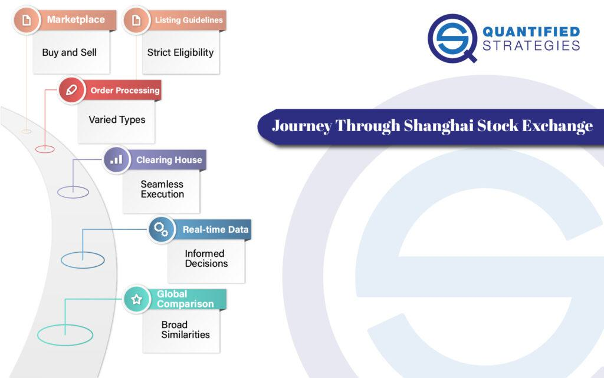

The Shanghai Stock Exchange (SSE) stands as a key component of China's financial ecosystem, being the largest stock exchange within mainland China. With its significant position in the Asian financial markets, the SSE attracts both domestic and international investors, necessitating a robust understanding of its operations. This article will examine the trading dynamics on the SSE, focusing on the rise and impact of algorithmic trading, a domain that has evolved to play a critical role in the modern trading landscape.

In recent years, the SSE has introduced new regulatory frameworks targeting the management of algorithmic trading. These rules are designed to enhance market stability and transparency, making it crucial for investors, both local and foreign, to comprehend and adapt to the regulatory environment. As algorithmic trading becomes more prevalent, understanding these regulations is vital for ensuring compliance and strategizing effectively within this crucial market.

Regulated under the China Securities Regulatory Commission (CSRC), the SSE facilitates the exchange of stocks, funds, bonds, and derivatives. These financial instruments form the backbone of the trading activities on the exchange, influencing the broader economic landscape of China. In summary, understanding the operational framework and recent regulatory developments of the SSE is essential for investors seeking opportunities in China's expanding financial markets.

## Table of Contents

## Overview of Shanghai Stock Exchange

The Shanghai Stock Exchange (SSE), inaugurated in 1990, has established itself as a significant player in the global financial landscape, ranking as the fourth-largest stock exchange by market capitalization. The SSE is a key venue for trading a vast array of securities, including stocks, bonds, and derivatives. It operates a non-profit model under the stringent oversight of the China Securities Regulatory Commission (CSRC).

Central to the structure of the SSE are two distinct types of shares: A-shares and B-shares. A-shares are denominated in the local currency, Chinese Yuan (CNY), and are predominantly available to domestic investors. These shares are crucial for local investors, as they provide access to some of China’s most influential companies, often encompassing previously state-owned enterprises. Conversely, B-shares are denominated in foreign currencies, such as the U.S. dollar (USD), which facilitates participation by international investors. This bifurcation ensures that both domestic and international investors can engage with China's booming market albeit within regulated frameworks.

The companies listed on the SSE often include major financial institutions and enterprises, many of which were formerly state-owned. This includes key sectors such as banking and insurance, which play a pivotal role in China's economic ecosystem. These companies contribute significantly to the exchange’s market capitalization and reflect China's economic priorities and growth sectors.

Furthermore, the SSE enforces rigorous listing requirements, mandating that prospective companies meet specific financial and regulatory criteria. These criteria are enforced to maintain transparency, stability, and investor protection within the marketplace. Approval from the CSRC is mandatory, ensuring that all listed entities uphold these standards and align with national and international best practices.

In summary, the SSE is an indispensable component of China's economic framework, offering vast opportunities for investment while being secured by robust regulatory practices. Its dual-share structure caters to both domestic and international investors, contributing to its stature and influence in the global financial markets.

## Algorithmic Trading in China’s Financial Markets

Algorithmic trading, frequently referred to as algo-trading, involves the use of sophisticated computer algorithms to automate and execute trading orders. It plays an increasingly pivotal role in China’s rapidly evolving stock markets. This method relies on high-speed computations to monitor and trade vast quantities of stocks in fractions of a second, which dramatically alters the dynamics of traditional trading.

A significant advantage of algo-trading is efficiency. These algorithms can process a vast array of market data far faster than a human trader, executing orders in microseconds. This speed allows traders to capitalize on even the smallest market movements, enhancing [liquidity](/wiki/liquidity-risk-premium) and, at times, reducing transaction costs. However, these benefits come with substantial concerns. 

The principal concerns surrounding algo-trading in China's financial markets revolve around market stability and fairness. The rapid and repetitive nature of high-frequency trading can exacerbate [volatility](/wiki/volatility-trading-strategies), leading to abrupt price swings that undermine market stability. Additionally, the technological complexity and sheer power of [algorithmic trading](/wiki/algorithmic-trading) platforms provide well-equipped traders with a competitive edge, potentially leading to an imbalanced playing field and disadvantaging traditional traders.

These issues have prompted recent regulatory changes enacted by the Shanghai Stock Exchange (SSE). Under these new rules, traders are required to openly report algorithmic trading activities, offering transparency into their operations. The criteria that classify activities as algorithmic trading are also clearly defined, ensuring that all affected participants are aware of their obligations. Such measures aim to prevent market manipulation, which can occur through strategies like spoofing – placing large orders to mislead market participants and then canceling them once the price has moved.

The rise of algorithmic trading is double-edged in its impact on market liquidity and volatility. On one side, algorithms can provide continuous liquidity, narrowing bid-ask spreads and improving price efficiency. On the other, the sheer [volume](/wiki/volume-trading-strategy) and speed of such trades can contribute to short-term volatility, particularly if large numbers of algorithms simultaneously engage in the same strategies. This necessitates meticulous monitoring to safeguard against potential manipulation and ensure a fair and orderly market.

In conclusion, algorithmic trading is reshaping China’s financial landscape, offering both opportunities and challenges. The recent regulatory interventions by the SSE are essential steps toward maintaining balance, transparency, and equity within the market, ultimately fostering a more stable and fair trading environment.

## Recent Regulatory Changes and their Implications

New regulations implemented by the Shanghai Stock Exchange (SSE) and the China Securities Regulatory Commission (CSRC) focus on curbing algorithmic trading practices to promote market stability and integrity. These regulations place specific limits on trading frequency and speed, aiming to control the rapid transactions characteristic of algorithmic and high-frequency trading ([HFT](/wiki/high-frequency-trading-strategies)). By regulating these parameters, the SSE seeks to minimize risks associated with market manipulation and excessive volatility.

One of the key aspects of these regulatory changes is the increased requirement for transparency among algorithmic trading participants. Algorithmic traders are now mandated to report their trading activities more comprehensively, including details on the strategies and algorithms they employ. This requirement for greater transparency ensures that the regulatory bodies can monitor and assess the impact of algorithmic trading on market dynamics effectively.

Investors engaging in algorithmic trading must navigate these complex regulations, which include stricter oversight and potential penalties for non-compliance. The new regulatory framework challenges algorithmic traders to adapt their strategies within the constraints set by the SSE and CSRC. Penalties for violating these rules can include fines, trading suspensions, and other disciplinary actions, underscoring the importance of compliance.

The focus on regulating algorithmic trading underscores China’s commitment to maintaining a fair and orderly market environment. These measures align domestic regulatory practices with international standards, which have been evolving to ensure that the benefits of algorithmic trading do not come at the expense of market fairness and stability. By aligning with international norms, China signals its commitment to integrating its financial markets more closely with global practices, which may also enhance the appeal of the SSE to international investors.

In conclusion, these regulatory changes reflect a significant shift in the oversight of algorithmic trading activities in China, aiming to create a more level playing field and a stable market environment. This alignment with global practices and enhanced regulatory oversight presents both challenges and opportunities for algorithmic traders and other market participants in the region.

## Impact on Investors and Market Participants

The new regulations introduced by the Shanghai Stock Exchange (SSE) significantly impact investors and market participants, particularly those involved in algorithmic and high-frequency trading. For international investors interested in these trading methods, understanding these regulations is crucial, as they will influence access to and trading strategies on the SSE.

One immediate effect of these regulations is the potential increase in compliance costs. The rules demand more stringent reporting and adherence to trading frequency and speed limits. These measures are designed to ensure market stability and fairness, creating a level playing field for all participants, whether they are domestic or international. For instance, traders must report any orders executed via algorithms, which adds an administrative layer to trading operations. This additional oversight may lead to higher operational costs, particularly for firms with high-frequency trading strategies that involve numerous trades over short time frames.

As a consequence, high-frequency traders may face new challenges, particularly due to the differentiated fee structures imposed on algorithmic trading activities. These fees are structured to mitigate any undue advantage that high-frequency traders might have, thereby contributing to a more equitable trading environment. The increased costs associated with these fees could reshape the participation landscape, potentially discouraging those solely reliant on speed and frequency as competitive edges.

However, these regulatory changes might have a positive impact by attracting more long-term investors. By curbing excessive volatility often associated with high-frequency trading, the regulations aim to foster a more stable market environment. This aligns with global trends towards more regulated algorithmic trading frameworks, reflecting a broader commitment to market integrity and investor protection. By mitigating volatility, the measures may encourage investment strategies that prioritize [fundamental analysis](/wiki/fundamental-analysis) and long-term growth prospects over short-term gains.

Ultimately, while these regulations introduce new challenges, they also present opportunities. Investors who adapt to the new landscape and integrate compliance into their operational strategies may discover new paths to leverage the growing Chinese financial market. Such understanding is pivotal, as it can help market participants not only comply with but also benefit from the changing regulatory environment that governs one of the world's largest stock exchanges.

## Conclusion

The Shanghai Stock Exchange is undergoing significant changes, driven by the increasing prominence of algorithmic trading within the financial landscape. These recent regulatory adjustments highlight the SSE’s ongoing evolution and commitment to fostering a fair, stable, and transparent market. For both global and domestic traders, these developments present a dual-edged sword: while offering a more structured trading environment, they also impose new compliance requirements and demand strategic recalibrations. As China's financial market continues to integrate more deeply into the global economy, the SSE's nuanced approach to stock and algorithmic trading emerges as a critical consideration for investors. The fresh regulations, designed to mitigate risks while promoting equitable trading conditions, reflect a broader trend towards aligning with international standards. Grasping the intricacies of these regulatory updates is crucial for market participants aiming to leverage the dynamic opportunities presented by China’s sizable financial markets. By doing so, they can effectively navigate the regulatory landscape, optimize their trading strategies, and potentially enhance returns in this pivotal market.

## References & Further Reading

[1]: Shanghai Stock Exchange. ["About SSE."](https://en.wikipedia.org/wiki/Shanghai_Stock_Exchange) 

[2]: China Securities Regulatory Commission. ["Laws and Regulations."](http://www.csrc.gov.cn/csrc_en/c102034/common_list.shtml?channelid=ae291c62f625438a98b4bdb358753532)

[3]: Aldridge, I. (2013). ["High-Frequency Trading: A Practical Guide to Algorithmic Strategies and Trading Systems"](https://www.amazon.com/High-Frequency-Trading-Practical-Algorithmic-Strategies/dp/1118343506) Wiley Finance.

[4]: Lewis, M. (2015). [*"Flash Boys: A Wall Street Revolt."*](https://en.wikipedia.org/wiki/Flash_Boys) W. W. Norton & Company.

[5]: Zhang, F., & Xiang, Z. (2018). ["Regulating Algorithmic Trading in China"](https://www.sciencedirect.com/science/article/pii/S2468606924002995), SSRN Electronic Journal.

[6]: Pettis, M. (2013). [*"The Great Rebalancing: Trade, Conflict, and the Perilous Road Ahead for the World Economy."*](https://carnegieendowment.org/research/2013/02/the-great-rebalancing-trade-conflict-and-the-perilous-road-ahead-for-the-world-economy/) Princeton University Press.