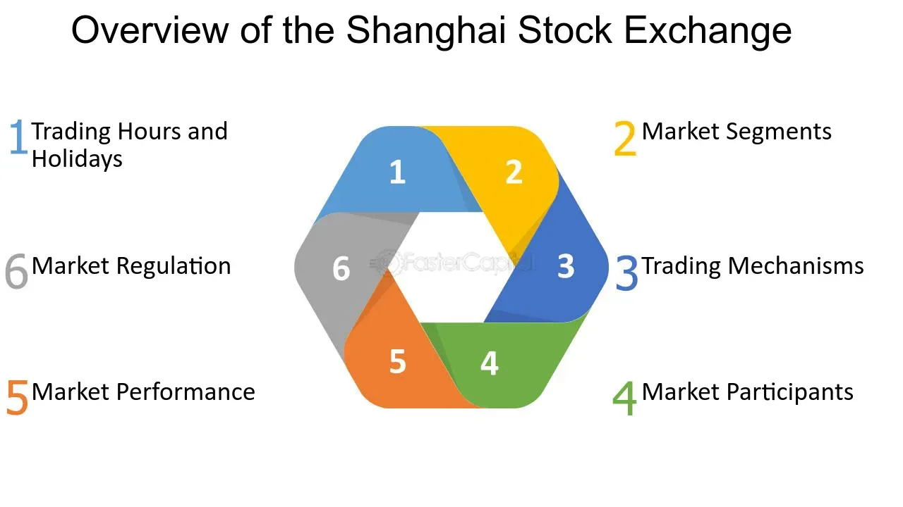

## Table of Contents

## What is the Shanghai Stock Exchange (SSE)?

The Shanghai Stock Exchange (SSE) is a stock market in Shanghai, China. It is one of the biggest stock exchanges in the world. People and companies can buy and sell shares of companies on the SSE. It helps companies get money to grow their business by selling shares to investors.

The SSE started in 1990. It has two main markets: the Main Board and the STAR Market. The Main Board is for big, established companies. The STAR Market is for new technology companies. The SSE is important for China's economy because it helps businesses raise money and lets people invest in companies.

## When was the Shanghai Stock Exchange established?

The Shanghai Stock Exchange, often called SSE, was established in 1990. This was an important step for China's financial system. Before the SSE, China did not have a big stock market like those in other countries.

The SSE helps companies get money by selling shares to people and other companies. It has two main parts: the Main Board for big, well-known companies and the STAR Market for new tech companies. The SSE is very important for China's economy because it helps businesses grow and lets people invest in them.

## What types of securities are traded on the SSE?

The Shanghai Stock Exchange (SSE) trades different types of securities. The main ones are stocks, which are shares in companies. When you buy a stock, you own a small part of that company. The SSE also trades bonds, which are like loans to companies or the government. When you buy a bond, you lend money and get it back with interest later.

Another type of security traded on the SSE is funds, like exchange-traded funds (ETFs). ETFs are baskets of different investments, like stocks or bonds, that you can buy and sell like a single stock. The SSE also has a market for futures and options, which are agreements to buy or sell something at a future date. These can be used to guess how prices will change or to protect against price changes.

The SSE has different markets for these securities. The Main Board is for big, established companies, and the STAR Market is for new technology companies. This helps the SSE meet the needs of different investors and companies.

## How does one invest in the Shanghai Stock Exchange?

To invest in the Shanghai Stock Exchange (SSE), you need to open a brokerage account. A brokerage is a company that helps you buy and sell stocks. You can choose a brokerage that offers access to the SSE. Once you have an account, you can deposit money into it. Then, you can use that money to buy stocks, bonds, or other securities listed on the SSE. You can do this online or through a broker, depending on what the brokerage offers.

There are different ways to invest in the SSE. If you want to buy stocks of big, well-known companies, you can look at the Main Board. If you are interested in new technology companies, you can check out the STAR Market. You can also invest in funds like ETFs, which let you buy a basket of different investments all at once. Remember, investing always has risks, so it's a good idea to learn about the companies and markets before you start.

## What are the main indices of the SSE?

The main index of the Shanghai Stock Exchange is the SSE Composite Index. This index shows how the stocks on the SSE are doing overall. It includes all the stocks listed on the Main Board of the SSE. If the SSE Composite Index goes up, it means that, on average, the prices of the stocks on the SSE are going up. If it goes down, the prices are going down. This index is important because it gives people a quick way to see how the whole market is doing.

Another important index is the SSE 50 Index. This index only includes the 50 biggest and most liquid stocks on the SSE. These are companies that are easy to buy and sell. The SSE 50 Index helps investors focus on the performance of the biggest and most important companies on the exchange. It's useful for people who want to invest in the strongest companies in China.

## What are the trading hours of the Shanghai Stock Exchange?

The Shanghai Stock Exchange, or SSE, has regular trading hours from 9:30 AM to 11:30 AM and then from 1:00 PM to 3:00 PM, Beijing time. This means there is a break in the middle of the day. These hours are when most people can buy and sell stocks, bonds, and other securities on the SSE.

There are also times before and after the regular trading hours when you can place orders. These are called pre-market and after-hours trading. Pre-market trading happens from 9:15 AM to 9:25 AM, and after-hours trading is from 3:00 PM to 3:30 PM. During these times, you can set up orders that will be filled when the regular trading hours start or end.

## How does the SSE contribute to China's economy?

The Shanghai Stock Exchange (SSE) helps China's economy by letting companies get money to grow their businesses. When a company wants to expand or start new projects, it can sell shares on the SSE. People and other companies buy these shares, giving the company the money it needs. This is important because it helps businesses in China get bigger and create more jobs. The SSE has different markets like the Main Board for big companies and the STAR Market for new tech companies, so it can help all kinds of businesses.

The SSE also helps people in China save and invest their money. When people buy stocks or other securities on the SSE, they are putting their money into companies that they think will do well. This can help them earn more money over time. The SSE's main index, the SSE Composite Index, shows how the whole market is doing, which helps people make smart choices about where to invest. By letting people invest and helping companies grow, the SSE plays a big role in making China's economy stronger.

## What are the listing requirements for companies on the SSE?

To list on the Shanghai Stock Exchange (SSE), a company needs to meet certain rules. For the Main Board, a company must have been in business for at least three years and have made a profit for the last three years. It also needs to have a certain amount of money and assets. The company must follow the rules set by the China Securities Regulatory Commission (CSRC) and the SSE. This includes having good financial reports and a clear business plan.

For the STAR Market, the rules are a bit different. This market is for new technology companies, so they don't need to have been in business for as long. They can list if they have new technology or a new business model. But they still need to show they have a good plan and enough money to grow. The STAR Market helps these new companies get the money they need to develop their ideas and grow their business.

## How does the SSE regulate trading and ensure market integrity?

The Shanghai Stock Exchange (SSE) works hard to make sure trading is fair and honest. They do this by watching the market all the time. If they see something strange or someone breaking the rules, they can stop trading or investigate. The SSE has rules that everyone must follow, like not sharing secret information or trying to trick other traders. They also make sure companies tell the truth about their business and money. If a company lies or breaks the rules, the SSE can punish them.

The SSE also helps keep the market safe by checking the people and companies that want to trade. Before someone can start buying and selling, the SSE makes sure they meet certain rules. This helps keep bad people out of the market. The SSE works with the China Securities Regulatory Commission (CSRC) to make sure everything is fair. Together, they make rules and watch over the market to keep it honest and protect investors.

## What role does the SSE play in global financial markets?

The Shanghai Stock Exchange (SSE) is a big part of the world's money markets. It is one of the biggest stock exchanges in the world, and it helps China's economy grow by letting companies get money from investors. When companies in China want to grow, they can sell shares on the SSE. People and companies from all over the world can buy these shares, which helps the companies get the money they need. This makes the SSE important not just for China, but for the whole world's economy.

The SSE also helps connect China's money markets with the rest of the world. It has programs like the Stock Connect, which lets people in Hong Kong and mainland China trade stocks on each other's markets. This makes it easier for people from different countries to invest in Chinese companies. By doing this, the SSE helps make the world's money markets more connected and helps investors from different places work together.

## How have technological advancements impacted the operations of the SSE?

Technological advancements have made the Shanghai Stock Exchange (SSE) work better and faster. Now, people can trade stocks and other securities online from their computers or phones. This is much easier than the old days when they had to go to a physical place to trade. The SSE uses computers to watch the market all the time and make sure everything is fair. They can see if someone is doing something wrong and stop it quickly. This helps keep the market safe and honest for everyone.

The SSE also uses technology to share information with investors. They have websites and apps where people can see the latest prices and news about companies. This helps investors make smart choices about where to put their money. The STAR Market, which is for new technology companies, is another way the SSE uses technology. It helps these new companies get the money they need to grow by letting them sell shares online. This shows how technology is changing the way the SSE works and helps China's economy.

## What are the future prospects and strategic plans for the Shanghai Stock Exchange?

The Shanghai Stock Exchange (SSE) is looking to grow and become even more important in the future. They want to help more companies, especially new technology companies, get the money they need to grow. The SSE plans to make it easier for these companies to list on the STAR Market. They also want to make the market safer and more fair by using new technology to watch for problems and stop them quickly. This will help investors feel more confident about putting their money into Chinese companies.

Another big plan for the SSE is to connect more with the rest of the world. They want to make it easier for people from other countries to invest in Chinese companies. Programs like the Stock Connect with Hong Kong are part of this plan. The SSE also wants to work with other big stock exchanges around the world to share information and make trading easier. By doing these things, the SSE hopes to help China's economy grow and become a bigger part of the global financial market.

## References & Further Reading

[1]: Shanghai Stock Exchange. ["About SSE."](https://en.wikipedia.org/wiki/Shanghai_Stock_Exchange) 

[2]: China Securities Regulatory Commission. ["Laws and Regulations."](http://www.csrc.gov.cn/csrc_en/c102034/common_list.shtml?channelid=ae291c62f625438a98b4bdb358753532)

[3]: Aldridge, I. (2013). ["High-Frequency Trading: A Practical Guide to Algorithmic Strategies and Trading Systems"](https://www.amazon.com/High-Frequency-Trading-Practical-Algorithmic-Strategies/dp/1118343506) Wiley Finance.

[4]: Lewis, M. (2015). [*"Flash Boys: A Wall Street Revolt."*](https://en.wikipedia.org/wiki/Flash_Boys) W. W. Norton & Company.

[5]: Zhang, F., & Xiang, Z. (2018). ["Regulating Algorithmic Trading in China"](https://www.sciencedirect.com/science/article/pii/S2468606924002995), SSRN Electronic Journal.

[6]: Pettis, M. (2013). [*"The Great Rebalancing: Trade, Conflict, and the Perilous Road Ahead for the World Economy."*](https://carnegieendowment.org/research/2013/02/the-great-rebalancing-trade-conflict-and-the-perilous-road-ahead-for-the-world-economy/) Princeton University Press.