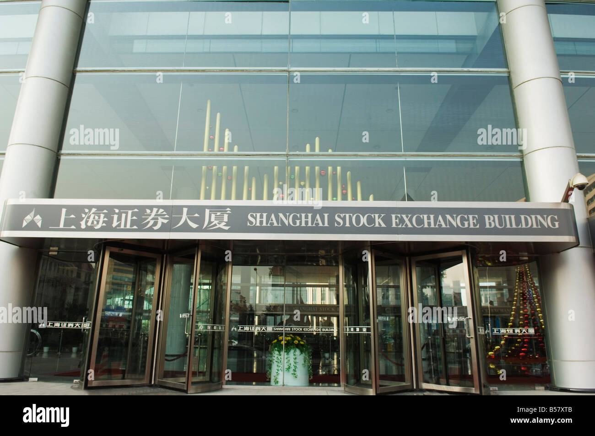

## Table of Contents

## What is the Shanghai Stock Exchange (SSE)?

The Shanghai Stock Exchange (SSE) is a stock market in China where people and companies can buy and sell shares of companies. It started in 1990 and is one of the biggest stock exchanges in the world. The SSE is important because it helps companies get money to grow their business by selling shares to the public.

The SSE has two main types of stocks: A-shares and B-shares. A-shares are for people in China who use the Chinese currency, called the yuan. B-shares are for people outside of China and are traded in U.S. dollars. The SSE also has a special index called the SSE Composite Index, which shows how well the stocks on the exchange are doing overall. This helps people see if the market is going up or down.

## When was the Shanghai Stock Exchange established?

The Shanghai Stock Exchange, or SSE, was set up in 1990. This was an important time because it was when China started to open up its economy more to the world. Before the SSE, there wasn't a big place in China where people could easily buy and sell shares of companies.

The SSE helped change that by giving companies a place to raise money from the public. It made it easier for people in China to invest in businesses and for those businesses to grow. Today, the SSE is one of the biggest stock exchanges in the world and plays a big role in China's economy.

## What types of securities are traded on the SSE?

The Shanghai Stock Exchange, or SSE, trades different types of securities. The main ones are stocks, which are shares in companies. There are two kinds of stocks on the SSE: A-shares and B-shares. A-shares are for people in China who use the Chinese currency, called the yuan. B-shares are for people outside of China and are traded in U.S. dollars. This way, both local and international investors can take part in the market.

Besides stocks, the SSE also trades bonds. Bonds are like loans that investors give to companies or the government. In return, the bond issuer promises to pay back the money with interest over time. The SSE has different types of bonds, like government bonds and corporate bonds. This gives investors more choices to put their money into, depending on how much risk they want to take and how much return they expect.

The SSE also has other financial products like funds and derivatives. Funds are collections of investments managed by professionals, which can include stocks, bonds, or other assets. Derivatives are financial contracts whose value comes from something else, like the price of a stock or a commodity. These products help investors manage risk and make more complex investment strategies. Overall, the SSE offers a wide range of securities to meet different investment needs.

## How does one invest in stocks listed on the SSE?

To invest in stocks listed on the Shanghai Stock Exchange (SSE), you first need to decide if you want to buy A-shares or B-shares. A-shares are for people in China and are traded in Chinese yuan. If you're in China, you can open an account with a local brokerage firm. They will help you buy and sell A-shares. If you're outside of China, you can invest in A-shares through programs like the Stock Connect, which links the SSE with stock exchanges in Hong Kong. This allows international investors to buy A-shares without needing a local brokerage account in China.

B-shares, on the other hand, are for people outside of China and are traded in U.S. dollars. If you're not in China, you can open an account with a brokerage firm that has access to the SSE's B-share market. Once your account is set up, you can start buying and selling B-shares. No matter which type of shares you choose, it's important to do your research on the companies you're interested in. Look at their financial health, future growth plans, and any news that might affect their stock prices. This will help you make smarter investment choices.

## What are the main indices of the SSE and what do they represent?

The main index of the Shanghai Stock Exchange is the SSE Composite Index. This index shows how well the stocks on the SSE are doing overall. It includes all the stocks that are traded on the SSE, both A-shares and B-shares. When the SSE Composite Index goes up, it means that, on average, the prices of the stocks on the SSE are going up. If it goes down, it means the prices are going down. This index is really important because it gives people a quick way to see how the whole market is doing.

Another important index is the SSE 50 Index. This index only includes the 50 biggest and most important companies on the SSE. These companies are usually very stable and have a big impact on the economy. The SSE 50 Index is useful for people who want to invest in big, reliable companies. It's a good way to see how these leading companies are doing and can be a safer way to invest in the stock market.

## Can foreign investors participate in the SSE, and if so, how?

Yes, foreign investors can participate in the Shanghai Stock Exchange (SSE). They can do this by buying B-shares, which are stocks traded in U.S. dollars. To buy B-shares, foreign investors need to open an account with a brokerage firm that has access to the SSE's B-share market. This way, they can directly invest in companies listed on the SSE without needing to be in China.

Another way for foreign investors to participate is through the Stock Connect program. This program links the SSE with stock exchanges in Hong Kong, allowing international investors to buy A-shares, which are traded in Chinese yuan. Foreign investors can open an account with a broker in Hong Kong that participates in the Stock Connect and then start trading A-shares. This makes it easier for people outside of China to invest in the SSE and take part in China's growing economy.

## What are the trading hours of the Shanghai Stock Exchange?

The Shanghai Stock Exchange, or SSE, has trading hours that are split into two parts each day. The morning session starts at 9:30 AM and ends at 11:30 AM. This is when people can buy and sell stocks for the first part of the day. After a break, the afternoon session begins at 1:00 PM and goes until 3:00 PM. So, the total trading time each day is four hours.

These hours are set to match the working hours in China. It gives people time to look at the market, make decisions, and trade during their workday. Knowing the trading hours is important for anyone who wants to invest in the SSE because you need to be ready to buy or sell during these times.

## What is the role of the SSE in China's economy?

The Shanghai Stock Exchange, or SSE, plays a big role in China's economy. It helps companies raise money by selling shares to the public. When a company sells its shares on the SSE, it gets money that it can use to grow its business. This helps the company create more jobs and make more products, which is good for the economy. The SSE also makes it easier for people to invest their money. When people buy stocks, they are putting their money into companies, which helps the economy grow.

The SSE also helps keep the economy stable. It does this by showing how well the market is doing through its main index, the SSE Composite Index. When this index goes up, it means the market is doing well, which can make people feel more confident about the economy. If the index goes down, it can show that the market is having problems. This information helps the government and businesses make better decisions. Overall, the SSE is an important part of China's economy because it helps companies grow, gives people a way to invest, and helps keep the economy stable.

## How does the SSE regulate trading and ensure market integrity?

The Shanghai Stock Exchange, or SSE, works hard to make sure trading is fair and honest. They do this by setting rules that everyone has to follow. For example, they have rules about how much a stock's price can change in one day. This helps stop the market from getting too wild. The SSE also checks to make sure that companies tell the truth about their business. If a company lies or hides important information, the SSE can punish them. This helps keep the market honest and makes people trust it more.

Another way the SSE keeps the market safe is by watching for bad behavior. They use special computer programs to look for signs of cheating, like people trying to trick others by making stock prices go up or down on purpose. If they find someone breaking the rules, they can stop them from trading and even tell the police. By doing all these things, the SSE helps make sure that everyone can trade fairly and that the market stays strong and trustworthy.

## What are some of the major companies listed on the SSE?

Some of the biggest companies you can find on the Shanghai Stock Exchange, or SSE, are really important in China and around the world. One of them is PetroChina, which is a huge company that deals with oil and gas. They help make sure China has the energy it needs. Another big company is Industrial and Commercial Bank of China, or ICBC. It's one of the biggest banks in the world and helps people and businesses with their money. There's also China Life Insurance, which is a big insurance company that helps people protect their families and their future.

Another important company on the SSE is China Petroleum & Chemical Corporation, also known as Sinopec. They are also in the oil and gas business and play a big role in China's energy industry. Then there's Bank of China, which is another giant bank that helps with international money matters. And don't forget about China Construction Bank, which is also a big bank that helps with building projects and other big investments. These companies are all very important to China's economy and are some of the reasons why the SSE is such a big deal.

## How has the performance of the SSE been over the past decade?

Over the past ten years, the Shanghai Stock Exchange, or SSE, has had its ups and downs. From 2013 to 2023, the SSE Composite Index, which shows how the whole market is doing, went through some big changes. In 2015, the index had a huge jump, going up a lot in a short time. But then it crashed, losing a lot of its value very quickly. This made a lot of people worried about the market. After that, the SSE had some years where it didn't move much, but then it started to go up again, especially in 2020 and 2021, when the world was dealing with the effects of the COVID-19 pandemic.

Even though there have been some tough times, the SSE has still been an important part of China's economy. It has helped many companies grow by letting them sell shares to the public. The SSE also opened up more to foreign investors, which helped bring more money into the market. Overall, the SSE has been a place where people can invest and see their money grow, even if it hasn't always been a smooth ride. The market keeps changing, but it's still a big part of how China's economy works.

## What future developments are anticipated for the Shanghai Stock Exchange?

The Shanghai Stock Exchange, or SSE, is looking forward to some big changes in the future. One of the main things they want to do is make it even easier for people from other countries to invest in the SSE. They might do this by making more deals with other stock markets around the world. This would help bring more money into the SSE and make it a bigger player in the global market. Another thing they're thinking about is adding new types of investments, like more kinds of funds and other financial products. This would give people more choices and could help the SSE grow even more.

Another important change could be using more technology to make trading faster and safer. The SSE might use more computer programs to watch for cheating and to make sure the market stays fair. They could also make it easier for people to trade using their phones or computers. This would make investing simpler and could attract more people to the SSE. Overall, these changes are all about making the SSE a stronger and more trusted place for people to invest their money, both in China and around the world.

## References & Further Reading

[1]: ["An Evolutionary Examination of Algorithmic Trading Systems at the Shanghai Stock Exchange"](https://www.researchgate.net/publication/381852135_THE_ECONOMIC_IMPACT_OF_ALGORITHMIC_TRADING_WITH_EVOLUTIONARY_STRATEGIES_A_COMPREHENSIVE_ANALYSIS) - A research article published in the Procedia Computer Science journal, discussing the impact of algorithmic trading at the SSE.

[2]: Walter D. F., ("Algorithmic Trading and High-Frequency Trading: A Primer"), Journal of the Financial Management Association.

[3]: Aldridge, I. (2013). ["High-Frequency Trading: A Practical Guide to Algorithmic Strategies and Trading Systems"](https://www.amazon.com/High-Frequency-Trading-Practical-Algorithmic-Strategies/dp/1118343506), Wiley Finance, which offers an in-depth exploration of algorithmic trading strategies applicable to global markets including SSE.

[4]: ["The China Securities Regulatory Commission: Regulator of China’s Capital Markets"](https://en.wikipedia.org/wiki/China_Securities_Regulatory_Commission) - Information about the regulatory body responsible for overseeing the SSE and its trading practices.

[5]: China Securities Regulatory Commission (CSRC). ["Annual Report"](http://www.csrc.gov.cn/csrc_en/c102063/common_list.shtml?channelid=e855fa5d4cab4ce7a9304769d9d1c4e9) - A collection of reports detailing the policies and regulatory framework governing the Shanghai Stock Exchange.

[6]: Taboga, M. (2010). ["Lectures on Probability and Statistics"](https://freecomputerbooks.com/StatLect.html), available on authors homepage, which includes introductory content on statistical tools used in algorithmic trading.