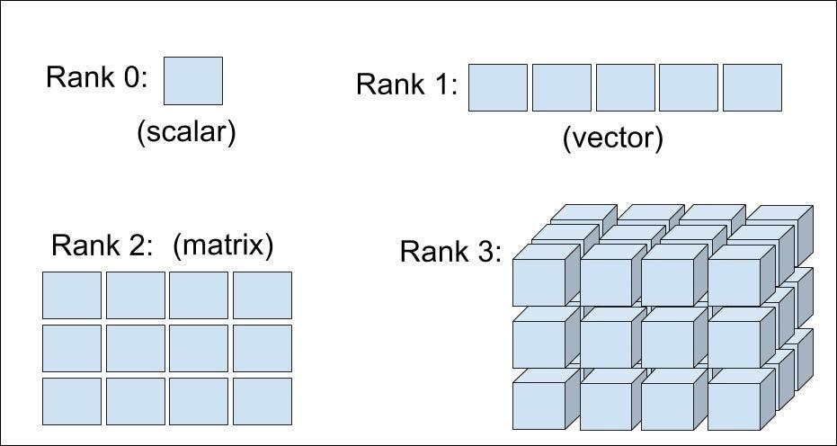

## Table of Contents

## What is a tensor in the context of machine learning?

In the context of machine learning, a tensor is a mathematical object used to represent data. Think of it as a container that can hold numbers in various arrangements, similar to how a box can hold different items. In simpler terms, a tensor can be a single number (scalar), a list of numbers (vector), or a table of numbers (matrix). For example, an image can be represented as a tensor where each pixel's color value is stored in a three-dimensional arrangement.

Tensors are important in machine learning because they can efficiently handle large amounts of data and perform complex calculations. Many machine learning algorithms, especially those in deep learning, use tensors to process and analyze data. For instance, in neural networks, tensors flow through the layers of the network, allowing the model to learn from the data and make predictions. Libraries like TensorFlow and PyTorch are built around the concept of tensors, making it easier for developers to implement machine learning models.

## How is the shape of a tensor defined?

The shape of a tensor tells us how many numbers it has and how they are arranged. It's like describing the size and structure of a box. For example, a tensor with the shape $$ (3, 4) $$ has 3 rows and 4 columns, making a total of 12 numbers. If it's a 3D tensor with the shape $$ (2, 3, 4) $$, it's like having 2 boxes, each with 3 rows and 4 columns, resulting in 24 numbers in total.

In machine learning, knowing the shape of a tensor is important because it helps us understand and work with the data. For instance, if we're dealing with images, a tensor's shape might be $$ (height, width, color_channels) $$. This tells us the image's dimensions and whether it's in grayscale or color. When we use libraries like TensorFlow or PyTorch, we can check a tensor's shape easily with code. For example, in PyTorch, you might see something like ``` tensor.shape ``` to get the shape of a tensor.

## Why is understanding the shape of tensors important in machine learning?

Understanding the shape of tensors is important in machine learning because it helps us know how data is organized and what operations we can do with it. For example, if we have an image, the tensor's shape tells us the image's height, width, and number of color channels. This information is crucial for designing and training models. If we're working with a neural network, knowing the input tensor's shape helps us set up the right layers and connections, making sure the data flows correctly through the network.

In addition, the shape of tensors affects how we perform calculations and transformations. When we use operations like matrix multiplication or convolutional layers, the shapes need to match certain rules. For instance, if we want to multiply two tensors, their shapes must be compatible. In PyTorch, we can check a tensor's shape using ``` tensor.shape ```, which helps us ensure our data is in the right format before we start training or making predictions. Understanding tensor shapes makes it easier to work with data and build effective machine learning models.

## Can you explain the difference between a scalar, vector, and matrix in terms of tensor shapes?

A scalar is the simplest type of tensor. It's just a single number, like 5 or 3.14. In terms of shape, a scalar has no dimensions, so its shape is represented as $$ () $$. For example, in PyTorch, you can create a scalar like this: ``` tensor(5) ```. A vector, on the other hand, is a one-dimensional tensor. It's like a list of numbers, such as [1, 2, 3]. The shape of a vector is described by one number, which tells us how many elements it has. For instance, a vector with 3 elements would have a shape of $$ (3) $$. In code, you might see it as ``` tensor([1, 2, 3]) ```.

A matrix is a two-dimensional tensor, which you can think of as a table of numbers. It has rows and columns, like a grid. The shape of a matrix is described by two numbers, the first for the number of rows and the second for the number of columns. For example, a matrix with 2 rows and 3 columns would have a shape of $$ (2, 3) $$. In PyTorch, you could create such a matrix like this: ``` tensor([[1, 2, 3], [4, 5, 6]]) ```. Understanding these different shapes helps us work with data in machine learning, as each type of tensor can represent different kinds of information and requires specific operations.

## How do you determine the shape of a tensor in popular machine learning libraries like TensorFlow or PyTorch?

In TensorFlow, you can find out the shape of a tensor using the `shape` attribute or the `tf.shape()` function. If you have a tensor called `my_tensor`, you can get its shape by writing `my_tensor.shape` or `tf.shape(my_tensor)`. The result will show you the dimensions of the tensor, like $$ (3, 4) $$ for a 3 by 4 matrix. This helps you understand how the data is organized, which is important for building and training your machine learning models.

In PyTorch, checking the shape of a tensor is just as easy. If you have a tensor named `my_tensor`, you can see its shape by using `my_tensor.shape`. For example, if `my_tensor` is a 2 by 3 by 4 tensor, `my_tensor.shape` would return $$ (2, 3, 4) $$. Knowing the shape of your tensors in PyTorch helps you make sure your data is in the right format before you start working with it in your models.

## What are the common operations that change the shape of tensors?

In machine learning, you often need to change the shape of tensors to make them fit into different parts of your model. One common operation is reshaping, which rearranges the data without changing the total number of elements. For example, if you have a tensor with shape $$ (2, 3) $$, you can reshape it to $$ (3, 2) $$ or $$ (6,) $$. In TensorFlow, you can use `tf.reshape(tensor, new_shape)` to do this, and in PyTorch, you would use `tensor.reshape(new_shape)` or `tensor.view(new_shape)`.

Another operation is squeezing, which removes dimensions of size 1. If you have a tensor with shape $$ (3, 1, 4) $$, squeezing it would give you a tensor with shape $$ (3, 4) $$. In TensorFlow, you can use `tf.squeeze(tensor)`, and in PyTorch, you can use `tensor.squeeze()`. The opposite of squeezing is unsqueezing, which adds a dimension of size 1. For example, if you have a tensor with shape $$ (3, 4) $$, you can unsqueeze it to get a tensor with shape $$ (3, 1, 4) $$. In TensorFlow, you can use `tf.expand_dims(tensor, axis)`, and in PyTorch, you can use `tensor.unsqueeze(axis)`.

Transposing is another way to change the shape of tensors, which swaps the dimensions. For a matrix with shape $$ (2, 3) $$, transposing it would give you a matrix with shape $$ (3, 2) $$. In TensorFlow, you can use `tf.transpose(tensor)`, and in PyTorch, you can use `tensor.transpose(dim0, dim1)` or `tensor.t()` for matrices. These operations help you adjust the data to fit the needs of your machine learning models, making it easier to process and analyze the information.

## How does reshaping a tensor affect the data it contains?

Reshaping a tensor changes how its numbers are arranged, but it doesn't change the numbers themselves. Think of it like rearranging the pieces of a puzzle. If you have a tensor with shape $$ (2, 3) $$ that contains the numbers 1 through 6, reshaping it to $$ (3, 2) $$ will still use the same numbers, just in a different order. The total number of elements stays the same, so you can't reshape a tensor into a shape that doesn't match the total number of elements. For example, you can't reshape a tensor with 6 elements into a shape like $$ (2, 4) $$ because that would require 8 elements.

In machine learning, reshaping is useful because it helps you fit the data into the right format for your models. If you're working with images, you might need to reshape a tensor to change it from a 2D image to a 1D vector or vice versa. In TensorFlow, you can reshape a tensor using ``` tf.reshape(tensor, new_shape) ```, and in PyTorch, you can use ``` tensor.reshape(new_shape) ``` or ``` tensor.view(new_shape) ```. These operations make it easier to process and analyze your data without changing the actual values it contains.

## What is broadcasting in the context of tensor operations, and how does it relate to tensor shapes?

Broadcasting is a way to perform operations on tensors with different shapes without needing to change their shapes first. It's like making two things the same size so they can work together. When you add a tensor with shape $$ (3, 4) $$ to a tensor with shape $$ (4,) $$, broadcasting stretches the smaller tensor to match the bigger one. So the smaller tensor gets copied along the missing dimension to become $$ (3, 4) $$. This lets you do the addition without having to reshape anything manually.

In machine learning, broadcasting is useful because it makes operations simpler and more efficient. For example, if you want to add a constant value to every element in a big tensor, you don't need to create a new tensor with the same shape. You can just use broadcasting to add the constant to all elements at once. In TensorFlow, you might see broadcasting happen automatically when you use operations like ``` tf.add() ```, and in PyTorch, it works the same way with operations like ``` tensor + scalar ```. This helps keep your code clean and your calculations fast.

## How can mismatches in tensor shapes lead to errors in neural network models?

Mismatches in tensor shapes can cause errors in neural network models because the shapes need to fit together correctly for operations like matrix multiplication or convolutional layers. For example, if you try to multiply a tensor with shape $$ (3, 4) $$ by a tensor with shape $$ (2, 5) $$, it won't work because the inner dimensions don't match. This can stop your model from running and give you an error message saying the shapes are not compatible. In machine learning libraries like TensorFlow or PyTorch, these errors are common when you're setting up your model or feeding in data.

To avoid these errors, you need to make sure the shapes of your tensors line up correctly at every step. If you're using a convolutional layer, the input tensor's shape must match what the layer expects. If you're doing a simple operation like adding two tensors, their shapes need to be the same or compatible through broadcasting. By checking the shapes with ``` tensor.shape ``` in PyTorch or ``` tensor.shape ``` in TensorFlow, you can catch these issues early and fix them before they cause problems in your neural network model.

## What advanced techniques involve manipulating tensor shapes for optimizing machine learning models?

One advanced technique for optimizing machine learning models involves using tensor reshaping to speed up computations. For example, in convolutional neural networks, you might reshape the input tensor to fit the expected format of the convolutional layers. This can help reduce the number of operations needed, making the model run faster. Another technique is using tensor transposition to change the order of dimensions, which can be useful in recurrent neural networks where you might need to switch the time and feature dimensions. By carefully manipulating tensor shapes, you can make your model more efficient and improve its performance without changing the underlying data.

Another technique is using broadcasting to perform operations on tensors with different shapes. This can be particularly useful in operations like element-wise addition or multiplication where you want to apply a smaller tensor to a larger one. For example, if you have a tensor with shape $$ (3, 4) $$ and you want to add a constant value to each element, you can use broadcasting to do this without creating a new tensor with the same shape. This not only saves memory but also speeds up the computation. In libraries like TensorFlow and PyTorch, these techniques are often used automatically, but understanding them can help you optimize your models even further.

## How do you handle tensors with dynamic shapes in machine learning frameworks?

In machine learning, tensors with dynamic shapes can change their size during runtime. This is useful when you're working with data where the size isn't known until the model is running. For example, if you're processing text, the length of each sentence can be different. In TensorFlow, you can use `tf.dynamic_rnn` to handle sequences of different lengths. In PyTorch, you can use `torch.nn.utils.rnn.pack_padded_sequence` to deal with variable-length sequences. These tools help you process data even when you don't know the exact shape ahead of time.

Handling dynamic shapes can make your models more flexible and able to work with different kinds of data. But it can also make things more complicated. You need to be careful to make sure your model can handle the changing shapes without breaking. In TensorFlow, you might use `tf.shape` to get the current shape of a tensor during runtime, and in PyTorch, you can use `tensor.shape`. By using these tools and functions, you can build models that adapt to the data they're given, making them more powerful and useful in real-world situations.

## Can you discuss the impact of tensor shapes on model performance and efficiency?

The shape of tensors can have a big impact on how well and how fast your machine learning model works. When you choose the right shape for your tensors, you can make your model run faster and use less memory. For example, if you reshape a tensor to fit better with the operations in your model, like making it match the input shape of a convolutional layer, you can speed up the calculations. In TensorFlow, you might use ``` tf.reshape(tensor, new_shape) ``` to do this, and in PyTorch, you can use ``` tensor.reshape(new_shape) ```. By carefully picking the right shapes, you can make your model more efficient and save time and resources.

Another way tensor shapes affect model performance is through operations like broadcasting. When you use broadcasting, you can do operations on tensors with different shapes without having to change them first. This can make your code simpler and your model run faster. For instance, if you want to add a constant value to every element in a big tensor, you don't need to create a new tensor with the same shape. You can just use broadcasting to add the constant to all elements at once. In both TensorFlow and PyTorch, broadcasting happens automatically when you use operations like ``` tf.add() ``` or ``` tensor + scalar ```. By understanding and using these techniques, you can make your models work better and more efficiently.