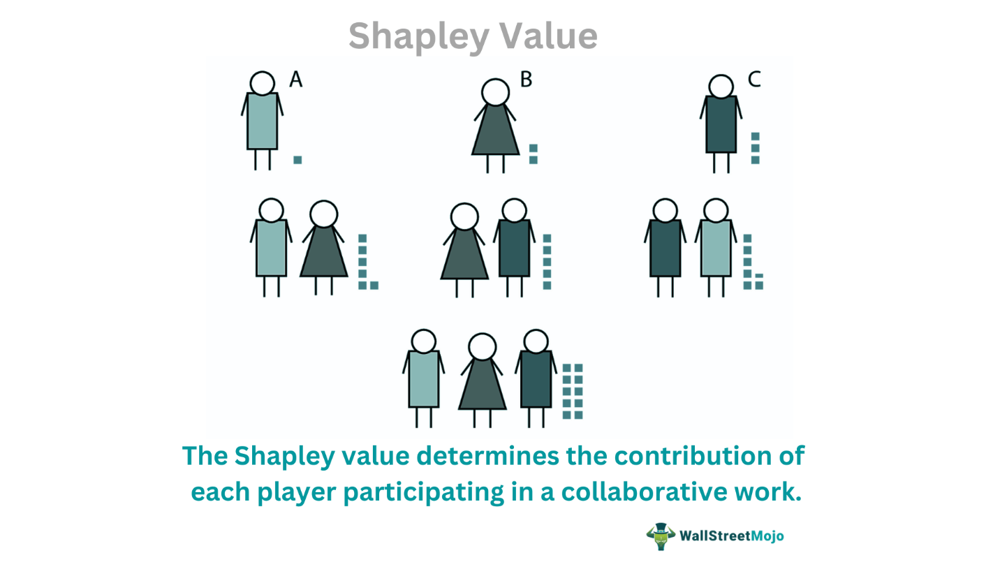

Game theory is a fundamental tool used in the analysis of strategic interactions and decision-making frameworks within cooperative environments. One of the most intriguing concepts derived from cooperative game theory is the Shapley value, which serves as a benchmark for fair distribution of gains and costs among participants in a coalition. This principle has significant implications across various fields, notably in algorithmic trading, where strategic cooperation and equitable value distribution are crucial for optimizing financial returns.

The Shapley value offers a solution to fairly distribute the total gains generated by a coalition based on each participant's marginal contribution. Developed by Lloyd Shapley in 1953, this concept is grounded in established mathematical axioms that ensure fairness, such as efficiency, symmetry, and the dummy player principle. These axioms guarantee that each player's contribution is recognized and rewarded appropriately, paving the way for more cooperative and efficient interactions.

This article explores the intersection of cooperative games, the Shapley value, and algorithmic trading, providing insights into how these concepts support equitable decision-making processes and value distribution within coalition settings. In the context of modern financial markets, the Shapley value's applicability extends to automated trading systems, where various trading algorithms work in conjunction to achieve optimal results. These systems require sophisticated methods for evaluating and compensating the performance of individual strategies to ensure overall efficiency and profitability.

As we navigate through these themes, we aim to highlight the transformative impact of the Shapley value in fostering cooperation and fairness in financial trading. We will also consider the potential challenges associated with its implementation, such as computational complexity, and the ongoing research efforts to address these issues. This examination underscores the critical role of the Shapley value in shaping equitable and effective cooperative strategies in today's dynamic economic landscape.

## Table of Contents

## Understanding Cooperative Games and Game Theory

Cooperative games are a fundamental aspect of game theory, focusing on scenarios where multiple players collaborate to achieve a common goal, resulting in collective benefits or payoffs. In such games, the decision-making process is not isolated but interconnected, emphasizing the importance of cooperation among participants.

Game theory, as a broader discipline, provides the strategic frameworks necessary to model and analyze these cooperative interactions. It encompasses various concepts that help in understanding how players can form coalitions, negotiate agreements, and make decisions that maximize collective outcomes. The essence of cooperative game theory lies in understanding how players can share the benefits derived from their collective efforts in a fair and rational manner.

The primary components of cooperative games—players, strategies, and payoffs—are crucial for analyzing the dynamics involved. Players in a cooperative setting are often seen as entities or [agents](/wiki/agents) that can benefit from mutual cooperation. Strategies denote the possible actions players can undertake to form coalitions and maximize their payoffs. The payoffs, on the other hand, are the rewards or outcomes achieved as a result of these strategies, which need to be distributed among the players.

In cooperative games, the emphasis is placed on the ability of players to form coalitions, where the value of a coalition is often greater than the sum of individual efforts due to synergistic effects. Mathematical formulations such as characteristic functions are employed to assign values to each coalition, indicating the total payoff a coalition can expect to receive.

Real-world applications of cooperative games are abundant and illustrate how cooperation can result in optimal outcomes. For instance, in business consortiums or joint ventures, companies may form alliances to leverage shared resources and technology, achieving benefits that would be unattainable individually. Another example can be seen in environmental agreements, where nations cooperate to address global challenges like climate change, aiming for collective benefits that ensure sustainability and shared responsibility.

Cooperative games also play a significant role in economic models where collective bargaining, resource allocation, and public goods distribution are analyzed. These models often highlight the importance of equitable distribution of resources and the need for mechanisms that ensure fair sharing of benefits derived from cooperation.

Overall, cooperative games and game theory provide vital insights into the mechanisms of cooperation and collective decision-making. By offering strategic models and analytical tools, they enable the study of how players can align their strategies to maximize cumulative benefits, thereby achieving more robust and efficient outcomes.

## The Shapley Value: Concept and Calculation

The Shapley value is a fundamental concept in cooperative game theory, devised by Lloyd Shapley in 1953 to address the problem of fairly distributing total gains or costs among players involved in a cooperative game. The Shapley value rigorously quantifies each player's marginal contribution to the coalition, ensuring an equitable allocation of resources. Four main axioms form the foundation of the Shapley value: efficiency, symmetry, dummy, and additivity.

1. **Efficiency**: The total gains or surplus from cooperation should be distributed entirely among the players. In mathematical notation, for a cooperative game $(N, v)$ with $N$ as the set of players and $v$ as the characteristic function defining the value of each coalition, it holds that the sum of Shapley values for all players equals the total value of the grand coalition $v(N)$.

2. **Symmetry**: If two players contribute equally to every possible coalition, they should receive equal shares. Formally, if for any coalition $S \subseteq N \setminus \{i, j\}$, it holds that $v(S \cup \{i\}) = v(S \cup \{j\})$, then the Shapley value for player $i$ should be equal to that for player $j$.

3. **Dummy**: A player who does not contribute additional value to any coalition beyond what the coalition could achieve without them should receive a Shapley value of zero. Specifically, if for all $S \subseteq N \setminus \{i\}$, $v(S \cup \{i\}) = v(S)$, then the Shapley value for player $i$ is zero.

4. **Additivity**: For any two games with characteristic functions $v$ and $w$, the Shapley value of the sum of these games should be the sum of their individual Shapley values. That is, $\phi_i(v + w) = \phi_i(v) + \phi_i(w)$ for each player $i$.

The computation of the Shapley value involves assessing the marginal contribution of a player across all possible coalitions. Formally, the Shapley value $\phi_i(v)$ for a player $i$ is given by:

$$
\phi_i(v) = \sum_{S \subseteq N \setminus \{i\}} \frac{|S|!(|N| - |S| - 1)!}{|N|!} \left[ v(S \cup \{i\}) - v(S) \right]
$$

Here, the term $\frac{|S|!(|N| - |S| - 1)!}{|N|!}$ represents the probability of the player joining coalition $S$ and is derived from combinatorial considerations, reflecting the proportion of permutations where player $i$ is pivotal.

Due to the necessity of summing over all possible coalitions, the computational complexity of calculating the Shapley value can be substantial, particularly for games with a large number of participants. Efficient algorithms and approximations are often required to implement the Shapley value in practical scenarios.

## Applications of Shapley Value in Business and Economics

Shapley value, a concept from cooperative game theory, has profound applications in business and economics, particularly in evaluating contributions and distributing resources fairly. It offers an equitable framework for scenarios involving cost allocation, profit sharing, and market analysis, ensuring that all participants receive compensation proportionate to their contribution.

In cost allocation, the Shapley value is employed to assign costs among different participants or entities that benefit from a shared resource. The airport problem exemplifies this application, where multiple airlines use a single airport's facilities. Each airline benefits from the airport's infrastructure, and the costs associated should be distributed fairly based on usage and benefit. By calculating the Shapley value, each airline's contribution to the total cost can be analytically determined, ensuring an unbiased allocation.

The underlying principle of the Shapley value is to consider each participant's marginal contribution across all possible coalitions. Mathematically, the Shapley value for player $i$ in a cooperative game with set $N$ of players is given by:

$$
\Phi_i(v) = \sum_{S \subseteq N \setminus \{i\}} \frac{|S|!(|N| - |S| - 1)!}{|N|!} (v(S \cup \{i\}) - v(S))
$$

where $v(S)$ is the value of coalition $S$, and $|S|$ represents the size of coalition $S$.

Beyond cost allocation, the Shapley value is widely used in profit-sharing scenarios, such as joint ventures or partnerships. It ensures that profits are distributed equitably based on each party's contribution, encouraging fairness and cooperation.

In market analysis, the Shapley value provides insights into the individual player's impact on market outcomes. This is particularly useful in competitive industries where understanding each participant's role can inform strategy and decision-making.

Marketing analytics also benefits from the application of the Shapley value, particularly in attribution models. These models evaluate the contribution of various marketing channels to a final conversion or sale. By attributing value proportionally to each channel based on its effectiveness, businesses can optimize marketing strategies and budget allocations. The Shapley value's ability to assign fair contributions makes it a vital tool for assessing complex interdependencies in these multi-touchpoint environments.

In summary, the Shapley value's versatility and mathematical rigor make it an invaluable resource across diverse business and economic applications, from cost allocation to profit sharing and beyond. It provides a structured approach to ensure fair and transparent resource distribution, driving strategic decision-making and fostering equitable cooperation.

## Shapley Value in Algorithmic Trading

Algorithmic trading is an approach in financial markets that employs automated strategies for executing trades at optimal times based on pre-defined criteria. These strategies often involve a complex interplay of multiple algorithms working in unison. At the intersection of cooperative game theory and [algorithmic trading](/wiki/algorithmic-trading), the Shapley value presents a robust framework for optimizing decision-making and enhancing the efficacy of these algorithms.

The Shapley value, derived from cooperative game theory, offers a systematic method to fairly allocate both gains and risks among various trading algorithms. By quantifying each algorithm's marginal contribution to the total performance, the Shapley value ensures that rewards or losses are distributed equitably, reflecting the individual contributions of each participant. This fairness is pivotal in contexts where multiple trading strategies contribute to an overarching goal, such as maximizing returns or minimizing risks.

Mathematically, the Shapley value for a player $i$ in a cooperative game with $n$ players is calculated using the formula:

$$
\phi_i(v) = \sum_{S \subseteq N \setminus \{i\}} \frac{|S|!(n - |S| - 1)!}{n!} [v(S \cup \{i\}) - v(S)]
$$

where $v(S)$ is the value created by coalition $S$, and $N$ is the set of all players (or trading algorithms, in this context).

In algorithmic trading, understanding and implementing the Shapley value can significantly enhance the cooperation and coordination among trading bots. For instance, by identifying which algorithms contribute positively to a strategy's success, traders can reallocate resources to strengthen these algorithms or optimize their parameters further. Conversely, less effective algorithms can be refined or replaced, ensuring that the overall trading system remains as efficient and profitable as possible.

Evaluating different trading strategies through the lens of their Shapley values also facilitates a clear assessment of their effectiveness. It allows for an objective comparison, revealing which strategies are essential for the trading operation’s success and which are redundant. This understanding can drive more informed decision-making processes when designing or adjusting algorithmic trading systems.

Moreover, the Shapley value aids in addressing issues related to fairness in profit-sharing among algorithms. In environments where different algorithmic teams or developers might have created the algorithms, ensuring fair compensation based on performance contributions can drive motivation and innovation, fostering a collaborative atmosphere that is conducive to improving overall trading outcomes.

As algorithmic trading systems become increasingly sophisticated, leveraging concepts from cooperative game theory like the Shapley value can play a critical role in optimizing the deployment of trading algorithms. While this integration poses computational challenges, ongoing advancements in computation power and theoretical algorithmics continue to enhance its practical applicability, making it an invaluable tool in modern financial markets.

## Challenges and Limitations of Shapley Value

Calculating the Shapley value poses substantial computational challenges, primarily due to the complexity involved when dealing with a large number of players. The Shapley value requires the evaluation of all possible permutations of players to ascertain each one's marginal contribution to various coalitions. Formally, for a game with $n$ players, the Shapley value $\phi_i$ for a player $i$ can be expressed as:

$$
\phi_i = \frac{1}{n!} \sum_{S \subseteq N \setminus \{i\}} \frac{|S|! (n - |S| - 1)!}{n!} (v(S \cup \{i\}) - v(S))
$$

where $v(S)$ is the value of coalition $S$, and $N$ is the set of all players. This equation highlights the factorial complexity, $n!$, arising from the need to consider all subsets $S$.

Further challenges emerge in the estimation of contributions, which can introduce errors and biases, particularly in dynamic or large-scale environments. Proper estimation requires accurate modeling of the value function $v(S)$, capturing the precise contributions of each player—a task often marred by uncertainty and variability.

Another limitation of the Shapley value lies in its foundational assumptions. It presupposes rational cooperation among participants, where each player acts in a way that aligns with collective benefits and strategies. This assumption might not hold in real-world scenarios where diverse goals and strategies are at play. Additionally, the Shapley value assumes contributions can be accurately quantified, which may not be feasible in all settings, especially those involving intangible or qualitative benefits.

Despite these challenges, active research continues to refine computational techniques, making the Shapley value more applicable across various domains. Approaches such as approximation algorithms and [machine learning](/wiki/machine-learning) techniques are being explored to efficiently estimate Shapley values in large or complex games. Python libraries like `shap` offer tools to calculate Shapley values, particularly useful in data science for model interpretation, demonstrating ongoing efforts to improve both scalability and accuracy.

The computational intensity and inherent assumptions of the Shapley value invite both critical analysis and creative solutions to enhance its range of applicability while preserving its core principle of fair allocation.

## Conclusion

The Shapley value serves as a vital mechanism for fair resource allocation in cooperative environments, providing solutions across diverse applications. Its integration into algorithmic trading underscores its significance in contemporary financial settings, where fairness and equitable distribution of profits and losses among automated trading algorithms are critical. By allowing each participant in a cooperative setting to receive an allocation proportional to their actual contribution, the Shapley value ensures that decisions are both equitable and justified. This is particularly crucial in algorithmic trading, where multiple trading strategies interact, and discerning the true value of each can enhance strategic decisions and risk management.

Despite the clear advantages of using the Shapley value, there are inherent challenges, particularly in computation. Calculating the Shapley value becomes increasingly complex as the number of participants grows, due to its dependence on factorizing every possible coalition. This computational demand often limits its direct application in systems with numerous players or strategies. Nevertheless, ongoing advancements in computational techniques, including more efficient algorithms and approximations, are gradually addressing these limitations, enhancing its practicality.

Future developments in technology and computation hold promising potential for expanding the application of Shapley value. As machine learning and [artificial intelligence](/wiki/ai-artificial-intelligence) techniques advance, they offer new ways to approximate the Shapley value in scenarios where direct computation is infeasible. The synergy between advanced computation and cooperative game theory principles like the Shapley value could lead to more widespread adoption across sectors. This integration not only promises to optimize operations within existing cooperative frameworks but also enables the development of new models facilitating equitable decision-making, thus maintaining the Shapley value's relevance in achieving fairness and efficiency.

## References & Further Reading

[1]: Shapley, L.S. (1953). "A Value for n-person Games." In: Contributions to the Theory of Games, Volume II. (Eds. H.W. Kuhn and A.W. Tucker), Annals of Mathematics Studies, (28), Princeton University Press, 307-317.

[2]: Roth, A.E. (ed.) (1988). "The Shapley Value: Essays in Honor of Lloyd S. Shapley." Cambridge University Press.

[3]: Osborne, M.J., & Rubinstein, A. (1994). "A Course in Game Theory." MIT Press.

[4]: Myerson, R.B. (1991). "Game Theory: Analysis of Conflict." Harvard University Press.

[5]: Narahari, Y., Garg, D., Prakash, H., & Mehta, R. (2009). "Game Theoretic Problems in Network Economics and Mechanism Design Solutions." Springer.

[6]: Hart, S., & Mas-Colell, A. (1989). "Potential, Value, and Consistency." Econometrica, 57(3), 589-614.

[7]: Chen, J., & Deng, X. (2005). "Settling the Complexity of Computing Two-Player Nash Equilibria." IEEE Symposium on Foundations of Computer Science (FOCS), 261-272.

[8]: Von Neumann, J., & Morgenstern, O. (1944). "Theory of Games and Economic Behavior." Princeton University Press.

[9]: Owen, G. (1995). "Game Theory." 3rd Edition, Academic Press.

[10]: Lopez de Prado, M. (2018). "Advances in Financial Machine Learning." Wiley.