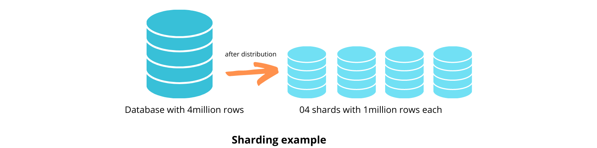

## Table of Contents

## What is a shard in the context of machine learning?

In machine learning, a shard refers to a portion of a larger dataset that is split into smaller, manageable pieces. This technique is often used when dealing with very large datasets that are too big to be processed by a single machine or in a single pass. By dividing the data into shards, different parts of the data can be processed in parallel, which can significantly speed up the training process of machine learning models.

For example, imagine you have a dataset with millions of images. Instead of loading all the images into memory at once, you can split the dataset into smaller shards, each containing a subset of the images. These shards can then be distributed across multiple computers or processed sequentially on a single machine. This not only helps in managing memory usage but also allows for more efficient use of computational resources.

In practice, sharding can be implemented in various ways depending on the specific requirements of the machine learning task. For instance, in distributed training scenarios, each shard might be assigned to a different node in a cluster, where each node processes its shard independently before the results are combined. This approach is particularly useful in deep learning, where large neural networks are trained on vast amounts of data.

## Why are shards used in machine learning models?

Shards are used in [machine learning](/wiki/machine-learning) models to handle large datasets that are too big for a single machine to process at once. By breaking the data into smaller pieces, or shards, the workload can be distributed across multiple machines or processed in smaller batches on a single machine. This helps manage memory usage better, as the entire dataset does not need to be loaded into memory all at once. Instead, each shard can be processed individually, making it easier to work with limited resources.

Additionally, using shards allows for parallel processing, which can speed up the training of machine learning models. When different machines or processors work on different shards at the same time, the overall time needed to train a model can be significantly reduced. This is particularly important in fields like [deep learning](/wiki/deep-learning), where models often need to be trained on vast amounts of data. By processing shards in parallel, the efficiency of the training process is improved, leading to faster model development and deployment.

## How does sharding improve the performance of machine learning algorithms?

Sharding helps machine learning algorithms work faster and better by breaking big data into smaller pieces called shards. When you have a huge amount of data, it can be hard for one computer to handle it all at once. By splitting the data into shards, each piece can be processed separately. This means that if you have many computers, each one can work on a different shard at the same time. This is called parallel processing, and it makes the whole process much quicker because the work is shared among many machines.

Another way sharding improves performance is by saving memory. When training a machine learning model, you need to load data into the computer's memory. With very large datasets, this can be a problem because the memory might not be big enough. Sharding lets you load and process just one shard at a time, which uses less memory. This way, you can train your model without running out of memory, making the process smoother and more efficient.

## What are the common methods to implement sharding in machine learning?

One common way to implement sharding in machine learning is by using horizontal partitioning. This means splitting the dataset into smaller subsets based on rows. For example, if you have a dataset with millions of entries, you could split it into smaller groups, where each group, or shard, contains a portion of the total rows. These shards can then be processed independently, either on different machines in a distributed system or sequentially on a single machine. This method helps manage large datasets efficiently and speeds up the training process by allowing parallel processing.

Another method is vertical partitioning, where the dataset is divided based on columns. This is useful when different parts of the data are used for different tasks or when some columns are more frequently accessed than others. For instance, if you are training a model that uses only a subset of the total features, you can shard the data by grouping related columns together. This approach can reduce the amount of data that needs to be loaded into memory at any one time, making the training process more memory-efficient. Both horizontal and vertical partitioning can be combined to create a more flexible sharding strategy that optimizes performance based on the specific needs of the machine learning task.

## Can you explain the difference between sharding and partitioning in machine learning?

Sharding and partitioning are similar ideas in machine learning, but they can be a bit different. Sharding usually means breaking a big dataset into smaller pieces, called shards, so that different machines or processors can work on them at the same time. This helps make things faster, especially when you have a lot of data. Imagine you have a giant puzzle; sharding is like giving different parts of the puzzle to different friends to solve at the same time.

Partitioning, on the other hand, is a broader term that can include sharding but also other ways of splitting data. Partitioning can be about organizing data into smaller, more manageable groups, not just for speed but also for easier management and analysis. For example, you might partition data by time, like having different datasets for each month, or by type, like separating customer data from sales data. While sharding is often about speed and parallel processing, partitioning can be used for various reasons, including data organization and easier access.

## How does sharding affect the training process of a machine learning model?

Sharding helps speed up the training of a machine learning model by breaking a big dataset into smaller pieces called shards. When you have a lot of data, it can be hard for one computer to handle it all at once. By splitting the data into shards, different computers or processors can work on different pieces at the same time. This is like having many friends help you solve a big puzzle faster. Each friend works on a different part of the puzzle, and when they are done, you put all the pieces together. This way, the training process becomes much quicker because the work is shared among many machines.

Another way sharding helps is by saving memory. When training a machine learning model, you need to load data into the computer's memory. With very large datasets, this can be a problem because the memory might not be big enough. Sharding lets you load and process just one shard at a time, which uses less memory. This way, you can train your model without running out of memory, making the process smoother and more efficient. By managing memory better and allowing for parallel processing, sharding makes the training of machine learning models faster and more manageable.

## What are the challenges faced when implementing sharding in machine learning systems?

One challenge when implementing sharding in machine learning systems is making sure that each shard has a good mix of data. If the data is not split evenly or if some important information is missing from a shard, it can make the model less accurate. This is called data skew, and it can be hard to avoid, especially with big and complicated datasets. You need to be careful about how you divide the data so that each shard can help train the model properly.

Another challenge is keeping everything in sync when you are using many computers to process the shards. When each computer is working on its own piece of data, they need to communicate with each other to make sure they are all on the same page. This can be tricky because if one computer finishes its work before the others, it might have to wait, which can slow things down. Also, if there is a problem with one computer, it can affect the whole training process. So, managing how the computers work together and keeping them coordinated is important but can be difficult.

## How can sharding be optimized for distributed machine learning environments?

To optimize sharding for distributed machine learning environments, it's important to make sure each shard has a good mix of data. This means you should try to avoid data skew, where some shards have more or less of certain types of data. You can do this by carefully choosing how to split the data, maybe using random sampling or stratification techniques. This helps make sure that each computer working on a shard is training the model with a balanced set of examples, leading to a more accurate model overall.

Another key to optimizing sharding is to manage how the computers in the distributed system work together. This involves setting up good communication between the machines so they can share updates and stay in sync. You might use techniques like synchronous or asynchronous updates to keep everything running smoothly. Synchronous updates mean all computers wait for each other before moving on, while asynchronous updates let them keep working without waiting. Choosing the right approach depends on your specific needs, like how fast you need the training to go and how much you can handle some computers being a bit out of sync.

## What impact does sharding have on the scalability of machine learning models?

Sharding helps make machine learning models more scalable by breaking big datasets into smaller pieces that different computers can work on at the same time. This means you can use more computers to train your model faster. When you have a lot of data, it can be hard for one computer to handle it all. By splitting the data into shards, you can spread the work across many machines, making the training process quicker and allowing you to handle even bigger datasets.

Another way sharding helps with scalability is by saving memory. When training a model, you need to load data into the computer's memory. With very large datasets, this can be a problem because the memory might not be big enough. Sharding lets you load and process just one shard at a time, which uses less memory. This way, you can train your model without running out of memory, making it easier to scale up your machine learning projects to handle more data and more complex models.

## How does sharding influence data privacy and security in machine learning?

Sharding can help with data privacy and security in machine learning by spreading data across different computers. When data is split into shards, each computer only sees a small part of the whole dataset. This means if one computer gets hacked, the attacker only gets a piece of the data, not everything. It's like hiding pieces of a puzzle in different places; if someone finds one piece, they still can't see the whole picture.

However, sharding can also make things more complicated. When data is spread out, it's harder to keep track of where everything is and to make sure it's all secure. You need good ways to make sure the data stays safe while moving between computers and while it's being processed. If you don't do this right, sharding could actually make your data less secure because there are more places where things could go wrong.

## What are some advanced techniques for managing shards in large-scale machine learning applications?

One advanced technique for managing shards in large-scale machine learning applications is dynamic sharding. This means the system can change how it splits the data into shards while the model is being trained. If some computers finish their work faster than others, the system can give them more data to work on. This helps keep everything balanced and makes the training process faster. Dynamic sharding can also help if the data changes over time, like if new data comes in, by adjusting the shards to include the new information without stopping the training.

Another technique is using hash-based sharding. This method uses a special math formula to decide which data goes into which shard. For example, if you have a dataset with customer IDs, you can use a hash function to turn each ID into a number, and then use that number to decide which shard the data goes into. This helps make sure the data is split evenly and can be useful for keeping the data balanced across different computers. It's like using a secret code to sort the data in a way that makes it easy to manage and process.

## Can you discuss a case study where sharding significantly improved a machine learning system's performance?

A great example of sharding improving a machine learning system's performance is seen in the work done by Google on their TensorFlow framework. Google had to deal with huge amounts of data for training their machine learning models, and sharding helped them manage this challenge effectively. They split their large datasets into smaller shards, which allowed them to distribute the workload across many computers in their data centers. This parallel processing made the training of their models much faster. For instance, when training a deep learning model on a dataset with millions of images, sharding allowed them to process different parts of the data at the same time, significantly reducing the overall training time.

In another case study, a company called Airbnb used sharding to improve the performance of their recommendation system. Airbnb's system needed to handle a vast amount of user data and property listings to provide personalized recommendations. By implementing sharding, they were able to split their data into manageable pieces and process them in parallel across multiple servers. This not only sped up the training of their machine learning models but also allowed them to scale their system to handle more data as their business grew. The result was a more responsive and accurate recommendation system that could keep up with the increasing demands of their users.

## References & Further Reading

[1]: Abadi, M., Barham, P., Chen, J., Chen, Z., Davis, A., Dean, J., ... & Zheng, X. (2016). ["TensorFlow: A System for Large-Scale Machine Learning."](https://arxiv.org/abs/1603.04467) In 12th {USENIX} Symposium on Operating Systems Design and Implementation ({OSDI} 16) (pp. 265-283).

[2]: Dean, J., & Ghemawat, S. (2008). ["MapReduce: Simplified Data Processing on Large Clusters."](https://dl.acm.org/doi/10.1145/1327452.1327492) Communications of the ACM, 51(1), 107-113.

[3]: Lorica, B. (2017). ["Airbnb's Data Infrastructure: A Case Study."](https://www.tandfonline.com/doi/full/10.1080/01916122.2025.2494808) O'Reilly Media.

[4]: LeCun, Y., Bengio, Y., & Hinton, G. (2015). ["Deep Learning."](https://www.nature.com/articles/nature14539) Nature, 521(7553), 436-444. 

[5]: Zaharia, M., Chowdhury, M., Franklin, M. J., Shenker, S., & Stoica, I. (2010). ["Spark: Cluster Computing with Working Sets."](https://people.csail.mit.edu/matei/papers/2010/hotcloud_spark.pdf) In 2nd USENIX Workshop on Hot Topics in Cloud Computing (Vol. 10).