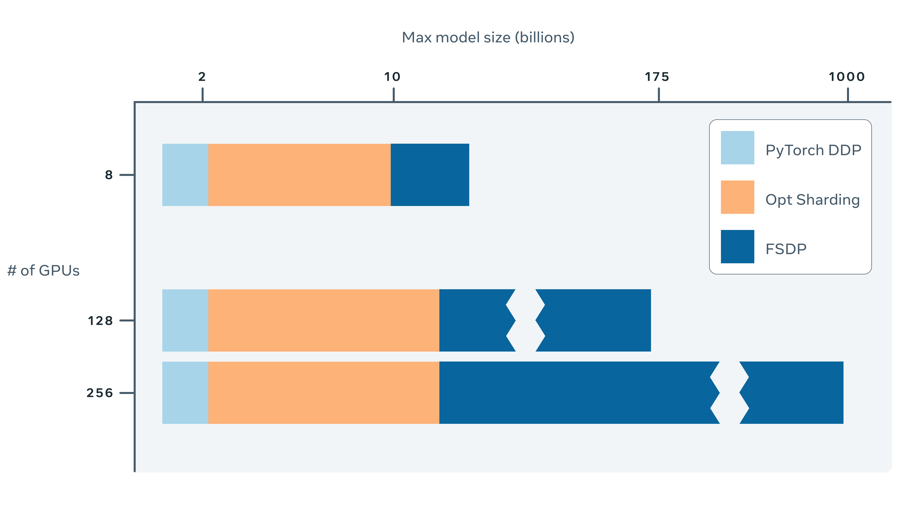

## Table of Contents

## What is sharded data parallel in machine learning?

Sharded data parallel is a technique used in machine learning to train large models more efficiently. It involves splitting the model's parameters and data across multiple devices, like GPUs, so that each device works on a part of the model and data at the same time. This way, the training process can be faster because the workload is shared among many devices. For example, if you have a model with a lot of parameters, you can divide these parameters into smaller chunks, and each GPU can handle one chunk. This is especially useful when you're working with very large datasets or models that don't fit into the memory of a single device.

In sharded data parallel, the data is also split into smaller pieces, called shards. Each device processes its own shard of data and its part of the model. After processing, the devices need to communicate with each other to combine their results. This communication can be a bit tricky because it needs to be fast and efficient to keep the training process smooth. The goal is to make sure that all devices are working together well, so the model can learn from the entire dataset effectively. By using sharded data parallel, you can train bigger and more complex models faster than if you were using just one device.

## How does sharded data parallel differ from traditional data parallel methods?

Sharded data parallel and traditional data parallel methods both aim to speed up machine learning model training by using multiple devices, like GPUs. In traditional data parallel, the entire model is copied onto each device. Each device then works on a different part of the data, but all devices use the same model. After processing their part of the data, the devices share their results to update the model. This method works well when the model is small enough to fit into the memory of each device.

In contrast, sharded data parallel is used when the model is too large to fit into the memory of a single device. Instead of copying the whole model to each device, the model's parameters are split into smaller parts, or shards, and each device gets a different part of the model. The data is also split into shards, and each device processes its own shard of data with its part of the model. This allows for training much larger models because no single device needs to hold the entire model at once. However, this method requires more complex communication between devices to combine the results and update the model effectively.

## What are the main benefits of using sharded data parallel methods?

Sharded data parallel methods allow you to train very big [machine learning](/wiki/machine-learning) models that wouldn't fit into the memory of just one device. By splitting the model's parameters and the data into smaller parts, called shards, each device can work on a piece of the model and data at the same time. This means you can use many devices together to handle models that are too large for a single device. This is really helpful when you want to train complex models with lots of data, because it makes the training process faster and more efficient.

Another big benefit is that sharded data parallel can make better use of the available hardware. When you use traditional data parallel, each device needs to have a copy of the whole model, which can be wasteful if the model is very large. With sharded data parallel, you can spread the model across many devices, so you don't need as much memory on each device. This can save money and resources, because you can use more affordable hardware to train big models. Plus, by working together, the devices can finish the training faster, which is great for projects where time is important.

## Can you explain the concept of ZeRO (Zero Redundancy Optimizer)?

ZeRO, or Zero Redundancy Optimizer, is a technique used in machine learning to make training big models faster and more efficient. In traditional methods, each device, like a GPU, has to keep a full copy of the model's parameters, which can be wasteful and take up a lot of memory. ZeRO solves this problem by splitting the model's parameters, gradients, and optimizer states across multiple devices. This means that no single device needs to store the entire model, making it possible to train much larger models without running out of memory.

The key idea behind ZeRO is to reduce redundancy. Instead of each device having all the data, ZeRO makes sure that each piece of data is stored on only one device at a time. When a device needs to use data that it doesn't have, it can quickly get it from another device. This way, the devices can work together more efficiently, and the training process can be faster. ZeRO is especially useful for very large models, because it allows you to use the memory and computing power of many devices together, making it easier to train models that would be too big for a single device.

## How does ZeRO-Offload enhance the capabilities of ZeRO?

ZeRO-Offload takes the benefits of ZeRO even further by using the CPU and disk storage to help with training big models. In regular ZeRO, all the model's parameters, gradients, and optimizer states are split across GPUs. But with ZeRO-Offload, some of this data can be moved to the CPU or even saved on the disk when it's not being used. This means you can train models that are even bigger than what regular ZeRO can handle, because you're not limited to just the memory on the GPUs.

By offloading data to the CPU or disk, ZeRO-Offload frees up more space on the GPUs, which can make the training process faster. It's like having extra storage and processing power that you can use when you need it. This is really helpful when you're working with very large models and datasets, because it lets you use all the resources you have more efficiently. So, with ZeRO-Offload, you can train bigger and more complex models without needing to buy more GPUs.

## What is ZeRO-Infinity and how does it differ from ZeRO and ZeRO-Offload?

ZeRO-Infinity is a way to train really big machine learning models by using not just GPUs, but also CPUs and even the computer's hard drive. It's like ZeRO and ZeRO-Offload, but it goes even further. With ZeRO-Infinity, you can move parts of the model, like the parameters and gradients, to the CPU or hard drive when they're not being used by the GPUs. This means you can train models that are much bigger than what you could handle with just ZeRO or ZeRO-Offload, because you're using all the memory and processing power you have.

The main difference between ZeRO-Infinity and the other two is how much it uses the CPU and hard drive. ZeRO splits the model across GPUs, and ZeRO-Offload moves some data to the CPU to free up space on the GPUs. But ZeRO-Infinity takes this even further by using the hard drive too. This makes it possible to train models that are so big they wouldn't fit into the memory of any single device. By using all these resources together, ZeRO-Infinity helps you train bigger and more complex models faster and more efficiently.

## What are the hardware requirements for implementing sharded data parallel methods like ZeRO?

To use sharded data parallel methods like ZeRO, you need multiple GPUs. The more GPUs you have, the bigger the models you can train. Each GPU needs enough memory to handle its part of the model and the data it's working on. You also need a good way for the GPUs to talk to each other, like a fast network connection. This is important because the GPUs need to share information to work together properly.

Besides GPUs, you might need a powerful CPU and enough disk space if you're using ZeRO-Offload or ZeRO-Infinity. These methods let you move some of the model's data to the CPU or hard drive, which helps you train even bigger models. The CPU and hard drive need to be fast enough to keep up with the GPUs, so the training process doesn't slow down. Overall, the key is to have a good balance of GPUs, CPU, and storage to make the most of sharded data parallel methods.

## How do sharded data parallel methods impact the training time of large-scale models?

Sharded data parallel methods like ZeRO can make training large-scale models much faster. By splitting the model's parameters and data across multiple GPUs, each GPU can work on a part of the model at the same time. This means that instead of one GPU doing all the work, many GPUs can share the load. This can speed up the training process a lot, especially for very big models that take a long time to train on a single GPU. The more GPUs you use, the faster the training can be, as long as the GPUs can communicate with each other quickly.

However, there are some things to think about. When you use sharded data parallel, the GPUs need to share information with each other, which can slow things down a bit. If the network connecting the GPUs is not fast enough, this can add extra time to the training process. Also, methods like ZeRO-Offload and ZeRO-Infinity use the CPU and hard drive to help with training, which can make the training even faster. But this means you need a good CPU and fast hard drive to keep up with the GPUs. Overall, sharded data parallel methods can make training big models much faster, but you need to make sure your hardware is set up right to get the best results.

## What are some common challenges faced when implementing sharded data parallel methods?

One common challenge when implementing sharded data parallel methods is managing the communication between devices. When you split a model across multiple GPUs, they need to share information with each other to work together properly. If the network connecting the GPUs is slow, this can add extra time to the training process, making it less efficient. You need to make sure the GPUs can talk to each other quickly to keep the training speed up.

Another challenge is balancing the workload across the devices. Each GPU should have a similar amount of work to do, so they can all finish at about the same time. If one GPU has more work than the others, it can slow down the whole training process. Also, when using methods like ZeRO-Offload or ZeRO-Infinity, you need to make sure the CPU and hard drive are fast enough to keep up with the GPUs. If they are too slow, it can make the training slower instead of faster.

## How can sharded data parallel methods be integrated with existing machine learning frameworks?

Sharded data parallel methods can be integrated with existing machine learning frameworks like PyTorch and TensorFlow by using special libraries or built-in features that support these methods. For example, in PyTorch, you can use the DeepSpeed library, which includes support for ZeRO and its extensions like ZeRO-Offload and ZeRO-Infinity. This library helps you split your model across multiple GPUs and manage the communication between them. To use it, you need to set up your model and training loop in a way that works with DeepSpeed, which might mean changing some of your code to fit the library's requirements.

Another way to integrate sharded data parallel methods is by using built-in features of the frameworks themselves. For instance, TensorFlow has its own distributed training capabilities that can be used to implement sharded data parallel training. You can set up your model to be split across multiple devices using TensorFlow's distribution strategies. This involves configuring your training script to use these strategies, which might require some adjustments to how you define and train your model. By using these libraries and features, you can take advantage of sharded data parallel methods to train larger models more efficiently within your existing workflow.

## What are the latest advancements in sharded data parallel techniques beyond ZeRO, ZeRO-Offload, and ZeRO-Infinity?

One of the latest advancements in sharded data parallel techniques is the development of Fully Sharded Data Parallel (FSDP) in PyTorch. FSDP allows for even more efficient use of memory by sharding the model's parameters, gradients, and optimizer states across multiple GPUs, similar to ZeRO. However, FSDP goes further by allowing for dynamic sharding, which means it can adjust how the model is split based on the available resources. This can lead to better performance and the ability to train even larger models. FSDP also includes features like mixed precision training, which can speed up the training process and reduce memory usage even more.

Another advancement is the integration of sharded data parallel methods with other optimization techniques, like gradient accumulation and pipeline parallelism. Gradient accumulation allows you to process more data before updating the model, which can help when you're working with limited GPU memory. Pipeline parallelism splits the model into stages and processes them in a pipeline fashion across multiple GPUs, which can further speed up training. By combining these techniques with sharded data parallel methods, you can train very large models more efficiently and with less hardware. These advancements are making it easier for researchers and developers to work with big models and complex datasets.

## Can you provide case studies or examples where sharded data parallel methods significantly improved model training efficiency?

One notable case study where sharded data parallel methods significantly improved model training efficiency is in the development of large language models like those used in natural language processing. For instance, researchers at Microsoft used the ZeRO technique to train a model with over 100 billion parameters. By using ZeRO, they were able to split the model across 256 GPUs, which allowed them to train the model much faster than if they had used traditional data parallel methods. The training time was reduced from weeks to just a few days, making it possible to experiment with different model configurations and hyperparameters more quickly. This improvement in efficiency helped them achieve better performance on language understanding tasks.

Another example comes from the field of computer vision, where researchers at Meta used ZeRO-Infinity to train a large-scale vision model. They had a model that was too big to fit into the memory of a single GPU, so they used ZeRO-Infinity to offload some of the model's data to the CPU and disk. This allowed them to train the model using fewer GPUs than they would have needed otherwise, saving on hardware costs. The training process was also faster because the GPUs were able to focus on the most important parts of the model, while the CPU and disk handled the rest. As a result, they were able to train a more complex and accurate model in less time, which improved the performance of their vision tasks.

These examples show how sharded data parallel methods like ZeRO, ZeRO-Offload, and ZeRO-Infinity can make a big difference in training large-scale models. By splitting the model across multiple devices and using all available resources efficiently, these techniques allow researchers to train bigger and better models faster and with less hardware. This is important for advancing research in fields like natural language processing and computer vision, where large models are often needed to achieve state-of-the-art results.