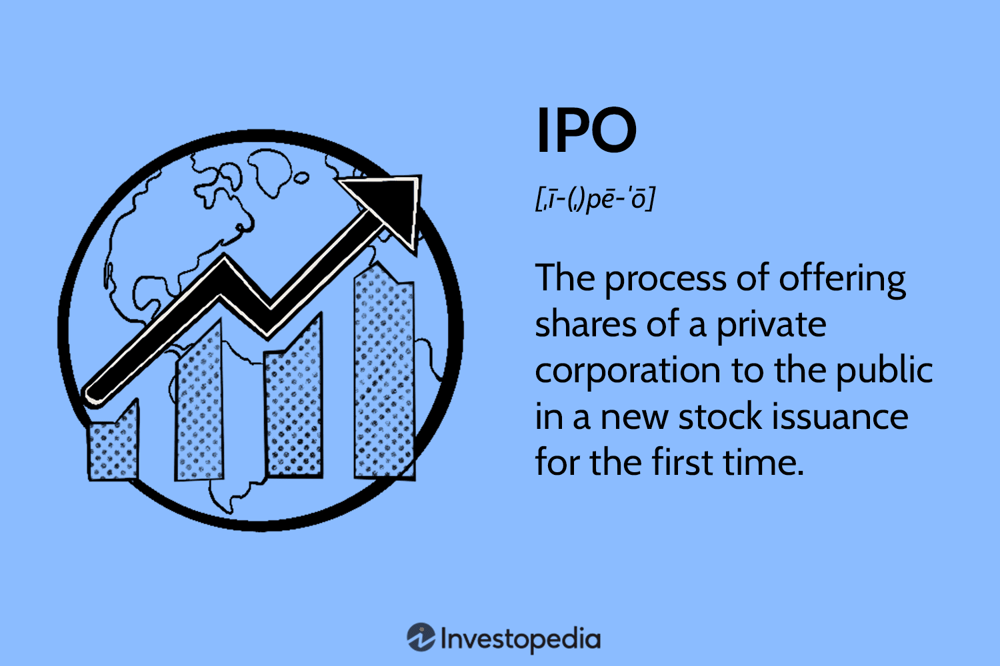

## Table of Contents

## What is share allotment and how does it work?

Share allotment is when a company gives out its shares to people who want to buy them. This usually happens when a company is new and wants to raise money, or when it wants to grow and needs more funds. People who want to buy the shares fill out a form and say how many shares they want. The company then decides how many shares each person gets. Sometimes, if a lot of people want the shares, not everyone gets as many as they asked for.

The process of share allotment can be different depending on the company and the country's rules. Usually, the company will tell everyone how many shares they are getting through a letter or an email. After that, the buyers have to pay for the shares they were given. Once the payment is done, the shares are officially theirs. This is important because it means the buyers now own a part of the company and can sometimes get a say in how it is run.

## What are the different methods of share allotment?

There are a few main ways companies can give out shares. One way is called 'pro-rata allotment'. This means if a lot of people want to buy shares and there aren't enough for everyone, the company will give each person a smaller number of shares. For example, if someone asked for 100 shares but only gets 50, that's pro-rata. Another way is 'fixed price allotment', where the company sets a price for the shares and gives them out to whoever wants to buy at that price until they run out.

Another method is 'book building', which is a bit more complicated. In book building, the company doesn't set a fixed price right away. Instead, it asks people how much they are willing to pay for the shares. The company then looks at all the offers and decides on a price that seems fair. After setting the price, the company gives out the shares to those who offered to buy at or above that price. This method helps the company get a better idea of what people think the shares are worth.

Lastly, there's 'preferential allotment', where the company gives shares to certain people or groups it chooses, like big investors or important partners. This is often done to get more investment or to build strong relationships with key players. The company decides who gets these shares and how many, usually without offering them to the general public.

## How does a company decide on the number of shares to allot?

A company decides on the number of shares to allot based on how much money it wants to raise and how many people want to buy the shares. If the company is trying to raise a certain amount of money, it will figure out how many shares it needs to sell to reach that goal. For example, if it wants to raise $1 million and each share is worth $10, the company will need to sell 100,000 shares. The company also looks at how many people are interested in buying the shares. If more people want to buy than there are shares available, the company might use a method like pro-rata allotment to give everyone a fair share.

Sometimes, the company might have special reasons for deciding how many shares to allot. For instance, if the company wants to attract big investors or important partners, it might use preferential allotment to give shares to these specific groups. In other cases, the company might use book building to see what price people are willing to pay for the shares and then decide how many shares to allot based on the offers it gets. This helps the company make sure it gets a fair price for its shares and that the shares go to people who really want them.

## What is a share increase and why might a company choose to increase its shares?

A share increase is when a company decides to make more shares and sell them. This is also called issuing new shares. When a company does this, it can sell the new shares to people who want to buy them, and this brings in more money for the company. The money from selling new shares can be used for different things, like growing the business, paying off debts, or starting new projects.

A company might choose to increase its shares for a few reasons. One big reason is to raise money. If a company needs money to do something important, like building a new factory or buying new equipment, selling more shares can be a good way to get the money it needs. Another reason is to let more people own part of the company. By selling more shares, the company can have more shareholders, which can make the company more popular and well-known. Sometimes, a company might also increase its shares to make it easier for people to buy them, especially if the price of the shares is very high. By increasing the number of shares and lowering the price per share, more people might be able to afford to buy them.

## What are the legal and regulatory requirements for share increases?

When a company wants to increase its shares, it has to follow certain rules set by the government and other groups that watch over businesses. These rules can be different depending on where the company is located. Usually, the company has to tell the people who already own shares about the plan to increase the number of shares. They might need to have a meeting where the shareholders vote on whether they agree with the plan. The company also has to tell the public about the new shares, often through a document called a prospectus, which explains what the company plans to do with the money it raises.

There are also rules about how the company can sell the new shares. For example, the company might need to offer the new shares to the current shareholders first, before selling them to new buyers. This is called a rights issue. The company also has to be careful not to break any rules about how it talks about the new shares. It can't say things that aren't true or that might trick people into buying the shares. If the company doesn't follow these rules, it could get in trouble with the government or other groups that make sure companies follow the law.

## How does a share increase affect existing shareholders?

When a company increases its shares, it can change things for the people who already own shares. If the company sells more shares, the value of each share might go down because there are more shares to go around. This means that the part of the company that each existing shareholder owns gets smaller. For example, if you owned 10% of the company before the share increase, you might own less than 10% after the company sells more shares. This is called dilution, and it can make the shares you own worth less money.

On the other hand, a share increase can also be good for existing shareholders if the company uses the money well. If the company uses the money to grow the business or start new projects that make more money, the value of the company might go up. This can make the shares worth more in the long run, even if each share is worth a little less right after the increase. So, while a share increase might make your shares worth less at first, it could help the company grow and make your shares more valuable later on.

## What is an Initial Public Offering (IPO) and what are its main objectives?

An Initial Public Offering (IPO) is when a company decides to sell its shares to the public for the first time. Before an IPO, a company might be owned by just a few people or a small group of investors. When the company goes public, it lets anyone buy its shares. This is a big step for a company because it means more people can own a part of it, and the company has to follow more rules and share more information about how it's doing.

The main goal of an IPO is to raise money. When a company sells its shares to the public, it gets money from the people who buy those shares. The company can use this money to grow its business, pay off debts, or start new projects. Another important goal is to increase the company's visibility and credibility. When a company goes public, it gets more attention from investors and the public, which can help it become more well-known and trusted. This can be good for the company's future growth and success.

## What are the steps involved in preparing for and executing an IPO?

Preparing for an IPO takes a lot of work and planning. First, the company needs to get its financials in order. This means making sure all the numbers are correct and that the company's finances look good to people who might want to buy shares. The company also needs to choose some important helpers, like investment banks, lawyers, and accountants. These helpers will guide the company through the IPO process and help make sure everything is done right. The company also needs to decide how many shares it wants to sell and at what price. This can be tricky because the company wants to raise as much money as possible but also wants to make sure people will want to buy the shares.

Once the company is ready, it's time to execute the IPO. The company starts by filing a document called a registration statement with the government. This document tells people all about the company, its finances, and what it plans to do with the money it raises. After the government looks over the document and says it's okay, the company can start selling its shares. The company usually works with its investment bank to set a final price for the shares and then offers them to the public. Once the shares start trading on the stock market, the IPO is complete. Now, the company is public, and anyone can buy and sell its shares.

## How does an IPO impact a company's financial structure and market perception?

When a company goes public through an IPO, its financial structure changes a lot. Before the IPO, the company might have been owned by just a few people or a small group of investors. After the IPO, the company has many more shareholders. This means the company now has to share its profits with more people. The money the company raises from the IPO can also change its financial structure. The company can use this money to pay off debts, which can make the company's finances healthier. Or, the company can use the money to grow its business, which can make the company bigger and more successful.

An IPO can also change how people see the company. When a company goes public, it gets a lot more attention from investors and the public. This can make the company more well-known and trusted. If the IPO goes well and the company's shares go up in price, people might think the company is doing a good job and has a bright future. On the other hand, if the IPO doesn't go well and the company's shares go down in price, people might think the company is not doing so well. So, an IPO can be a big moment for a company, and how it goes can change how people see the company for a long time.

## What are the differences between a primary and a secondary offering in an IPO?

A primary offering in an IPO is when a company sells new shares to the public for the first time. The money the company gets from selling these new shares goes straight to the company. The company can use this money to grow its business, pay off debts, or start new projects. This is the main way a company raises money through an IPO. When people buy these new shares, they become part owners of the company.

A secondary offering in an IPO is different because it involves selling shares that are already owned by someone else, usually the company's early investors or founders. The money from a secondary offering doesn't go to the company. Instead, it goes to the people who are selling their shares. A secondary offering can happen at the same time as a primary offering or later on. It's a way for early investors to get some of their money back by selling their shares to new buyers.

## How do underwriters and investment banks play a role in an IPO?

Underwriters and investment banks are very important for a company that wants to do an IPO. An underwriter is usually a big investment bank that helps the company figure out how to sell its shares. The underwriter helps the company decide how many shares to sell and at what price. They also help the company make the documents it needs to tell people about the IPO. The underwriter's job is to make sure the IPO goes well and that the company raises the money it needs.

Investment banks also help the company sell its shares to the public. They talk to investors and try to get them excited about buying the company's shares. They also help set the final price for the shares right before the IPO starts. If the IPO goes well and the shares sell quickly, the investment bank can make a lot of money. But if the IPO doesn't go well and the shares don't sell, the investment bank might have to buy some of the shares itself. This can be risky, but it's part of what they do to help the company go public.

## What are the long-term benefits and potential risks of going public through an IPO?

Going public through an IPO can bring many long-term benefits to a company. One big benefit is that the company can raise a lot of money. This money can help the company grow bigger, start new projects, or pay off debts. Another benefit is that the company becomes more well-known and trusted. When a company goes public, it gets more attention from investors and the public. This can help the company attract more customers and business partners. Also, the company's shares can be bought and sold on the stock market, which can make it easier for the company to raise more money in the future if it needs to.

However, going public through an IPO also comes with some risks. One risk is that the company has to follow a lot more rules and share a lot more information about its finances and how it's doing. This can be hard and expensive for the company. Another risk is that the price of the company's shares can go up and down a lot. If the shares go down, the company might have a hard time raising more money, and people might think the company is not doing well. Also, the people who own the company before the IPO might own a smaller part of the company after the IPO, which can make them less happy. So, while going public can help a company grow, it also brings new challenges and risks.

## What are Overallotment Options and the Greenshoe Mechanism?

The overallotment option, commonly known as the Greenshoe option, is a financial instrument employed by underwriters in an Initial Public Offering (IPO) to maintain stability in a company's stock price in the days following the IPO. Named after the first company to implement this strategy, the Green Shoe Manufacturing Company, the overallotment option allows underwriters to issue additional shares, typically up to 15% more than the original amount set for the IPO, if the demand exceeds initial expectations.

This mechanism enables underwriters to stabilize stock price volatility effectively. When the demand for shares is high, leading to a price surge, the underwriters can exercise the Greenshoe option by purchasing additional shares from the company. This increased supply of shares helps moderate price increases and normalize market conditions. On the flip side, if the share price falls below the offering price, underwriters can buy back shares from the market to cover their short position, thereby providing support to the stock price and preventing further declines.

Mathematically, the dynamics of the Greenshoe option can be represented as follows:

$$
\text{Total shares available} = \text{Initial shares} + \text{Overallotment option (up to 15% of initial shares)}
$$

This option acts as a safety net for investors, ensuring price stability and reducing the risk of exposure to significant post-IPO price fluctuations. By promoting balance and mitigating extreme volatility, the Greenshoe mechanism fosters a more orderly and predictable trading environment. 

The deployment of such financial tools reflects strategic planning in navigating public markets and highlights the sophisticated techniques employed to cater to investor needs and market realities. The Greenshoe option exemplifies thoughtful intervention to manage supply-demand mechanics and reinforce investor confidence in newly issued stock.

## References & Further Reading

[1]: Aggarwal, R., Prabhala, N. R., & Puri, M. (2002). ["Institutional allocation in initial public offerings: Empirical evidence."](https://www.jstor.org/stable/2697783) The Journal of Finance, 57(3), 1421-1442.

[2]: Boehmer, E., Fong, K. Y. L., & Wu, J. (2021). ["Algorithmic trading and changes in firms' equity capital."](https://www.semanticscholar.org/paper/Algorithmic-Trading-and-Market-Quality%3A-Evidence-Boehmer-Fong/2dde378b30aa5acadbfed3ee3483a512f547a6d9) The Review of Financial Studies, 34(3), 1537-1577.

[3]: Gao, X., & Ritter, J. R. (2010). ["The marketing of seasoned equity offerings."](https://www.sciencedirect.com/science/article/pii/S0304405X10000504) Journal of Financial Economics, 97(1), 33-52.

[4]: Gomber, P., Arndt, B., Lutat, M., & Uhle, T. (2011). ["High-frequency trading."](https://papers.ssrn.com/sol3/papers.cfm?abstract_id=1858626) Business & Information Systems Engineering, 3(2), 93-98.

[5]: Pukthuanthong, K., & Roll, R. (2009). ["Global market integration: An alternative measure and its application."](https://www.sciencedirect.com/science/article/pii/S0304405X09001214) Journal of Financial Economics, 94(2), 214-232.

[6]: Ritter, J. R., & Welch, I. (2002). ["A review of IPO activity, pricing, and allocations."](https://onlinelibrary.wiley.com/doi/abs/10.1111/1540-6261.00478) The Journal of Finance, 57(4), 1795-1828.

[7]: Schliemann, P., & Sehgal, D. (2018). ["Market Liquidity and Trading Activity."](https://www.jstor.org/stable/222572) Business & Information Systems Engineering, 60(4), 229-240.