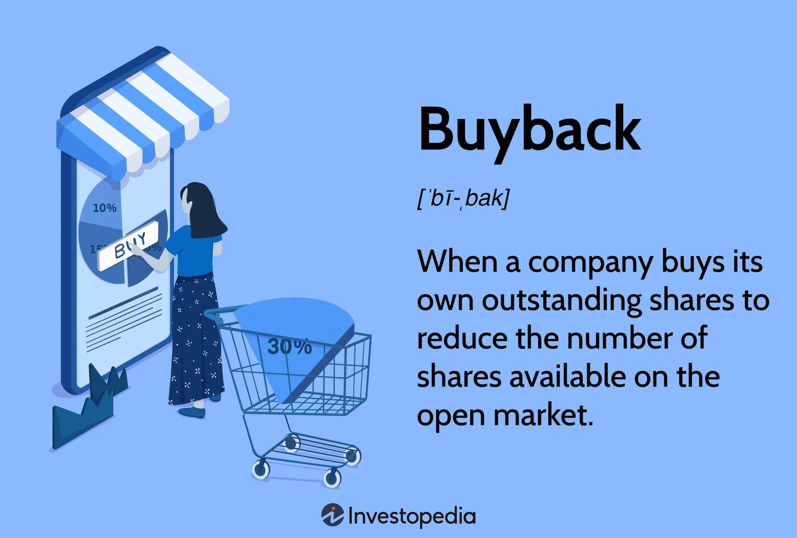

## Table of Contents

## What is a share buyback?

A share buyback, also known as a stock repurchase, is when a company buys back its own shares from the marketplace. This means the company is essentially investing in itself by reducing the number of shares available to the public. Companies might decide to do this for various reasons, like if they believe their stock is undervalued, or if they want to increase the value of the remaining shares by making them scarcer.

When a company buys back its shares, it uses its own money to do so. This money can come from the company's profits or from other funds it has available. Once the shares are bought back, they can be kept by the company, canceled, or reissued later. Share buybacks can be good for shareholders because they can increase the value of their shares and might also increase the earnings per share, since there are fewer shares among which the company's earnings are divided.

## Why do companies engage in share buybacks?

Companies engage in share buybacks for a few main reasons. One big reason is that they think their stock is not priced correctly by the market. They believe their shares are worth more than what people are paying for them. So, they use their own money to buy the shares back, hoping to get them at a good price. Another reason is to make the remaining shares more valuable. When a company buys back its shares, it reduces the total number of shares out there. This can make each share more valuable because there are fewer of them.

Another reason companies do buybacks is to return money to shareholders in a different way than paying dividends. Instead of giving cash directly to shareholders, the company uses that cash to buy back shares. This can be good for shareholders because it can increase the value of their shares over time. It also gives them the option to sell their shares back to the company if they want to. Overall, share buybacks are a way for companies to use their money to potentially increase shareholder value and show confidence in their own business.

## How does a share buyback affect a company's stock price?

When a company does a share buyback, it can make the stock price go up. This happens because there are fewer shares available in the market. When there are fewer shares, and the same number of people want to buy them, the price can go up because of supply and demand. Also, when a company buys back its shares, it shows that the company thinks its stock is a good investment. This can make other people feel more confident about the company and want to buy its stock too, which can push the price up.

But, a share buyback doesn't always make the stock price go up right away. Sometimes, the market might not react the way the company hopes. If people think the company is using its money in a bad way or if there are other things happening in the market, the stock price might not change much or could even go down. It's also important to know that the long-term effect on the stock price depends on how well the company does after the buyback. If the company keeps doing well, the stock price might keep going up, but if it doesn't, the stock price might not go up as much as expected.

## What are the different methods of executing a share buyback?

Companies can use different ways to buy back their shares. One common way is through open market purchases. This means the company buys its shares on the stock market, just like any other investor. They might buy a little bit at a time over a long period, or they might buy a lot at once. Another way is through tender offers. In a tender offer, the company tells its shareholders that it wants to buy back a certain number of shares at a specific price. Shareholders can then decide if they want to sell their shares back to the company at that price.

Another method is through a Dutch auction. In a Dutch auction, the company says it will buy back shares within a range of prices. Shareholders then tell the company how many shares they want to sell and at what price within that range. The company then picks the lowest price that lets it buy back the number of shares it wants. This way, everyone who offered to sell at or below that price gets to sell their shares. Lastly, some companies use negotiated purchases or block trades. This is when the company talks directly with big shareholders or investment firms to buy a large number of shares all at once. Each method has its own benefits and can be chosen based on what the company wants to achieve with the buyback.

## Can a share buyback be beneficial for shareholders?

Yes, a share buyback can be good for shareholders. When a company buys back its own shares, it reduces the total number of shares available. This can make each remaining share more valuable because there are fewer shares to go around. It's like if you have a pizza and fewer people to share it with, you get a bigger slice. Also, when a company uses its money to buy back shares, it shows that the company believes its stock is a good investment. This can make shareholders feel more confident and might make the stock price go up.

Another way share buybacks can help shareholders is by increasing the earnings per share. Since there are fewer shares after a buyback, the company's earnings are divided among fewer shares, which can make the earnings per share higher. This can make the stock more attractive to investors. Share buybacks also give shareholders a choice. If they want to sell their shares back to the company, they can do so, which can be a way to get some of their investment back. Overall, share buybacks can be a smart way for a company to use its money to potentially increase the value of the shares that shareholders own.

## What are the potential drawbacks of share buybacks for a company?

Share buybacks can have some downsides for a company. One problem is that the company uses its money to buy back shares instead of investing in new projects or improving its business. This can slow down the company's growth because it's not using its money to make the business better. Also, if the company borrows money to buy back shares and the stock price doesn't go up, the company might have trouble paying back the loan. This can put the company in a risky financial situation.

Another issue is that share buybacks might not always make the stock price go up right away. If the market doesn't think the buyback is a good idea, the stock price could even go down. This can make shareholders unhappy and might make them lose trust in the company's decisions. Also, if the company is doing buybacks just to make the stock price look better for a short time, it might be ignoring bigger problems that need to be fixed. This can hurt the company in the long run.

## How are share buybacks regulated?

Share buybacks are watched over by rules to make sure companies do them the right way. In the United States, the main rule is called Rule 10b-18, which is part of the Securities and Exchange Commission (SEC) rules. This rule says that if a company follows certain steps when buying back its shares, it won't be seen as trying to trick the market. The steps include things like how much they can buy back each day, and not buying back shares at the start or end of the trading day. This helps make sure the buyback is done fairly and doesn't mess with the stock price too much.

There are also other rules that companies need to follow. For example, they have to tell everyone about their buyback plans so that shareholders know what's going on. They also can't use secret information to decide when to buy back shares. In other countries, there are different rules, but most places have laws to make sure buybacks are done honestly and openly. This helps protect shareholders and keeps the market fair for everyone.

## What is the difference between a share buyback and a dividend?

A share buyback and a dividend are two different ways a company can give money back to its shareholders. A share buyback happens when a company uses its money to buy its own shares from the market. This can make the remaining shares more valuable because there are fewer shares available. It's like if you have a pizza and fewer people to share it with, you get a bigger slice. Shareholders don't get cash directly from a buyback, but they might see the value of their shares go up.

On the other hand, a dividend is when a company gives cash directly to its shareholders. If you own shares in the company, you get a certain amount of money for each share you own. This is like getting a piece of the company's profits. Dividends give shareholders immediate money, but they don't change the number of shares or the stock price directly. Both methods can be good for shareholders, but they work in different ways and can affect the company and its shareholders differently.

## How do share buybacks impact a company's financial statements?

When a company does a share buyback, it shows up in its financial statements in a few ways. First, the company uses its cash to buy the shares, so the cash on the balance sheet goes down. The value of the shares that the company buys back is taken out of the shareholders' equity section, usually from the part called "treasury stock." This makes the total shareholders' equity go down because the company is now holding onto its own shares instead of them being owned by the public.

Also, share buybacks can change the company's earnings per share (EPS). Since there are fewer shares after a buyback, the company's total earnings are spread over fewer shares. This can make the EPS go up, which can make the company look more profitable on a per-share basis. But, the actual total earnings of the company don't change because of the buyback. So, while the EPS might look better, the overall financial health of the company depends on more than just the number of shares.

## What are the tax implications of share buybacks for both the company and shareholders?

For a company, the tax implications of a share buyback can be different depending on where the company is located. In the United States, a company doesn't usually pay taxes on the money it uses to buy back its own shares. This is because the money used for the buyback is seen as a return of capital to shareholders, not as income for the company. But, the company might have to pay taxes on any money it borrows to do the buyback, like interest on loans. So, it's important for the company to think about how it will pay for the buyback and what that might mean for its taxes.

For shareholders, the tax implications of a share buyback can also vary. If a shareholder decides to sell their shares back to the company during a buyback, they might have to pay capital gains tax on any profit they make. This means if they sell the shares for more than they paid for them, they have to pay tax on the difference. The amount of tax depends on how long they held the shares and the tax laws where they live. If a shareholder doesn't sell their shares back to the company, they don't have to pay any taxes right away. But, if the buyback makes the value of their remaining shares go up, they might have to pay taxes later when they do decide to sell those shares.

## How do investors typically react to announcements of share buybacks?

When a company says it's going to do a share buyback, investors often see it as a good sign. They think the company believes its own stock is a good deal, which can make them feel more confident about the company. This can make the stock price go up because more people want to buy the stock. But, not all investors react the same way. Some might worry that the company is using its money to buy back shares instead of investing in new projects or paying down debt. They might think the company is trying to make the stock price look better for a short time instead of focusing on long-term growth.

Investors also look at other things when a company announces a buyback. They check if the company has enough money to buy back shares without hurting its business. They also think about how the buyback might change the company's earnings per share and the overall value of their investment. If the buyback seems like a smart move and the company is doing well, investors are usually happy. But if the company's reasons for the buyback seem weak or if there are other problems with the company, investors might not be as excited and the stock price might not go up as much.

## What are some notable examples of share buybacks and their outcomes?

One famous example of a share buyback is when Apple started buying back its shares in 2012. Apple used a lot of its money to buy back its own stock, and this made the value of the remaining shares go up. Over the years, Apple kept doing buybacks and it helped make the stock price go up a lot. Shareholders were happy because their shares became more valuable. Apple's buyback program showed that the company thought its stock was a good investment, and this made investors feel more confident in the company.

Another example is IBM, which spent a lot of money on share buybacks in the 2010s. IBM wanted to make its earnings per share look better by reducing the number of shares. But, some people thought IBM was spending too much money on buybacks instead of investing in new projects to grow the business. In the end, IBM's stock price didn't go up as much as people hoped, and some investors were not happy. This shows that buybacks can work well for some companies but not so well for others, depending on how the company uses its money and how it's doing overall.

## Why do companies opt for share buybacks?

Companies opt for share buybacks for various strategic and financial reasons, primarily to enhance shareholder value and optimize financial performance. One of the foremost motivations is the belief that the company's stock is undervalued in the market. When share prices are perceived to be lower than the intrinsic value, a buyback can correct the market mispricing by reducing the supply of shares and potentially increasing the stock price. This practice signals management's confidence in the company's future prospects, often resulting in a positive market reaction.

Excess cash reserves also drive companies towards buybacks. In scenarios where firms accumulate substantial cash without immediate reinvestment opportunities, repurchasing shares becomes an attractive alternative. It allows the redistribution of surplus funds back to shareholders without committing to long-term dividend increases, thus maintaining operational flexibility.

An additional advantage of share buybacks is the enhancement of earnings per share (EPS). By reducing the number of outstanding shares, the same level of earnings is distributed over a smaller share base, often leading to an increase in EPS. The formula for calculating EPS is:

$$
\text{EPS} = \frac{\text{Net Income}}{\text{Outstanding Shares}}
$$

Hence, a reduction in the denominator results in a higher EPS, which can make the company more attractive to investors looking for profitability improvements.

Buybacks also serve as a strategic tool for enhancing shareholder value and defending against potential takeovers. By reducing the number of outstanding shares, buybacks increase the ownership concentration of existing shares, potentially thwarting acquisition threats by increasing the difficulty for hostile entities to acquire a controlling interest in the company. Additionally, it can boost shareholder value if the repurchase is executed at a price lower than the expected future selling price of the stock.

These strategies underscore the importance of buybacks as a means of capital reallocation and strategic financial management. They reflect company management's approach to maximizing shareholder returns while balancing market perceptions and corporate objectives. While buybacks can offer multiple benefits, they require careful consideration of timing and financial health to ensure alignment with the company's overarching strategy and market conditions.

## References & Further Reading

[1]: Ikenberry, D., Lakonishok, J., & Vermaelen, T. (2000). ["Stock Repurchases in Canada: Performance and Strategic Trading."](https://www.nber.org/papers/w7325) Journal of Finance, 55(5), 2373-2397.

[2]: Chan, Ernest P. (2013). ["Algorithmic Trading: Winning Strategies and Their Rationale."](https://github.com/hudson-and-thames/arbitragelab/blob/master/docs/source/cointegration_approach/cointegration_tests.rst) Wiley Trading.

[3]: De Prado, Marcos Lopez. (2018). ["Advances in Financial Machine Learning."](https://www.amazon.com/Advances-Financial-Machine-Learning-Marcos/dp/1119482089) Wiley.

[4]: Jansen, Stefan. (2020). ["Machine Learning for Algorithmic Trading: Predictive models to extract signals from market and alternative data for systematic trading strategies with Python."](https://www.amazon.com/Machine-Learning-Algorithmic-Trading-alternative/dp/1839217715) Packt Publishing.

[5]: Fama, Eugene F., & French, Kenneth R. (2001). ["Disappearing dividends: changing firm characteristics or lower propensity to pay?"](https://www.sciencedirect.com/science/article/pii/S0304405X01000381) Journal of Financial Economics, 60(1), 3-43.