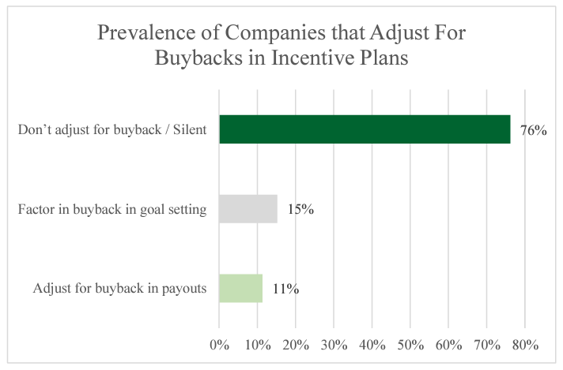

In today's dynamic financial markets, the strategies employed by corporations and traders are constantly evolving. Companies and investors are continually exploring new avenues to enhance shareholder value and optimize financial performance. One such strategy that has gained significant attention in recent years is share buybacks, also known as stock repurchases.

Share buybacks involve a company purchasing its own shares from the marketplace, with the primary aim of reducing the number of outstanding shares. This strategy can result in increasing the value of the remaining shares, benefiting existing shareholders. The popularity of buybacks has surged, as they offer a flexible method for companies to distribute excess cash to shareholders while simultaneously signaling confidence in the company's future prospects. 



This article explores the intricacies of corporate finance concerning share buybacks, their impact on stock prices, and the role of algorithmic trading in this domain. Algorithmic trading has introduced a new dimension to financial markets by enabling high-speed, data-driven decision-making processes. In the context of buybacks, algorithms assist companies in executing repurchases efficiently and strategically.

Understanding these concepts is crucial for investors and financial professionals looking to navigate the modern financial landscape. As market conditions and investor expectations continue to shift, share buybacks have become a critical tool within corporate finance. This article aims to provide a comprehensive overview of the multifaceted role that buybacks play today, equipping readers with the insights needed to better comprehend their implications and potential.

## Table of Contents

## What Are Share Buybacks?

Share buybacks, commonly referred to as stock repurchases, involve a corporation reacquiring its own shares from the existing shareholders in the open market. This strategic financial maneuver primarily aims at reducing the total number of outstanding shares in the marketplace. When a corporation reduces its share count, each remaining share's stake in the company's earnings and overall equity increases, often resulting in an uplift in the share price and enhancing shareholder value. 

Mathematically, the effect of a buyback can be understood through metrics such as Earnings Per Share (EPS). Suppose a company has a net income of $100 million and 10 million shares outstanding. The EPS is calculated as:

$$
\text{EPS} = \frac{\text{Net Income}}{\text{Number of Outstanding Shares}} = \frac{100,000,000}{10,000,000} = \$10
$$

If the company buys back 1 million shares, the new EPS becomes:

$$
\text{EPS after Buyback} = \frac{100,000,000}{9,000,000} = \$11.11
$$

This increase in EPS generally makes the stock more attractive to investors, as they perceive the company to be more profitable per share. 

Corporations typically engage in buybacks utilizing surplus cash reserves, which enables them to redistribute capital to shareholders. It also implicitly conveys the firm's confidence in its financial health and positive future prospects. This action can be perceived as the management believing that the company's stock is undervalued, warranting their reinvestment into the business.

The processes for executing buybacks can vary, primarily comprising open market purchases and tender offers. In open market purchases, the company buys its shares at the current market price, gradually executing transactions over time. Alternatively, a tender offer is a direct approach where the firm proposes to buy back shares from shareholders at a specified price, often at a premium over the current market value, for a limited period. 

Both methods require careful consideration of legal, financial, and market dynamics to ensure they align with corporate objectives and shareholder interests. Through buybacks, a company can assert greater control over its capital structure, influence share price trajectories, and optimize financial performance metrics.

## The Impact of Share Buybacks on Stock Prices

Share buybacks can have a significant impact on stock prices, primarily due to the reduction in the supply of shares available in the market. When a company repurchases its stock, it effectively reduces the number of shares outstanding, which can lead to a short-term increase in the stock price. This price appreciation occurs because, with fewer shares on the market, each remaining share represents a larger ownership stake in the company. In a basic sense, if earnings remain the same but the number of shares decreases, the earnings per share (EPS) increases, potentially boosting the stock's market value.

Investors often interpret share buybacks as a positive signal. They may see buybacks as an indication that the company has excess cash and confidence in its future profitability, suggesting that the stock is undervalued. This perception can lead to increased demand for the stock, further driving up the price in the short term.

However, the long-term effects of share buybacks are more contentious. Critics argue that buybacks might not necessarily contribute to a company's sustainable growth. By allocating capital towards stock repurchases instead of investments in research and development (R&D) or capital expenditures (CapEx), companies might undermine their long-term growth prospects. This debate hinges on whether buybacks are the best use of a company's capital, particularly when considering alternative investments that might offer higher returns over time.

Economic factors, market conditions, and investor sentiment also play crucial roles in determining the ultimate impact of buybacks on stock prices. During economic downturns, for example, the announcement of a buyback might not lead to significant price appreciation, as broader market conditions might outweigh company-specific actions. Similarly, if investor sentiment is generally pessimistic, even large buyback programs might not provide the expected upward pressure on stock prices.

Investors evaluating companies engaged in repurchase programs must consider several factors. They should assess whether the buybacks are being funded by retained earnings or debt issuance. Buybacks financed through excess earnings might be more sustainable, whereas those financed through debt could increase the company's financial leverage and risk profile.

Additionally, understanding the company's growth strategy and the rationale for the buyback is important. If a company is buying back shares simply to prop up its stock price without a clear strategic objective, investors might view this negatively.

In summary, while share buybacks can create upward [momentum](/wiki/momentum) in stock prices in the short term, their long-term impact depends on a variety of factors. These include the company's financial health, its strategy for deploying capital, and the prevailing market conditions. Investors must weigh these considerations carefully when analyzing the effects of buyback programs.

## How Share Buybacks Fit Into Corporate Finance Strategy

Corporate finance is fundamentally concerned with optimizing shareholder value, and share buybacks have emerged as a pivotal instrument in achieving this objective. Companies often weigh buybacks against dividends, both of which serve as mechanisms for returning value to shareholders. However, buybacks may present advantages in terms of tax efficiency, flexibility, and strategic capital allocation.

One notable benefit of share buybacks is their impact on financial metrics critical to investors. By repurchasing shares, a company reduces the number of outstanding shares, which can lead to an increase in earnings per share (EPS). The formula for calculating EPS is:

$$
\text{EPS} = \frac{\text{Net Income}}{\text{Average Outstanding Shares}}
$$

An increase in EPS can positively influence the perception of the company's profitability. Similarly, share buybacks can affect the return on equity (ROE), calculated as:

$$
\text{ROE} = \frac{\text{Net Income}}{\text{Shareholder's Equity}}
$$

By reducing the number of outstanding shares and thus the overall shareholders' equity, buybacks can enhance ROE, suggesting a more efficient utilization of equity capital.

Beyond these financial metrics, buybacks might play a strategic defensive role during hostile takeover attempts. By consolidating ownership, companies can strengthen control among existing shareholders, making it more difficult for hostile entities to gain a controlling interest.

The decision to implement a share buyback program involves consideration of various strategic factors. Companies might prefer buybacks over dividends when aiming for greater flexibility. Dividends represent a recurring commitment, whereas buybacks offer more discretion regarding timing and magnitude. Moreover, buybacks can facilitate strategic capital reallocation, allowing companies to redirect excess cash to value-enhancing opportunities or to adjust capital structures in response to changing market conditions.

In summary, share buybacks are a versatile tool within corporate finance, influencing crucial financial metrics and providing strategic advantages. By understanding these dynamics, firms can make informed decisions that align with their broader financial strategies and stakeholder interests.

## Algorithmic Trading and Its Role in Share Buybacks

Algorithmic trading has significantly influenced the execution of share buybacks, primarily through its ability to process vast amounts of data and execute trades at speeds unattainable by human traders. This change is crucial for companies aiming to [carry](/wiki/carry-trading) out stock repurchases with minimal disruption to market prices. By leveraging high-frequency trading algorithms, firms can efficiently schedule buyback operations, ensuring the purchases are completed with minimal market impact.

Algorithms used in buybacks focus on optimal pricing and timing. These programs analyze historical and real-time market data to identify trends, price movements, and [liquidity](/wiki/liquidity-risk-premium) levels, enabling companies to strategically position their buyback orders. The objective is to balance the trade-off between cost and execution risk, thereby acquiring shares at favorable prices while minimizing the risk of adversely affecting the stock price.

For instance, execution algorithms like VWAP (Volume-Weighted Average Price) ensure that the stock repurchase is carried out at an average price that reflects the market's true value over a specific period, making it a preferred choice for firms keen on cost-effective buybacks. Additionally, algorithms may use data points such as stock [volatility](/wiki/volatility-trading-strategies), trading [volume](/wiki/volume-trading-strategy), and [order book](/wiki/order-book-trading-strategies) dynamics to adjust their strategies on the fly, adapting to market conditions in real-time.

Python serves as a powerful tool for developing such algorithms due to its extensive libraries and ease of use in handling large datasets. Here's a simple example of a VWAP calculation that might be adapted for such a purpose:

```python
import pandas as pd

# Example DataFrame containing stock data
data = {
    'price': [100, 102, 101, 103, 102],
    'volume': [200, 150, 180, 160, 190]
}
df = pd.DataFrame(data)

# Calculate VWAP
df['pv'] = df['price'] * df['volume']
vwap = df['pv'].sum() / df['volume'].sum()

print("VWAP:", vwap)
```

In practice, these algorithms are more complex and require real-time data streams and continuous adjustments based on incoming information. The integration of [algorithmic trading](/wiki/algorithmic-trading) in share buybacks represents the confluence of technology and corporate finance, allowing companies to execute repurchase programs with precision and efficiency, ultimately benefiting from reduced costs and enhanced execution efficacy. As technology continues to evolve, its role in the financial landscape, particularly in stock repurchases, is likely to expand and further refine the strategic execution of capital distribution.

## Conclusion

Share buybacks remain a powerful tool within corporate finance, significantly influencing stock prices and corporate strategies. By reducing the number of outstanding shares, buybacks can elevate the value of remaining shares, positively impacting shareholder wealth. Additionally, they provide companies with a strategic mechanism to optimize their capital structure, potentially offering a more tax-efficient alternative to dividends.

The integration of algorithmic trading into the buyback process underscores the fusion of advanced technology and finance. Through sophisticated algorithms, companies can execute stock repurchases with precision, minimizing market impact while maximizing cost efficiency. These algorithms, leveraging vast datasets and real-time market analysis, facilitate optimal decision-making in executing buyback strategies.

Understanding the subtleties of share buybacks and algorithmic trading is essential for stakeholders navigating today's financial ecosystem. Investors, financial analysts, and corporate decision-makers must recognize how these elements interplay to influence market dynamics and corporate valuations. As financial markets continue to change, adaptability and informed decision-making are key to capitalizing on emerging opportunities while effectively managing associated risks.

This article has provided insights into the intricate world of share buybacks, equipping readers with a comprehensive understanding of their implications. As companies and traders continuously seek to refine their strategies, the knowledge of how buybacks operate and their integration with technology will be indispensable in anticipating and shaping future financial outcomes.

## References & Further Reading

[1]: Vermaelen, T. (1981). ["Common Stock Repurchases and Market Signaling: An Empirical Study."](https://www.sciencedirect.com/science/article/pii/0304405X81900118) Journal of Financial Economics, 9(2), 139-183.

[2]: Peyer, U., & Vermaelen, T. (2009). ["The Nature and Persistence of Buyback Anomalies."](https://papers.ssrn.com/sol3/papers.cfm?abstract_id=1365688) Review of Financial Studies, 22(4), 1693-1745.

[3]: ["Corporate Finance"](https://www.investopedia.com/terms/c/corporatefinance.asp) by Stephen A. Ross, Randolph W. Westerfield, and Jeffrey F. Jaffe

[4]: Fama, E. F., & French, K. R. (2001). ["Disappearing Dividends: Changing Firm Characteristics or Lower Propensity to Pay?"](https://www.sciencedirect.com/science/article/pii/S0304405X01000381) Journal of Financial Economics, 60(1), 3–43.

[5]: ["Trading and Exchanges: Market Microstructure for Practitioners"](https://academic.oup.com/book/52292) by Larry Harris

[6]: ["Algorithmic Trading: Winning Strategies and Their Rationale"](https://onlinelibrary.wiley.com/doi/pdf/10.1002/9781118676998.fmatter) by Ernie Chan