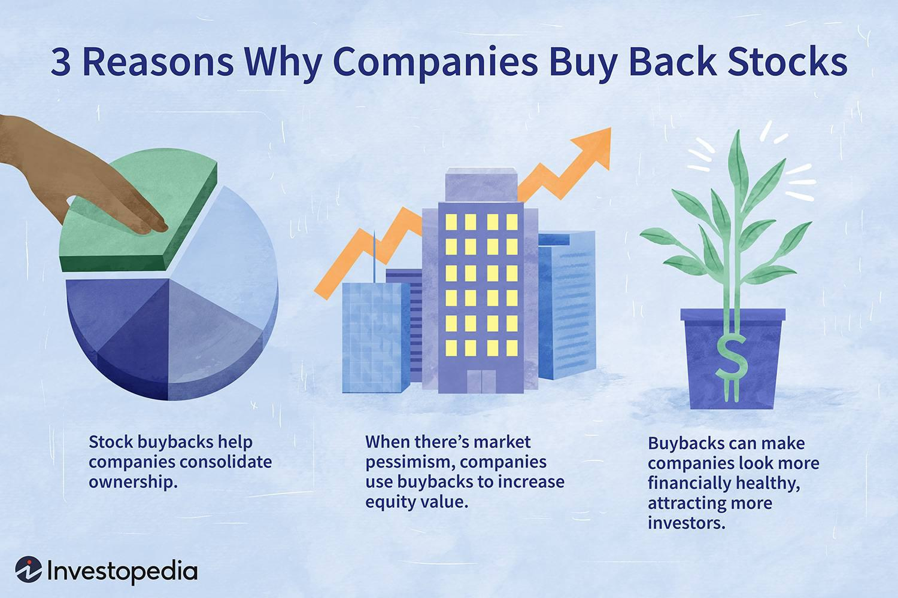

In corporate finance, strategies such as share buybacks, stock repurchases, and share redemptions have gained increasing importance. These financial maneuvers allow companies to effectively return capital to shareholders, exercise control over stock prices, and enhance overall financial performance. By reducing the number of outstanding shares, these strategies can help increase the value of remaining shares and improve key financial metrics such as Earnings Per Share (EPS) and Return on Equity (ROE).

Algorithmic trading has played a crucial role in evolving the implementation of these strategies. This advanced technology enables companies to execute trades with precision and speed, minimizing human error and market disruptions. Through the use of complex algorithms that analyze real-time data, businesses can optimize the timing of buybacks and other financial maneuvers, which is particularly critical in volatile markets.



Understanding the nuances and implications of share buybacks, stock repurchases, and share redemptions is vital for both investors and corporations. These mechanisms offer various advantages, including potential tax efficiencies and flexibility in capital management. As the financial landscape continues to transform, being well-versed in these components aids in making strategic decisions. This article delves into the essence of these financial strategies and the pivotal role of algorithmic trading in enhancing their effectiveness, providing insights crucial for navigating modern financial markets.

## Table of Contents

## Understanding Share Buybacks and Stock Repurchases

Share buybacks and stock repurchases are financial strategies where a company reacquires its own shares from the marketplace, reducing the total number of shares outstanding. This reduction can lead to an increase in Earnings Per Share (EPS) and Return on Equity (ROE), as these key financial metrics are calculated with fewer shares. 

For instance, EPS, defined as:

$$
\text{EPS} = \frac{\text{Net Income}}{\text{Average Outstanding Shares}}
$$

increases when the denominator (number of shares) decreases, assuming net income remains constant. Similarly, ROE, which measures a company's profitability relative to shareholders' equity, can be positively impacted:

$$
\text{ROE} = \frac{\text{Net Income}}{\text{Shareholder’s Equity}}
$$

A decrease in shareholder's equity, due to capital being used for buybacks, can boost ROE, portraying a more efficient use of capital.

Management often opts for buybacks when they perceive the company's shares as undervalued, signaling faith in long-term growth prospects. This move can increase market confidence, drive up share prices, and enhance shareholder value.

From a financial perspective, buybacks can offer tax advantages over dividends. In jurisdictions where capital gains are taxed at a lower rate than dividends, buybacks might be a more tax-efficient method to return capital to shareholders. Additionally, reducing the number of shares can lead to higher share prices by increasing demand relative to supply, benefiting current shareholders.

In summary, share buybacks and stock repurchases are crucial tools for financial management, impacting metrics, market valuation, and offering potential tax benefits, thereby playing a central role in investor relations and corporate strategy.

## Share Redemptions and Their Strategic Applications

Share redemptions are a significant component of corporate financial management, involving the compulsory repurchase of shares by the issuing company at a predetermined price. These mechanisms are frequently associated with callable shares, a type of equity that provides the issuer the right, but not the obligation, to repurchase at set times and prices. This feature offers several advantages in capital management, allowing firms to efficiently control [liquidity](/wiki/liquidity-risk-premium) and capital structure.

Redemption strategies play a crucial role in safeguarding companies from hostile takeovers. By concentrating ownership through the redemption of shares, companies can effectively strengthen their defenses against unsolicited acquisition attempts. This concentration reduces the number of publicly held shares, thereby diminishing the likelihood of accumulation by potential acquirers aiming to gain significant influence or control.

Unlike standard buybacks, share redemptions are less voluntary for both the company and the shareholder. They typically involve pre-agreed conditions set forth at the time of issuance, providing a structured method of ensuring shareholder alignment and managing capital flows. This structure results in a higher degree of predictability and control over corporate shareholding.

For companies, implementing share redemptions involves strategic considerations. It requires a balance between leveraging the flexibility in financial management and ensuring the timing aligns with market conditions and corporate financial health. Therefore, understanding the nature and impact of share redemptions is essential for effective capital planning and corporate governance.

## Algorithmic Trading in Enhancing Buyback Strategies

The implementation of [algorithmic trading](/wiki/algorithmic-trading) has become a transformative force in enhancing the execution of stock buyback strategies. Algorithms are designed to perform trades with a level of speed and precision unattainable by human traders. This capability is crucial for minimizing human error and the potential adverse impact on market prices that large buyback orders might otherwise induce. Through algorithms, companies can execute buybacks more efficiently, ensuring that large transactions are broken into smaller ones across different times and venues to optimize pricing.

Real-time data analysis is a hallmark of algorithmic trading, providing insights that allow companies to determine the most opportune moments for executing buybacks. These systems assess multiple market variables such as stock price [volatility](/wiki/volatility-trading-strategies), trading volumes, and historical price patterns. By processing this data continuously, algorithmic systems enhance the timing and effectiveness of buyback executions, especially in volatile market conditions where price fluctuations can impact the attractiveness of conducting buybacks.

Moreover, algorithmic trading significantly cuts transaction costs associated with buybacks. By selecting optimal trading paths and venues, these systems can reduce market impact and avoid the premium costs typically associated with large buy orders. This cost-effectiveness is enhanced through advanced trading strategies, such as the use of VWAP (Volume Weighted Average Price) algorithms, which spread orders over a predetermined time interval to achieve an average price close to the intraday trading [volume](/wiki/volume-trading-strategy)'s weighted average.

Enhanced execution effectiveness of buyback strategies is further achieved through the adaptability of algorithmic systems. These systems can be tailored to incorporate specific corporate buyback philosophies and strategies, integrating various factors such as overall financial health and strategic goals, while remaining compliant with applicable trading regulations. As the financial markets become more sophisticated, the role of algorithmic trading in optimizing buyback strategies is expected to grow, providing firms with a powerful tool for capital management and shareholder value enhancement.

## Comparing Dividends and Share Buybacks

Both dividends and share buybacks are strategies employed by companies to distribute value to shareholders, yet they offer distinct financial implications and serve different strategic purposes.

Dividends are typically cash payments made to shareholders out of a company’s profits or reserves. They provide shareholders with a regular income stream, which can signal financial stability and profitability. Dividends are especially attractive to investors seeking steady returns without selling shares. The consistency of dividends is often interpreted by investors as a sign of a company’s reliable cash flow and solid financial health. For example, a company declaring consistent dividends over the years indicates robust earnings capability and commitment to shareholder returns.

On the other hand, share buybacks involve a company buying back its own shares from the marketplace, effectively reducing the number of outstanding shares. This reduction can increase Earnings Per Share (EPS) as the net income is distributed over a smaller number of shares. Share buybacks offer companies flexibility in managing capital. They can adjust the scale or timing according to market conditions and financial strategy. Moreover, buybacks can provide tax advantages over dividends in certain jurisdictions, as capital gains taxes on increased share value are often lower than dividend taxes. However, stakeholders sometimes view buybacks skeptically, interpreting them as artificial inflation of financial metrics like EPS, rather than genuine growth. The perception of buybacks as value manipulation arises particularly if implemented to offset dilution from stock options.

Investors and analysts frequently scrutinize the rationale behind a company's choice between dividends and buybacks. This choice reflects broader corporate strategies and market conditions. For instance, a firm with abundant cash reserves and limited reinvestment opportunities might prefer buybacks to increase shareholder value. Conversely, a company focused on signaling stability might prioritize regular dividends. Ultimately, the decision hinges on factors such as tax considerations, market perceptions, reinvestment opportunities, and shareholder preferences.

In conclusion, while both methods aim to return capital to shareholders, their impacts and investor perceptions vary, illustrating the need for strategic alignment with overarching corporate goals.

## Regulatory Considerations for Share Buybacks

Share buybacks are subject to a range of regulatory frameworks designed to prevent unfair trading practices and uphold market integrity. One of the most critical regulatory considerations is the U.S. Securities and Exchange Commission (SEC) Rule 10b-18, which provides companies with a "safe harbor" provision for conducting share repurchases. This rule establishes certain conditions under which share buybacks can be performed, thereby ensuring that these activities do not manipulate stock prices or deceive investors.

Under Rule 10b-18, firms must adhere to specific conditions regarding the timing, volume, pricing, and manner of buyback transactions. Timing conditions restrict companies from conducting buybacks at the opening or closing of the trading day to minimize the possibility of manipulating stock prices during these pivotal periods. Volume restrictions typically limit the amount of shares that can be repurchased in one day to no more than 25% of the average daily trading volume. Pricing rules prevent companies from buying back shares at a price higher than the current market price, to ensure that repurchases reflect genuine market conditions.

Compliance with these conditions is crucial for avoiding allegations of market manipulation. Such adherence helps maintain transparency and fairness in the market, as it prevents companies from artificially inflating their stock prices through aggressive buyback strategies. Firms that fail to comply risk penalties and reputational damage, which can have significant financial and operational consequences.

Navigating these regulations requires careful strategic planning, particularly for companies operating across multiple international jurisdictions. Each country may have its own regulatory requirements and disclosures for buybacks, making it essential for multinational corporations to customize their strategies to remain compliant globally. For example, while U.S. regulations focus on preventing market manipulation through specific trading constraints, countries like the United Kingdom require detailed disclosure of buyback intentions and execution to enhance transparency.

International operations necessitate a robust understanding of both domestic and foreign laws to coordinate activities that align with varying regulatory standards. Companies must therefore invest in comprehensive compliance programs that incorporate ongoing monitoring of regulatory updates and employ legal and financial experts familiar with the regulatory landscapes of their operating regions.

Ensuring compliance not only helps in avoiding legal penalties but also supports best practices in corporate governance, promoting trust among investors and other market participants. As regulations continue to evolve, especially in response to technological advancements and market dynamics, firms must remain vigilant and adaptive to maintain compliance and uphold market integrity during share buyback transactions.

## Challenges and Risks in Share Buybacks

Share buybacks, while a popular method for returning capital to shareholders and potentially enhancing stock metrics, come with several challenges and risks that companies must carefully consider. One significant risk is related to market perception and the potential misjudgment of a company’s financial health. Investors might suspect that buybacks are initiated to boost stock prices artificially, especially if the company lacks substantial growth prospects. This skepticism can diminish investor confidence and negatively impact the stock's market value.

Ill-timed buybacks present another risk. When a company repurchases its shares without accurately assessing market conditions or its financial performance, there is an increased likelihood of overpaying for its stock. This overvaluation results in the misallocation of resources, as the capital used for the buyback might have yielded higher returns if allocated elsewhere within the organization, such as investments in innovation, research, or expansion. Here is a simple representation of how ill-timed buybacks can be evaluated in Python:

```python
def evaluate_buyback_timing(stock_price_history, current_price):
    average_price = sum(stock_price_history) / len(stock_price_history)
    if current_price > average_price:
        return "Overpayment Risk"
    else:
        return "Buyback Timed Well"

stock_price_history = [25, 30, 28, 27, 29]  # Historical stock prices
current_price = 32  # Current stock price
print(evaluate_buyback_timing(stock_price_history, current_price))
```

The strategy of buybacks can also lead to the depletion of cash reserves, a crucial concern, especially during economic downturns when liquidity becomes paramount. If the capital used for buybacks could have sustained operations during challenging financial periods, the lack of cash reserves can result in severe operational funding challenges, impairing the company’s ability to maintain its operational continuity and meet short-term obligations.

Therefore, effective strategic alignment and robust risk management are essential for mitigating these challenges associated with buyback initiatives. It involves comprehensive analysis and understanding of the company's financial conditions, market behaviors, and future growth prospects. By integrating these elements, companies can ensure that buyback strategies align with their long-term financial objectives and shareholder interests, minimizing risks and maximizing potential benefits.

## The Future of Buyback Strategies and Algorithmic Trading

The ongoing integration of [artificial intelligence](/wiki/ai-artificial-intelligence) (AI) and [machine learning](/wiki/machine-learning) (ML) into algorithmic trading frameworks is set to significantly enhance buyback strategies. The enhancement stems mainly from the ability of these technologies to improve predictive analytics, enabling more precise timing of buyback transactions, which can optimize cost-efficiency and market impact.

AI and ML algorithms process vast amounts of data at unprecedented speeds, identifying patterns and trends that may not be visible to human analysts. For instance, these technologies can process market volatility indicators, historical price movements, and trading volumes to predict future stock price movements. This capacity allows companies to potentially purchase their shares at lower prices, yielding a better return on investment for the buyback strategy.

Consider the potential application of AI through a simple predictive model using Python. Using libraries like `scikit-learn` and `pandas`, one could develop a model to forecast stock prices:

```python
import pandas as pd
from sklearn.model_selection import train_test_split
from sklearn.linear_model import LinearRegression

# Load your dataset
data = pd.read_csv('stock_prices.csv')
X = data[['feature1', 'feature2', 'feature3']]  # Example features
y = data['stock_price']

# Split into training and test sets
X_train, X_test, y_train, y_test = train_test_split(X, y, test_size=0.2, random_state=42)

# Train the model
model = LinearRegression()
model.fit(X_train, y_train)

# Predict stock prices
predictions = model.predict(X_test)
print(predictions)
```

As regulatory landscapes evolve, there may be increased demands for transparency and compliance in buyback practices, especially when AI tools are utilized. With the potential for AI to influence stock prices and trading volumes, regulatory bodies may seek assurances that these systems are not manipulating the market unfairly and are acting in shareholders' best interests. Organizations will need to implement comprehensive compliance frameworks to meet these standards, balancing technological capabilities with ethical considerations.

Companies that successfully adapt to these technological and regulatory developments will likely find themselves at an advantage, enhancing their buyback efficiencies and maximizing shareholder value. Those who can leverage AI and ML to not only execute transactions effectively but also ensure alignment with global regulatory expectations will be better positioned for sustained competitive advantage in financial markets. This progressive integration signifies a transformative period in corporate finance, underscoring the critical importance of technology in strategic business operations.

## Conclusion

Share buybacks, repurchases, and redemptions represent significant tools in the arsenal of corporate finance. These mechanisms afford companies a degree of flexibility in managing their capital and enhancing shareholder value. A well-executed buyback can not only optimize a company's capital structure but also signal management's confidence in the company's future prospects, thereby boosting investor sentiment.

The integration of technology, particularly algorithmic trading, has revolutionary potential in refining these financial strategies. By utilizing data-driven insights and automated processes, companies can execute buybacks with greater precision and cost-efficiency. Algorithmic trading allows for the swift analysis and execution of trades, which is essential in dynamic and volatile market conditions. This technological advancement ensures that buyback strategies are more effective and aligned with real-time market data.

For corporations to fully harness the benefits of buybacks, it is essential that they align these strategies with their strategic financial objectives. This alignment ensures that buybacks are not just a short-term solution but are integrated into the broader financial goals of the company. As the landscape of market regulations continues to evolve, it becomes increasingly important for companies to navigate these changes adeptly. This includes understanding the implications of regulatory requirements and ensuring compliance to prevent potential market manipulation concerns.

In summary, as companies explore various strategies for capital management, share buybacks, repurchases, and redemptions remain pivotal. Their effectiveness is considerably enhanced by technological advancements such as algorithmic trading. Thus, for corporations aiming to maximize shareholder value and maintain financial health, it is crucial to integrate these strategies with broader financial objectives and to stay informed of regulatory changes in the market.

## References & Further Reading

Further detailed analysis and examples of share buybacks, stock repurchases, and share redemptions can be enriched by exploring a selection of academic papers, financial publications, and corporate case studies. A comprehensive understanding can be augmented by reviewing contributions from financial journals that cover theoretical models and empirical data regarding these financial strategies.

Additionally, understanding the real-world application and impact of buybacks can be informed through case studies of major corporations such as Apple Inc. and Microsoft Corporation. Apple, for example, has historically engaged in substantial share repurchase programs to return capital to shareholders, leverage capital structure, and influence market perceptions positively, as reflected in its annual financial disclosures and shareholder reports.

Moreover, Apple's aggressive buyback program is often cited in financial literature, which details not only its strategic rationale but also its effects on financial metrics like Earnings Per Share (EPS) and stock price volatility. Microsoft also serves as a salient example, particularly concerning the use of buybacks as a tool for maintaining stock price and ensuring optimal capital allocation. These cases demonstrate how algorithmic trading and technological advancements have enhanced the execution of buybacks by optimizing trade execution times and minimizing market impact.

For more academic contexts, studies published in journals such as the Journal of Finance and the Review of Financial Studies examine the implications of buybacks on market behavior, the motivations behind corporate buyback decisions, and the subsequent financial performance outcomes. These studies often utilize quantitative approaches and econometric models to dissect the variables involved in share repurchase decisions, providing a deeper understanding of their strategic financial impacts.

Furthermore, literature assessing the intersection of algorithmic trading with buybacks presents insights into how automation and real-time data analysis are redefining execution strategies. Such studies illustrate the mechanics of algorithmic platforms and their influence on minimizing transaction costs and increasing the efficiency of buyback operations.

Overall, these references collectively offer a wealth of knowledge aiding both scholars and practitioners in mastering the complexities of share buybacks, repurchases, and redemptions within the evolving financial landscape.

