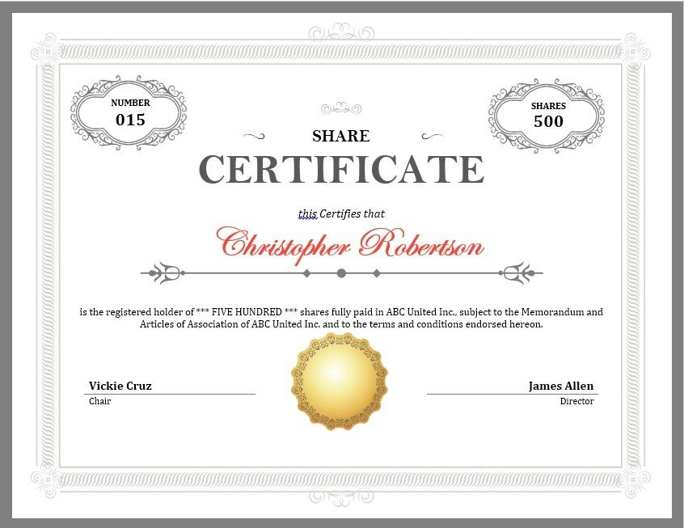

## Table of Contents

## What is a share certificate?

A share certificate is a document that shows you own part of a company. When you buy shares in a company, you get a certificate that says how many shares you own. It's like a receipt that proves you are a part-owner of the company. Companies used to give out paper certificates, but now most of them are kept electronically.

These certificates are important because they show that you have a right to a part of the company's profits, called dividends. They also give you the right to vote on important company decisions. If you want to sell your shares, the certificate helps prove that you own them, making it easier to transfer ownership to someone else.

## How does a share certificate differ from a stock certificate?

A share certificate and a stock certificate are basically the same thing. They both show that you own a piece of a company. When you buy shares or stocks, you get a certificate that says how many you own. This certificate proves that you are a part-owner of the company. In the past, these were paper documents, but now they are usually kept electronically.

The main difference between the two terms is just how people use them. Some people and companies use "share" and some use "stock," but they mean the same thing. Both certificates give you the right to get part of the company's profits, called dividends, and to vote on important company decisions. If you want to sell your shares or stocks, the certificate helps prove that you own them, making it easier to transfer ownership to someone else.

## What information is typically included on a share certificate?

A share certificate usually has the name of the company on it. It also shows how many shares you own and what type they are. There will be a certificate number that helps keep track of it. Your name will be on it too, to show that you are the owner. The date when the certificate was issued is also important and will be included.

Sometimes, the certificate will have the company's logo or seal on it to make it look official. It might also say how much each share is worth, but this can change over time. The certificate will have a place for signatures, often from company officers, to make it valid. All this information helps prove that you own part of the company and can use it if you need to sell your shares or get dividends.

## How can someone obtain a share certificate?

To get a share certificate, you usually need to buy shares in a company. You can do this through a stockbroker or an online trading platform. Once you buy the shares, the company or the brokerage firm will issue a certificate to show that you own them. If you want a paper certificate, you might need to ask for it specifically, because most certificates are kept electronically these days.

If you already own shares and want a certificate, you can contact the company's investor relations department or the transfer agent. They can help you get a certificate if you need one. Remember, getting a physical certificate might cost a small fee, and it might take a few weeks to arrive. But having a certificate can be useful if you want to keep a record of your ownership or if you plan to give the shares as a gift.

## What are the benefits of holding a share certificate?

Holding a share certificate can give you a sense of ownership and pride. When you have a certificate, you can see and touch proof that you own part of a company. It's like having a trophy that shows you are a part-owner. This can be especially meaningful if you've invested in a company you believe in or if you want to keep the certificate as a keepsake or a family heirloom.

Another benefit is that a share certificate can make it easier to give shares as a gift. If you want to give shares to someone else, having a physical certificate can make the process simpler and more personal. It's like giving a special present that also has financial value. Plus, if you ever need to prove that you own the shares, the certificate serves as an official document that can help with that.

## Are there any risks associated with share certificates?

One risk of having a share certificate is that it can get lost or damaged. If you lose your certificate, it can be hard to prove that you own the shares. You might have to go through a long process to get a new one, and it can be stressful. If the certificate gets damaged, like if it gets wet or torn, it might not be accepted as proof of ownership anymore. Keeping it safe is important, but accidents can happen.

Another risk is that share certificates can be stolen. If someone steals your certificate, they could try to sell your shares or claim them as their own. This can lead to a lot of trouble and you might lose your investment. It's a good idea to keep your certificate in a safe place, like a safe deposit box at a bank, to lower the chance of it being stolen. But even with careful storage, there's always a small risk that something bad could happen.

## How do you transfer ownership of a share certificate?

To transfer ownership of a share certificate, you need to fill out a form that comes with the certificate. This form is called a stock power or an assignment form. You write down the name of the person who will get the shares, and then you sign the form. If you have a paper certificate, you usually send it along with the signed form to the company's transfer agent. The transfer agent is a special company that helps with these kinds of things. They will update their records to show the new owner's name and then send the certificate back, now showing the new owner's name.

If your shares are held electronically, the process is a bit different. You still need to fill out the transfer form and sign it. But instead of sending a paper certificate, you usually send the form to your broker or the transfer agent. They will update the electronic records to show the new owner's name. This way, the new owner can see their shares in their account. It's a bit easier and faster than dealing with paper certificates, but you still need to follow the right steps to make sure the transfer goes smoothly.

## What should you do if you lose a share certificate?

If you lose your share certificate, you need to act quickly to protect your investment. The first thing to do is to contact the company's transfer agent or the investor relations department. Let them know that your certificate is lost and ask them what you need to do next. They might ask you to fill out a form saying that the certificate is lost and that you want a new one. You might also need to pay a small fee to get a replacement.

Once you've reported the lost certificate, you'll need to wait for the new one to be issued. This can take a few weeks, so be patient. In the meantime, keep an eye on your account to make sure no one tries to use the lost certificate. If you find the lost certificate later, don't use it. Instead, send it back to the transfer agent so they can cancel it and avoid any confusion or problems.

## How are share certificates affected by corporate actions like mergers or splits?

When a company goes through a merger or a stock split, it can change what your share certificate says. If there's a merger, where two companies join together, your old share certificate might not be valid anymore. You might get a new certificate that shows you own shares in the new company that was formed by the merger. The transfer agent or the company will send you the new certificate and let you know what to do with your old one. It's a good idea to follow their instructions carefully so you don't lose your investment.

If there's a stock split, your share certificate will change too. A stock split means the company decides to split each share into more shares, but the total value of your investment stays the same. For example, if you had 100 shares and the company does a 2-for-1 split, you'll have 200 shares after the split. The transfer agent will send you a new certificate that shows the new number of shares you own. You might need to send back your old certificate, so make sure to keep an eye out for any instructions from the company.

## What role do share certificates play in estate planning?

Share certificates can be important in estate planning because they show what shares you own. When you're planning what will happen to your things after you're gone, you need to know what you have. Share certificates help you and your family know exactly how many shares you own in different companies. This makes it easier to include these shares in your will or trust. You can decide who gets the shares, and the certificates help prove that you own them.

When you pass away, your family or the people you choose will need to transfer the shares to their names. The share certificates make this process easier because they show who the original owner was. Your family can work with the company's transfer agent to get new certificates in their names. This way, they can keep getting any dividends or sell the shares if they need to. Having clear records with share certificates can help avoid confusion and make sure your wishes are followed.

## How have digital share certificates changed the landscape of share ownership?

Digital share certificates have made owning shares easier and faster. Instead of waiting for a paper certificate to arrive in the mail, you can see your shares right away on a computer or phone. This makes it simpler to buy, sell, or transfer shares because everything is done online. You don't have to worry about losing a paper certificate or keeping it safe. It's all stored safely in a computer system, which makes it harder for someone to steal your shares.

But digital certificates have also changed how we think about owning shares. They don't give you something you can hold in your hand, like a paper certificate. This might make owning shares feel less special or real to some people. On the other hand, digital certificates make it easier to keep track of your investments and manage them from anywhere. They also help companies keep better records and make it easier for them to handle things like stock splits or mergers. Overall, digital certificates have made share ownership more convenient and efficient.

## What legal considerations should be taken into account when dealing with share certificates internationally?

When dealing with share certificates across different countries, it's important to know about the laws in each place. Each country has its own rules about owning and transferring shares. For example, some countries might have special taxes or fees when you buy or sell shares. You also need to make sure the share certificates are legal in both the country where the company is based and the country where you live. If you don't follow these rules, you could face fines or other legal problems.

Another thing to think about is how to transfer share certificates between countries. You might need to work with banks or special companies called transfer [agents](/wiki/agents) that know the rules in both countries. Sometimes, you'll need to fill out extra forms or get special approvals to move shares across borders. It's a good idea to talk to a lawyer who knows about international laws to make sure everything is done right. This can help you avoid any surprises and keep your investments safe.

## References & Further Reading

[1]: Chan, E. (2009). ["Algorithmic Trading: Winning Strategies and Their Rationale."](https://github.com/ftvision/quant_trading_echan_book) Wiley.

[2]: Graham, B. (2006). ["The Intelligent Investor: The Definitive Book on Value Investing."](https://www.amazon.com/Intelligent-Investor-Definitive-Investing-Essentials/dp/0060555661) Harper Business.

[3]: Tharp, V. K. (1998). ["Trade Your Way to Financial Freedom."](https://archive.org/details/tradeyourwaytofi0000thar_r7d1) McGraw-Hill Education.

[4]: Lopez de Prado, M. (2018). ["Advances in Financial Machine Learning."](https://books.google.com/books/about/Advances_in_Financial_Machine_Learning.html?id=oU9KDwAAQBAJ) Wiley.

[5]: Aronson, D. (2007). ["Evidence-Based Technical Analysis: Applying the Scientific Method and Statistical Inference to Trading Signals."](https://www.amazon.com/Evidence-Based-Technical-Analysis-Scientific-Statistical/dp/0470008741) Wiley.

[6]: Jansen, S. (2020). ["Machine Learning for Algorithmic Trading: Predictive Models to Extract Signals from Market and Alternative Data for Systematic Trading Strategies with Python."](https://github.com/stefan-jansen/machine-learning-for-trading) Packt Publishing.

[7]: Chan, E. (2008). ["Quantitative Trading: How to Build Your Own Algorithmic Trading Business."](https://github.com/ftvision/quant_trading_echan_book) Wiley.

[8]: SEC.gov. (2020). ["Introduction to Algorithmic Trading Strategies."](https://www.sec.gov/files/Algo_Trading_Report_2020.pdf) U.S. Securities and Exchange Commission.

[9]: CFA Institute. (2020). ["Global Investment Performance Standards (GIPS)."](https://www.gipsstandards.org/wp-content/uploads/2021/03/2020_gips_standards_firms.pdf) 

[10]: [New York Stock Exchange. (2023). "The Digital Transition of Share Certificates."](https://www.sharewise.com/us/news_articles/Heres_the_Average_Stock_Market_Return_Over_the_Last_10_Years_and_What_It_Means_for_the_Next_10_Year_TheMotleyFool_20241128_1015)