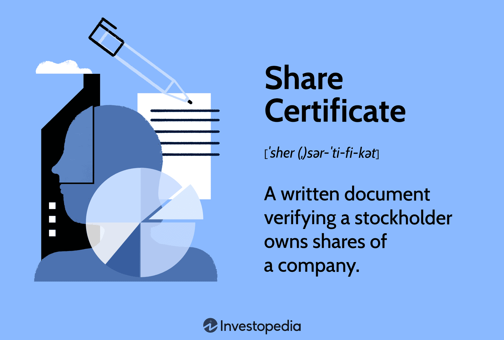

In modern investment strategies, understanding the fundamental concepts of investment documents, stock ownership, share certificates, and algorithmic trading (algo trading) is crucial. An investment document serves as a formal record detailing the terms, rights, and obligations associated with financial transactions, investments, and ownership interests. It is essential for investors to maintain accurate and up-to-date documentation to validate their financial activities, assess the performance of their investments, and comply with regulatory requirements.

Stock ownership represents an investor's stake in a corporation, entitling them to a portion of the company's profits and assets. A share certificate is an official document evidencing a shareholder's ownership in the company. Historically, these were physical certificates; however, technological advancements have led to the transition towards electronic forms, enhancing efficiency and reducing administrative burdens.

Algorithmic trading refers to the use of computer algorithms to automate trading decisions, contrasting with traditional manual trading methods. By employing advanced mathematical models and high-frequency data analysis, algo trading offers significant advantages such as increased speed, precision, and cost-effectiveness. This technological approach has revolutionized the financial markets, allowing traders to execute complex strategies and capitalize on minuscule market movements.

These elements are integral to the financial market landscape, as they reflect the evolving practices and underpin the operational integrity of modern investment activities. The increasing influence of technology is reshaping traditional investment practices by enabling seamless integration of digital tools with conventional methods. For instance, the conventional model of stock ownership has adapted to include intricate data solutions, while algo trading further underscores the necessity of robust investment documentation for strategy validation and compliance.

Throughout this exploration, we will delve into the intricate dynamics between these concepts and examine how technology continues to shape their application in the financial markets, providing a comprehensive understanding necessary for strategic advantage in today's investment environment.

## Table of Contents

## Understanding Investment Documents

Investment documents are formalized records crucial for documenting, executing, and managing investment activities. They serve as an essential foundation for communicating the terms, agreements, and performance metrics of investments, ensuring both transparency and accountability in financial transactions.

### Types of Investment Documents

There are various types of investment documents that investors commonly use, each serving a specific purpose in the investment process:

1. **Prospectuses**: These documents offer detailed information about an investment fund or security and are crucial for investors making informed decisions. They typically include the objectives, strategies, risks, and performance history of an investment.

2. **Financial Statements**: These are periodic reports that provide a summary of a company's financial status, including balance sheets, income statements, and cash flow statements. They are fundamental to analyzing a company’s financial health and future prospects.

3. **Investment Contracts**: These define the terms of investment agreements between parties, including obligations, rights, and the expected return on investment. They provide legal protection and clarity for both investors and issuers.

4. **Portfolio Statements**: These documents outline the holdings, performance, and asset allocations of an investment portfolio, offering a snapshot of an investor’s current financial standing.

5. **Share Certificates**: While less common in physical form today, these documents historically served as proof of share ownership in a company. Their electronic counterparts now fulfill this role in modern transactions.

### Importance of Accurate and Up-to-Date Investment Documentation

Maintaining precise and current investment documentation is vital for several reasons:

- **Compliance**: Regulatory compliance demands accurate documentation to ensure adherence to financial laws and standards, which vary across jurisdictions.

- **Performance Analysis**: Investors rely on documentation to assess and benchmark the performance of their investments, enabling data-driven decision-making.

- **Tax Reporting**: Accurate records are necessary for tax calculations and reporting, helping prevent legal issues and optimize tax strategy.

- **Dispute Resolution**: Well-maintained documents can serve as evidence during disputes or misunderstandings between parties, safeguarding investor interests.

### Influence of Digital Transformation

The digitalization of financial services has significantly transformed the field of investment documentation:

- **Automation and Efficiency**: Digital tools enable automatic generation and organization of documents, improving efficiency and reducing human error.

- **Real-Time Access and Updates**: Investors can access and update their documentation in real-time from anywhere, facilitating better-informed and timely investment decisions.

- **Enhanced Security**: Digital platforms often incorporate advanced security measures such as encryption and blockchain technology, ensuring data integrity and confidentiality.

- **Integration with Other Tools**: Investment documents can now be integrated seamlessly with financial analysis tools and trading platforms, fostering a more holistic view of investment activities.

In conclusion, investment documents are indispensable in financial activities, providing clarity, facilitating regulatory compliance, and informing strategic decisions. As technology continues to evolve, the processes surrounding these documents are constantly improving, offering new opportunities and efficiencies for investors.

## Stock Ownership and Share Certificates

Stock ownership represents an individual's or entity's equity stake in a corporation, manifested through shares. This form of ownership grants shareholders certain rights, such as voting privileges and a potential share in the company's profits via dividends. Stock ownership appeals to investors due to its prospect for capital appreciation and income, depending on the company's performance.

A share certificate serves as a tangible proof of stock ownership, historically issued in paper form. It details essential information about the shareholding, including the number of shares owned, the identification of the shareholder, and the corporate entity responsible for issuing the shares. These certificates once played a crucial role as the primary evidence of ownership, allowing shareholders to register their ownership officially and claim associated benefits.

The financial market’s evolution brought a significant shift from physical certificates to electronic records, primarily for efficiency and security reasons. This transformation began in the late 20th century with innovations in technology and the creation of central securities depositories. Dematerialization allowed shares to be held and traded electronically, significantly reducing the cumbersome process of handling physical certificates. The Depository Trust and Clearing Corporation (DTCC) in the United States and Crest in the UK are examples of institutions that facilitate electronic records of share ownership.

Investors gain several benefits from understanding share certificates and stock ownership. Firstly, shareholders can exercise their voting rights in company decisions, impacting corporate governance and policy. Secondly, comprehensive knowledge of stock ownership structures enhances an investor's ability to make informed decisions, considering factors like [liquidity](/wiki/liquidity-risk-premium), control, and potential returns. Furthermore, understanding the transition to electronic forms empowers investors to navigate modern trading environments efficiently, minimizing risks like theft or loss of physical documents.

Overall, stock ownership and share certificates continue to be foundational concepts in investment, bridging traditional methods with contemporary practices. This understanding equips investors to engage confidently and effectively in today’s dynamic financial markets.

## The Rise of Algorithmic Trading

Algorithmic trading, commonly known as algo trading, refers to the use of computer programs and algorithms to automate and execute trading decisions based on predefined criteria. This differs from traditional trading methods, where decisions are made manually by traders based on market analysis and human judgment. Algo trading has gained significant traction due to its ability to leverage computational power for making rapid trading decisions.

Historically, the evolution of algo trading can be traced back to the 1970s when the New York Stock Exchange implemented designated order turnaround (DOT) systems, which paved the way for the digital trading era. Over the subsequent decades, it evolved with the increased use of computers and electronic communications networks (ECNs). By the late 1990s and early 2000s, [algorithmic trading](/wiki/algorithmic-trading) had become a mainstream practice among institutional investors.

The primary advantages of algorithmic trading are speed, accuracy, and reduced transaction costs. Algorithms can analyze market data, identify trading opportunities, and execute trades much faster than a human can. This speed is critical in financial markets, where prices can change in milliseconds. Additionally, algo trading eliminates emotional biases, ensuring that trading strategies are executed consistently as per the coded logic. The reduction in transaction costs comes from the increased efficiency and the ability to take advantage of [arbitrage](/wiki/arbitrage) opportunities that might be overlooked or too slow for manual execution.

However, algo trading is not without its challenges and risks. One of the primary concerns is the potential for market [volatility](/wiki/volatility-trading-strategies) due to erroneous algorithms. A small coding error can lead to significant losses or create fluctuations in the market, as infamously seen in events like the 2010 Flash Crash. Moreover, algo trading systems depend heavily on technology infrastructure, making them susceptible to technical failures and cyberattacks. The rapidly changing market conditions can also render specific algorithms ineffective, necessitating constant updates and monitoring.

In conclusion, while algorithmic trading provides numerous benefits, it is essential for traders and firms to understand and manage the associated risks. Proper regulation, robust risk management practices, and continual assessment of algorithms are crucial for harnessing the full potential of algo trading in modern financial markets.

## Integrating Algo Trading with Traditional Investment Documentation

Algorithmic trading (algo trading) can significantly enhance traditional investment practices by leveraging computational power to optimize trade execution and streamline documentation processes. Algorithmic trading uses predefined rules and mathematical models to execute trades at speeds and frequencies impossible for human traders. This methodology complements traditional investment strategies by allowing for high efficiency, reducing transaction costs, and ensuring precision in decision making.

### Efficiency Improvements in Managing Investment Documents

The integration of algo trading with investment documentation presents substantial opportunities for enhancing operational efficiency. Traditional investment practices involve considerable paperwork and manual documentation, which can be time-consuming and error-prone. Through the application of technology, these processes can be automated, allowing for real-time updates and accurate record-keeping. Automated systems can generate investment documents instantaneously following trades, ensuring that all data remains current and consistent.

For instance, blockchain technology can be utilized in concert with algo trading systems to manage investment documents. Blockchain provides an immutable ledger that ensures transparency and security, making it an ideal solution for recording ownership and transaction details. This integration enables syndication of transaction histories across all parties involved, streamlining audits and compliance checks.

### Combining Traditional Stock Ownership Models with Modern Trading Techniques

Algorithmic trading can augment traditional stock ownership models by optimizing the buying and selling processes. Investment strategies that previously relied on human intuition and delayed execution can now benefit from algorithms that analyze vast amounts of market data to make split-second decisions. By coupling these algorithms with [machine learning](/wiki/machine-learning) (ML) and [artificial intelligence](/wiki/ai-artificial-intelligence) (AI), investors can develop predictive models that identify optimal trading opportunities, thus enhancing portfolio performance.

Consider a scenario where an investor holds a diversified portfolio of stocks. Using algo trading, an investor can implement a dynamic rebalancing strategy, which involves real-time monitoring of market conditions to adjust portfolio weightings. This approach not only maximizes returns but also minimizes risks through constant alignment of the portfolio with investment goals and risk tolerance.

### Real-World Examples of Integration

A real-world example of integrating algo trading with investment documentation is the use of robo-advisors. These platforms utilize algorithmic trading to manage client portfolios based on their risk profiles and investment objectives. Robo-advisors automate the generation of investment documents, reports, and statements, offering clients transparency and accessibility to their financial information.

Moreover, high-frequency trading firms exemplify the integration of algo trading with documentation practices. These firms execute numerous trades in microseconds, where each transaction is precisely documented and recorded using advanced computational systems. This integration ensures compliance and legal adherence across various financial jurisdictions.

In summary, the convergence of algo trading and traditional investment documentation heralds a new era of efficiency and effectiveness in financial markets. By leveraging technology to enhance traditional practices, investors can better navigate the complexities of modern trading environments, driving greater success in their financial endeavors.

## Legal and Regulatory Considerations

Investment documentation and algorithmic trading are integral components of the financial markets, each subject to specific legal and regulatory frameworks designed to ensure stability, transparency, and fairness in trading operations.

**Regulatory Overview**

Investment documentation regulations primarily focus on ensuring accuracy and transparency in the recording and reporting of financial activities. These documents, which include stock ownership records and transaction histories, must adhere to both local and international standards, such as the Generally Accepted Accounting Principles (GAAP) and International Financial Reporting Standards (IFRS). Compliance with these standards ensures consistency and reliability in financial reporting, facilitating informed decision-making by investors.

Algorithmic trading, characterized by the use of complex algorithms to execute trades at high speeds, is regulated to prevent market manipulation and ensure fair trading practices. Regulatory bodies, such as the U.S. Securities and Exchange Commission (SEC) and the Commodity Futures Trading Commission (CFTC), oversee these activities by implementing rules that address issues like market integrity and the prevention of fraud. These frameworks also incorporate safeguards against "flash crashes," which can occur when high-frequency trading algorithms react to market conditions in unexpected ways.

**Importance of Compliance**

Compliance with financial regulations is crucial for maintaining both the integrity and reputation of investment firms. Non-compliance can lead to penalties, including fines and suspensions, and can damage investor trust. For algo trading, compliance is particularly critical as it ensures that trading algorithms adhere to market rules and do not exploit loopholes or disproportionately affect market conditions. International regulations are also significant, as many trading firms operate globally and must follow the financial laws of multiple jurisdictions.

**Challenges and Implications of Regulatory Changes**

The financial landscape is continually evolving, prompting updates and changes to regulatory frameworks. These changes can pose challenges for investment firms as they require updates to existing systems and practices. For example, the Markets in Financial Instruments Directive II (MiFID II) in the European Union introduced significant changes to market structure and transparency requirements, necessitating extensive adjustments in how firms document and report trades.

Regulatory changes can also lead to increased operational costs, as firms need to invest in new technologies and personnel to ensure compliance. However, these regulations are essential for enhancing market transparency and protecting investor interests.

**Ensuring Transparency and Integrity**

Investors can ensure transparency and integrity in their trading operations by adopting comprehensive compliance programs that incorporate regular audits and continuous monitoring of trading activities. Implementing advanced technologies, such as blockchain, can enhance the transparency of investment documentation by providing immutable records of transactions.

Furthermore, firms should engage in proactive communication with regulatory bodies and participate in discussions on impending regulatory changes to better anticipate and adapt to new requirements. By fostering a culture of compliance and transparency, investment firms can build trust with stakeholders and maintain their competitive edge in the evolving financial markets.

## Conclusion

Investment documents, stock ownership, share certificates, and algorithmic trading represent key elements of modern financial activities, each playing a distinct role in the ecosystem of investments. Their interconnectedness emerges from the way they each influence investment strategies. Understanding this interconnectedness provides investors with a comprehensive approach to managing and optimizing their portfolios.

Investment documents serve as the backbone of financial transactions, offering proof and details of investments, while stock ownership and share certificates provide tangible representation of these investments. Algorithmic trading, on the other hand, enhances the execution of trading strategies by leveraging speed and accuracy facilitated through advanced computational techniques.

The integration of technology with traditional investment methods presents a strategic advantage. It allows for the streamlining of processes, reduces the likelihood of manual errors, and optimizes decision-making. For instance, the digitization of investment documents reduces storage complexities and improves accessibility, while electronic share certificates offer greater security and efficiency compared to physical certificates. Algorithmic trading complements these advancements by, for example, employing automated systems to analyze vast amounts of data more rapidly than a human trader could, thereby identifying potential investment opportunities or risks more efficiently.

To remain competitive, investors are encouraged to stay informed and adaptable. The financial market is dynamic, with technological innovations continually reshaping how investment activities are conducted. By embracing technology, investors can gain insights and leverage tools that were unimaginable in traditional settings.

Looking ahead, the future of investments and trading is poised to be heavily influenced by further digital advancement. With the proliferation of artificial intelligence, machine learning, and blockchain technology, the landscape will likely continue to evolve, offering new opportunities and challenges. Investors who are proactive in learning and adapting to these developments will be well-positioned to maximize their returns and ensure the longevity of their investment strategies—adapting not just to survive, but to thrive, in an increasingly digital world.

## Additional Resources

### Suggested Books, Articles, and Courses

1. **Books:**
   - *"Algorithmic Trading" by Ernie Chan*. This book provides a comprehensive guide to developing automated trading systems and understanding the mechanics behind algorithmic trading.
   - *"The Intelligent Investor" by Benjamin Graham*. A timeless classic for understanding fundamental investment principles, including stock ownership and investment documentation.
   - *"Trade Your Way to Financial Freedom" by Van K. Tharp*. Offers insights into trading psychology and strategies, vital for both traditional and algorithmic traders.

2. **Articles:**
   - "The Transition from Paper to Digital: A New Era for Share Certificates" in *The Journal of Finance*. Discusses the technological shift in handling stock ownership evidence.
   - "The Regulatory Frameworks Shaping Algo Trading" in *Harvard Business Review*. Examines how regulations influence the development and implementation of algorithmic trading.

3. **Courses:**
   - *Algorithmic Trading Strategies* on Coursera. This course covers the basics of designing and implementing trading algorithms.
   - *Investment Fundamentals and Practice* on edX. A structured approach to understanding investment documents and stock ownership.

### Links to Financial Tools and Platforms

1. **Interactive Brokers:** A comprehensive trading platform offering both traditional and algorithmic trading capabilities.
2. **E*TRADE:** Provides a user-friendly interface for managing investments, including tools for traditional and electronic share certificate management.
3. **QuantConnect:** An integrated development environment for quantitative algorithmic trading across various platforms.

### Discussion Forums and Investment Communities

1. **Reddit – r/investing:** A vibrant community for discussing investment strategies, including the incorporation of algorithmic and traditional methods.
2. **Trade2Win:** An online forum dedicated to trading, offering insights on merging algorithmic strategies with traditional investments.
3. **Investopedia – Simulator Community:** A platform for engaging with fellow investors, experimenting with real-life market scenarios using both algorithmic and traditional tactics.

These resources provide a robust foundation for expanding your knowledge and application of investment documentation, stock ownership, share certificates, and algorithmic trading. Whether you are a novice investor or an experienced trader, exploring these materials can help enhance your strategic approach in an increasingly digital financial market.

## References & Further Reading

[1]: Chan, E. (2009). ["Algorithmic Trading: Winning Strategies and Their Rationale."](https://github.com/ftvision/quant_trading_echan_book) Wiley.

[2]: Graham, B. (2006). ["The Intelligent Investor: The Definitive Book on Value Investing."](https://www.amazon.com/Intelligent-Investor-Definitive-Investing-Essentials/dp/0060555661) Harper Business.

[3]: Tharp, V. K. (1998). ["Trade Your Way to Financial Freedom."](https://archive.org/details/tradeyourwaytofi0000thar_r7d1) McGraw-Hill Education.

[4]: Lopez de Prado, M. (2018). ["Advances in Financial Machine Learning."](https://books.google.com/books/about/Advances_in_Financial_Machine_Learning.html?id=oU9KDwAAQBAJ) Wiley.

[5]: Aronson, D. (2007). ["Evidence-Based Technical Analysis: Applying the Scientific Method and Statistical Inference to Trading Signals."](https://www.amazon.com/Evidence-Based-Technical-Analysis-Scientific-Statistical/dp/0470008741) Wiley.

[6]: Jansen, S. (2020). ["Machine Learning for Algorithmic Trading: Predictive Models to Extract Signals from Market and Alternative Data for Systematic Trading Strategies with Python."](https://github.com/stefan-jansen/machine-learning-for-trading) Packt Publishing.

[7]: Chan, E. (2008). ["Quantitative Trading: How to Build Your Own Algorithmic Trading Business."](https://github.com/ftvision/quant_trading_echan_book) Wiley.

[8]: SEC.gov. (2020). ["Introduction to Algorithmic Trading Strategies."](https://www.sec.gov/files/Algo_Trading_Report_2020.pdf) U.S. Securities and Exchange Commission.

[9]: CFA Institute. (2020). ["Global Investment Performance Standards (GIPS)."](https://www.gipsstandards.org/wp-content/uploads/2021/03/2020_gips_standards_firms.pdf) 

[10]: [New York Stock Exchange. (2023). "The Digital Transition of Share Certificates."](https://www.sharewise.com/us/news_articles/Heres_the_Average_Stock_Market_Return_Over_the_Last_10_Years_and_What_It_Means_for_the_Next_10_Year_TheMotleyFool_20241128_1015)