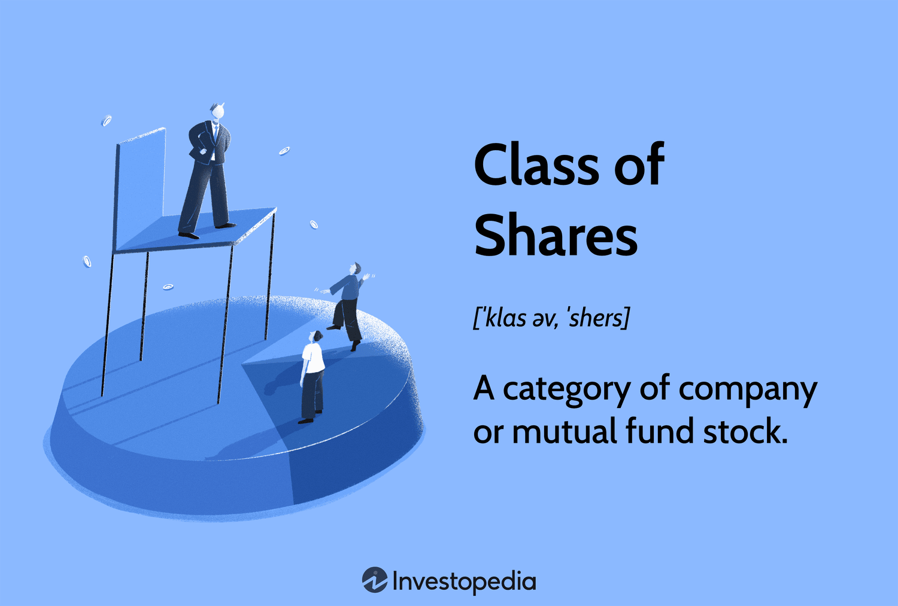

## Table of Contents

## What is a share class?

A share class is a type of stock that a company offers to investors. It represents ownership in the company, but different share classes can have different rights and benefits. For example, some share classes might give investors more voting power, while others might offer higher dividends or other financial benefits.

Companies might create different share classes for various reasons. Sometimes, they want to give founders or early investors more control over the company's decisions. Other times, they might want to attract different types of investors by offering shares with different features. Understanding the differences between share classes is important for investors because it can affect their potential returns and influence in the company.

## What are the basic rights associated with different share classes?

Different share classes can have different rights, but there are some basic rights that are common among them. One of the most important rights is the right to vote. Usually, each share gives the owner one vote, but some share classes might give more votes per share. This means that people with these special shares can have more say in how the company is run. Another basic right is the right to receive dividends. Dividends are payments that companies make to their shareholders from their profits. Some share classes might get bigger dividends than others.

Another right that shareholders have is the right to information. This means that the company has to tell shareholders important things about how it's doing and what it's planning. This helps shareholders make good decisions about their investments. Finally, shareholders often have the right to sell their shares. This is called [liquidity](/wiki/liquidity-risk-premium), and it's important because it lets people turn their shares into cash if they need to. Different share classes might have different rules about when and how shares can be sold, so it's good to know these details before investing.

## How do voting rights differ between share classes?

Voting rights can be different between share classes. Some shares, called common shares, usually give one vote per share. This means if you own 100 common shares, you get 100 votes. But some companies have special shares, called preferred shares, that might not give any votes at all. This means people who own these shares can't vote on company decisions.

Other times, a company might have different classes of common shares, like Class A and Class B shares. Class A shares might give more votes per share than Class B shares. For example, one Class A share could give 10 votes, while one Class B share gives just one vote. This is often done so that founders or early investors can keep more control over the company, even if they own fewer shares than other investors.

## What are the common types of share classes and their features?

There are a few common types of share classes that companies use. One type is called common stock, which is the most basic kind of share. Common stock usually gives one vote per share and a chance to get dividends, but these dividends can change or even stop if the company isn't doing well. Another type is preferred stock. Preferred stock often doesn't give any votes, but it has some advantages. For example, preferred shareholders usually get their dividends before common shareholders, and these dividends are often fixed, meaning they don't change. Also, if the company goes bankrupt, preferred shareholders get paid back their investment before common shareholders.

Some companies also have different classes of common stock, like Class A and Class B shares. These classes can have different voting rights. For example, Class A shares might give 10 votes per share, while Class B shares give just one vote per share. This is often used to let founders or early investors keep more control over the company. Another type of share class is called non-voting stock, which, as the name suggests, doesn't give any voting rights at all. This type of share is less common but can be used to attract investors who are more interested in dividends than in having a say in how the company is run.

## How do dividend rights vary among different share classes?

Dividend rights can be different for different share classes. Common stock usually gets dividends, but these can change or even stop if the company isn't doing well. On the other hand, preferred stock often gets a fixed dividend, which means the amount doesn't change. Preferred shareholders get their dividends before common shareholders, so they have a bit more safety if the company has a tough time.

Some companies also have different classes of common stock, like Class A and Class B shares. These classes might have the same dividend rights, meaning they get the same amount of money per share. But sometimes, one class might get a higher dividend than the other. Non-voting stock can also have different dividend rights. These shares might get the same dividends as common stock or might have special rules about how much they get. It all depends on what the company decides when they create the different share classes.

## What is the significance of share class in terms of ownership and control?

Share class is really important when it comes to who owns a company and who gets to make decisions. Different share classes can give different levels of control. For example, common stock usually gives one vote per share, so if you own a lot of common stock, you have a bigger say in how the company is run. But some companies have special shares, like Class A and Class B shares, where Class A might give more votes per share. This means that even if someone owns fewer shares, they can still have more control over the company if they own the right kind of shares.

Another way share class affects ownership and control is through preferred stock. Preferred stock often doesn't give any votes at all, so people who own these shares can't help make decisions for the company. But they might get other benefits, like getting their dividends before common shareholders. This can make preferred stock attractive to investors who want a steady income but don't care about having a say in how the company is run. So, when you're thinking about investing, it's important to understand the different share classes and how they affect who owns and controls the company.

## How can share classes impact a company's capital structure?

Share classes can change a company's capital structure by giving different rights to different investors. When a company creates different share classes, it can attract different types of investors. For example, some investors might want to have a say in how the company is run, so they might buy shares with more voting power. Other investors might just want a steady income, so they might buy shares that give them fixed dividends but no voting rights. By offering different share classes, a company can get money from a wider range of investors, which can help it grow and do more things.

Another way share classes can impact a company's capital structure is by affecting how much control the founders or early investors have. If a company issues shares with different voting rights, like Class A and Class B shares, the founders can keep more control even if they own fewer shares. This can be important for keeping the company's direction in line with the founders' vision. But it can also make some investors less interested if they feel they won't have much say in the company's decisions. So, choosing the right mix of share classes is a big part of planning a company's capital structure.

## What are the tax implications of different share classes?

The tax implications of different share classes can be different depending on the type of shares you own and where you live. For common stock, when you get dividends, you usually have to pay taxes on them. The tax rate can be different depending on if the dividends are qualified or not. Qualified dividends are taxed at a lower rate than regular income, while non-qualified dividends are taxed at your normal income tax rate. If you sell your common stock and make a profit, you also have to pay capital gains tax. The rate for this can be different depending on how long you held the stock before selling it.

Preferred stock can have different tax rules. Like common stock, dividends from preferred stock are usually taxable. But because preferred stock often gives fixed dividends, these might be treated as interest income, which can be taxed at a different rate than dividends from common stock. Also, if you sell preferred stock at a profit, you'll have to pay capital gains tax, just like with common stock. It's important to know that tax laws can change and can be different in different places, so it's a good idea to talk to a tax professional to understand how different share classes might affect your taxes.

## How do share classes affect investor eligibility and investment strategies?

Share classes can change who can invest in a company and how they might want to invest. Different share classes might have rules about who can buy them. For example, some shares might only be available to certain types of investors, like big institutions or people who already own other shares in the company. This can make it harder for regular people to buy certain types of shares. Knowing the rules about who can buy different share classes is important for investors because it can affect what they can invest in.

Share classes also change how investors might want to plan their investments. Some investors might want to have a say in how the company is run, so they might look for shares with more voting power. Other investors might just want to get money from dividends, so they might choose shares that give fixed dividends but no voting rights. By offering different share classes, companies can attract different types of investors. This means investors need to think about what they want from their investment—like control, income, or growth—when choosing which share class to buy.

## What are dual-class shares and what are their advantages and disadvantages?

Dual-class shares are when a company has two different types of shares, usually called Class A and Class B shares. These shares give different rights to the people who own them. Usually, Class A shares give more votes per share than Class B shares. This means that people who own Class A shares can have more say in how the company is run, even if they own fewer shares than people who own Class B shares. Companies often use dual-class shares to let founders or early investors keep control of the company, even as it grows and more people invest in it.

The advantages of dual-class shares are that they can help founders keep their vision for the company. This can be good because the founders might know the company best and want to keep it going in the right direction. It can also make the company more stable because the people in charge don't change as often. But there are also disadvantages. Some investors might not like dual-class shares because they feel they won't have much say in the company's decisions. This can make it harder for the company to get money from investors who want more control. Also, if the founders make bad decisions, it can be harder for other shareholders to do something about it.

## How do regulatory environments influence the creation and management of share classes?

Regulatory environments play a big role in how companies create and manage different share classes. Different countries have different rules about what kinds of shares companies can offer and who can buy them. For example, some places might not allow companies to have shares with different voting rights, while other places might let companies do this but with strict rules. These rules are there to protect investors and make sure the market is fair. Companies have to follow these rules when they decide to create new share classes or change the rights of existing ones. If they don't, they could get in trouble with the regulators, which could lead to fines or other problems.

Because of these rules, companies need to think carefully about how they structure their share classes. They might need to talk to lawyers and other experts to make sure they're doing everything right. The regulatory environment can also affect how companies talk to their investors about different share classes. They have to be clear and honest about what each share class offers and any risks involved. This helps investors make good choices and keeps the company out of trouble with regulators. So, understanding the regulatory environment is really important for companies that want to use different share classes to raise money and grow.

## What advanced strategies can companies use with share classes to optimize corporate governance?

Companies can use share classes in smart ways to make their corporate governance better. One way is by giving founders or key leaders shares with more voting power, like Class A shares. This helps them keep control of the company and make decisions that fit with their vision. It's good for the company because the people who know it best can guide it. But it's important to balance this with fairness to other investors. Companies can do this by making sure there are also share classes, like Class B shares, that let other investors have some say in big decisions, like choosing board members or approving major changes.

Another strategy is using preferred shares to attract investors who want a steady income without voting rights. This can help the company raise money without giving away too much control. It's also a way to keep the company's focus on long-term goals, because these investors are less likely to push for short-term gains. Companies can also use share classes to bring in different types of investors, like big institutions or smaller retail investors, by offering shares with different features. This diversity can make the company stronger and more stable. By carefully planning their share classes, companies can create a governance structure that works well for everyone involved.

## References & Further Reading

#