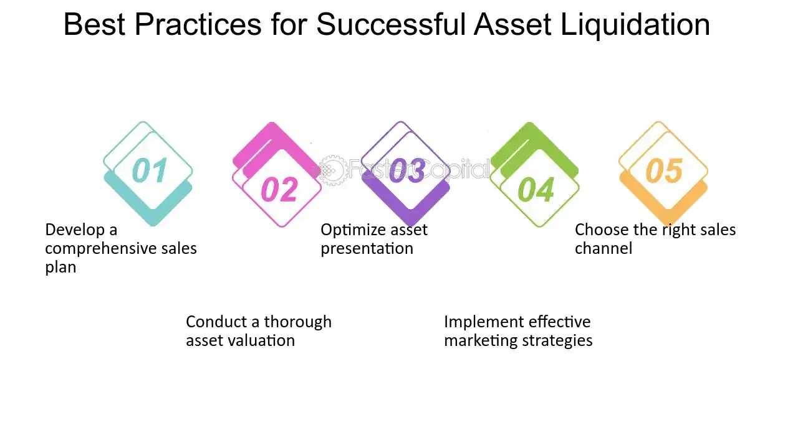

## Table of Contents

## What is share disposition in the context of company liquidation?

Share disposition in the context of company liquidation refers to what happens to the shares of a company when it is being dissolved. When a company goes into liquidation, it means the company is closing down and its assets are being sold off to pay its debts. During this process, the shares that people own in the company usually become worthless because the company no longer exists. This is because the value of shares is tied to the company's ongoing operations and future profits, which are no longer possible once the company is liquidated.

In some cases, if there is any money left after all the debts are paid, shareholders might get a small amount back. This is known as a residual payment. However, this is rare because usually all the money goes towards paying off creditors first. So, for shareholders, the disposition of their shares during liquidation often means they lose the value of their investment. It's important for shareholders to understand this risk when they invest in a company, especially if the company is facing financial difficulties.

## Why is share disposition important during company liquidation?

Share disposition is important during company liquidation because it tells shareholders what will happen to their shares when the company closes down. When a company goes into liquidation, it means the company is selling everything it owns to pay off its debts. During this time, the shares that people own in the company usually become worthless because the company will no longer exist. This is important for shareholders to know because it helps them understand that they might lose the money they invested in the company.

Understanding share disposition also helps shareholders know if they might get any money back after the company's debts are paid. Sometimes, if there is money left over after paying all the debts, shareholders might get a small amount back. This is called a residual payment. However, this doesn't happen very often because usually all the money goes to paying off the people the company owes money to first. Knowing about share disposition helps shareholders plan and make decisions about their investments, especially if the company is in financial trouble.

## What are the common methods of share disposition in liquidation?

When a company goes into liquidation, one common method of share disposition is that the shares simply become worthless. This happens because the company is closing down and will no longer exist. Shareholders usually don't get any money back because the company uses all its money to pay off its debts first. This means that the value of the shares goes down to zero, and shareholders lose the money they invested.

Another method is that if there is any money left after the company pays all its debts, shareholders might get a small amount back. This is called a residual payment. But this doesn't happen very often because usually all the money goes to paying the people the company owes money to. If shareholders do get a residual payment, it is usually very small compared to what they originally invested in the company.

## How does share disposition affect shareholders during liquidation?

When a company goes into liquidation, share disposition means that the shares people own in the company usually become worthless. This is because the company is closing down and selling everything it owns to pay off its debts. Shareholders don't get any money back from their shares because all the money goes to paying the people the company owes money to first. This can be a big problem for shareholders because it means they lose the money they invested in the company.

Sometimes, if there is any money left after the company pays all its debts, shareholders might get a small amount back. This is called a residual payment. But this doesn't happen very often, and when it does, the amount of money shareholders get is usually very small compared to what they originally invested. So, share disposition during liquidation is important for shareholders to understand because it helps them know that they might not get any money back from their investment.

## What legal considerations must be taken into account during share disposition in liquidation?

When a company goes into liquidation, there are some important legal rules that need to be followed about what happens to the shares. The main rule is that the company has to pay off all its debts first before it can give any money back to shareholders. This means that the people or companies the business owes money to, like banks or suppliers, get paid before shareholders. If there isn't enough money to pay everyone, shareholders usually don't get anything because they are at the bottom of the list of who gets paid.

Another important legal thing to think about is how the company tells shareholders what is happening. The law says that the company has to let shareholders know about the liquidation and what it means for their shares. This usually means sending them a letter or an email explaining that the company is closing down and that their shares will probably become worthless. This helps make sure that shareholders know what is going on and can plan what to do next with their money.

## What are the tax implications of share disposition during company liquidation?

When a company goes into liquidation and your shares become worthless, you might have to pay taxes on the loss of value of your shares. This is called a capital loss. You can use this loss to reduce the amount of tax you have to pay on other money you've made from investments. For example, if you made money from selling other stocks, you can use the loss from the liquidated company to lower your tax bill on those gains. It's important to keep good records of when you bought the shares and how much you paid for them, so you can show the tax people how much you lost.

Sometimes, if you get a small amount of money back from the liquidated company, called a residual payment, you might have to pay taxes on that too. This money is usually treated as a capital gain, which means you might have to pay tax on it depending on how much you get and your overall tax situation. It's a good idea to talk to a tax professional to understand exactly how these rules apply to you, because tax laws can be complicated and they can change.

## How can a company prepare for share disposition in anticipation of liquidation?

When a company knows it might have to close down, it should start getting ready for what will happen to the shares. The first thing to do is to talk to a lawyer who knows about company laws. This lawyer can help the company understand all the rules about what needs to be done with the shares when the company goes into liquidation. The company should also make sure it has good records of who owns the shares, because it will need to tell all the shareholders what is happening. This means sending them letters or emails to let them know that the company is closing down and their shares will probably become worthless.

Another important thing the company can do is to work with a financial advisor to figure out if there will be any money left over after paying all the debts. If there is, the company needs to plan how to give this money back to shareholders fairly. This is called a residual payment, but it doesn't happen very often. The company should also think about the tax rules and how they will affect shareholders when their shares become worthless. Talking to a tax expert can help make sure everyone knows what to expect and how to handle any taxes that might come up.

## What role do liquidators play in the process of share disposition?

Liquidators are people who help close down a company and sell everything it owns to pay off its debts. When it comes to share disposition, their main job is to figure out what happens to the shares when the company closes down. They have to make sure that the company follows all the rules about paying off debts first before giving any money back to shareholders. This means they need to check how much money the company has and who it owes money to. If there is any money left after paying all the debts, the liquidators decide how to give it back to shareholders fairly.

Liquidators also have to tell shareholders what is happening to their shares. They send letters or emails to let shareholders know that the company is closing down and that their shares will probably become worthless. This helps shareholders understand that they might not get any money back from their investment. Liquidators also need to keep good records of everything they do, so they can show that they followed all the rules. They work with lawyers and tax experts to make sure everything is done correctly and that shareholders know about any tax issues that might come up because of the liquidation.

## How do different types of shares (e.g., common, preferred) influence the disposition process during liquidation?

During a company's liquidation, the type of shares you own can affect what happens to them. Common shares are usually the last to get any money back if there's anything left after paying all the debts. This means that if you own common shares, you might not get anything because all the money goes to paying off the company's debts first. Common shareholders are at the bottom of the list of who gets paid, so they often end up losing all their investment.

Preferred shares, on the other hand, might have a better chance of getting some money back. These shares often come with special rights, like getting paid before common shareholders. If the company has enough money left after paying its debts, preferred shareholders might get a small amount back. However, even with these special rights, it's still not guaranteed that preferred shareholders will get anything because the company might not have enough money left over after paying everyone else.

## What are the potential conflicts that can arise during share disposition and how can they be resolved?

During share disposition in liquidation, conflicts can happen when shareholders argue about who should get any money left over after the company pays its debts. Some shareholders might think they should get more money because they own special types of shares, like preferred shares, which are supposed to be paid before common shares. Others might argue about how the company is valuing its assets or how it's deciding who gets paid first. These disagreements can lead to fights and even lawsuits if shareholders feel they are not being treated fairly.

To solve these conflicts, it's important for the liquidator to be clear and fair. The liquidator should follow the company's rules and the law about who gets paid first and how much they get. They should also keep good records and explain everything to the shareholders so everyone understands what is happening. If disagreements still happen, the liquidator might need to talk to a lawyer to help sort things out. Sometimes, going to court might be needed to make a final decision, but it's better if everyone can agree without fighting in court because it saves time and money.

## How does the timing of share disposition impact the overall liquidation process?

The timing of share disposition can affect how quickly a company finishes its liquidation. When a company decides to close down, it needs to sell everything it owns to pay its debts. If the company waits too long to tell shareholders about the liquidation and what will happen to their shares, it might cause delays. Shareholders might not be happy and could start arguing about who should get any money left over. This can slow down the whole process because the liquidator has to spend time dealing with these disagreements instead of focusing on selling the company's assets and paying off debts.

On the other hand, if the company tells shareholders about the share disposition early and clearly, it can help the liquidation go more smoothly. When shareholders know what is happening to their shares from the start, they are less likely to cause problems later on. This means the liquidator can move faster to sell the company's things and pay off its debts. By keeping everyone informed and handling the share disposition quickly, the company can finish the liquidation process sooner and with less trouble.

## What are the best practices for managing share disposition effectively during company liquidation?

When a company is getting ready to close down, it's important to handle the shares carefully. The company should start by talking to a lawyer who knows about company laws. This lawyer can help make sure the company follows all the rules about what happens to the shares. The company should also keep good records of who owns the shares and tell all the shareholders early about the liquidation. This means sending them letters or emails to explain that the company is closing down and their shares will probably become worthless. By being clear and honest from the start, the company can help avoid fights and make the process go more smoothly.

It's also a good idea for the company to work with a financial advisor to see if there will be any money left after paying all the debts. If there is, the company needs to plan how to give this money back to shareholders fairly. The company should also think about the tax rules and how they will affect shareholders when their shares become worthless. Talking to a tax expert can help make sure everyone knows what to expect and how to handle any taxes that might come up. By planning ahead and keeping everyone informed, the company can manage the share disposition well and finish the liquidation process faster.

## What is the role of algorithmic trading in liquidation?

Algorithmic trading plays a crucial role during the liquidation process by optimizing asset sales and reducing associated costs. This approach leverages sophisticated algorithms to execute trades swiftly, following pre-determined criteria while dynamically adapting to market fluctuations. The utilization of [algorithmic trading](/wiki/algorithmic-trading) is invaluable in liquidation scenarios due to its ability to manage large volumes of transactions efficiently.

Understanding market dynamics is essential for effective asset liquidation. Algorithms are designed to analyze market data constantly and respond to variations in stock prices, volumes, and other factors that influence market conditions. By rapidly processing this information, algorithmic trading systems can determine the optimal timing and quantity of asset sales to maximize return and minimize the time required to [exit](/wiki/exit-strategy) positions.

A pivotal aspect of algorithmic trading in liquidation is the application of duality-based techniques. These techniques involve employing dual representations of trade strategies that help in assessing possible outcomes and choosing the most favorable ones. This mathematical approach ensures that trades are executed in a manner that considers both market impact and transaction costs, achieving a balance between speed and cost-effectiveness.

To describe this mathematically, consider the optimization problem where the aim is to maximize the total liquidation value given a set of constraints. Let $P(t)$ represent the price function and $Q(t)$ denote the quantity function over time. The objective is to maximize the function:

$$

\text{Maximize} \ \int_{0}^{T} P(t) \cdot Q'(t) \, dt 
$$

subject to constraints derived from market dynamics, such as liquidity limits and price impacts. Solving this problem involves utilizing techniques from linear programming or other optimization frameworks, often incorporating dual variables that correspond to these constraints.

Additionally, algorithmic strategies must address adverse selection and market impact—a phenomenon where the execution of large trades negatively affects asset prices. To mitigate this, algorithms can employ tactics such as [volume](/wiki/volume-trading-strategy)-weighted average price (VWAP) strategies or time-weighted average price (TWAP) strategies, which disperse trades over time to prevent sudden shifts in market prices. 

For example, a simple Python implementation of calculating VWAP might look like this:

```python
def calculate_vwap(prices, volumes):
    cumulative_price_volume = sum(p*v for p, v in zip(prices, volumes))
    cumulative_volume = sum(volumes)
    return cumulative_price_volume / cumulative_volume

# Example data
prices = [100, 102, 101, 103]
volumes = [150, 200, 175, 160]

vwap = calculate_vwap(prices, volumes)
print(f"The VWAP is: {vwap:.2f}")
```

In summary, algorithmic trading offers substantial benefits in liquidation scenarios. By using advanced algorithms, understanding market dynamics, and employing duality-based techniques, companies can effectively manage asset sales, minimizing the negative effects of adverse selection and market impact. This makes algorithmic trading an indispensable tool for businesses navigating the complex processes associated with liquidation.

## References & Further Reading

[1]: [Bisinger, B., Subtil, F., & Weihofen, M. (2014). "Algorithmic Trading in Practice with MATLAB."](https://www.liebertpub.com/doi/10.4187/respcare.07682) MathWorks.

[2]: Ganguin, B., & Bilardello, J. M. (2005). ["Fundamentals of Corporate Credit Analysis."](https://www.amazon.com/Standard-Fundamentals-Corporate-Credit-Analysis/dp/0071441638) McGraw-Hill.

[3]: Hull, J. (2014). ["Options, Futures, and Other Derivatives."](https://www.amazon.com/Options-Futures-Other-Derivatives-9th/dp/0133456315) Pearson Education.

[4]: Moyer, R. C., McGuigan, J. R., & Kretlow, W. J. (2012). ["Contemporary Financial Management."](https://books.google.com/books/about/Contemporary_Financial_Management.html?id=cHcUDgAAQBAJ) Cengage Learning.

[5]: ["U.S. Bankruptcy Code,"](https://www.law.cornell.edu/uscode/text/11) Legal Information Institute, Cornell Law School.