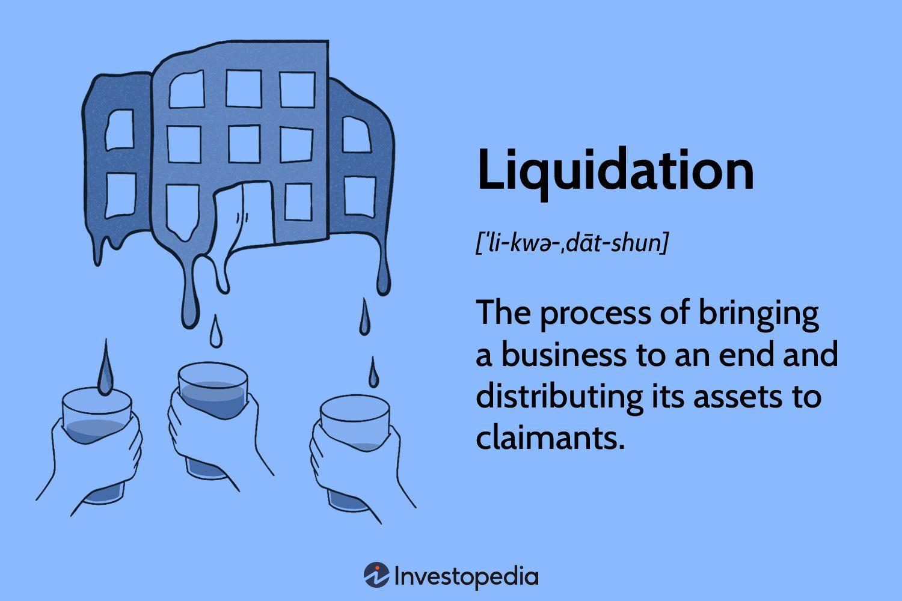

The world of investment has undergone notable transformations due to advancements in technology. This shift has given rise to investment brokerage accounts, share liquidation, and algorithmic trading as pivotal elements that shape contemporary investing. These components serve as essential tools for investors seeking efficiency and precision in managing their portfolios. This article aims to provide a comprehensive overview of brokerage accounts, explore the concept of share liquidation, and examine the role of algorithmic trading within the investment ecosystem. 

Investment brokerage accounts provide individuals and institutions with access to stock markets, bonds, exchange-traded funds (ETFs), and a range of financial instruments. Understanding these accounts is fundamental for effective portfolio management. Meanwhile, the concept of share liquidation is crucial for managing and safeguarding investments, especially when dealing with margin accounts where factors such as falling stock prices or unmet margin calls might necessitate selling off holdings. 

Algorithmic trading, another cornerstone of modern finance, employs computer algorithms to automatically execute trades based on predetermined criteria like timing, price, and volume. This method enhances trading consistency and efficiency by minimizing human errors and emotional biases, thus transforming how markets operate. 

Recognizing how these elements interconnect is vital to grasping the broader picture of automated and strategic trading in financial markets today. This understanding can ultimately lead to more informed and successful investment management strategies.

## Table of Contents

## Understanding Investment Brokerage Accounts

Investment brokerage accounts are essential for individuals and institutions aiming to participate in financial markets, providing a platform to buy, sell, and hold a variety of securities such as stocks, bonds, and Exchange-Traded Funds (ETFs). These accounts play a pivotal role in enabling access to investment vehicles across global markets.

### Types of Brokerage Accounts

There are primarily two types of investment brokerage accounts: cash accounts and margin accounts. Each account type has distinct features that dictate how investors can use them.

**Cash Accounts**  
Cash accounts require investors to conduct transactions fully backed by the funds they have deposited. This means that an investor must pay the total cost of the purchase at the time of the transaction. Here's a simplified example: if an investor wishes to buy $5,000 worth of stocks, they need to have at least $5,000 in their cash brokerage account. The absence of borrowing in this account type minimizes the risk of liquidation, as investors do not face obligations beyond their initial capital. This makes cash accounts a safer choice for risk-averse investors.

**Margin Accounts**  
Margin accounts offer a more leveraged approach by allowing investors to borrow money from their brokerage firm to purchase securities. The borrowed funds, or "margin," enable investors to engage in bigger trades than the capital they possess. For example, an investor with $5,000 in their margin account might be able to purchase up to $10,000 in securities, borrowing the additional $5,000 from their broker. This introduces the concept of a margin call, where the broker demands additional funds or the sale of securities if the account's equity falls below a required level, known as the maintenance margin.

### Risks and Considerations

The potential for higher returns in margin accounts comes with inherent risks, notably the possibility of liquidation if margin calls are unmet. Liquidation risk arises when investments decrease in value, and the equity in a margin account falls below the maintenance margin. Failure to meet the broker's margin call can result in forced sales of securities to cover debts, which may occur at unfavorable prices.

Investors should thoroughly understand the differences and implications of using cash versus margin accounts. Decision-making should be guided by factors including risk tolerance, investment goals, and market experience. Proper management and strategic planning can help investors capitalize on the benefits associated with each type of account while mitigating potential downsides.

By fully comprehending the functionality of investment brokerage accounts, investors can make informed choices that align with their financial objectives and risk preferences.

## The Concept of Share Liquidation

Share liquidation is a process where a brokerage firm sells holdings in an investment account, typically to meet margin requirements. This process is essential in maintaining the integrity of margin accounts, which allow investors to borrow funds from brokers to purchase securities. When the value of securities purchased on margin falls below the broker's maintenance requirement, the broker issues a margin call, demanding additional funds or the liquidation of assets to cover potential losses.

Several factors can lead to share liquidation. One primary trigger is a significant drop in stock prices, which can reduce the overall equity in a margin account below the required maintenance threshold. Personal insolvency, where an investor cannot meet their financial obligations, can also necessitate the forced sale of shares. Moreover, failure to satisfy a margin call promptly can result in the broker liquidating positions to protect their loaned capital. 

Liquidation serves a critical function by ensuring that the borrowed funds in a margin account can be recovered, safeguarding both the investor and the brokerage firm. If a margin call is issued and the investor does not or cannot respond, the broker is authorized to liquidate assets from the account to meet the required margin level. This is typically outlined in the margin agreement signed by the investor upon opening the account.

Understanding the dynamics of share liquidation enables investors to better manage their portfolios and mitigate risks. By carefully monitoring their margin levels and staying informed about market conditions, investors can avoid the adverse effects of forced liquidation. Additionally, maintaining a diversified portfolio with sufficient [liquidity](/wiki/liquidity-risk-premium) can help prevent situations where rapid asset sales are necessary. 

Investors should always carefully read and fully understand the terms and conditions related to margin trading, including the implications of share liquidation. This knowledge is vital for making informed decisions and maintaining strategic control over investments. In an interconnected financial ecosystem, awareness and proactive management of margin accounts can mitigate potential losses and enhance portfolio resilience.

## Exploring Algorithmic Trading

Algorithmic trading, often referred to as algo trading, utilizes computer algorithms to execute trading operations based on predefined criteria. These criteria encompass elements such as timing, price, and [volume](/wiki/volume-trading-strategy), allowing trades to be conducted with minimal human intervention. By eliminating human emotions, which often lead to irrational financial decisions, [algorithmic trading](/wiki/algorithmic-trading) offers enhanced trading consistency and efficiency.

One of the primary benefits of algorithmic trading is its capability to minimize errors associated with manual trading. Since algorithms are predefined, they systematically execute trades, maintaining a level of accuracy that is difficult to achieve manually. This systematic approach significantly reduces the potential for human error and emotional bias, thereby improving the overall efficiency of trading practices.

Various strategies in algorithmic trading cater to different financial objectives:

1. **Trend-Following Strategies**: These strategies exploit market movements by analyzing historical price data to recognize trends early and execute trades accordingly. By identifying persistent price movements, trend-following algorithms seek to capture profits from sustained shifts in market prices.

2. **Arbitrage Strategies**: These strategies find and exploit price discrepancies of the same asset in different markets. By buying low in one market and selling high in another, arbitrage algorithms generate profit from temporary incongruities in pricing.

3. **Market-Making Strategies**: Serving as liquidity providers, these strategies set bid and ask prices for a specific asset, profiting from the bid-ask spread. Market makers algorithmically balance their inventory and adjust prices to maintain a favorable trading position.

4. **Mean Reversion Strategies**: Based on the statistical assumption that asset prices will return to their mean or average over time, these strategies monitor deviations from historical average prices and execute trades anticipating a reversion to the mean.

Algorithmic trading not only streamlines the trading process but also significantly cuts down on trading costs. This is achieved through rapid execution capabilities, enabling traders to capitalize on short-lived trading opportunities with minimal delay. The ability to process large datasets swiftly allows algorithms to identify and act on trading prospects overlooked by human traders.

Nevertheless, algorithmic trading also presents specific challenges. Technical failures, such as glitches or system crashes, can result in substantial financial losses, emphasizing the need for robust technology infrastructure. Additionally, trades executed via algorithmic systems can exert a market impact, potentially moving prices against the trader's favor. The initial setup costs, which include acquiring sophisticated software and securing reliable data sources, might also be prohibitively high for some traders.

Overall, while algorithmic trading offers significant advantages, it requires a comprehensive understanding of both its potential and its risks. Traders and firms must ensure their systems are well-designed and robust enough to handle the complexities of fast-paced financial markets.

## Impact of Algo Trading on Share Liquidation

Algorithmic trading, especially in the form of high-frequency trading ([HFT](/wiki/high-frequency-trading-strategies)), plays a significant role in modern financial markets and can substantially impact share liquidation in margin accounts. This influence primarily stems from the way algorithmic trading affects stock liquidity and market [volatility](/wiki/volatility-trading-strategies).

Algo trading uses sophisticated mathematical models and complex algorithms to make quick trading decisions. These systems can analyze market conditions faster than a human trader ever could, enabling the execution of trades with precision and at high speeds. Through this process, algo trading can enhance market liquidity by facilitating the entry and [exit](/wiki/exit-strategy) of trades efficiently. However, this increased liquidity often comes with heightened volatility, especially when market conditions prompt widespread algorithmic responses.

High-frequency trading, a subset of algo trading, executes trades in fractions of a second. The rapid pace can lead to significant, albeit short-lived, price movements. For margin account holders, such swift fluctuations can result in unmet margin calls, compelling brokers to liquidate assets to cover potential losses quickly. The immediate response of HFT systems to even minor market changes can thus trigger a cascade effect, wherein the rapid execution of trades motivates further price swings, impacting the stability of margin levels.

Algorithm-driven trading strategies are designed to exploit various market conditions, potentially contributing to market efficiency by narrowing bid-ask spreads and enhancing price discovery. However, the rapid swings they can cause might inadvertently raise volatility levels, posing risks for investors who maintain leveraged positions. This volatility, while sometimes beneficial for traders seeking short-term gains, can destabilize margin accounts if not properly managed, as it heightens the risk of falling below maintenance margin requirements and necessitates forced liquidation.

Investors incorporating algorithmic strategies need to have a keen awareness of the potential impacts on account maintenance. These strategies should be designed to mitigate risks associated with liquidation while leveraging the benefits of automation. For instance, investors could potentially incorporate stop-loss mechanisms or position limits coded into their algorithms to prevent excessive exposure due to unforeseen rapid market changes.

Balancing the benefits and risks of algo trading requires a strategic approach. Data-driven insights and robust risk management practices are crucial in employing algo trading effectively. By understanding and anticipating the nuances of how these automated systems operate in various market conditions, investors can employ algo trading judiciously to achieve a harmony between automated strategies and the mitigation of forced liquidation risks. Successful integration of algo trading strategies involves continuous monitoring and adjustment to ensure alignment with investment goals and risk tolerance.

## Conclusion

Investment brokerage accounts, share liquidation, and algorithmic trading represent interconnected facets of modern investing. Each element within this triad plays a crucial role in shaping the strategic landscape for investors, necessitating a comprehensive understanding to exploit their full potential effectively.

Choosing the right brokerage account is the foundational step in enhancing one's investment strategy. Investors need to evaluate their financial goals, risk tolerance, and liquidity needs when deciding between cash and margin accounts. A cash account offers safety from forced liquidation, while a margin account allows for greater leverage but comes with inherent liquidation risks. It is crucial that investors remain aware of these risks and conduct careful assessments to align their choices with their investment objectives.

Maintaining awareness of liquidation risks within margin accounts is vital for portfolio management. Liquidation events, often triggered by unmet margin calls, can lead to substantial financial losses. By understanding the circumstances that may necessitate liquidation—such as volatile market movements or declining asset values—investors can devise strategies to minimize these risks. This may include maintaining sufficient capital reserves or utilizing stop-loss orders to preemptively manage exposure.

Algorithmic trading offers significant potential to enhance investment strategies through improved efficiency and precision. By utilizing algorithms to execute trades, investors can eliminate human error and emotional biases, potentially achieving better market timing and cost efficiency. However, the adoption of algorithmic trading should be approached with caution. Technical failures, initial setup costs, and potential market impacts pose challenges that require careful consideration. A balanced approach, combining automated trading strategies with active oversight, can help mitigate these risks.

Staying informed and adaptable in the face of rapidly evolving market technologies is essential for navigating today’s financial landscape. Continuous education and adaptation to new tools and methodologies will empower investors to remain competitive and responsive to market changes. Furthermore, aligning strategies with one's risk tolerance is equally important to ensure sustainable investment success.

As investors consider the interplay of investment brokerage accounts, share liquidation, and algorithmic trading, it is advisable to assess strategy alignment continuously and seek professional advice where necessary. This approach enables individuals to optimize their investments, balancing risk and reward in a structured and informed manner.

## References & Further Reading

[1]: Bergstra, J., Bardenet, R., Bengio, Y., & Kégl, B. (2011). ["Algorithms for Hyper-Parameter Optimization."](https://dl.acm.org/doi/10.5555/2986459.2986743) Advances in Neural Information Processing Systems 24.

[2]: ["Advances in Financial Machine Learning"](https://www.amazon.com/Advances-Financial-Machine-Learning-Marcos/dp/1119482089) by Marcos Lopez de Prado

[3]: ["Evidence-Based Technical Analysis: Applying the Scientific Method and Statistical Inference to Trading Signals"](https://www.amazon.com/Evidence-Based-Technical-Analysis-Scientific-Statistical/dp/0470008741) by David Aronson

[4]: ["Machine Learning for Algorithmic Trading"](https://github.com/stefan-jansen/machine-learning-for-trading) by Stefan Jansen

[5]: ["Quantitative Trading: How to Build Your Own Algorithmic Trading Business"](https://www.amazon.com/Quantitative-Trading-Build-Algorithmic-Business/dp/1119800064) by Ernest P. Chan