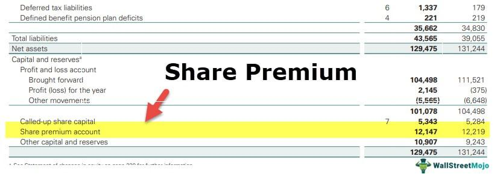

## Table of Contents

## What is a share premium account?

A share premium account is a part of a company's equity where the money paid by investors for shares is recorded, but only the amount that is above the face value of the shares. For example, if a share has a face value of $1 and an investor pays $5 for it, the extra $4 goes into the share premium account. This account is important because it shows how much extra money the company has received from selling its shares.

The money in the share premium account can be used by the company, but there are rules about how it can be used. Usually, it can be used to pay for issuing new shares, to write off the costs of setting up the company, or to cover any losses if the company is not doing well. It's a way for the company to keep track of the extra money it has raised and to use it in ways that can help the business grow or stay stable.

## Where is the share premium account located in the balance sheet?

The share premium account is found on the balance sheet under the section called "Shareholders' Equity" or "Stockholders' Equity." This part of the balance sheet lists all the money that belongs to the owners of the company, including the money they paid for the shares.

Within the Shareholders' Equity section, you will see different accounts like "Common Stock" or "Preferred Stock," which show the face value of the shares. Right next to or below these, you will find the "Share Premium" or "Additional Paid-In Capital" account, which shows the extra money paid by investors over the face value of the shares.

## How is the share premium account different from the share capital account?

The share premium account and the share capital account are both part of the shareholders' equity on a company's balance sheet, but they track different things. The share capital account shows the total face value of all the shares that the company has issued. For example, if a company issues 1,000 shares with a face value of $1 each, the share capital account would show $1,000.

On the other hand, the share premium account records the extra money that investors pay for shares above their face value. Using the same example, if investors paid $5 per share instead of the $1 face value, the extra $4 per share would go into the share premium account. So, if all 1,000 shares were sold at $5 each, the share premium account would show $4,000. This account helps the company keep track of the additional funds it has raised from selling its shares at a higher price.

## What transactions typically lead to an increase in the share premium account?

The main transaction that increases the share premium account happens when a company sells its shares for more money than their face value. For example, if a share has a face value of $1 but is sold for $5, the extra $4 per share goes into the share premium account. This is common when a company first sells its shares to the public or when it issues new shares to raise more money.

Another way the share premium account can increase is if the company receives gifts or donations that are meant to be part of the shareholders' equity. However, this is less common than selling shares at a premium. Both of these situations help the company show how much extra money it has been able to raise from its investors or other sources.

## Can the share premium account ever decrease, and if so, how?

Yes, the share premium account can decrease. This happens when a company uses the money in the share premium account for certain allowed purposes. For example, the company might use the money to pay for the costs of issuing new shares, to cover the expenses of setting up the company, or to write off any losses if the business is not doing well. When the company uses the money for these reasons, the amount in the share premium account goes down.

Another way the share premium account can decrease is if the company decides to buy back its own shares. If the company pays more for the shares than their face value, it might use money from the share premium account to cover the extra cost. This action will reduce the balance in the share premium account. So, while the share premium account usually grows when shares are sold at a higher price, it can also decrease when the company uses the money for specific purposes or buys back its shares.

## How does the share premium account affect a company's equity?

The share premium account is a part of a company's equity that shows how much extra money the company has gotten from selling shares above their face value. When people buy shares for more than what the company says they are worth, the extra money goes into this account. This makes the company's total equity go up because it shows more money coming from the shareholders.

Using the money in the share premium account can affect the company's equity too. If the company uses this money to pay for things like the costs of making new shares or to cover losses, the share premium account goes down. This means the company's total equity will also go down because it is using up the money that was part of its equity. So, the share premium account is important for both increasing and sometimes decreasing a company's equity, depending on how the company uses the money.

## What are the legal restrictions on the use of funds in the share premium account?

There are rules about how a company can use the money in the share premium account. These rules are there to make sure the company uses the money in a fair way. The main rule is that the money can only be used for certain things. For example, the company can use it to pay for the costs of making new shares, to cover the expenses of setting up the company, or to write off any losses if the business is not doing well. These uses are allowed because they help the company grow or stay stable.

Another important rule is that the company cannot just take the money out of the share premium account and give it to the owners or shareholders as a dividend. The money has to stay in the company and be used for the allowed purposes. If the company wants to use the money in a different way, it has to follow special rules and sometimes get permission from the people who make the laws about companies. This helps make sure the money is used in a way that is good for the company and fair to everyone involved.

## How does the treatment of share premium accounts vary internationally?

The way share premium accounts are handled can be different in different countries because each country has its own rules about how companies should work. In some places, like the United States, the share premium account is called "additional paid-in capital" and it is a part of the shareholders' equity on the balance sheet. The rules in the U.S. say that this money can be used for things like paying the costs of making new shares or helping the company when it has losses, but it cannot be given to shareholders as dividends.

In other countries, like the United Kingdom, the share premium account has to follow strict rules from the Companies Act. The money in the share premium account can only be used for certain things, like paying for the costs of issuing new shares, writing off the expenses of setting up the company, or covering losses. The UK rules are very clear that this money cannot be used to pay dividends to shareholders, and if a company wants to use it in a different way, they have to follow special steps and sometimes get permission. So, even though the idea of a share premium account is the same everywhere, the rules about what you can do with the money can be different depending on where the company is.

## What are the tax implications of entries into the share premium account?

When a company gets money into its share premium account, it usually does not have to pay taxes on that money right away. This is because the money is seen as part of the company's equity, not as income. So, when people buy shares for more than their face value, and the extra money goes into the share premium account, the company does not have to pay taxes on that extra money at that time.

However, the tax rules can be different in different countries. In some places, if the company uses the money in the share premium account for certain things, like paying for the costs of making new shares or covering losses, there might be tax effects. For example, if the company uses the money to cover losses, it might affect how much tax the company has to pay on its income. It's important for companies to know the tax rules in their country so they can handle the money in the share premium account the right way.

## How can share premium accounts be used in corporate restructuring or mergers?

When companies are going through big changes like restructuring or merging with another company, the share premium account can play a helpful role. If a company wants to buy another company, it might use the money in the share premium account to pay for some of the costs. This can be a good way to use the extra money the company got from selling shares at a higher price. It can help the company grow bigger or change its business without needing to borrow more money or find other ways to pay for the changes.

Sometimes, during a merger or restructuring, a company might need to issue new shares to make the deal happen. The costs of making these new shares can be paid for with the money in the share premium account. This is allowed because the rules say the share premium account can be used for things like this. Using the share premium account this way can make the process of merging or restructuring smoother and help the company keep its financial health strong during big changes.

## What are the strategic considerations for managing the share premium account?

When a company is thinking about how to manage its share premium account, it needs to think about the best ways to use the extra money it has. This account holds the money that investors paid over the face value of the shares, so it's important to use it wisely. One big thing to consider is using the money to help the company grow or change. For example, if the company wants to issue new shares to buy another company or to expand its business, it can use the money in the share premium account to pay for the costs of making these new shares. This can be a smart way to use the money without having to borrow more or find other ways to pay for growth.

Another thing to think about is how using the money in the share premium account can affect the company's financial health. If the company is not doing well and has losses, it might use the money in the share premium account to cover those losses. This can help keep the company stable and give it time to get back on track. But it's important to be careful because using up the money in the share premium account can lower the company's total equity. The company also needs to follow the rules about how it can use the money, which can be different in different countries. So, managing the share premium account well is about finding the right balance between using the money to help the company grow or stay stable, and making sure the company follows the rules and keeps its financial health strong.

## How do analysts and investors interpret changes in the share premium account when evaluating a company's financial health?

When analysts and investors look at a company's financial health, they pay attention to changes in the share premium account. If the share premium account goes up, it usually means the company sold shares for more money than their face value. This can be a good sign because it shows that investors are willing to pay more for the company's shares, which might mean they think the company has a bright future. A growing share premium account can also give the company more money to use for things like growing the business or paying for costs without having to borrow.

On the other hand, if the share premium account goes down, it could mean the company used some of that money for allowed purposes like paying for the costs of issuing new shares or covering losses. If the company used the money to cover losses, it might make investors worry about the company's financial health. But if the money was used to help the company grow or change in a good way, like during a merger or restructuring, it might be seen as a smart move. So, analysts and investors look at why the share premium account changed to understand if it's a good or bad sign for the company's financial health.

## What is the Role of Share Premium in Financial Statements?

Share premium accounts are critical components of shareholders' equity in a company's financial statements, acting as a reflection of the additional amount investors are willing to pay over the nominal or par value of shares. This additional capital is recorded in the share premium account, which serves as a statutory reserve. Typically, the funds in this account are non-distributable, meaning they cannot be used for dividend payments. Instead, they are designated for specific strategic financial purposes, such as writing off preliminary expenses or issuing bonus shares.

In accounting terms, when a company issues shares at a price above their par value, the excess amount received over the nominal value is credited to the share premium account. This account thereby represents the difference between the total issue price of shares and the sum of their nominal values. Mathematically, this can be expressed as:

$$
\text{Share Premium} = (\text{Issue Price per Share} - \text{Par Value per Share}) \times \text{Number of Shares Issued}
$$

The balance in the share premium account fluctuates with each issuance of new shares at prices above par value. The utilization of share premium funds may include paying off company start-up costs, financing share buybacks, or supporting future capital expenditures. These strategies all depend on the company's financial policies and market conditions.

Presenting share premiums in balance sheets gives an insightful indication of a company's financial approach and investor confidence. Investors look at the share premium to gauge the extent of market enthusiasm for the company's equity offerings. A high share premium often signifies strong market anticipation and demand for the company’s stock, thus offering a strategic advantage in corporate finance. It reflects the premium investors are willing to pay, based on their perception of the company's growth potential and financial stability.

In summary, analyzing share premiums provides valuable insights not only into a company's capital structure but also into investor sentiment regarding the company's equity. This enables financial analysts and investors to assess the company’s capability to attract premium pricing in the market, aligning their assessments with its financial strategies and long-term potential.

## References & Further Reading

[1]: ["Advances in Financial Machine Learning"](https://www.amazon.com/Advances-Financial-Machine-Learning-Marcos/dp/1119482089) by Marcos Lopez de Prado

[2]: ["Evidence-Based Technical Analysis: Applying the Scientific Method and Statistical Inference to Trading Signals"](https://www.amazon.com/Evidence-Based-Technical-Analysis-Scientific-Statistical/dp/0470008741) by David Aronson

[3]: ["Machine Learning for Algorithmic Trading"](https://github.com/stefan-jansen/machine-learning-for-trading) by Stefan Jansen

[4]: ["Quantitative Trading: How to Build Your Own Algorithmic Trading Business"](https://www.amazon.com/Quantitative-Trading-Build-Algorithmic-Business/dp/1119800064) by Ernest P. Chan

[5]: Bodie, Z., Kane, A., & Marcus, A. J. (2014). ["Investments"](https://books.google.com/books/about/EBOOK_Investments_Global_edition.html?id=BMsvEAAAQBAJ), McGraw-Hill Education.

[6]: Damodaran, A. (2001). ["Corporate Finance: Theory and Practice,"](https://archive.org/details/corporatefinance0000damo_v8d8) John Wiley & Sons.

[7]: Harris, L. (2003). ["Trading and Exchanges: Market Microstructure for Practitioners"](https://www.amazon.com/Trading-Exchanges-Market-Microstructure-Practitioners/dp/0195144708), Oxford University Press.