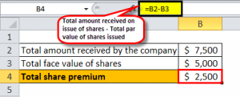

Understanding the foundational concepts that drive corporate financial structures is essential for investors, analysts, and business stakeholders. These concepts encompass the fundamental elements that define a company's financial health and potential for growth. Among these concepts are the relationships between balance sheets, share premiums, and algorithmic trading, which play a significant role in shaping strategies for informed financial decisions.

Balance sheet accounting is a crucial aspect that offers a snapshot of a company's financial position at a particular time, revealing assets, liabilities, and shareholders' equity. This information underscores the financial stability and operational efficiency of a business. Meanwhile, share premium accounts reflect the additional amount paid by investors over the nominal value of shares issued. This component of shareholders' equity not only highlights investor confidence but can also be strategically used to bolster a company's financial framework.



Furthermore, algorithmic trading represents the intersection of finance and technology, employing complex mathematical models and computational algorithms for executing trades at optimal prices. Its ability to enhance liquidity and ensure efficient price discovery in financial markets exemplifies its transformative impact on modern trading practices.

This article will explore the impact of balance sheet accounting, the role of share premium accounts, and the cutting-edge techniques of algorithmic trading. The integration of these elements forms a comprehensive financial picture, allowing businesses to optimize their operations. By merging traditional financial metrics with technological advancements in trading, organizations can enhance their financial health and investment strategies, ensuring robust corporate growth and sustainability.

## Table of Contents

## Understanding Balance Sheet Accounting

A balance sheet is a foundational financial document that presents a company's financial position at a specific moment. It is organized into three primary sections: assets, liabilities, and shareholders’ equity. Each component provides critical insights into the financial stability and operational efficacy of a business.

Assets represent the resources owned by a company, encompassing both current assets such as cash and inventories, and non-current assets such as property and equipment. Current assets are expected to be converted into cash or used up within one year, whereas non-current assets have a longer-term use or benefit. 

Liabilities, on the other hand, are the obligations a company owes to outside parties. Similar to assets, liabilities are categorized into current liabilities, which are due within one year, and long-term liabilities, such as bonds payable that extend beyond a year.

Shareholders' equity is defined as the residual interest in the assets of an entity after deducting liabilities. It is an indicator of a company’s net worth and is represented by components such as common stock, retained earnings, and reserves.

The formula for the balance sheet is given by:
$$
\text{Assets} = \text{Liabilities} + \text{Shareholders' Equity}
$$

### Assets = Liabilities + Shareholders' Equity

Recording balance sheet items follows specific accounting principles to ensure accuracy and compliance with financial reporting standards. For example, the historical cost principle requires assets to be recorded based on their original purchase cost, unless specified otherwise by accounting regulations.

Balance sheets offer valuable insights into a company’s financial health. By examining assets, stakeholders can assess [liquidity](/wiki/liquidity-risk-premium) and productivity. Liabilities provide understanding regarding the company’s debt levels and future financial obligations. Shareholders’ equity indicates the financial health from an ownership perspective, showcasing the extent of funding sourced from the company's owners.

Comprehending the dynamics of balance sheet accounting is crucial for stakeholders, as it allows for evaluating the sustainability of a company's operations. It assists in the analysis of financial ratios such as debt-to-equity ratio and current ratio, which are crucial indicators of a company's financial health and operational efficiency. Understanding this document enables investors and analysts to make informed decisions regarding investments and management strategies.

## The Role of Share Premium in Financial Statements

Share premium accounts are critical components of shareholders' equity in a company's financial statements, acting as a reflection of the additional amount investors are willing to pay over the nominal or par value of shares. This additional capital is recorded in the share premium account, which serves as a statutory reserve. Typically, the funds in this account are non-distributable, meaning they cannot be used for dividend payments. Instead, they are designated for specific strategic financial purposes, such as writing off preliminary expenses or issuing bonus shares.

In accounting terms, when a company issues shares at a price above their par value, the excess amount received over the nominal value is credited to the share premium account. This account thereby represents the difference between the total issue price of shares and the sum of their nominal values. Mathematically, this can be expressed as:

$$
\text{Share Premium} = (\text{Issue Price per Share} - \text{Par Value per Share}) \times \text{Number of Shares Issued}
$$

The balance in the share premium account fluctuates with each issuance of new shares at prices above par value. The utilization of share premium funds may include paying off company start-up costs, financing share buybacks, or supporting future capital expenditures. These strategies all depend on the company's financial policies and market conditions.

Presenting share premiums in balance sheets gives an insightful indication of a company's financial approach and investor confidence. Investors look at the share premium to gauge the extent of market enthusiasm for the company's equity offerings. A high share premium often signifies strong market anticipation and demand for the company’s stock, thus offering a strategic advantage in corporate finance. It reflects the premium investors are willing to pay, based on their perception of the company's growth potential and financial stability.

In summary, analyzing share premiums provides valuable insights not only into a company's capital structure but also into investor sentiment regarding the company's equity. This enables financial analysts and investors to assess the company’s capability to attract premium pricing in the market, aligning their assessments with its financial strategies and long-term potential.

## Algorithmic Trading: Merging Technology with Finance

Algorithmic trading, also known as algo trading or black-box trading, utilizes sophisticated mathematical models and computational algorithms to facilitate the buying and selling of financial instruments. This method aims to execute trades at the most favorable prices by leveraging pre-established rules based on time, price, quantity, or any other mathematical model. The core advantage of [algorithmic trading](/wiki/algorithmic-trading) is its ability to process substantial volumes of data and execute orders at a speed and frequency that is impossible for a human trader to achieve.

At the foundation of algorithmic trading are pre-set rules that guide trade decisions. These rules are typically derived from complex computational techniques that analyze market data to identify inefficiencies. For instance, traders might employ a moving average crossover strategy, where a short-term moving average crosses above a long-term moving average, signaling a buy order. In Python, this could be implemented as follows:

```python
def moving_average(price_list, window_size):
    return [sum(price_list[i:i+window_size])/window_size for i in range(len(price_list)-window_size+1)]

def moving_average_crossover(prices, short_window, long_window):
    short_ma = moving_average(prices, short_window)
    long_ma = moving_average(prices, long_window)
    if short_ma[-1] > long_ma[-1]:
        return "Buy"
    elif short_ma[-1] < long_ma[-1]:
        return "Sell"
    else:
        return "Hold"
```

The rise of high-frequency trading ([HFT](/wiki/high-frequency-trading-strategies)) has significantly expanded the role of algorithmic trading. HFT operates on millisecond time scales, exploiting tiny price discrepancies to generate profits through rapid trade execution. This practice enhances market liquidity and plays a pivotal role in efficient price discovery.

Moreover, the integration of [machine learning](/wiki/machine-learning) algorithms in algo trading provides substantial improvements in predictive accuracy and decision-making. Machine learning models process and analyze historical market data to predict future price movements and identify profitable trading opportunities. These advancements present considerable benefits, such as the ability to automatically adapt to changing market conditions, thus maintaining a competitive edge.

The advantages of algorithmic trading extend to improved trading efficiency and reduced transaction costs. By automating the trading process, firms can minimize manual intervention, thus reducing the risk of human error and the associated costs. Furthermore, algo trading promotes tighter spreads, which directly benefits market participants through lower trading costs.

Despite these benefits, algorithmic trading also raises concerns, particularly regarding market stability. The occurrence of flash crashes, where stock prices plummet rapidly due to erroneous trades executed by algorithms, exemplifies the potential risks. Therefore, it is critical for regulatory bodies to monitor algorithmic trading activities to safeguard market integrity.

In conclusion, algorithmic trading represents a convergence of technology and finance, providing significant advantages in terms of efficiency, speed, and accuracy in financial markets. As technology continues to evolve, the role of algorithmic trading will likely expand, offering new opportunities and challenges for market participants.

## The Interplay Between Share Premium and Algorithmic Trading

Algorithmic trading has transformed the dynamics of financial markets, influencing share prices and investor sentiment. A critical aspect of this transformation is its impact on share premiums. As algorithmic trading executes trades based on advanced computational techniques and pre-set rules, it plays a pivotal role in shaping the market value of shares, indirectly affecting the share premium—the additional amount investors are willing to pay over the nominal share value.

A thorough understanding of both algorithmic trading and share premiums is crucial for investors aiming to optimize corporate capital structures. By analyzing real-time trading patterns, investors can gain valuable insights into market perceptions of share value, which directly impacts the level of share premium. For instance, algorithmic strategies can quickly identify trends and anomalies in share price movements, reflecting on investor confidence and their willingness to pay premiums. This information is indispensable for strategic decision-making regarding share issuance.

Companies can leverage algorithmic trading insights to determine the optimal timing and conditions for issuing new shares. This strategic issuance can help maintain a favorable balance between debt and equity financing, crucial for sustaining financial health and minimizing cost of capital. The ability to predict and respond to market trends allows firms to issue shares when the share premium is likely to be higher, thereby maximizing capital raised.

Moreover, algorithmic trading can significantly help manage market [volatility](/wiki/volatility-trading-strategies) and ensure price efficiency in share offerings. Algorithms can execute trades at speeds and frequencies that human traders cannot match, smoothing out price fluctuations and enhancing liquidity. This aspect of algorithmic trading reduces uncertainty, which can lead to more stable pricing and potentially higher share premiums.

In practice, implementing algorithmic strategies for optimizing share premiums may involve coding models that analyze historical price data and forecast future trends. Consider a basic Python code snippet to simulate a simple moving average crossover, a foundational strategy in algorithmic trading:

```python
import pandas as pd

# Load historical price data
data = pd.read_csv('historical_prices.csv')

# Calculate short-term and long-term moving averages
data['SMA_10'] = data['Close'].rolling(window=10).mean()
data['SMA_50'] = data['Close'].rolling(window=50).mean()

# Define trading signals
data['Signal'] = 0
data['Signal'][data['SMA_10'] > data['SMA_50']] = 1
data['Position'] = data['Signal'].diff()

# Analyze profitable entry points for issuing shares
entry_points = data[data['Position'] == 1].index.tolist()
```

This code evaluates simple moving averages to identify potential entry points for trading, thereby assisting in making informed decisions about share issuance based on predicted market conditions. By harnessing such algorithmic strategies, companies can better manage the interplay between share premiums and market dynamics, enhancing their financial strategies and shareholder value.

## Strategic Financial Management Using Share Premium and Algo Trading

Companies strategically utilize their share premium accounts, which represent the funds received from issuing shares above their nominal value, for various aspects of financial management such as corporate restructuring and expansion efforts. This financial reserve allows firms to make investments without increasing debt, thus maintaining a balanced capital structure.

Algorithmic trading offers significant advantages by providing real-time market intelligence. This capability enables companies to swiftly adjust their financial strategies, allowing businesses to capitalize on emerging market trends. Through data-driven decision-making processes, algorithmic trading helps in identifying optimal pricing and timing for share issuance, ensuring that companies are well-positioned to attract investment at favorable premiums.

By integrating share premium management with advanced algorithmic trading practices, businesses can significantly boost their competitiveness in the market. This integration allows companies to refine their financial management processes, ensuring that they can quickly adapt to market changes while maintaining stable growth. The real-time insights provided by algorithmic trading support informed decision-making around the use of share premiums, thus enhancing the overall financial health of the organization.

Effective management of share premiums, when combined with strategic trading activities, contributes to an optimized capital structure which balances debt and equity in a way that supports sustained growth. Companies that align their share premium strategies with insights gained from algorithmic trading can ensure robust financial planning. This alignment aids in mitigating risks while maximizing returns on investments.

Robust financial planning becomes achievable when algorithmic insights are used to anticipate market fluctuations and investor sentiment. These insights guide companies in issuing shares at optimal premiums, thereby preserving shareholder value. As a result, firms that blend traditional financial strategies with algorithmic solutions can thrive in a dynamic financial environment, securely navigating the complexities of modern corporate finance.

## Conclusion: Navigating the Future of Corporate Finance

In a rapidly evolving financial landscape, aligning traditional financial principles with modern technological tools is crucial for companies aiming to maintain a competitive edge. This alignment requires understanding the synergies between balance sheet components and trading algorithms, which are essential for effective strategic decision-making. Companies that successfully integrate share premium management with algorithmic trading insights can achieve heightened financial efficiency and resilience.

The complexity of modern financial markets demands continuous learning and adaptation. As the dynamics of financial ecosystems shift, companies face both challenges and opportunities that necessitate a proactive and agile approach to corporate finance management. By continuously updating their knowledge base and leveraging technological advancements, businesses can better navigate these changes and harness market opportunities to bolster their financial standings.

Technological progress presents novel methods for optimizing financial performance and enhancing shareholder value. Algorithmic trading, enabled by advancements in computational power and data analysis techniques, allows firms to capitalize on market trends and inefficiencies in real-time. Tools such as machine learning and [artificial intelligence](/wiki/ai-artificial-intelligence) can further refine trading strategies, leading to improved decision-making processes that are more responsive to market conditions.

Incorporating these technological tools with traditional financial metrics, such as balance sheet analysis and shareholder equity management, facilitates a comprehensive approach to financial strategy. By doing so, companies can not only maximize operational efficiency but also secure their long-term growth and sustainability.

The future of corporate finance will likely continue to be shaped by this intersection of technology and traditional financial practices. Organizations that remain committed to learning and innovation will be best positioned to thrive. As they adapt to the ever-changing financial landscape, they will unlock new pathways to optimizing financial performance and achieving sustained shareholder value.

## References & Further Reading

[1]: ["Advances in Financial Machine Learning"](https://www.amazon.com/Advances-Financial-Machine-Learning-Marcos/dp/1119482089) by Marcos Lopez de Prado

[2]: ["Evidence-Based Technical Analysis: Applying the Scientific Method and Statistical Inference to Trading Signals"](https://www.amazon.com/Evidence-Based-Technical-Analysis-Scientific-Statistical/dp/0470008741) by David Aronson

[3]: ["Machine Learning for Algorithmic Trading"](https://github.com/stefan-jansen/machine-learning-for-trading) by Stefan Jansen

[4]: ["Quantitative Trading: How to Build Your Own Algorithmic Trading Business"](https://www.amazon.com/Quantitative-Trading-Build-Algorithmic-Business/dp/1119800064) by Ernest P. Chan

[5]: Bodie, Z., Kane, A., & Marcus, A. J. (2014). ["Investments"](https://books.google.com/books/about/EBOOK_Investments_Global_edition.html?id=BMsvEAAAQBAJ), McGraw-Hill Education.

[6]: Damodaran, A. (2001). ["Corporate Finance: Theory and Practice,"](https://archive.org/details/corporatefinance0000damo_v8d8) John Wiley & Sons.

[7]: Harris, L. (2003). ["Trading and Exchanges: Market Microstructure for Practitioners"](https://www.amazon.com/Trading-Exchanges-Market-Microstructure-Practitioners/dp/0195144708), Oxford University Press.