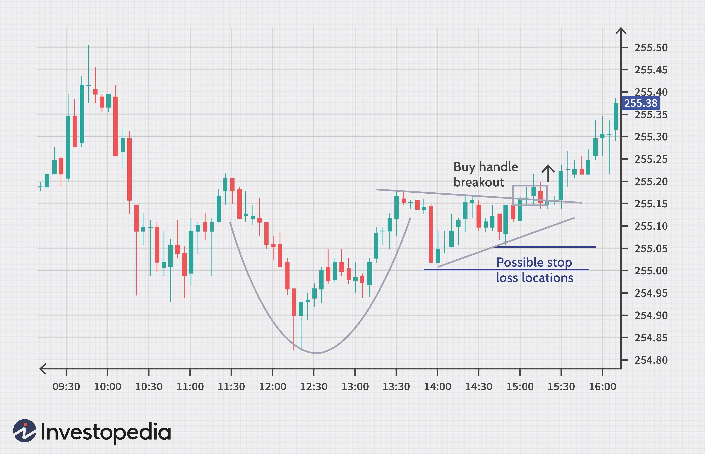

Investment in stock markets has always been a strategic endeavor, heavily relying on numbers and data to drive financial outcomes. Over time, technological advancements have significantly altered trading and investment landscapes, introducing new methodologies and analytical tools that have transformed traditional practices.

A thorough examination of stock valuation, the importance of share price analysis, and the implementation of algorithmic trading provides a comprehensive view of modern investment practices. Stock valuation remains a foundational concept, helping investors assess the intrinsic value of a company's shares and determine over or undervaluation in relation to prevailing market conditions. Share price analysis offers insights into the fluctuating value of stocks stemming from various factors, including corporate performance, market sentiment, and macroeconomic indicators.



The augmentation of investment strategies through technology is epitomized by algorithmic trading. This modern approach leverages computational power and complex algorithms to execute trades with precision, offering substantial benefits such as increased market efficiency and reduced transaction costs.

Understanding and integrating these concepts enables investors to craft informed strategies, optimizing their portfolios for favorable financial results. The interaction of stock valuation, share pricing, and algorithmic trading reflects a dynamically changing market landscape. For both novice and experienced investors, it is crucial to remain informed and proficient with these elements to effectively navigate and capitalize on the ever-evolving stock market.

## Table of Contents

## Understanding Stock Valuation

Stock valuation refers to the process of estimating the intrinsic value of a company's stock, which is central to informed investment decisions. This assessment aids investors in determining whether a stock is overvalued, undervalued, or fairly priced. Valuation methods are broadly divided into fundamental analysis and technical analysis.

### Fundamental Analysis

Fundamental analysis involves a thorough examination of a company’s financial health by analyzing its financial statements such as the balance sheet, income statement, and cash flow statement. This method seeks to assess a company's intrinsic value based on economic and financial factors. Key components of [fundamental analysis](/wiki/fundamental-analysis) include:

1. **Balance Sheet Analysis**: The balance sheet provides insights into a company's assets, liabilities, and shareholder equity at a given time. It helps investors evaluate the company's net worth and financial stability. 

2. **Income Statement Analysis**: This document reveals a company's performance over a specific period, focusing on revenues, expenses, and profits. Key metrics derived from the income statement include profit margins, earnings per share (EPS), and the price-to-earnings (P/E) ratio. 
$$
    \text{EPS} = \frac{\text{Net Income} - \text{Dividends on Preferred Stock}}{\text{Average Outstanding Shares}}

$$

3. **Cash Flow Statement Analysis**: It tracks the flow of cash in and out of the business, categorized into operations, investing, and financing activities. This statement is crucial for understanding a company’s liquidity and long-term viability.

### Technical Analysis

Technical analysis focuses on statistical trends derived from trading activity, such as price movement and [volume](/wiki/volume-trading-strategy), rather than a company's fundamentals. Investors use this method to predict future price movements based on historical performance. Core aspects of technical analysis include:

1. **Price Patterns**: Analysts study chart patterns like head and shoulders, flags, and pennants to forecast stock movements.

2. **Market Indicators**: Tools such as moving averages, relative strength index (RSI), and Bollinger Bands provide data points for analyzing stock behavior.

3. **Trend Analysis**: Identifying trends whether they are upwards, downwards, or sideways helps in making trading decisions. 
$$
    \text{MACD} = \text{EMA}_{12} - \text{EMA}_{26}

$$

In essence, stock valuation combines these methodologies to offer investors a comprehensive toolkit for assessing the true worth of company shares. By leveraging fundamental analysis, investors can determine a baseline value grounded in a company’s actual financial performance. In contrast, technical analysis equips investors with an understanding of market sentiment and trading dynamics, providing a holistic approach to stock evaluation.

## The Dynamics of Share Price

A share price represents the market valuation of a single share of a company's stock and is a reflection of various dynamic factors. Primarily, share prices are determined by the market's perception of a company’s financial health, growth potential, and risk, leading them to fluctuate more frequently than the underlying intrinsic value of the company.

Key factors influencing share price include company performance, which encompasses both historical earnings and projected revenues. This can be assessed through financial metrics such as earnings per share (EPS) and price-earnings ratio (P/E ratio). For instance, a company reporting higher-than-expected earnings often experiences an increase in share price.

Investor sentiment also plays a crucial role. This psychological aspect involves perceptions that may not necessarily align with fundamental valuations. Positive news, such as a new product launch, often boosts investor confidence and drives the price up, while negative news, such as a scandal or regulatory issue, can have the opposite effect.

Market conditions include the broader economic environment and industry-specific factors. Bull markets generally see rising share prices due to optimistic economic outlooks, whereas bear markets coincide with falling share prices and a negative economic perspective. Macroeconomic indicators such as interest rates, inflation rates, and unemployment figures can have direct impacts. For example, a cut in interest rates usually stimulates investment and can lead to an increase in share prices.

Geopolitical events, such as elections, trade agreements, and conflicts, introduce additional layers of complexity and uncertainty to share price dynamics. For example, political tensions or instability can lead to market [volatility](/wiki/volatility-trading-strategies) as investors react to perceived risks.

To analyze share prices effectively, investors consider both short-term and long-term perspectives. Short-term analysis often involves technical analysis, which examines price charts and patterns to discern trends and potential price movements. Meanwhile, long-term analysis focuses on fundamental analysis, assessing the complete financial picture of a company to gauge its future potential.

A Python snippet for a basic moving average calculation, often used in technical analysis to smooth out price data and identify trends, is as follows:

```python
import pandas as pd

# Mock data: Daily closing prices
data = {'Close': [150, 152, 154, 153, 155, 157, 158, 159, 160, 161]}
df = pd.DataFrame(data)

# Calculate the 3-day moving average
df['3-day MA'] = df['Close'].rolling(window=3).mean()
print(df)
```

This code helps to visualize how a moving average can smooth out the noise in daily price fluctuations, making it easier to spot trends. By understanding both the quantitative aspects and the qualitative factors impacting share prices, investors can make more informed decisions, aligning their strategies with comprehensive market insights.

## Algorithmic Trading: A Modern Approach

Algorithmic trading, often referred to as algo trading, employs sophisticated computer algorithms to execute trades with precision and speed that are beyond human capabilities. This methodology utilizes complex mathematical models to analyze real-time market data, allowing for swift decision-making and execution of trades. These algorithms can process vast amounts of information, identify patterns, and execute orders in milliseconds, optimizing the timing and pricing of trades.

One of the primary advantages of [algorithmic trading](/wiki/algorithmic-trading) is the enhancement of market efficiency. By automating the process, trades are executed with minimal latency, ensuring that market prices more accurately reflect all available information. This increased efficiency reduces the likelihood of price discrepancies and contributes to a more stable and equitable trading environment.

Additionally, algorithmic trading significantly reduces transaction costs. Traditional trading methods often involve human intervention, which can be slow and costly. Automated systems minimize these expenses by eliminating the need for manual processing and by reducing the spread between bid and ask prices. Moreover, algo trading mitigates the emotional biases that can influence human traders, such as fear and greed, which often lead to suboptimal trading decisions.

However, despite its many advantages, algorithmic trading is not without risks. One of the key concerns is market volatility, which can be exacerbated by the rapid execution of large volumes of trades. In cases where multiple algorithms respond similarly to market conditions, this can lead to "flash crashes" or sudden, severe market dips. Further, system failures pose another significant risk. Technical glitches or incorrect algorithms can result in substantial financial losses, as was evident in historical events like the 2010 Flash Crash.

To mitigate these risks, robust risk management frameworks and thorough testing of algorithms are essential. Furthermore, regulatory oversight is important to ensure that the deployment of these trading systems does not disrupt the broader financial markets. As technology continues to advance, algorithmic trading is poised to play an increasingly pivotal role in financial markets, offering opportunities for more precise and efficient trading strategies while necessitating vigilant oversight and risk management practices.

## The Interplay Between Valuation, Share Price, and Algo Trading

The value of stock valuation, share pricing, and algorithmic trading is interconnected, influencing each aspect in various ways. Algorithmic trading, which utilizes computer algorithms to execute trades, heavily relies on real-time share price data. This dependency underscores the importance of accurate stock valuation metrics, as they can significantly influence price data used by these algorithms. For instance, intrinsic value assessments can determine whether a stock appears overvalued or undervalued, impacting investor sentiment and, consequently, market prices.

Algorithmic trading utilizes a vast array of data inputs to generate trading signals and execute orders with high precision and speed. Python code, for example, can be employed to develop algorithmic strategies that analyze historical price data to identify potential buy or sell signals. Below is a simplified example of how a moving average crossover strategy might be implemented in Python:

```python
import pandas as pd

# Sample function to calculate moving averages and generate signals
def moving_average_crossover_strategy(data, short_window, long_window):
    signals = pd.DataFrame(index=data.index)
    signals['price'] = data['price']
    signals['short_mavg'] = data['price'].rolling(window=short_window, min_periods=1).mean()
    signals['long_mavg'] = data['price'].rolling(window=long_window, min_periods=1).mean()

    signals['signal'] = 0.0
    signals['signal'][short_window:] = np.where(signals['short_mavg'][short_window:] > signals['long_mavg'][short_window:], 1.0, 0.0)
    signals['positions'] = signals['signal'].diff()

    return signals

# Example usage
data = pd.DataFrame({'price': [/* insert historical price data here */]})
short_window = 40
long_window = 100
signals = moving_average_crossover_strategy(data, short_window, long_window)
```

This example demonstrates how algorithms can be programmed to respond to changing market conditions almost instantaneously, a capability that manual analysis simply cannot match in speed. However, automated systems must be continually fine-tuned based on valuation insights to ensure their accuracy amidst fluctuating market evaluations.

Investors are tasked with harmonizing rigorous manual analyses of intrinsic value with the rapid execution and diverse strategies enabled by algorithmic trading. By understanding intrinsic values, investors can make better informed decisions regarding when to initiate trades, even against the backdrop of algorithm-driven volatility.

Conclusively, blending these tools and methods—stock valuation, share price analysis, and algorithmic trading—creates a comprehensive strategy that can lead to more effective and informed investment decisions. The synergies between valuation, market dynamics as reflected in share prices, and advanced trading algorithms equip investors with a holistic view necessary for navigating the complexities of today's financial markets. This interplay not only optimizes returns but also minimizes risks, ensuring a balanced approach to stock market investments.

## Conclusion

Investing in stocks involves navigating a complex landscape where valuation, share prices, and trading technologies converge. Understanding these elements is crucial to make informed decisions and optimize investment strategies. Algorithmic trading has significantly transformed traditional investment approaches by using advanced data analytics and high-speed trades. This modern method not only enables precise decision-making but also enhances market efficiency and reduces transaction costs, making it a valuable tool for investors.

Staying informed about market dynamics and employing contemporary trading techniques can greatly aid investors in tackling market volatility. The stock market is often influenced by rapid shifts in economic, political, and technological arenas, which requires strategies flexible enough to adapt to these changes. Leveraging algorithmic trading, alongside traditional valuation methods, equips investors with the necessary insights to respond effectively to market fluctuations and capture financial opportunities.

As technologies continue to advance, their impact on stock valuation and investment strategies is set to expand further. Investors are likely to see more sophisticated tools that incorporate [artificial intelligence](/wiki/ai-artificial-intelligence) and [machine learning](/wiki/machine-learning), providing deeper analytical insights and more predictive models. Embracing these innovations not only offers a competitive edge but also reshapes how investments are evaluated and decisions are made in the ever-evolving landscape of stock markets.

## References & Further Reading

[1]: ["Algorithmic Trading and DMA: An introduction to direct access trading strategies"](https://www.amazon.com/Algorithmic-Trading-DMA-introduction-strategies/dp/0956399207) by Barry Johnson

[2]: ["Quantitative Investing: Strategies to exploit stock market anomalies for all investors"](https://books.google.com/books/about/Quantitative_Investing.html?id=eftcEAAAQBAJ) by Fred Piard

[3]: Andrew W. Lo, & A. Craig MacKinlay. (1999). ["A Non-Random Walk Down Wall Street."](https://www.amazon.com/Non-Random-Walk-Down-Wall-Street/dp/0691092567) Princeton University Press.

[4]: Fama, E. F. (1970). ["Efficient Capital Markets: A Review of Theory and Empirical Work."](https://www.jstor.org/stable/2325486?read-now=1&googleloggedin=true) The Journal of Finance, 25(2), 383–417.

[5]: Robert E. Whaley. (2000). ["The Investor Fear Gauge."](https://www.semanticscholar.org/paper/The-Investor-Fear-Gauge-Whaley/37ea262fb99beb8bf9dcb8406400d491aab40a0b) The Journal of Portfolio Management, 26(3), 12-17.

[6]: ["High-Frequency Trading: A Practical Guide to Algorithmic Strategies and Trading Systems"](https://www.wiley.com/en-us/High+Frequency+Trading%3A+A+Practical+Guide+to+Algorithmic+Strategies+and+Trading+Systems-p-9780470579770) by Irene Aldridge