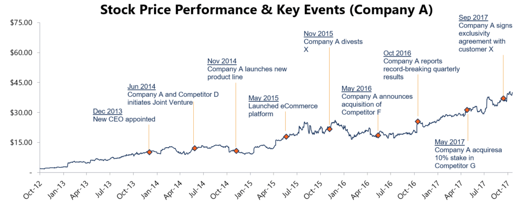

## Table of Contents

## What is a share price?

A share price is the cost of one share of a company's stock. When people buy or sell shares, they are trading pieces of ownership in that company. The share price can go up or down based on how much people are willing to pay for it. If many people want to buy the shares, the price usually goes up. If fewer people want to buy, the price might go down.

The share price is important because it shows what the market thinks a company is worth. It can be affected by many things, like how well the company is doing, news about the company, or even what's happening in the world. Investors watch the share price to decide if they should buy, sell, or hold onto their shares. By looking at the share price, they can try to guess if the company will do well in the future.

## How is the share price determined?

The share price of a company is determined by what people are willing to pay for it. It's like a big auction where lots of people are buying and selling shares all the time. If more people want to buy the shares than sell them, the price goes up because buyers have to offer more money to get them. If more people want to sell than buy, the price goes down because sellers have to lower their price to find someone who wants to buy.

Many things can affect what people are willing to pay for a share. For example, if a company is making more money and growing, people might think it's worth more and be willing to pay a higher price for its shares. News about the company, like new products or changes in leadership, can also change what people think about it and affect the share price. Even things happening in the world, like changes in the economy or new laws, can make people want to buy or sell shares and move the price up or down.

## What factors can influence a share's price?

A company's share price can go up or down because of many things. One big thing is how well the company is doing. If it's making more money and growing, people might want to buy its shares and the price can go up. If the company is not doing well, people might want to sell the shares and the price can go down. Another thing that can change the share price is news about the company. If there's good news, like a new product or a new leader, people might think the company will do better and the share price can go up. Bad news can make the price go down.

Things happening in the world can also affect a company's share price. For example, if the economy is doing well, people might be more willing to buy shares and the price can go up. If the economy is not doing well, people might sell their shares and the price can go down. Laws and rules can also change how people feel about buying or selling shares. If there's a new law that helps the company, the share price might go up. If there's a new law that makes things harder for the company, the share price might go down.

Sometimes, things that seem unrelated can still affect a company's share price. For example, if there's a big event happening, like a natural disaster or a big election, it can make people worried or excited and change what they're willing to pay for shares. Even what other people are saying about the company on social media can make the share price move up or down. It's all about what people think and feel about the company and its future.

## How can I find the current share price of a company?

You can find the current share price of a company by looking at financial websites. Websites like Yahoo Finance, Google Finance, or Bloomberg have tools where you can type in the name of the company or its stock symbol, and it will show you the current share price. These websites update the prices all the time, so you can see the latest information.

Another way to find the share price is by using a stock market app on your phone. Apps like Robinhood, E*TRADE, or the official apps from stock exchanges like the New York Stock Exchange or NASDAQ let you search for a company and see its current share price. These apps are easy to use and give you quick access to the information you need.

## What is the difference between the market price and the intrinsic value of a share?

The market price of a share is what people are willing to pay for it right now. It's like the price tag you see when you look up a company's stock on a financial website. This price can change all the time because it's based on what buyers and sellers are doing at that moment. If more people want to buy than sell, the market price goes up. If more people want to sell than buy, the market price goes down.

The intrinsic value of a share is what the company is really worth, based on its actual earnings, growth, and other things that make it valuable. It's like trying to figure out how much a company should be worth if you look at all its money and stuff. This value doesn't change as fast as the market price because it's based on the company's real situation, not just what people are doing right now. Sometimes the market price can be higher or lower than the intrinsic value, and investors try to find these differences to decide if a share is a good buy or not.

## How do stock market indices affect share prices?

Stock market indices like the S&P 500 or the Dow Jones show how a group of stocks are doing overall. When these indices go up, it usually means that many of the stocks in the group are also going up, which can make people feel good about buying shares. This can push the share prices of many companies higher, even if nothing has changed about those companies themselves. On the other hand, if the indices go down, it can make people worried and they might start selling their shares, which can make the share prices of many companies go down.

Sometimes, a big change in a stock market index can affect a specific company's share price even if that company isn't part of the index. For example, if the S&P 500 drops a lot, it can make people feel scared about the whole market, and they might sell shares of other companies too. This can cause the share prices of those companies to go down, even if they're doing well. So, stock market indices can have a big effect on share prices because they can change how people feel about buying and selling stocks.

## What are the common methods to analyze share price movements?

One common way to analyze share price movements is by using technical analysis. This method looks at past share prices and trading volumes to spot patterns and trends. People who use technical analysis believe that by studying these charts and graphs, they can predict where the share price might go next. They look for things like support and resistance levels, which are points where the share price often stops going down or up. They also use tools like moving averages, which smooth out price data over time to help see the overall direction of the share price.

Another method is fundamental analysis, which focuses on a company's financial health and future prospects. People using this approach look at things like earnings, revenue, and other financial statements to figure out if a share is priced right. They might also consider the company's management, industry trends, and economic conditions. By understanding these factors, they can decide if the share price is too high, too low, or just right, and whether it's a good time to buy or sell the share.

Some people also use a mix of both technical and fundamental analysis, called quantitative analysis, to get a fuller picture of share price movements. This method uses math and computer models to analyze lots of data quickly. It can help find patterns that might be hard to see with just one type of analysis. By combining different kinds of information, investors hope to make better decisions about when to buy or sell shares.

## How does company news and announcements impact share prices?

Company news and announcements can have a big impact on share prices. When a company shares good news, like making more money than expected or launching a new product, people might think the company is doing well. This can make more people want to buy the shares, which can push the share price up. On the other hand, if the news is bad, like losing money or having a big problem, people might want to sell their shares. This can make the share price go down because there are more people selling than buying.

Sometimes, even the hint of news can move share prices. For example, if a company says it will announce something important soon, people might start guessing what it could be. If they think it will be good news, they might start buying shares and the price can go up. If they think it will be bad news, they might start selling shares and the price can go down. So, it's not just the news itself, but also what people think the news might be, that can affect share prices.

## What role do economic indicators play in share price fluctuations?

Economic indicators are like signs that tell us how the economy is doing. Things like the unemployment rate, inflation, and how much people are spending can all affect share prices. When these indicators show that the economy is doing well, people might feel good about buying shares. They might think that companies will make more money and the share prices will go up. On the other hand, if the indicators show that the economy is not doing well, people might worry. They might sell their shares because they think companies will make less money and the share prices will go down.

Sometimes, just the news about these economic indicators can move share prices, even if nothing has changed about the companies themselves. For example, if a report comes out saying that more people are spending money, it can make people feel good about the economy. This can lead to more people buying shares and the prices going up. But if a report says that fewer people are spending, it can make people worried and they might start selling shares, which can make the prices go down. So, economic indicators can have a big effect on share prices because they change how people feel about the future.

## How can technical analysis be used to predict future share price trends?

Technical analysis is a way to look at past share prices and trading volumes to guess where the price might go next. People who use this method believe that by studying charts and graphs, they can spot patterns and trends that help them predict the future. They look for things like support and resistance levels, which are points where the share price often stops going down or up. They also use tools like moving averages, which smooth out price data over time to help see the overall direction of the share price. By finding these patterns, they hope to make better decisions about when to buy or sell shares.

Sometimes, technical analysts use other tools like trend lines and chart patterns to help them predict share price movements. Trend lines are lines drawn on a chart to show the direction of the price over time. If the price keeps going up, the trend line will go up too. If the price keeps going down, the trend line will go down. Chart patterns, like head and shoulders or double tops, are shapes that appear on the chart and can signal if the price might change direction soon. By understanding these tools and patterns, technical analysts try to guess where the share price might go next and make smarter investment choices.

## What are the implications of share price volatility for investors?

Share price [volatility](/wiki/volatility-trading-strategies) means that the price of a share can go up and down a lot in a short time. For investors, this can be both good and bad. If the price goes up a lot, they can make a lot of money quickly. But if the price goes down a lot, they can lose a lot of money too. This makes investing in volatile shares riskier than investing in shares that don't move around as much. Investors need to think about how much risk they are okay with before they buy shares that can be very volatile.

Volatility can also make it hard for investors to know when to buy or sell shares. If the price is moving up and down a lot, it can be hard to tell if the price is going to keep going up or if it's going to start going down. This can make investors feel unsure and worried. Some investors might try to use this volatility to make quick profits by buying and selling shares in a short time. But this can be risky and they might end up losing money if they guess wrong about which way the price will go.

## How do global events and geopolitical tensions influence share prices?

Global events and geopolitical tensions can shake up share prices a lot. When something big happens in the world, like a war or a big election, it can make people worried or excited. This can change how they feel about buying or selling shares. For example, if there's a war, people might be scared and start selling their shares. This can make the share prices go down because there are more people selling than buying. On the other hand, if there's good news, like a peace agreement, people might feel better and start buying shares, which can make the share prices go up.

Sometimes, even news that seems far away can affect share prices. For example, if there's a big change in another country's government, it can make people think about how it might affect their own country's economy. This can make them want to buy or sell shares based on what they think will happen next. So, global events and geopolitical tensions can make share prices move a lot because they change how people feel about the future and what they're willing to pay for shares.

## What is Understanding Stock Valuation?

Stock valuation refers to the process of estimating the intrinsic value of a company's stock, which is central to informed investment decisions. This assessment aids investors in determining whether a stock is overvalued, undervalued, or fairly priced. Valuation methods are broadly divided into fundamental analysis and technical analysis.

### Fundamental Analysis

Fundamental analysis involves a thorough examination of a company’s financial health by analyzing its financial statements such as the balance sheet, income statement, and cash flow statement. This method seeks to assess a company's intrinsic value based on economic and financial factors. Key components of [fundamental analysis](/wiki/fundamental-analysis) include:

1. **Balance Sheet Analysis**: The balance sheet provides insights into a company's assets, liabilities, and shareholder equity at a given time. It helps investors evaluate the company's net worth and financial stability. 

2. **Income Statement Analysis**: This document reveals a company's performance over a specific period, focusing on revenues, expenses, and profits. Key metrics derived from the income statement include profit margins, earnings per share (EPS), and the price-to-earnings (P/E) ratio. 
$$
    \text{EPS} = \frac{\text{Net Income} - \text{Dividends on Preferred Stock}}{\text{Average Outstanding Shares}}

$$

3. **Cash Flow Statement Analysis**: It tracks the flow of cash in and out of the business, categorized into operations, investing, and financing activities. This statement is crucial for understanding a company’s liquidity and long-term viability.

### Technical Analysis

Technical analysis focuses on statistical trends derived from trading activity, such as price movement and [volume](/wiki/volume-trading-strategy), rather than a company's fundamentals. Investors use this method to predict future price movements based on historical performance. Core aspects of technical analysis include:

1. **Price Patterns**: Analysts study chart patterns like head and shoulders, flags, and pennants to forecast stock movements.

2. **Market Indicators**: Tools such as moving averages, relative strength index (RSI), and Bollinger Bands provide data points for analyzing stock behavior.

3. **Trend Analysis**: Identifying trends whether they are upwards, downwards, or sideways helps in making trading decisions. 
$$
    \text{MACD} = \text{EMA}_{12} - \text{EMA}_{26}

$$

In essence, stock valuation combines these methodologies to offer investors a comprehensive toolkit for assessing the true worth of company shares. By leveraging fundamental analysis, investors can determine a baseline value grounded in a company’s actual financial performance. In contrast, technical analysis equips investors with an understanding of market sentiment and trading dynamics, providing a holistic approach to stock evaluation.

## References & Further Reading

[1]: ["Algorithmic Trading and DMA: An introduction to direct access trading strategies"](https://www.amazon.com/Algorithmic-Trading-DMA-introduction-strategies/dp/0956399207) by Barry Johnson

[2]: ["Quantitative Investing: Strategies to exploit stock market anomalies for all investors"](https://books.google.com/books/about/Quantitative_Investing.html?id=eftcEAAAQBAJ) by Fred Piard

[3]: Andrew W. Lo, & A. Craig MacKinlay. (1999). ["A Non-Random Walk Down Wall Street."](https://www.amazon.com/Non-Random-Walk-Down-Wall-Street/dp/0691092567) Princeton University Press.

[4]: Fama, E. F. (1970). ["Efficient Capital Markets: A Review of Theory and Empirical Work."](https://www.jstor.org/stable/2325486?read-now=1&googleloggedin=true) The Journal of Finance, 25(2), 383–417.

[5]: Robert E. Whaley. (2000). ["The Investor Fear Gauge."](https://www.semanticscholar.org/paper/The-Investor-Fear-Gauge-Whaley/37ea262fb99beb8bf9dcb8406400d491aab40a0b) The Journal of Portfolio Management, 26(3), 12-17.

[6]: ["High-Frequency Trading: A Practical Guide to Algorithmic Strategies and Trading Systems"](https://www.wiley.com/en-us/High+Frequency+Trading%3A+A+Practical+Guide+to+Algorithmic+Strategies+and+Trading+Systems-p-9780470579770) by Irene Aldridge